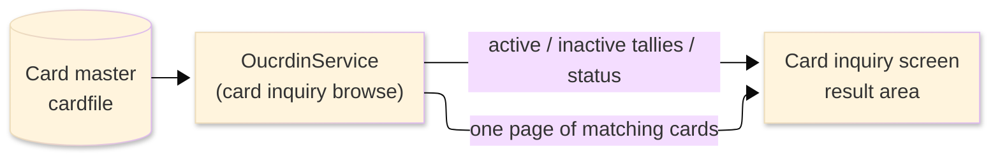
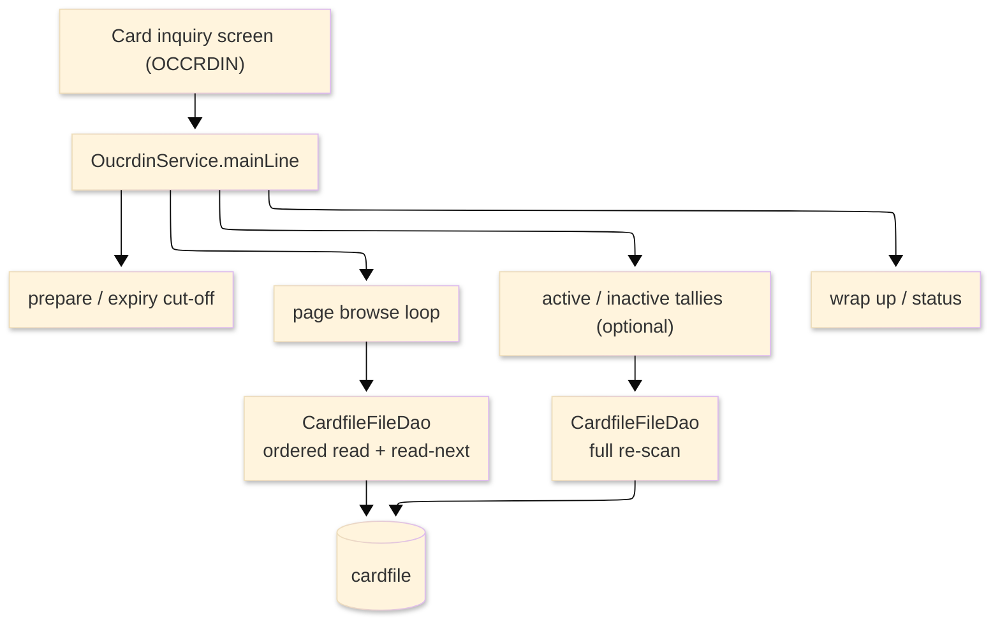

# TO-BE Batch Program Design — OUCRDIN_CardInquiryBrowse

> **TO-BE = AS-IS in business terms.** The section order follows the AS-IS document so the two
> compare 1-to-1; what is added is the mapping onto the generated Java/Spring module. Anything
> forced to differ is stated in the section it belongs to, in business terms.

**Header**

| Item | Content |
|---|---|
| System | ORION-CCMS (ORION Credit Card Management System) |
| Source program | OUCRDIN（COBOL） |
| TO-BE module | `orion-online/back-end/programs/oucrdin` · package `com.generated.orion.oucrdin` |
| Platform | Java 17 · Spring Boot 3.x · DB Oracle (H2 in dev) |
| Author ／ Date | modernizeX ／ 2026-09-28 |

> **Form-factor note (business impact):** in AS-IS this card browse was a COBOL routine that the
> card-inquiry screen called on line to fill one page of results. The transpiler produced it as an
> in-process service in the on-line back-end (`OucrdinService`), **not** as a stand-alone Spring Batch
> job; the business logic — which cards belong to each view and the figures shown for them — is
> unchanged. It is still invoked from the card-inquiry screen. See §8.

## 1. Program overview

### 1.1 TO-BE I/O diagram

### 1.2 Function overview

Return one page of cards that match the view chosen on the card-inquiry screen. The run reads the card
master in card-number order and, for each card, tests it against the selected view — every card, active
only, inactive only, or expiring soon (expiry date falling within the next sixty days from today,
inclusive and not already past). Matching cards are collected up to a full page (thirteen), each
carrying its card number, owning account, embossed name, expiry date and active status; if more remain,
a resume key and a more indicator are returned so the screen can page forward. When the screen also asks
for indicators, the whole card master is re-read to return the active and inactive tallies for the
filtered set. The run only reads; it never changes a card.

### 1.3 I/O table

| Business name | File ／ table | I/O |
|---|---|---|
| Card master (was VSAM KSDS) | table `cardfile` | I |
| Request / result area | in-memory call area (was COMMAREA) | I-O |

> The keyed card browse (start / read-next / end) becomes an ordered read of `cardfile` by its primary
> key `cd_num`, so cards are still processed in ascending card-number order (`ORDER BY cd_num`). The
> browse resumes at or after the requested key. Field widths are preserved (see §4). No card row is
> written back.

### 1.4 Called subprograms / modules

| Item | Notes |
|---|---|
| `CardfileFileDao` | data access for the card master; ordered browse and read-next by card number |
| (no sub-program) | the routine calls no external business program |

### 1.5 DB tables & SQL

| Table | Operation | Columns |
|---|---|---|
| `cardfile` | SELECT (ordered read by `cd_num`), sequential browse forward | card number, owning account, embossed name, expiry date and active status via JdbcTemplate |

### 1.6 Special notes

- Called on demand from the card-inquiry screen; the request names the view, the card number to resume
  after (`KCI-START-KEY`) and whether the active / inactive indicators are wanted (`KCI-WANT-KPI`).
- The expiring-soon view uses a sixty-day cut-off measured from today; a card matches when its expiry
  date is valid and falls between today and the cut-off, inclusive.
- No monetary amounts are read or computed; the run is read-only, so it is safe to repeat.

## 2. Processing details

_One row per business step, in execution order. Paragraph and method names are intentionally absent._

| 識別番号 | Business step | What happens | Condition ／ actual value |
|---|---|---|---|
| 0.0 | The inquiry starts | the run is called from the card-inquiry screen and drives preparation, the cut-off, the page browse, the optional tallies and the wrap-up in turn |  |
| 1.0 | Prepare the run | clears the result counters and paging switches and sets the status to normal |  |
| 2.0 | Work out the expiry cut-off | establishes the date sixty days ahead so cards expiring soon can be recognised | cut-off = today plus sixty days |
| 3.0 | Browse a page of cards | positions at the requested card and reads forward, keeping matching cards until the page is full or the file ends | stops at thirteen kept cards or end of file |
| 3.1 | Position the read | starts the card read at the requested card; when there is nothing to read the browse is treated as finished; an unexpected store response stops the browse and is flagged | not-found or end → nothing to browse; other → flagged as error |
| 3.2 | Gather the page | reads the next card, counts it as scanned, checks its expiry date, tests it against the chosen view and keeps it when it matches | end of cards ends the page |
| 3.4 | Finish the read | closes the card read once the page is complete and records whether more cards remain and the resume key | more indicator set when the file was not exhausted |
| 4.0 | Check each card's expiry | reads the card's expiry date and, when it is a valid date, expresses it as a day number so the expiring-soon test can compare it | invalid expiry date → card cannot match the expiring view |
| 4.5 | Apply the chosen view | keeps the card only when it belongs to the selected view — every card, active (status `Y`), inactive (status not `Y`) or expiring soon (valid expiry between today and the cut-off) | the view is chosen on the screen |
| 5.0 | Keep the matching card | adds the card to the page with its number, owning account, embossed name, expiry date and status, and remembers its number as the resume point |  |
| 6.0 | Compute the tallies | when indicators were requested, re-reads the whole card master, applies the same view and counts the active and inactive matches | only when the screen asked for indicators |
| 9.0 | Wrap up the run | sets the final status — normal, or error when a store failure was met — and returns the page, the counts, the tallies and the resume key to the screen | error status when a store access failed |

## 3. Structure diagram

_The call structure of the routine as generated._

## 4. Output specifications (file / table)

The result call area returned to the screen keeps the original field widths; it is the former COMMAREA,
now an in-memory object, and no field maps to a written table column.

### 4.1 Result call area (KCRDIN-AREA) — 813 bytes

| Level | Item name | Field | Type ／ bytes | Position | Java type | How it is set |
|---|---|---|---|---|---|---|
| 01 | Area | KCRDIN-AREA | group ／ 813 | 1 | call area | whole request / result area |
| 05 | Filter | KCI-FILTER | X(01) ／ 0 | 1 | `String` | requested view (input) |
| 05 | Start key | KCI-START-KEY | X(16) ／ 16 | 1 | `String` | card number to resume after (input) |
| 05 | Want indicators | KCI-WANT-KPI | X(01) ／ 0 | 17 | `String` | whether the tallies are wanted (input) |
| 05 | Return code | KCI-RETURN-CD | X(01) ／ 0 | 17 | `String` | normal or error, set at wrap-up |
| 05 | Row count | KCI-ROW-COUNT | 9(02) ／ 2 | 17 | `int` | cards kept on the page |
| 05 | More switch | KCI-MORE-SW | X(01) ／ 0 | 19 | `String` | more-cards indicator |
| 05 | Next key | KCI-NEXT-KEY | X(16) ／ 16 | 19 | `String` | next-page resume card number |
| 05 | Scan count | KCI-SCAN-COUNT | 9(07) ／ 7 | 35 | `int` | cards read |
| 05 | Active count | KCI-ACTIVE-CNT | 9(09) ／ 9 | 42 | `long` | active cards in the filtered set |
| 05 | Inactive count | KCI-INACTIVE-CNT | 9(09) ／ 9 | 51 | `long` | inactive cards in the filtered set |
| 05 | Row (occurs 13) | KCI-ROW | group ／ 754 | 60 | list | one entry per kept card |
| 10 | Card number | KCI-R-NUM | X(16) ／ 16 | 60 | `String` | card number |
| 10 | Owning account | KCI-R-ACCT | 9(11) ／ 11 | 76 | `long` | owning account id |
| 10 | Embossed name | KCI-R-NAME | X(20) ／ 20 | 87 | `String` | embossed cardholder name |
| 10 | Expiry date | KCI-R-EXPIRY | X(10) ／ 10 | 107 | `String` | expiry date |
| 10 | Status | KCI-R-STATUS | X(01) ／ 1 | 117 | `String` | active status |

> The page holds up to thirteen cards (`KCI-ROW` occurs 13). No monetary fields are present; the run
> carries no COMP-3 amounts and performs no rounding — only the expiry date is turned into a day number
> for the expiring-soon comparison.

## 5. In/out parameters & check specifications

### 5.1 Parameters

| Kind | Value | Notes |
|---|---|---|
| Input parameter | the view to browse and the card number to resume after (`KCI-FILTER`, `KCI-START-KEY`) | supplied by the card-inquiry screen |
| Input parameter | whether the active / inactive indicators are also wanted (`KCI-WANT-KPI`) | drives the second, filter-wide pass |
| Return value | an outcome code — normal or error (`KCI-RETURN-CD`) | tells the screen whether the page is reliable |
| Return page | up to thirteen matching cards with number, owning account, embossed name, expiry date and status (`KCI-ROW`) | shown on the inquiry screen |
| Return counts | cards kept, cards read, the more indicator and the resume key (`KCI-ROW-COUNT`, `KCI-SCAN-COUNT`, `KCI-MORE-SW`, `KCI-NEXT-KEY`) | drive paging |
| Return tallies | active and inactive card counts for the filtered set (`KCI-ACTIVE-CNT`, `KCI-INACTIVE-CNT`) | returned only when indicators were requested |

### 5.2 Checks

| No. | Kind | Condition | Error code | Behaviour |
|---|---|---|---|---|
| 1 | Store access | positioning the card read returns an unexpected response | — | the outcome code is set to error, the browse ends, and the response is written to the application log |
| 2 | Store access | reading the next card returns an unexpected response | — | the outcome code is set to error, the browse ends, and the response is written to the application log |
| 3 | Business | no card matches the chosen view | — | the page comes back empty with a normal status and the more indicator turned off |

## 6. Modification summary

| No. | Date | Title | Content |
|---|---|---|---|
| 1 | 2026-09-28 | Initial TO-BE mapping | Mapped from the AS-IS design onto the generated `OucrdinService`; behaviour preserved. |

## 7. Screen

No screen — the routine is driven from the card-inquiry screen and returns its page and tallies there.

## 8. TO-BE operations (replacing JCL/BAT)

| Item | Value |
|---|---|
| Trigger | called on demand from the card-inquiry screen each time the operator selects a view or pages forward; there is no stand-alone Spring Batch job |
| Schedule | not determined (ask the team) |
| Input data | the card numbers, owning accounts, embossed names, expiry dates and statuses already held in the database |
| Log | written to the application log; the counts and tallies are returned to the operator on screen |
| Rerun | safe to rerun; the run only reads the card master and re-derives the figures each time |
