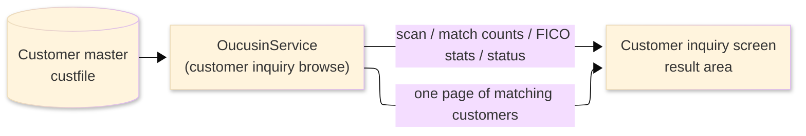
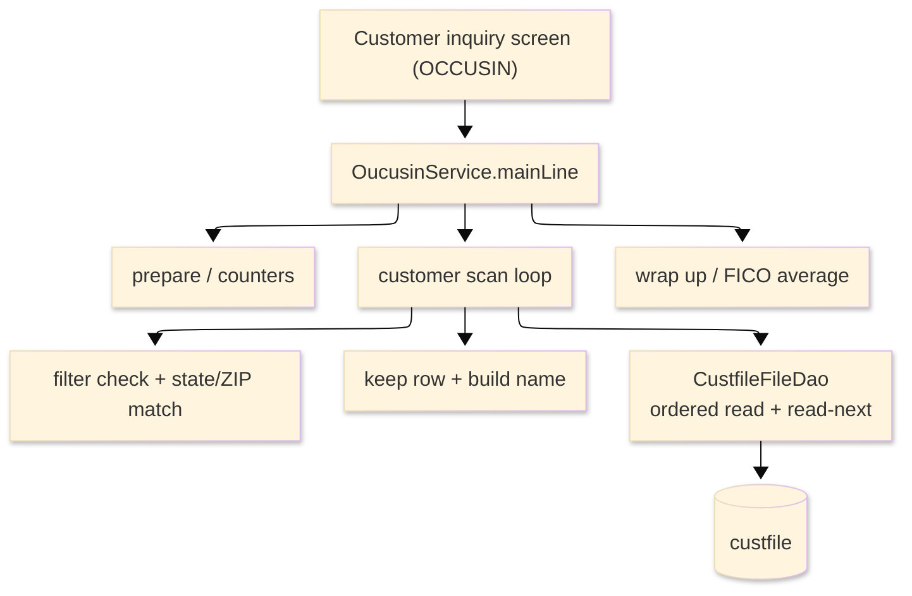

# TO-BE Batch Program Design — OUCUSIN_CustomerInquiryBrowse

> **TO-BE = AS-IS in business terms.** The section order follows the AS-IS document so the two
> compare 1-to-1; what is added is the mapping onto the generated Java/Spring module. Anything
> forced to differ is stated in the section it belongs to, in business terms.

**Header**

| Item | Content |
|---|---|
| System | ORION-CCMS (ORION Credit Card Management System) |
| Source program | OUCUSIN（COBOL） |
| TO-BE module | `orion-online/back-end/programs/oucusin` · package `com.generated.orion.oucusin` |
| Platform | Java 17 · Spring Boot 3.x · DB Oracle (H2 in dev) |
| Author ／ Date | modernizeX ／ 2026-09-28 |

> **Form-factor note (business impact):** in AS-IS this customer browse was a COBOL routine that the
> customer-inquiry screen called on line to fill one page of results. The transpiler produced it as an
> in-process service in the on-line back-end (`OucusinService`), **not** as a stand-alone Spring Batch
> job; the business logic — which customers belong to each filter and the aggregates reported for them —
> is unchanged. It is still invoked from the customer-inquiry screen. See §8.

## 1. Program overview

### 1.1 TO-BE I/O diagram

### 1.2 Function overview

Return one page of customers that match the filter chosen on the customer-inquiry screen. The run reads
the customer master in customer-id order and tests each customer against the selected filter — a
customer-id range, a FICO band, or a state with an optional ZIP prefix. Because the aggregates must be
genuine filter-wide totals (the same figures the former customer, score and ZIP listings printed), the
whole (filtered) set is scanned on every call; while scanning, the first thirteen matches whose
customer id is beyond the resume key are captured as the page, and a further match sets the
more indicator so the screen can page forward. Each page row carries the customer id, the built display
name, state, ZIP and FICO score. Alongside the page the run returns the records scanned, the matches
found, and the average, minimum and maximum FICO of the matched set. The run only reads; it never
changes a customer.

### 1.3 I/O table

| Business name | File ／ table | I/O |
|---|---|---|
| Customer master (was VSAM KSDS) | table `custfile` | I |
| Request / result area | in-memory call area (was COMMAREA) | I-O |

> The keyed customer browse (start / read-next / end) becomes an ordered read of `custfile` by its
> primary key `cu_id`, so customers are still processed in ascending customer-id order
> (`ORDER BY cu_id`). For the id-range filter the read starts at the low end of the range; for the FICO
> and state filters it starts at the beginning of the file. Field widths are preserved (see §4). No
> customer row is written back.

### 1.4 Called subprograms / modules

| Item | Notes |
|---|---|
| `CustfileFileDao` | data access for the customer master; ordered browse and read-next by customer id |
| (no sub-program) | the routine calls no external business program |

### 1.5 DB tables & SQL

| Table | Operation | Columns |
|---|---|---|
| `custfile` | SELECT (ordered read by `cu_id`), sequential browse forward | customer id, first and last name, state, ZIP and FICO score via JdbcTemplate |

### 1.6 Special notes

- Called on demand from the customer-inquiry screen; the request names the filter, its range or band
  values, the state and ZIP, and the customer to resume after (`KUI-START-KEY`).
- The whole filtered set is scanned every call so the aggregates are true totals, not just the page.
- FICO scores are whole numbers; the average FICO is the running total divided by the match count,
  rounded to the nearest whole number (half-up). When no customer matches, the average and minimum are
  reported as zero.
- Read-only: the run reports figures and never updates the customer master, so it is safe to repeat.

## 2. Processing details

_One row per business step, in execution order. Paragraph and method names are intentionally absent._

| 識別番号 | Business step | What happens | Condition ／ actual value |
|---|---|---|---|
| 0.0 | The inquiry starts | the run is called from the customer-inquiry screen and drives preparation, the customer scan and the wrap-up in turn |  |
| 1.0 | Prepare the run | clears the counters, sets the running minimum FICO high and the maximum low so the first match seeds them, and sets the status to normal |  |
| 2.0 | Scan the customers | positions the read and reads every customer forward, testing each against the filter, until the file ends | the whole filtered set is scanned |
| 2.1 | Position the read | for an id-range filter starts the read at the low end of the range; for the other filters starts at the beginning; when there is nothing to read the scan is treated as finished; an unexpected store response stops the scan and is flagged | not-found or end → nothing to scan; other → flagged as error |
| 2.2 | Take the next customer | reads the next customer and hands it on to be considered; at end of file the scan finishes | end of customers ends the scan |
| 2.25 | Consider the customer | counts it as scanned; for the id-range filter stops the scan once the id passes the upper bound; when it matches, updates the FICO total, minimum and maximum, and — if its id is beyond the resume key — keeps it on the page while the page is not yet full, otherwise flags that more remain | id past the range end → scan ends; page holds up to thirteen |
| 2.4 | Apply the chosen filter | marks the customer as matching only when it belongs to the selected filter — id within the range, FICO within the band, or the state matches (and the ZIP prefix matches when one was given) | the filter is chosen on the screen |
| 2.45 | Match on state and ZIP | for the state filter, requires the customer's state to match; when a ZIP was supplied, requires the customer's ZIP to match on that many leading characters | empty ZIP → state match is enough |
| 2.5 | Keep the matching customer | adds the customer to the page with its id, display name, state, ZIP and FICO, and remembers its id as the resume point |  |
| 2.6 | Build the display name | forms the shown name from the customer's first and last name | trailing blanks trimmed |
| 3.0 | Wrap up the run | computes the average FICO of the matched set (rounded to the nearest whole number); when nothing matched, reports the average and minimum as zero, and returns the page, counts and FICO figures to the screen | average zero when no customer matched |

## 3. Structure diagram

_The call structure of the routine as generated._

## 4. Output specifications (file / table)

The result call area returned to the screen keeps the original field widths; it is the former COMMAREA,
now an in-memory object, and no field maps to a written table column.

### 4.1 Result call area (KCUSIN-AREA) — 792 bytes

| Level | Item name | Field | Type ／ bytes | Position | Java type | How it is set |
|---|---|---|---|---|---|---|
| 01 | Area | KCUSIN-AREA | group ／ 792 | 1 | call area | whole request / result area |
| 05 | Request | KUI-REQUEST | group ／ 45 | 1 | fields | request block (input) |
| 10 | Filter | KUI-FILTER | X(01) ／ 0 | 1 | `String` | requested filter (input) |
| 10 | Id from | KUI-ID-FROM | 9(09) ／ 9 | 1 | `int` | id-range low bound (input) |
| 10 | Id to | KUI-ID-TO | 9(09) ／ 9 | 10 | `int` | id-range high bound (input) |
| 10 | FICO from | KUI-FICO-FROM | 9(03) ／ 3 | 19 | `int` | FICO band low bound (input) |
| 10 | FICO to | KUI-FICO-TO | 9(03) ／ 3 | 22 | `int` | FICO band high bound (input) |
| 10 | State | KUI-STATE | X(02) ／ 2 | 25 | `String` | state filter (input) |
| 10 | ZIP | KUI-ZIP | X(10) ／ 10 | 27 | `String` | ZIP prefix filter (input) |
| 10 | Start key | KUI-START-KEY | 9(09) ／ 9 | 37 | `int` | customer to resume after (input) |
| 05 | Response | KUI-RESPONSE | group ／ 45 | 46 | fields | response block |
| 10 | Return code | KUI-RETURN-CD | X(01) ／ 0 | 46 | `String` | normal or error, set at wrap-up |
| 10 | Row count | KUI-ROW-COUNT | 9(02) ／ 2 | 46 | `int` | customers kept on the page |
| 10 | More switch | KUI-MORE-SW | X(01) ／ 0 | 48 | `String` | more-customers indicator |
| 10 | Next key | KUI-NEXT-KEY | 9(09) ／ 9 | 48 | `int` | next-page resume customer |
| 10 | Scan count | KUI-SCAN-COUNT | 9(07) ／ 7 | 57 | `int` | customers read |
| 10 | Match count | KUI-MATCH-COUNT | 9(07) ／ 7 | 64 | `int` | customers matching the filter |
| 10 | FICO total | KUI-FICO-TOT | 9(11) ／ 11 | 71 | `long` | running FICO total of the matched set |
| 10 | FICO average | KUI-FICO-AVG | 9(03) ／ 3 | 82 | `int` | average FICO (rounded half-up) |
| 10 | FICO minimum | KUI-FICO-MIN | 9(03) ／ 3 | 85 | `int` | lowest FICO in the matched set |
| 10 | FICO maximum | KUI-FICO-MAX | 9(03) ／ 3 | 88 | `int` | highest FICO in the matched set |
| 05 | Rows (occurs 13) | KUI-ROW | group ／ 702 | 91 | list | one entry per kept customer |
| 15 | Id | KUR-ID | 9(09) ／ 9 | 91 | `int` | customer id |
| 15 | Name | KUR-NAME | X(30) ／ 30 | 100 | `String` | display name |
| 15 | State | KUR-STATE | X(02) ／ 2 | 130 | `String` | state |
| 15 | ZIP | KUR-ZIP | X(10) ／ 10 | 132 | `String` | ZIP |
| 15 | FICO | KUR-FICO | 9(03) ／ 3 | 142 | `int` | FICO score |

> The page holds up to thirteen customers (`KUI-ROW` occurs 13). No COMP-3 monetary amounts are present;
> FICO scores are whole numbers. The only computed value is the average FICO — the running total divided
> by the match count, rounded to the nearest whole number (half-up).

## 5. In/out parameters & check specifications

### 5.1 Parameters

| Kind | Value | Notes |
|---|---|---|
| Input parameter | the filter to browse and its range / band / state / ZIP values (`KUI-FILTER`, `KUI-ID-FROM`, `KUI-ID-TO`, `KUI-FICO-FROM`, `KUI-FICO-TO`, `KUI-STATE`, `KUI-ZIP`) | supplied by the customer-inquiry screen |
| Input parameter | the customer to resume after (`KUI-START-KEY`) | drives paging |
| Return value | an outcome code — normal or error (`KUI-RETURN-CD`) | tells the screen whether the page is reliable |
| Return page | up to thirteen matching customers with id, name, state, ZIP and FICO (`KUI-ROW`) | shown on the inquiry screen |
| Return counts | customers kept, customers read, the more indicator and the resume key (`KUI-ROW-COUNT`, `KUI-SCAN-COUNT`, `KUI-MORE-SW`, `KUI-NEXT-KEY`) | drive paging |
| Return statistics | matches found and the FICO total, average, minimum and maximum of the matched set (`KUI-MATCH-COUNT`, `KUI-FICO-TOT`, `KUI-FICO-AVG`, `KUI-FICO-MIN`, `KUI-FICO-MAX`) | filter-wide aggregates |

### 5.2 Checks

| No. | Kind | Condition | Error code | Behaviour |
|---|---|---|---|---|
| 1 | Store access | positioning the customer read returns an unexpected response | — | the outcome code is set to error and the scan ends |
| 2 | Store access | reading the next customer returns an unexpected response | — | the outcome code is set to error and the scan ends |
| 3 | Business | no customer matches the chosen filter | — | the page comes back empty and the average and minimum FICO are reported as zero |

## 6. Modification summary

| No. | Date | Title | Content |
|---|---|---|---|
| 1 | 2026-09-28 | Initial TO-BE mapping | Mapped from the AS-IS design onto the generated `OucusinService`; behaviour preserved. |

## 7. Screen

No screen — the routine is driven from the customer-inquiry screen and returns its page and figures there.

## 8. TO-BE operations (replacing JCL/BAT)

| Item | Value |
|---|---|
| Trigger | called on demand from the customer-inquiry screen each time the operator selects a filter or pages forward; there is no stand-alone Spring Batch job |
| Schedule | not determined (ask the team) |
| Input data | the customer ids, names, states, ZIPs and FICO scores already held in the database |
| Log | written to the application log; the counts and FICO figures are returned to the operator on screen |
| Rerun | safe to rerun; the run only reads the customer master and recomputes the aggregates each time |
