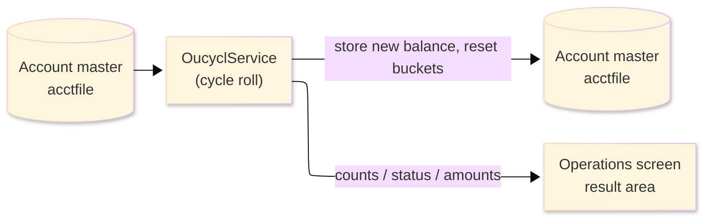
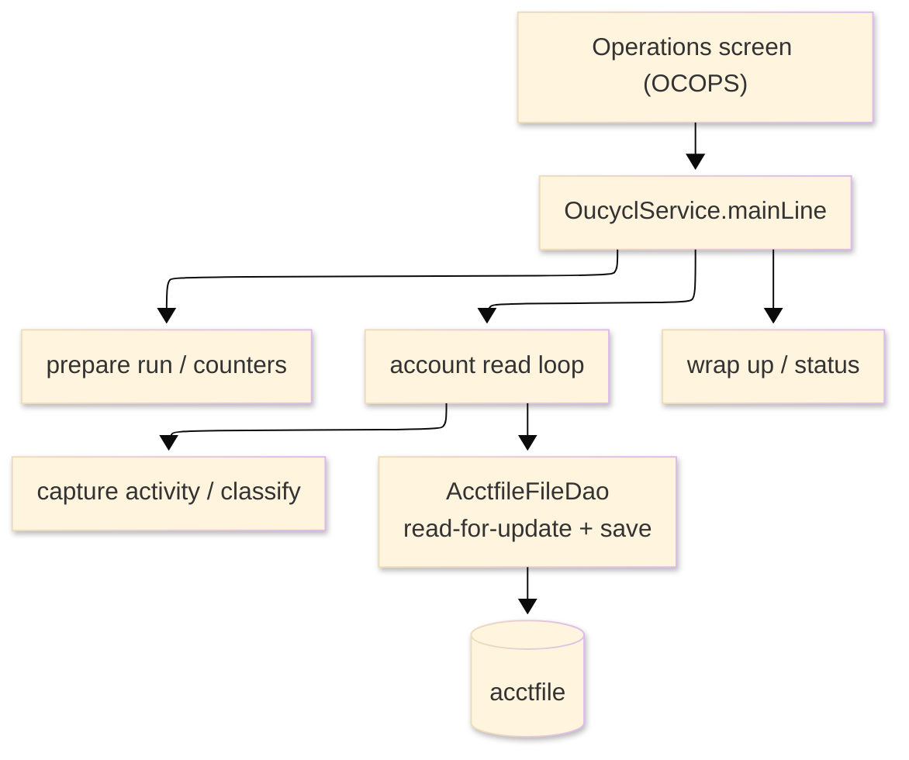

# TO-BE Batch Program Design — OUCYCL_CycleRoll

> **TO-BE = AS-IS in business terms.** The section order follows the AS-IS document so the two
> compare 1-to-1; what is added is the mapping onto the generated Java/Spring module. Anything
> forced to differ is stated in the section it belongs to, in business terms.

**Header**

| Item | Content |
|---|---|
| System | ORION-CCMS (ORION Credit Card Management System) |
| Source program | OUCYCL（COBOL） |
| TO-BE module | `orion-online/back-end/programs/oucycl` · package `com.generated.orion.oucycl` |
| Platform | Java 17 · Spring Boot 3.x · DB Oracle (H2 in dev) |
| Author ／ Date | modernizeX ／ 2026-09-28 |

> **Form-factor note (business impact):** in AS-IS this cycle / end-of-month roll was a COBOL routine
> invoked from the Operations screen. The transpiler produced it as an in-process service in the
> on-line back-end (`OucyclService`), **not** as a stand-alone Spring Batch job; the business logic —
> how the cycle activity is rolled into the balance and how the buckets are reset — is unchanged. It is
> still launched from the Operations screen. See §8.

## 1. Program overview

### 1.1 TO-BE I/O diagram

### 1.2 Function overview

Roll the billing cycle on demand. The run reads the account master in key order; for every account it
captures the cycle credit and debit, works out the net cycle activity into the running balance (new
balance = current balance + cycle-debit − cycle-credit), classifies the carried-forward balance
(in-credit, zero, over-limit or current), re-reads the account for update, stores the new balance,
resets the cycle credit and debit buckets to zero and saves it. The run reports how many accounts were
read, rolled with activity, posted and updated, how many fell into each classification, and the total
cycle credit, cycle debit and carried-forward balance. Consolidates the batch cycle programs OBCYCL,
OBREOM and OBBALFWD.

### 1.3 I/O table

| Business name | File ／ table | I/O |
|---|---|---|
| Account master (was VSAM KSDS) | table `acctfile` | I-O |
| Request / result area | in-memory call area (was COMMAREA) | I-O |

> The account master keyed browse (start / read-next) becomes an ordered read of `acctfile` by its
> primary key `ac_id`, so accounts are still processed in ascending account-id order. Field widths
> and money precision are preserved (see §4).

### 1.4 Called subprograms / modules

| Item | Notes |
|---|---|
| `AcctfileFileDao` | data access for the account master |
| (no sub-program) | the routine calls no external business program |

### 1.5 DB tables & SQL

| Table | Operation | Columns |
|---|---|---|
| `acctfile` | SELECT (ordered read), SELECT … FOR UPDATE, UPDATE | balance and cycle credit / debit columns via JdbcTemplate |

### 1.6 Special notes

- Launched on demand from the Operations screen; an optional single account may be requested
  (`KO-PARM-ACCT`; 0 means every account).
- New balance = current balance + cycle-debit − cycle-credit; the carried-forward balance is
  classified as in-credit (below zero), zero, over-limit (above the credit limit) or current.
- Money is held as `BigDecimal`. The new balance is a straight addition and subtraction of
  two-decimal amounts, so it is exact; the cycle buckets are reset to zero. No percentage or rounding
  is applied (see §4).

## 2. Processing details

_One row per business step, in execution order. Paragraph and method names are intentionally absent._

| 識別番号 | Business step | What happens | Condition ／ actual value |
|---|---|---|---|
| 0.0 | The cycle-roll run starts | the run is launched from the Operations screen and drives preparation, the account loop and the wrap-up in turn |  |
| 1.0 | Prepare the run | clears the result counters and sets the status to in-progress; if a single account was requested, switches on the filter for that one account | single account when the requested account is greater than zero |
| 3.0 | Read the accounts in order | positions at the first (or requested) account and reads forward until the end |  |
| 3.1 | Position the read | starts reading the account master from the first or the requested account; when there is nothing to read it reports that there are no accounts to roll; a store error stops the run | not-found → "no accounts to roll"; other error → run fails |
| 3.2 | Take the next account | reads the next account and counts it as read; at end of file the loop finishes; a store error stops the run | end of accounts ends the loop |
| 4.0 | Process one account | captures the cycle activity, classifies the outcome and rolls the cycle for the account |  |
| 4.1 | Capture the cycle activity | records the current balance and the cycle credit and debit, works out the new balance (current balance plus the cycle debit less the cycle credit), and adds the cycle credit and debit to the run totals | counted as rolled with activity when either bucket is non-zero |
| 4.2 | Classify the carried-forward balance | tallies the new balance as in-credit (below zero), zero, over-limit (above the credit limit) or otherwise current |  |
| 4.3 | Roll the cycle | re-reads the account for update, stores the new balance, resets the cycle credit and debit buckets to zero, saves it, counts it as posted and adds the new balance to the carried-forward total; a failed read or save counts the account as rejected |  |
| 3.4 | Finish the read | ends the account read once the loop is done |  |
| 9.0 | Wrap up the run | sets the final status (complete, complete-with-warnings when any account was rejected, or failed) and returns the counts and the cycle amounts to the operator | warning status when at least one account was rejected |

## 3. Structure diagram

_The call structure of the routine as generated._

## 4. Output specifications (file / table)

The account master record written back keeps the original field widths; each field also maps to a
column of the `acctfile` table.

### 4.1 Account master (ACCT-REC) — 300 bytes

| Level | Item name | Field ／ column | Type ／ bytes | Position | Java ／ SQL type | How it is set |
|---|---|---|---|---|---|---|
| 01 | Record | ACCT-REC | group ／ 300 | 1 | row of `acctfile` | whole record |
| 05 | Account id | AC-ID | 9(11) ／ 11 | 1 | `long` ／ `NUMERIC(11)` | record key (unchanged) |
| 05 | Active status | AC-ACTIVE-STATUS | X(01) ／ 1 | 12 | `String` ／ `VARCHAR2(1)` | unchanged |
| 05 | Current balance | AC-CURR-BAL | S9(10)V99 ／ 12 | 13 | `BigDecimal` ／ `DECIMAL(12,2)` | set to the new balance (current + cycle-debit − cycle-credit) |
| 05 | Credit limit | AC-CREDIT-LIMIT | S9(10)V99 ／ 12 | 25 | `BigDecimal` ／ `DECIMAL(12,2)` | unchanged |
| 05 | Cash limit | AC-CASH-LIMIT | S9(10)V99 ／ 12 | 37 | `BigDecimal` ／ `DECIMAL(12,2)` | unchanged |
| 05 | Open date | AC-OPEN-DATE | X(10) ／ 10 | 49 | `String` ／ `VARCHAR2(10)` | unchanged |
| 05 | Expiry date | AC-EXPIRY-DATE | X(10) ／ 10 | 59 | `String` ／ `VARCHAR2(10)` | unchanged |
| 05 | Reissue date | AC-REISSUE-DATE | X(10) ／ 10 | 69 | `String` ／ `VARCHAR2(10)` | unchanged |
| 05 | Cycle credit | AC-CYC-CREDIT | S9(10)V99 ／ 12 | 79 | `BigDecimal` ／ `DECIMAL(12,2)` | reset to zero |
| 05 | Cycle debit | AC-CYC-DEBIT | S9(10)V99 ／ 12 | 91 | `BigDecimal` ／ `DECIMAL(12,2)` | reset to zero |
| 05 | Address zip | AC-ADDR-ZIP | X(10) ／ 10 | 103 | `String` ／ `VARCHAR2(10)` | unchanged |
| 05 | Group id | AC-GROUP-ID | X(10) ／ 10 | 113 | `String` ／ `VARCHAR2(10)` | unchanged |
| 05 | Filler | FILLER | X(178) ／ 178 | 123 | — | reserved |

> COMP-3 money fields are held as `BigDecimal` and stored at the COBOL-declared two-decimal scale,
> truncated toward zero (`RoundingMode.DOWN`) — the same result as the original COBOL, which carries
> no `ROUNDED` clause. The new balance is a straight addition and subtraction of two-decimal amounts,
> so it is exact at two decimals with no rounding; the cycle credit and debit buckets are set to zero.

## 5. In/out parameters & check specifications

### 5.1 Parameters

| Kind | Value | Notes |
|---|---|---|
| Input parameter | a single account to roll, or 0 for all accounts (`KO-PARM-ACCT`) | supplied by the Operations screen |
| Return value | a status flag — complete, complete-with-warnings, or failed (`KO-STATUS`) plus a status message | tells the operator the outcome |
| Return counts | accounts read, rolled with activity, posted and updated and rejected, plus over-limit, zero and in-credit tallies | shown back on the Operations screen |
| Return amounts | total cycle credit (`KO-AMT-1`), total cycle debit (`KO-AMT-2`) and total carried-forward balance (`KO-AMT-3`) | shown back on the Operations screen |

### 5.2 Checks

| No. | Kind | Condition | Error code | Behaviour |
|---|---|---|---|---|
| 1 | Store access | the account read cannot be positioned | — | the run stops and reports "STARTBR ACCTFILE FAILED." |
| 2 | Store access | reading the next account fails | — | the run stops and reports "READNEXT ACCTFILE FAILED." |
| 3 | Business | an account cannot be re-read or saved for update | — | that account is counted as rejected and the run ends with a warning |
| 4 | Business | there are no accounts to roll | — | the run ends normally reporting "NO ACCOUNTS TO ROLL." |

## 6. Modification summary

| No. | Date | Title | Content |
|---|---|---|---|
| 1 | 2026-09-28 | Initial TO-BE mapping | Mapped from the AS-IS design onto the generated `OucyclService`; behaviour preserved. |

## 7. Screen

No screen — the routine is driven from the Operations screen and reports its outcome there.

## 8. TO-BE operations (replacing JCL/BAT)

| Item | Value |
|---|---|
| Trigger | launched on demand from the Operations screen; an optional single account can be entered, otherwise every account is rolled. This former batch routine now runs as an in-process on-line service, not a stand-alone Spring Batch job; the business logic is unchanged |
| Schedule | not determined (ask the team) |
| Input data | the current account balances and cycle credit / debit buckets already held in the database |
| Log | written to the application log; the outcome counts and the cycle amounts are returned to the operator on screen |
| Rerun | safe to rerun; once an account's cycle buckets have been reset to zero, a further run captures no activity and leaves the balance unchanged |
