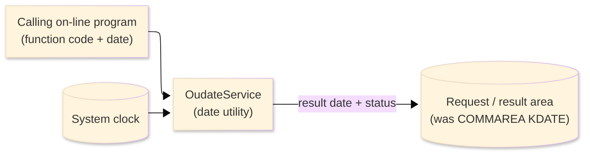
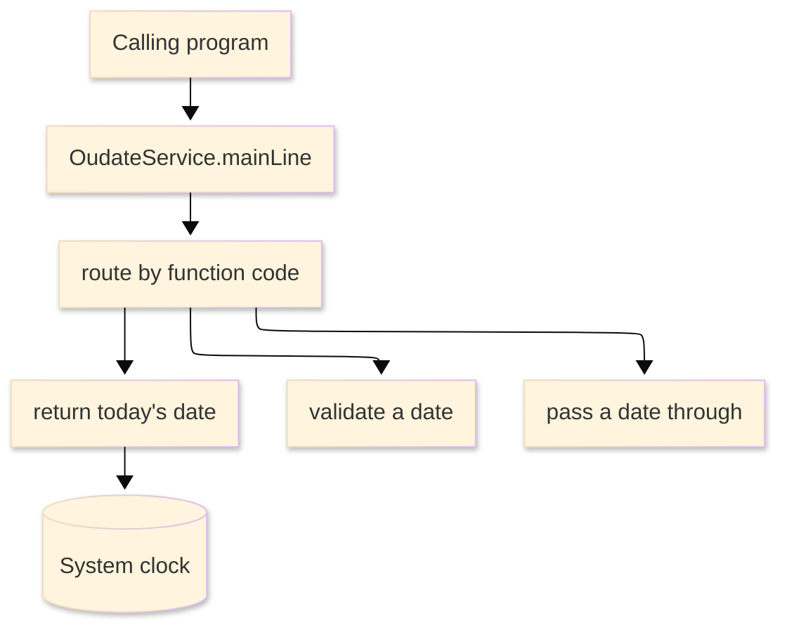

# TO-BE Batch Program Design — OUDATE_DateUtility

> **TO-BE = AS-IS in business terms.** The section order follows the AS-IS document so the two
> compare 1-to-1; what is added is the mapping onto the generated Java/Spring module. Anything
> forced to differ is stated in the section it belongs to, in business terms.

**Header**

| Item | Content |
|---|---|
| System | ORION-CCMS (ORION Credit Card Management System) |
| Source program | OUDATE（COBOL） |
| TO-BE module | `orion-online/back-end/programs/oudate` · package `com.generated.orion.oudate` |
| Platform | Java 17 · Spring Boot 3.x · DB Oracle (H2 in dev) |
| Author ／ Date | modernizeX ／ 2026-09-28 |

> **Form-factor note (business impact):** in AS-IS this was a shared date utility subroutine called by
> the account and card screens and the reporting program (reached through a CICS program link). The
> transpiler produced it as an in-process service in the on-line back-end (`OudateService`), **not** as
> a stand-alone Spring Batch job; the business behaviour — return today's date, validate a date, or
> pass a date through unchanged — is unchanged. It is still called in-process by those programs.
> See §8.

## 1. Program overview

### 1.1 TO-BE I/O diagram

### 1.2 Function overview

A small date utility called by other programs. The caller passes a function code and, when needed, a
date. The utility supports three functions: return today's date as YYYY-MM-DD, validate that a supplied
date is a real calendar date, or pass a supplied date straight through (it is already YYYY-MM-DD). It
sets a status telling the caller whether the request succeeded; an unrecognised function code returns
the error status.

### 1.3 I/O table

| Business name | File ／ table | I/O |
|---|---|---|
| Request / result area | in-memory call area (was COMMAREA `KDATE-PARM`) | I-O |
| Current date | the system clock (for the today function) | I |

### 1.4 Called subprograms / modules

| Item | Notes |
|---|---|
| (no sub-program) | the utility calls no external business program |

### 1.5 DB tables & SQL

No SQL — pure in-memory computation; the utility performs no file or database access.

### 1.6 Special notes

- Called in-process by other on-line programs; in AS-IS it was reached through a CICS program link and
  is used by the account add/update, card add/update and reporting programs (OCACCTA, OCACCTU, OCCARDA,
  OCCARDU, OCREPT).
- Three functions: return today's date, validate a date, and pass a date through unchanged; an
  unrecognised function returns the error status.
- On validation, February is accepted up to 29 days and leap years are not distinguished — this
  behaviour is preserved exactly from AS-IS.
- No database or business-file access.

## 2. Processing details

_One row per business step, in execution order. Paragraph and method names are intentionally absent._

| 識別番号 | Business step | What happens | Condition ／ actual value |
|---|---|---|---|
| 0.0 | The utility starts | assumes success and routes the request to the function the caller asked for | function is today, validate, format, or other |
| 1.0 | Return today's date | reads the current system date and returns it formatted as YYYY-MM-DD | function = TODY |
| 2.0 | Validate a supplied date | copies the supplied date to the result and checks it is a real calendar date | function = VALD |
| 2.1 | Check the digits | confirms the year, month and day positions all contain digits; otherwise the date is marked invalid | non-numeric → invalid |
| 2.2 | Check the month | confirms the month is between 1 and 12; otherwise the date is marked invalid | month < 1 or > 12 → invalid |
| 2.3 | Check the day | confirms the day falls within the days the month allows; otherwise the date is marked invalid | February accepted up to 29 (leap years not distinguished) |
| 2.4 | Pass a date through | returns the supplied date unchanged because it is already in the required format | function = FMT |
| 9.0 | Unrecognised function | when the function code is none of the three supported, the result is set to the error status | function = other |

## 3. Structure diagram

_The call structure of the routine as generated._

## 4. Output specifications (file / table)

The request / result area is passed in and returned; byte positions are kept from the AS-IS layout.

### 4.1 Request / result area (KDATE) — 26 bytes

| Level | Item name | Field ／ column | Type ／ bytes | Position | Java ／ SQL type | How it is set |
|---|---|---|---|---|---|---|
| 01 | Parm | KDATE-PARM | group ／ 26 | 1 | in-memory call area | whole request / result block |
| 05 | Function | KD-FUNC | X(04) ／ 4 | 1 | `String` | which function to run — supplied by the caller (input) |
| 05 | Date in | KD-DATE-IN | X(10) ／ 10 | 5 | `String` | the date to validate or format — supplied by the caller (input) |
| 05 | Date out | KD-DATE-OUT | X(10) ／ 10 | 15 | `String` | set to today's date, or to the validated / echoed input date |
| 05 | Status | KD-STATUS | X(02) ／ 2 | 25 | `String` | "00" success, "99" invalid date or unrecognised function |

> All fields are character (no numeric conversion on the block itself). Today's date is formatted as
> YYYY-MM-DD; the validate and format functions return the supplied date unchanged in the result.

## 5. In/out parameters & check specifications

### 5.1 Parameters

| Kind | Value | Notes |
|---|---|---|
| Input parameter | a function code (`KD-FUNC`) — today, validate or format — plus a date (`KD-DATE-IN`) when validating or formatting | supplied by the calling program |
| Return value | the result date (`KD-DATE-OUT`) and a status (`KD-STATUS`) | "00" success, "99" invalid date or unrecognised function |

### 5.2 Checks

| No. | Kind | Condition | Error code | Behaviour |
|---|---|---|---|---|
| 1 | Format | the supplied date's year, month or day positions are not all digits | `99` | the date is marked invalid |
| 2 | Business | the month is below 1 or above 12 | `99` | the date is marked invalid |
| 3 | Business | the day is below 1 or above the days the month allows (February up to 29) | `99` | the date is marked invalid |
| 4 | Business | the function code is not today, validate or format | `99` | the result is set to the error status |

## 6. Modification summary

| No. | Date | Title | Content |
|---|---|---|---|
| 1 | 2026-09-28 | Initial TO-BE mapping | Mapped from the AS-IS design onto the generated `OudateService`; behaviour preserved. |

## 7. Screen

No screen — the utility returns its result to the calling program; nothing is shown on a screen.

## 8. TO-BE operations (replacing JCL/BAT)

| Item | Value |
|---|---|
| Trigger | called in-process by other on-line programs when they need today's date or need to validate or format a date (in AS-IS a CICS-linked subroutine); it is now an in-process on-line service (`OudateService`), not a Spring Batch job, and is not scheduled |
| Schedule | not applicable — called on demand by other programs |
| Input data | the function code and date supplied by the calling program; the current system date for the today function |
| Log | application log |
| Rerun | safe to rerun; the utility holds no state and recomputes the result on each call |
