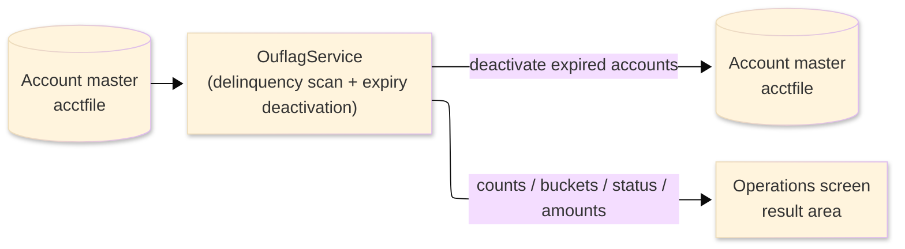
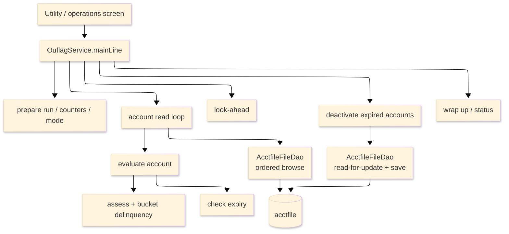

# TO-BE Batch Program Design — OUFLAG_DelinquencyScan

> **TO-BE = AS-IS in business terms.** The section order follows the AS-IS document so the two
> compare 1-to-1; what is added is the mapping onto the generated Java/Spring module. Anything
> forced to differ is stated in the section it belongs to, in business terms.

**Header**

| Item | Content |
|---|---|
| System | ORION-CCMS (ORION Credit Card Management System) |
| Source program | OUFLAG（COBOL） |
| TO-BE module | `orion-online/back-end/programs/ouflag` · package `com.generated.orion.ouflag` |
| Platform | Java 17 · Spring Boot 3.x · DB Oracle (H2 in dev) |
| Author ／ Date | modernizeX ／ 2026-09-28 |

> **Form-factor note (business impact):** in AS-IS this was a delinquency-and-expiry utility routine
> (an on-line port of the batch delinquency-aging job), invoked from the utility/operations screen.
> The transpiler produced it as an in-process service in the on-line back-end (`OuflagService`),
> **not** as a stand-alone Spring Batch job; the business logic — which accounts are flagged, how they
> are aged into buckets, and which expired accounts are deactivated — is unchanged. It is still
> launched from the operations screen. See §8.

## 1. Program overview

### 1.1 TO-BE I/O diagram

### 1.2 Function overview

Scan the account master for delinquency and expiry, on demand. The run reads the account master in
key order; for every active account it computes the minimum amount due, decides whether the account is
delinquent, and — when it is — classifies it into a 30 / 60 / 90 aging bucket by credit utilisation.
In the same pass it captures accounts whose expiry date has fallen before the cutoff; those accounts
are then re-read for update and saved with an inactive status. The run can cover delinquency only,
expiry only, or both. It reports how many accounts were read, skipped and current, how many were found
delinquent and in each bucket, how many were deactivated, and the total delinquent balance and
shortfall.

### 1.3 I/O table

| Business name | File ／ table | I/O |
|---|---|---|
| Account master (was VSAM KSDS) | table `acctfile` | I-O |
| Request / result area | in-memory call area (was COMMAREA) | I-O |

> The account master keyed browse (start / read-next) becomes an ordered read of `acctfile` by its
> primary key `ac_id` (`ORDER BY ac_id` ascending), so accounts are still processed in ascending
> account-id order from the requested start account. Field widths and money precision are preserved
> (see §4).

### 1.4 Called subprograms / modules

| Item | Notes |
|---|---|
| `AcctfileFileDao` | data access for the account master (ordered browse, read-for-update, save) |
| (no sub-program) | the routine calls no external business program |

### 1.5 DB tables & SQL

| Table | Operation | Columns |
|---|---|---|
| `acctfile` | SELECT (ordered browse), SELECT … FOR UPDATE, UPDATE | active-status, balance, credit-limit and cycle-credit columns via JdbcTemplate |

### 1.6 Special notes

- Launched on demand from the utility/operations screen; the operator chooses the mode (delinquency,
  expiry, or both), an optional start account and maximum count, and — for the expiry pass — a cutoff
  date. An invalid mode, or an expiry pass with no cutoff, ends the run before it reads anything.
- Money is held as `BigDecimal`. The minimum due is balance × the minimum-due rate, floored at a
  minimum amount; the shortfall is minimum due − cycle credit, floored at zero; the utilisation used
  to pick the bucket is balance ÷ credit limit × 100, rounded half-up (a zero or negative credit
  limit forces the highest bucket).
- Delinquency classification updates only the returned counters and totals; the account record itself
  is saved only when an expired account is deactivated.
- The scan stops early once a maximum account count or the expired-account capacity is reached.
- No sub-programs; the run stands alone against the account master.

## 2. Processing details

_One row per business step, in execution order. Paragraph and method names are intentionally absent._

| 識別番号 | Business step | What happens | Condition ／ actual value |
|---|---|---|---|
| 0.0 | The scan starts | the run is launched from the operations screen and drives preparation, the account loop and the wrap-up in turn |  |
| 1.0 | Prepare the run | clears the result counters and status, and turns on the requested work — delinquency, expiry, or both | mode = BOTH ／ DELQ ／ EXPY; an unknown mode ends the run |
| 2.0 | Position the read | starts reading the account master from the requested start account; when there is nothing to read the loop is skipped; a store error stops the run | store error → the run stops and reports the failure |
| 3.0 | Read the accounts in order | reads forward account by account and evaluates each, until the end of file or a cap is reached |  |
| 3.1 | Take the next account | reads the next account; at end of file the loop finishes; a store error ends the loop and is counted | store error → the loop ends and the failure is reported |
| 3.2 | Evaluate one account | counts the account as read; an inactive account is skipped; otherwise it is assessed for delinquency and, when requested, for expiry | inactive account is skipped |
| 3.3 | Assess delinquency | an account with a zero or negative balance is counted as current; otherwise the minimum due is worked out and, if the cycle credit covers it, the account is current, else it is flagged delinquent | current when cycle credit ≥ minimum due |
| 3.31 | Flag and bucket the account | counts it delinquent, works out the shortfall and the credit utilisation, and drops it into the 30, 60 or 90 aging bucket; adds its balance and shortfall to the running totals | utilisation ≥ 100 → 90 bucket; ≥ 90 → 60 bucket; else 30 bucket |
| 3.4 | Check the expiry | an account whose expiry date has fallen before the cutoff is captured for deactivation, up to the capacity; when the capacity is reached the scan stops | expiry date present and before the cutoff |
| 4.0 | Look ahead | reads one more account so the operator is told whether more remain and which account is next |  |
| 5.0 | Finish the read | ends the account read once the loop is done |  |
| 5.5 | Deactivate the expired accounts | works through the captured expired accounts one by one |  |
| 5.6 | Deactivate one account | re-reads the account for update; an already-inactive account is left alone; otherwise its status is set to inactive and it is saved and counted; a failed read or save is counted as an error | only accounts still active are deactivated |
| 6.0 | Wrap up the run | sets the final status and returns the accumulated counts and totals to the operator | none read → "NO ACCOUNTS PROCESSED"; otherwise "ACCOUNT FLAGGING COMPLETE" |

## 3. Structure diagram

_The call structure of the routine as generated._

## 4. Output specifications (file / table)

The account master record saved during deactivation keeps the original field widths; each field also
maps to a column of the `acctfile` table.

### 4.1 Account master (ACCT-REC) — 300 bytes

| Level | Item name | Field ／ column | Type ／ bytes | Position | Java ／ SQL type | How it is set |
|---|---|---|---|---|---|---|
| 01 | Record | ACCT-REC | group ／ 300 | 1 | row of `acctfile` | whole record |
| 05 | Account id | AC-ID | 9(11) ／ 11 | 1 | `long` ／ `NUMERIC(11)` | record key (unchanged) |
| 05 | Active status | AC-ACTIVE-STATUS | X(01) ／ 1 | 12 | `String` ／ `VARCHAR2(1)` | set to inactive ('N') when the account expired; otherwise unchanged |
| 05 | Current balance | AC-CURR-BAL | S9(10)V99 ／ 12 | 13 | `BigDecimal` ／ `DECIMAL(12,2)` | unchanged |
| 05 | Credit limit | AC-CREDIT-LIMIT | S9(10)V99 ／ 12 | 25 | `BigDecimal` ／ `DECIMAL(12,2)` | unchanged |
| 05 | Cash limit | AC-CASH-LIMIT | S9(10)V99 ／ 12 | 37 | `BigDecimal` ／ `DECIMAL(12,2)` | unchanged |
| 05 | Open date | AC-OPEN-DATE | X(10) ／ 10 | 49 | `String` ／ `VARCHAR2(10)` | unchanged |
| 05 | Expiry date | AC-EXPIRY-DATE | X(10) ／ 10 | 59 | `String` ／ `VARCHAR2(10)` | read to compare against the cutoff; unchanged |
| 05 | Reissue date | AC-REISSUE-DATE | X(10) ／ 10 | 69 | `String` ／ `VARCHAR2(10)` | unchanged |
| 05 | Cycle credit | AC-CYC-CREDIT | S9(10)V99 ／ 12 | 79 | `BigDecimal` ／ `DECIMAL(12,2)` | read to compare against the minimum due; unchanged |
| 05 | Cycle debit | AC-CYC-DEBIT | S9(10)V99 ／ 12 | 91 | `BigDecimal` ／ `DECIMAL(12,2)` | unchanged |
| 05 | Address zip | AC-ADDR-ZIP | X(10) ／ 10 | 103 | `String` ／ `VARCHAR2(10)` | unchanged |
| 05 | Group id | AC-GROUP-ID | X(10) ／ 10 | 113 | `String` ／ `VARCHAR2(10)` | unchanged |
| 05 | Filler | FILLER | X(178) ／ 178 | 123 | — | reserved |

> The account record is written back only to flip the active status to inactive for an expired
> account. The money fields are carried through unchanged; the utilisation, minimum due and shortfall
> used to age an account are computed as `BigDecimal` (rounded half-up) but stay in the returned
> totals, not in the account record.

## 5. In/out parameters & check specifications

### 5.1 Parameters

| Kind | Value | Notes |
|---|---|---|
| Input parameter | run mode (`KFL-MODE`) — delinquency, expiry, or both | chosen on the operations screen |
| Input parameter | expiry cutoff date (`KFL-CUTOFF`), start account (`KFL-START-ACCT`), maximum accounts (`KFL-MAX`) | cutoff is required for the expiry pass |
| Return value | status flag (`KFL-STATUS`) and message (`KFL-MSG`) | tells the operator the outcome |
| Return counts | read, skipped, current, delinquent, 30 / 60 / 90 buckets, expired and errors (`KFL-READ`, `KFL-SKIPPED`, `KFL-CURRENT`, `KFL-DELQ`, `KFL-B30`, `KFL-B60`, `KFL-B90`, `KFL-EXPIRED`, `KFL-ERRORS`) | shown back on the operations screen |
| Return amounts | delinquent balance and shortfall totals (`KFL-DELQ-BAL`, `KFL-SHORTFALL`); more-to-read flag and next account (`KFL-MORE`, `KFL-NEXT-ACCT`) | shown back on the operations screen |

### 5.2 Checks

| No. | Kind | Condition | Error code | Behaviour |
|---|---|---|---|---|
| 1 | Business | the requested mode is not delinquency, expiry or both | — | the run stops and reports "INVALID MODE - BOTH / DELQ / EXPY" |
| 2 | Business | the expiry pass is requested with no cutoff date | — | the run stops and reports "EXPIRY CUTOFF DATE REQUIRED" |
| 3 | Store access | the account read cannot be positioned | — | the run stops and reports "ACCTFILE STARTBR FAILED" |
| 4 | Store access | reading the next account fails | — | the error is counted, the loop ends and "ACCTFILE READNEXT FAILED" is reported |
| 5 | Store access | an expired account cannot be re-read or saved for deactivation | — | that account is counted as an error and the run continues |
| 6 | Business | no accounts were read | — | the run ends normally reporting "NO ACCOUNTS PROCESSED" |

## 6. Modification summary

| No. | Date | Title | Content |
|---|---|---|---|
| 1 | 2026-09-28 | Initial TO-BE mapping | Mapped from the AS-IS design onto the generated `OuflagService`; behaviour preserved. |

## 7. Screen

No screen — the routine is driven from the utility/operations screen and reports its outcome there.

## 8. TO-BE operations (replacing JCL/BAT)

| Item | Value |
|---|---|
| Trigger | launched on demand from the utility/operations screen; the operator picks the mode, an optional start account and maximum count, and a cutoff date for the expiry pass. In AS-IS this was a batch/utility routine; it now runs as the in-process service `OuflagService`, not a stand-alone Spring Batch job — the business logic is unchanged |
| Schedule | not determined (ask the team) |
| Input data | the current account balances, credit limits, cycle credits, expiry dates and active statuses already held in the database |
| Log | written to the application log; the outcome counts, buckets and totals are returned to the operator on screen |
| Rerun | safe to rerun; delinquency classification is recomputed from the current balances each time, and an account that is already inactive is left alone, so a rerun does not deactivate it twice |
