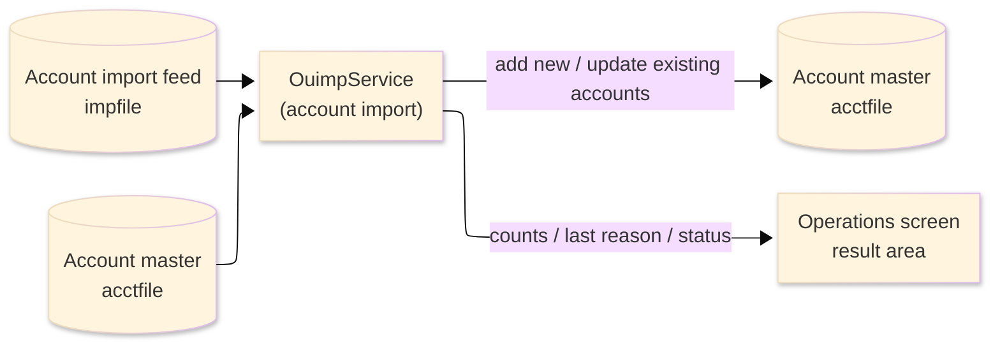
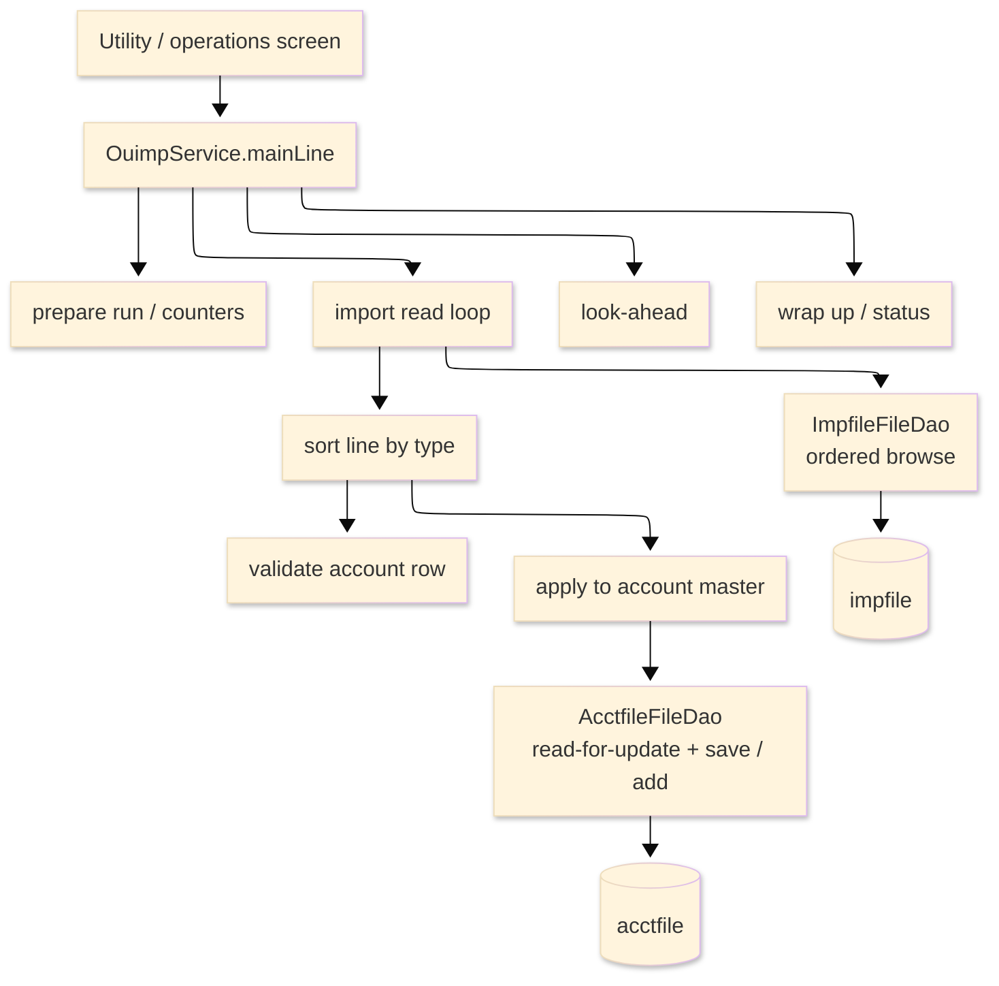

# TO-BE Batch Program Design — OUIMP_AccountImport

> **TO-BE = AS-IS in business terms.** The section order follows the AS-IS document so the two
> compare 1-to-1; what is added is the mapping onto the generated Java/Spring module. Anything
> forced to differ is stated in the section it belongs to, in business terms.

**Header**

| Item | Content |
|---|---|
| System | ORION-CCMS (ORION Credit Card Management System) |
| Source program | OUIMP（COBOL） |
| TO-BE module | `orion-online/back-end/programs/ouimp` · package `com.generated.orion.ouimp` |
| Platform | Java 17 · Spring Boot 3.x · DB Oracle (H2 in dev) |
| Author ／ Date | modernizeX ／ 2026-09-28 |

> **Form-factor note (business impact):** in AS-IS this account-import routine was an on-line port of
> the batch import job, invoked from the utility/operations screen. The transpiler produced it as an
> in-process service in the on-line back-end (`OuimpService`), **not** as a stand-alone Spring Batch
> job; the business logic — how each staged account line is validated and applied to the account
> master — is unchanged. It is still launched from the operations screen. See §8.

## 1. Program overview

### 1.1 TO-BE I/O diagram

### 1.2 Function overview

Import staged account lines into the account master, on demand. The run reads the import feed in key
order; each record carries one CSV-style account line, which is split into its fields and validated —
record type, account id, active status, monetary amounts and dates. A valid account row is applied to
the account master: an existing account is updated, a new one is added. Header rows and non-account
(customer) rows are skipped; an invalid row is rejected and the last reject reason is kept. The run
reports how many records were read, added, updated, accepted, rejected and skipped.

### 1.3 I/O table

| Business name | File ／ table | I/O |
|---|---|---|
| Account import feed (was VSAM KSDS) | table `impfile` | I |
| Account master (was VSAM KSDS) | table `acctfile` | I-O |
| Request / result area | in-memory call area (was COMMAREA) | I-O |

> The import-feed keyed browse (start / read-next) becomes an ordered read of `impfile` by its primary
> key `imp_key` (`ORDER BY imp_key` ascending), so records are still processed in ascending key order
> from the requested start key. The account master is reached by single keyed reads on its primary key
> `ac_id`. Field widths and money precision are preserved (see §4).

### 1.4 Called subprograms / modules

| Item | Notes |
|---|---|
| `ImpfileFileDao` · `AcctfileFileDao` | data access for the import feed (ordered browse) and the account master (read-for-update, save, add) |
| (no sub-program) | the routine calls no external business program |

### 1.5 DB tables & SQL

| Table | Operation | Columns |
|---|---|---|
| `impfile` | SELECT (ordered browse) | the staged import line, read in key order |
| `acctfile` | SELECT … FOR UPDATE, UPDATE, INSERT | the account is updated when it exists, inserted when it is new |

### 1.6 Special notes

- Launched on demand from the utility/operations screen. A start key may be supplied (blank means from
  the first record) and a maximum record count can cap the run.
- Each account row must carry at least 13 fields. The account id must be numeric and non-zero; the
  active status must be Y or N; the monetary amounts must be numeric; the open, expiry and reissue
  dates must each be in year, month and day order with a four-digit year (for example 2026-09-28).
- Monetary fields are held as `BigDecimal` with two-decimal scale, taken from the feed text as
  supplied — the import performs no arithmetic and applies no rounding.
- The CSV field split is a placeholder in the generated service (the field count is initialised to
  zero and not yet populated from the line). Business impact: until the field split is completed to
  match the original line parsing, account rows fail the field-count check and are rejected as "TOO FEW
  FIELDS"; header and customer rows are still skipped as before. Flag to the team.

## 2. Processing details

_One row per business step, in execution order. Paragraph and method names are intentionally absent._

| 識別番号 | Business step | What happens | Condition ／ actual value |
|---|---|---|---|
| 0.0 | The import starts | the run is launched from the operations screen and drives preparation, the import loop and the wrap-up in turn |  |
| 1.0 | Prepare the run | clears the result counters and status and takes the maximum record count |  |
| 2.0 | Position the read | starts reading the import feed from the requested start key, or the first record when none is given; a store error stops the run | store error → the run stops and reports the failure |
| 3.0 | Read the feed in order | reads forward record by record and processes each, until the end of file or the maximum is reached |  |
| 3.1 | Take the next line | reads the next import line; at end of file the loop finishes; a store error ends the loop and is counted | store error → the loop ends and the failure is reported |
| 3.2 | Sort the line by type | counts the line as read, splits it, and routes it: a header or a customer row is skipped, an account row is validated and applied, an unknown type is rejected | unknown type → "UNKNOWN RECTYPE" |
| 3.3 | Split the line | separates the CSV-style line into its individual fields | see the placeholder note in §1.6 |
| 3.4 | Validate the account row | rejects a row with too few fields, then checks the id, the status, the amounts and the dates in turn | fewer than 13 fields → "TOO FEW FIELDS" |
| 3.41 | Check the account id | the account id must be numeric and must not be zero | non-numeric → "INVALID ACCOUNT ID"; zero → "ACCOUNT ID IS ZERO" |
| 3.42 | Check the status | the active status must be Y or N | otherwise → "STATUS NOT Y OR N" |
| 3.43 | Check the amounts | the balance, credit limit, cash limit, cycle credit and cycle debit must each be numeric | otherwise → "INVALID BALANCE ／ CREDIT LIMIT ／ CASH LIMIT ／ CYC CREDIT ／ CYC DEBIT" |
| 3.44 | Check the dates | the open, expiry and reissue dates must each be valid | otherwise → "INVALID OPEN ／ EXPIRY ／ REISSUE DATE" |
| 3.45 | Check one date | a date is valid when its parts are in year, month and day order — hyphens in the right places and a numeric four-digit year, month and day |  |
| 3.6 | Apply to the account master | reads the account for update; an existing account is rebuilt and saved (counted updated and accepted), a new one is added (counted added and accepted); a failed read or save rejects the row | not found → add new; store error → the row is rejected |
| 3.61 | Build the account record | assembles the account record from the validated fields — id, status, balances and limits, dates and group |  |
| 3.7 | Reject the row | counts the row rejected and keeps the last reject reason and last key |  |
| 4.0 | Look ahead | reads one more line so the operator is told whether more remain and which key is next |  |
| 5.0 | Finish the read | ends the feed read once the loop is done |  |
| 6.0 | Wrap up the run | sets the final status and returns the accumulated counts to the operator | none read → "IMPORT FEED IS EMPTY"; otherwise "ACCOUNT IMPORT COMPLETE" |

## 3. Structure diagram

_The call structure of the routine as generated._

## 4. Output specifications (file / table)

The account master record written keeps the original field widths; each field also maps to a column of
the `acctfile` table.

### 4.1 Account master (ACCT-REC) — 300 bytes

| Level | Item name | Field ／ column | Type ／ bytes | Position | Java ／ SQL type | How it is set |
|---|---|---|---|---|---|---|
| 01 | Record | ACCT-REC | group ／ 300 | 1 | row of `acctfile` | whole record |
| 05 | Account id | AC-ID | 9(11) ／ 11 | 1 | `long` ／ `NUMERIC(11)` | record key — the parsed account id |
| 05 | Active status | AC-ACTIVE-STATUS | X(01) ／ 1 | 12 | `String` ／ `VARCHAR2(1)` | the validated status flag (Y or N) |
| 05 | Current balance | AC-CURR-BAL | S9(10)V99 ／ 12 | 13 | `BigDecimal` ／ `DECIMAL(12,2)` | the parsed balance (taken as supplied, no rounding) |
| 05 | Credit limit | AC-CREDIT-LIMIT | S9(10)V99 ／ 12 | 25 | `BigDecimal` ／ `DECIMAL(12,2)` | the parsed credit limit |
| 05 | Cash limit | AC-CASH-LIMIT | S9(10)V99 ／ 12 | 37 | `BigDecimal` ／ `DECIMAL(12,2)` | the parsed cash limit |
| 05 | Open date | AC-OPEN-DATE | X(10) ／ 10 | 49 | `String` ／ `VARCHAR2(10)` | the parsed open date |
| 05 | Expiry date | AC-EXPIRY-DATE | X(10) ／ 10 | 59 | `String` ／ `VARCHAR2(10)` | the parsed expiry date |
| 05 | Reissue date | AC-REISSUE-DATE | X(10) ／ 10 | 69 | `String` ／ `VARCHAR2(10)` | the parsed reissue date |
| 05 | Cycle credit | AC-CYC-CREDIT | S9(10)V99 ／ 12 | 79 | `BigDecimal` ／ `DECIMAL(12,2)` | the parsed cycle credit |
| 05 | Cycle debit | AC-CYC-DEBIT | S9(10)V99 ／ 12 | 91 | `BigDecimal` ／ `DECIMAL(12,2)` | the parsed cycle debit |
| 05 | Address zip | AC-ADDR-ZIP | X(10) ／ 10 | 103 | `String` ／ `VARCHAR2(10)` | the parsed zip |
| 05 | Group id | AC-GROUP-ID | X(10) ／ 10 | 113 | `String` ／ `VARCHAR2(10)` | the parsed group id |
| 05 | Filler | FILLER | X(178) ／ 178 | 123 | — | reserved |

> The monetary fields are `BigDecimal` with two-decimal scale, taken straight from the feed text after
> the numeric checks pass. The import applies no interest, proration or rounding — an incoming value is
> stored exactly as supplied.

## 5. In/out parameters & check specifications

### 5.1 Parameters

| Kind | Value | Notes |
|---|---|---|
| Input parameter | start key (`KIM-START-KEY`), maximum records (`KIM-MAX`) | supplied by the operations screen; blank start key means from the first record |
| Return value | status flag (`KIM-STATUS`) and message (`KIM-MSG`) | tells the operator the outcome |
| Return counts | read, added, updated, accepted, rejected, skipped and errors (`KIM-READ`, `KIM-ADDED`, `KIM-UPDATED`, `KIM-ACCEPTED`, `KIM-REJECTED`, `KIM-SKIPPED`, `KIM-ERRORS`) | shown back on the operations screen |
| Return values | last reject reason and last key (`KIM-LAST-REASON`, `KIM-LAST-KEY`); more-to-read flag and next key (`KIM-MORE`, `KIM-NEXT-KEY`) | shown back on the operations screen |

### 5.2 Checks

| No. | Kind | Condition | Error code | Behaviour |
|---|---|---|---|---|
| 1 | Store access | the import feed cannot be positioned | — | the run stops and reports "IMPFILE STARTBR FAILED" |
| 2 | Store access | reading the next line fails | — | the error is counted, the loop ends and "IMPFILE READNEXT FAILED" is reported |
| 3 | Format | an account row carries fewer than 13 fields | — | the row is rejected with "TOO FEW FIELDS" |
| 4 | Format | the account id is not numeric, or is zero | — | the row is rejected with "INVALID ACCOUNT ID" or "ACCOUNT ID IS ZERO" |
| 5 | Format | the active status is not Y or N | — | the row is rejected with "STATUS NOT Y OR N" |
| 6 | Format | a monetary field is not numeric | — | the row is rejected with the matching "INVALID …" amount message |
| 7 | Format | a date is not in year, month and day order | — | the row is rejected with the matching "INVALID … DATE" message |
| 8 | Business | the record type is not recognised | — | the row is rejected with "UNKNOWN RECTYPE" |
| 9 | Store access | the account cannot be read, saved or added | — | the row is rejected with "READ ERROR", "REWRITE FAILED" or "WRITE FAILED" |

## 6. Modification summary

| No. | Date | Title | Content |
|---|---|---|---|
| 1 | 2026-09-28 | Initial TO-BE mapping | Mapped from the AS-IS design onto the generated `OuimpService`; behaviour preserved. |

## 7. Screen

No screen — the routine is driven from the utility/operations screen and reports its outcome there.

## 8. TO-BE operations (replacing JCL/BAT)

| Item | Value |
|---|---|
| Trigger | launched on demand from the utility/operations screen with an optional start key and maximum count. In AS-IS this was a batch/utility import; it now runs as the in-process service `OuimpService`, not a stand-alone Spring Batch job — the business logic is unchanged |
| Schedule | not determined (ask the team) |
| Input data | the staged account lines, held in the import table, plus the current account master |
| Log | written to the application log; the read, added, updated, accepted, rejected and skipped counts and the last reject reason are returned to the operator on screen |
| Rerun | safe to rerun; re-importing the same feed reapplies each row — an existing account is updated and a new one added — so a rerun converges to the same account master, only the counters differ |
