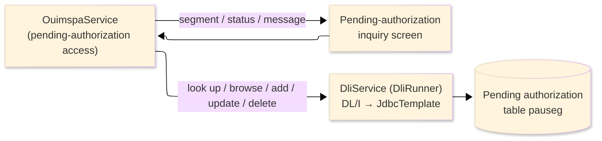
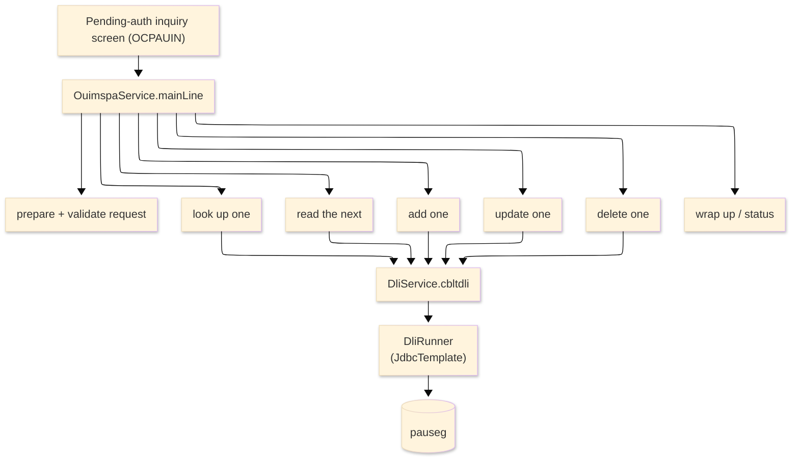

# TO-BE Batch Program Design — OUIMSPA_PendingAuthDLI

> **TO-BE = AS-IS in business terms.** The section order follows the AS-IS document so the two
> compare 1-to-1; what is added is the mapping onto the generated Java/Spring module. Anything
> forced to differ is stated in the section it belongs to, in business terms.

**Header**

| Item | Content |
|---|---|
| System | ORION-CCMS (ORION Credit Card Management System) |
| Source program | OUIMSPA（COBOL） |
| TO-BE module | `orion-online/back-end/programs/ouimspa` · package `com.generated.orion.ouimspa` |
| Platform | Java 17 · Spring Boot 3.x · DB Oracle (H2 in dev) |
| Author ／ Date | modernizeX ／ 2026-09-28 |

> **Form-factor note (business impact):** in AS-IS this pending-authorization data-access routine was a
> COBOL sub-routine that reached an IMS database through DL/I (`CBLTDLI`), invoked from the
> pending-authorization inquiry screen. The transpiler produced it as an in-process service in the
> on-line back-end (`OuimspaService`), **not** as a stand-alone Spring Batch job. Its data access no
> longer uses IMS: the DL/I calls now run through the runtime DL/I service, which stores the pending
> authorization in a **relational table** (see §1.5 / §1.6). The business behaviour — look up, browse,
> add, update and delete a pending authorization by id — is unchanged. It is still driven from the
> inquiry screen. See §8.

## 1. Program overview

### 1.1 TO-BE I/O diagram

### 1.2 Function overview

Serve one pending-authorization request at a time, on demand. Depending on the function asked for, the
routine looks up a single pending authorization by its id, browses to the next one in id order, adds a
new pending authorization, updates an existing one, or deletes one. In AS-IS every access was a DL/I
call against the IMS pending-authorization database; in TO-BE the same operations run through the
runtime DL/I service, which reads and writes a relational pending-authorization table. The requested
function, the authorization id and the record all travel in the call area. The routine returns the
retrieved record, an outcome status and a message.

### 1.3 I/O table

| Business name | File ／ table | I/O |
|---|---|---|
| Pending card-approval store (was IMS DL/I database, segment PAUSEG) | table `pauseg` | I-O |
| Request / result area | in-memory call area (was COMMAREA) | I-O |

> The DL/I hierarchical segment becomes a relational table keyed on the authorization id
> (`PA-AUTH-ID` → primary key `pa_auth_id`). The DL/I browse in ascending key order becomes an ordered
> read (`ORDER BY pa_auth_id` ascending), so "read the next pending authorization" still walks the
> authorizations in ascending id order. Field widths and money precision are preserved (see §4).

### 1.4 Called subprograms / modules

| Item | Notes |
|---|---|
| `DliService` (runtime `DliRunner`) | the DL/I call interface (`cbltdli`); in TO-BE it is backed by `JdbcTemplate` with one table per segment, replacing the AS-IS external `CBLTDLI` module |
| (no business sub-program) | the routine calls no external business program |

### 1.5 DB tables & SQL

| Table | Operation | Columns |
|---|---|---|
| `pauseg` | SELECT (by key / next), SELECT … FOR UPDATE, INSERT, UPDATE, DELETE | the pending-authorization row via JdbcTemplate; each DL/I function maps to one SQL operation |

> **DL/I → relational mapping:** the keyed fetch (GU/GHU) becomes a `SELECT` (with `FOR UPDATE` when the
> row is held for a later change), the sequential fetch (GN) becomes a next-row `SELECT`, the insert
> (ISRT) becomes an `INSERT`, the replace (REPL) becomes an `UPDATE`, and the delete (DLET) becomes a
> `DELETE`. The 2-character DL/I status is still returned (blank OK, `GE` not found, `GB` end of
> database, `II` duplicate) so the routine's decisions are unchanged.

### 1.6 Special notes

- Driven from the pending-authorization inquiry screen; the requested function and its data travel in
  the call area (laid out as the pending-authorization link record).
- The IMS hierarchical database is replaced by a relational table named after the segment (`pauseg`);
  the DL/I position, hold and end-of-database handling are provided by the runtime DL/I service. No
  application logic changed as a result.
- The authorization amount is held as `BigDecimal` with two-decimal scale; the routine stores and
  retrieves it but performs no arithmetic on it, so no rounding rule is involved.
- This is a sub-routine: it performs one requested operation and returns through the call area, setting
  an error flag and message for the caller.

## 2. Processing details

_One row per business step, in execution order. Paragraph and method names are intentionally absent._

| 識別番号 | Business step | What happens | Condition ／ actual value |
|---|---|---|---|
| 0.0 | The request starts | prepares the request, checks it, runs the one requested operation, and finishes | function = look up ／ next ／ add ／ update ／ delete |
| 1.0 | Prepare the request | loads the request from the call area and clears the status and the call counter |  |
| 1.1 | Check the request | the function must be one of the five; look up, add, update and delete also require an authorization id; otherwise the request is marked a bad function | missing id → "Authorization id is required." |
| 2.0 | Look up one | reads the pending authorization for the requested id; found → returns it; none on file → reports not found; a store error → reports a data-access error | by authorization id |
| 2.1 | Read the next | with no id, reads the first or next authorization in id order; with an id, positions at it and reads the one after; past the end → reports end of list; a store error → data-access error |  |
| 2.11 | Position then read next | positions at the requested id and reads the following authorization; when the id is not on file, positions at the next id above it |  |
| 2.2 | Add one | validates the supplied record and adds a new pending authorization; a duplicate id is reported; a store error → data-access error | success → "Pending authorization inserted." |
| 2.21 | Check the new record | a card number is required and the account id must be numeric; a blank decision status defaults to pending | no card → "Card number is required to insert." |
| 2.3 | Update one | reads the pending authorization for update; found → applies the change; none on file → reports not found; a store error → data-access error |  |
| 2.31 | Apply the change | saves the changed pending authorization; a store error → data-access error | success → "Pending authorization updated." |
| 2.4 | Delete one | reads the pending authorization for update; found → removes it; none on file → reports not found; a store error → data-access error |  |
| 2.41 | Apply the delete | removes the pending authorization; a store error → data-access error | success → "Pending authorization purged." |
| 2.9 | Bad function | an unrecognised request is reported as a bad function | "Unknown DL/I request function code." |
| 5.0 | Fetch by key | reads one pending authorization from the store by its id | keyed read |
| 5.1 | Store a new record | adds the pending authorization to the store |  |
| 5.2 | Save the change | saves the changed pending authorization to the store |  |
| 5.3 | Remove the record | deletes the pending authorization from the store |  |
| 5.4 | Fetch the next | reads the next pending authorization in id order |  |
| 6.0 | Return the record | hands the retrieved pending authorization back to the caller | "Pending authorization retrieved." |
| 6.1 | Report not found | reports that no pending authorization exists for that id | "No pending authorization for that id." |
| 6.2 | Report end of list | reports that the end of the pending-authorization list was reached | "End of pending authorization list." |
| 6.9 | Report a data-access error | reports a store error with the returned status and function, and writes it to the log |  |
| 9.0 | Wrap up | sets the outcome flag and message in the call area for the caller | error flag set when the outcome is not OK |

## 3. Structure diagram

_The call structure of the routine as generated._

## 4. Output specifications (file / table)

The pending-authorization record read and written keeps the original field widths; each field also maps
to a column of the relational `pauseg` table (the former IMS PAUSEG segment).

### 4.1 Pending authorization record (PAUSEG-REC)

| Level | Item name | Field ／ column | Type ／ bytes | Position | Java ／ SQL type | How it is set |
|---|---|---|---|---|---|---|
| 01 | Record | PAUSEG-REC | group | 1 | row of `pauseg` | whole record |
| 05 | Authorization id | PA-AUTH-ID | X(16) ／ 16 | 1 | `String` ／ `VARCHAR2(16)` | record key — the authorization id |
| 05 | Card number | PA-CARD-NUM | X(16) ／ 16 | 17 | `String` ／ `VARCHAR2(16)` | required on add |
| 05 | Account id | PA-ACCT-ID | 9(11) ／ 11 | 33 | `long` ／ `NUMERIC(11)` | must be numeric on add |
| 05 | Amount | PA-AMOUNT | S9(09)V99 ／ 11 | 44 | `BigDecimal` ／ `DECIMAL(11,2)` | authorization amount (stored as supplied, no rounding) |
| 05 | Merchant | PA-MERCHANT | X(50) ／ 50 | 55 | `String` ／ `VARCHAR2(50)` | as supplied |
| 05 | Request timestamp | PA-REQUEST-TS | X(26) ／ 26 | 105 | `String` ／ `VARCHAR2(26)` | as supplied |
| 05 | Status | PA-STATUS | X(01) ／ 1 | 131 | `String` ／ `VARCHAR2(1)` | defaults to pending when blank on add |
| 05 | Decision | PA-DECISION | group ／ 65 | 132 | (group) | the decision block |
| 10 | Decision code | PA-DEC-CODE | X(01) ／ 1 | 132 | `String` ／ `VARCHAR2(1)` | approve / decline / refer |
| 10 | Decision reason | PA-DEC-REASON | X(30) ／ 30 | 133 | `String` ／ `VARCHAR2(30)` | as supplied |
| 10 | Decision user | PA-DEC-USER | X(08) ／ 8 | 163 | `String` ／ `VARCHAR2(8)` | as supplied |
| 10 | Decision timestamp | PA-DEC-TS | X(26) ／ 26 | 171 | `String` ／ `VARCHAR2(26)` | as supplied |
| 05 | Filler | FILLER | X(04) ／ 4 | 197 | — | reserved |

> The amount is `BigDecimal` with two-decimal scale. The routine only stores and retrieves the record —
> it computes nothing, so no rounding rule applies. Byte positions follow the generated record layout;
> the level-01 total is left unstated because the source layout carries a trailing reserved filler.

## 5. In/out parameters & check specifications

### 5.1 Parameters

| Kind | Value | Notes |
|---|---|---|
| Input parameter | requested function (`WS-PL-FUNC`) — look up, next, add, update or delete | supplied in the call area by the inquiry screen |
| Input parameter | authorization id (`WS-PL-KEY`); for add and update, the pending-authorization record (`PA-*` fields) | the id is required for look up, add, update and delete |
| Return value | outcome status (`WS-PL-STATUS`) — OK, bad function, not found, end of list, duplicate or error — and message (`WS-PL-MSG`) | tells the caller the outcome |
| Return value | the retrieved pending-authorization record and the DL/I status (`WS-PL-DLI-STAT`); the call-area error flag and message (`CA-ERR-FLG`, `CA-ERR-MSG`) | returned through the call area |

### 5.2 Checks

| No. | Kind | Condition | Error code | Behaviour |
|---|---|---|---|---|
| 1 | Business | the function is not one of the five | — | reported as a bad function: "Unknown DL/I request function code." |
| 2 | Business | the authorization id is missing on look up, add, update or delete | — | reported as a bad function: "Authorization id is required." |
| 3 | Business | an add supplies no card number | — | rejected with "Card number is required to insert." |
| 4 | Business | an add supplies a non-numeric account id | — | rejected with "Account id must be numeric." |
| 5 | Business | no pending authorization exists for the id on look up, update or delete | — | reported not found: "No pending authorization for that id." |
| 6 | Business | an add uses an id that already exists | — | rejected with "Authorization id already exists." |
| 7 | Business | the browse has passed the last authorization | — | reported as end of list: "End of pending authorization list." |
| 8 | Store access | any other store status is returned | — | reported as a data-access error and written to the log with the status and function |

## 6. Modification summary

| No. | Date | Title | Content |
|---|---|---|---|
| 1 | 2026-09-28 | Initial TO-BE mapping | Mapped from the AS-IS design onto the generated `OuimspaService`; DL/I data access remapped onto the relational pending-authorization table via the runtime DL/I service; behaviour preserved. |

## 7. Screen

No screen — the routine is a sub-routine driven from the pending-authorization inquiry screen and
returns its outcome through the call area.

## 8. TO-BE operations (replacing JCL/BAT)

| Item | Value |
|---|---|
| Trigger | driven on demand from the pending-authorization inquiry screen; the requested action (look up, next, add, update or delete) and the authorization id or record travel in the call area. In AS-IS this was a DL/I sub-routine against an IMS database; it now runs as the in-process service `OuimspaService`, not a stand-alone Spring Batch job, and its data access runs against a relational table — the business logic is unchanged |
| Schedule | not determined (ask the team) |
| Input data | the pending authorizations, now held in the relational pending-authorization table (was the IMS pending-authorization database) |
| Log | written to the application log; a data-access error is logged with the returned status and the requested function |
| Rerun | each call is a single operation; a look up or a browse is read-only and safe to repeat, while an add, update or delete changes one authorization and should be repeated only when the previous attempt did not complete |
