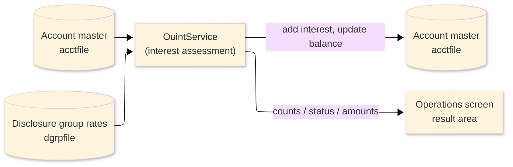
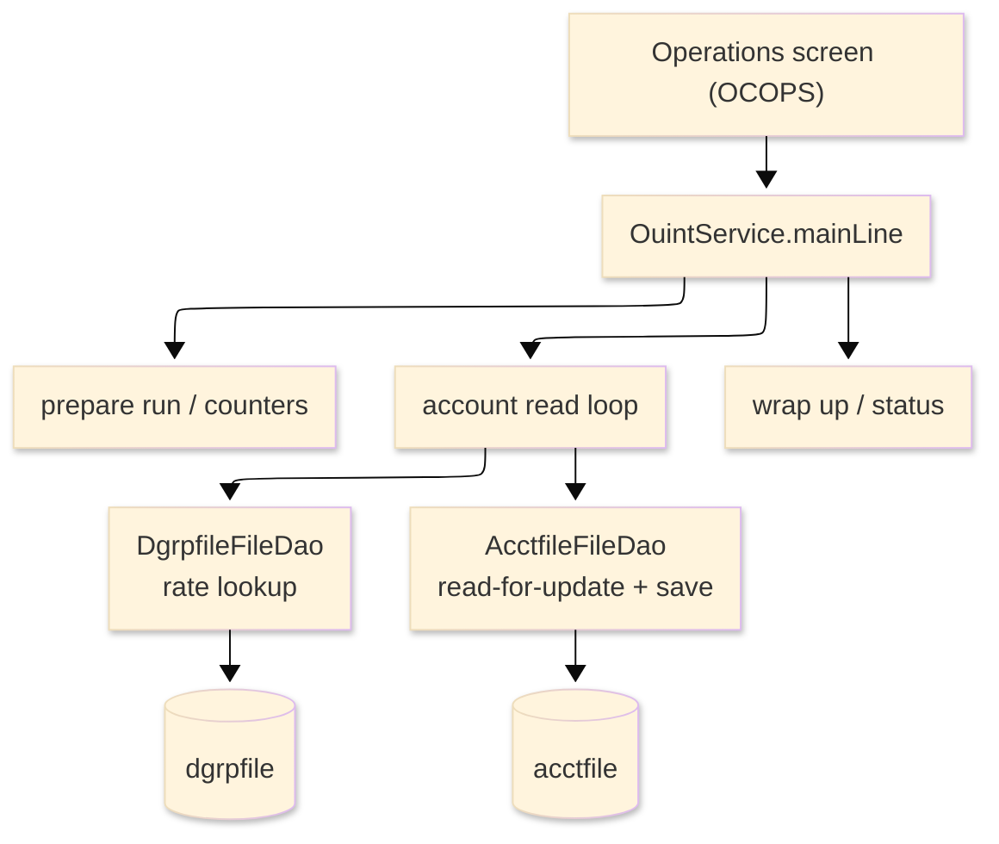

# TO-BE Batch Program Design — OUINT_InterestAssessment

> **TO-BE = AS-IS in business terms.** The section order follows the AS-IS document so the two
> compare 1-to-1; what is added is the mapping onto the generated Java/Spring module. Anything
> forced to differ is stated in the section it belongs to, in business terms.

**Header**

| Item | Content |
|---|---|
| System | ORION-CCMS (ORION Credit Card Management System) |
| Source program | OUINT（COBOL） |
| TO-BE module | `orion-online/back-end/programs/ouint` · package `com.generated.orion.ouint` |
| Platform | Java 17 · Spring Boot 3.x · DB Oracle (H2 in dev) |
| Author ／ Date | modernizeX ／ 2026-09-28 |

> **Form-factor note (business impact):** in AS-IS this interest run was a COBOL routine invoked
> from the Operations screen. The transpiler produced it as an in-process service in the on-line
> back-end (`OuintService`), **not** as a stand-alone Spring Batch job; the business logic — which
> accounts are charged and how the interest is computed — is unchanged. It is still launched from the
> Operations screen. See §8.

## 1. Program overview

### 1.1 TO-BE I/O diagram

### 1.2 Function overview

Assess one month of interest on revolving balances, on demand. The run reads the account master in
key order; for every active account that carries a positive balance it looks up the annual interest
rate for the account's disclosure group (type/category for interest), computes the monthly interest,
adds it to the balance and to the cycle debit bucket, and saves the account. Inactive accounts and
accounts with a zero or negative balance are skipped. The run reports how many accounts were read,
selected, charged and skipped, the total interest posted, and the balance before and after.

### 1.3 I/O table

| Business name | File ／ table | I/O |
|---|---|---|
| Account master (was VSAM KSDS) | table `acctfile` | I-O |
| Disclosure group rates (was VSAM KSDS) | table `dgrpfile` | I |
| Request / result area | in-memory call area (was COMMAREA) | I-O |

> The account master keyed browse (start / read-next) becomes an ordered read of `acctfile` by its
> primary key `ac_id`, so accounts are still processed in ascending account-id order. Field widths and
> the money precision are preserved (see §4).

### 1.4 Called subprograms / modules

| Item | Notes |
|---|---|
| `AcctfileFileDao` · `DgrpfileFileDao` | data access for the account master and the disclosure-group rate table |
| (no sub-program) | the routine calls no external business program |

### 1.5 DB tables & SQL

| Table | Operation | Columns |
|---|---|---|
| `acctfile` | SELECT (ordered read), SELECT … FOR UPDATE, UPDATE | balance and cycle-debit columns via JdbcTemplate |
| `dgrpfile` | SELECT by group / type / category | interest-rate column |

### 1.6 Special notes

- Launched on demand from the Operations screen; an optional single account may be requested
  (`KO-PARM-ACCT`; 0 means every account).
- Money is held as `BigDecimal`; the monthly interest is balance × annual-rate ÷ 1200, rounded
  half-up. When the disclosure-group rate is missing, a default rate is used and that account is
  counted as rate-defaulted.
- No sub-programs; the run stands alone against the two tables.

## 2. Processing details

_One row per business step, in execution order. Paragraph and method names are intentionally absent._

| 識別番号 | Business step | What happens | Condition ／ actual value |
|---|---|---|---|
| 0.0 | The interest run starts | the run is launched from the Operations screen and drives preparation, the account loop and the wrap-up in turn |  |
| 1.0 | Prepare the run | clears the result counters and sets the status to in-progress; if a single account was requested, switches on the filter for that one account | single account when the requested account is greater than zero |
| 3.0 | Read the accounts in order | positions at the first (or requested) account and reads forward until the end |  |
| 3.1 | Position the read | starts reading the account master from the first or the requested account; when there is nothing to read it reports that there are no accounts to assess; a store error stops the run | not-found → "no accounts to assess"; other error → run fails |
| 3.2 | Take the next account | reads the next account; at end of file the loop finishes; a store error stops the run | end of accounts ends the loop |
| 4.0 | Assess one account | adds the balance to the running "before" total, then decides whether this account is charged | skipped when the account is inactive or the balance is not positive |
| 4.1 | Look up the rate | reads the annual interest rate for the account's disclosure group; if none is on file a default rate is used and the account is counted as rate-defaulted | rate defaulted when the group has no entry |
| 4.2 | Compute the interest | monthly interest = balance × rate ÷ 1200, rounded half-up; a negative result is forced to zero | interest floored at zero |
| 4.3 | Charge the account | re-reads the account for update, adds the interest to the balance and to the cycle-debit bucket, saves it, and counts it as posted; a failed read or save counts the account as rejected | only when the computed interest is above zero |
| 3.4 | Finish the read | ends the account read once the loop is done |  |
| 9.0 | Wrap up the run | sets the final status (complete, complete-with-warnings when any account was rejected, or failed) and returns the accumulated counts and amounts to the operator | warning status when at least one account was rejected |

## 3. Structure diagram

_The call structure of the routine as generated._

## 4. Output specifications (file / table)

The account master record written back keeps the original field widths; each field also maps to a
column of the `acctfile` table.

### 4.1 Account master (ACCT-REC) — 300 bytes

| Level | Item name | Field ／ column | Type ／ bytes | Position | Java ／ SQL type | How it is set |
|---|---|---|---|---|---|---|
| 01 | Record | ACCT-REC | group ／ 300 | 1 | row of `acctfile` | whole record |
| 05 | Account id | AC-ID | 9(11) ／ 11 | 1 | `long` ／ `NUMERIC(11)` | record key (unchanged) |
| 05 | Active status | AC-ACTIVE-STATUS | X(01) ／ 1 | 12 | `String` ／ `VARCHAR2(1)` | unchanged |
| 05 | Current balance | AC-CURR-BAL | S9(10)V99 ／ 12 | 13 | `BigDecimal` ／ `DECIMAL(12,2)` | balance plus the posted interest |
| 05 | Credit limit | AC-CREDIT-LIMIT | S9(10)V99 ／ 12 | 25 | `BigDecimal` ／ `DECIMAL(12,2)` | unchanged |
| 05 | Cash limit | AC-CASH-LIMIT | S9(10)V99 ／ 12 | 37 | `BigDecimal` ／ `DECIMAL(12,2)` | unchanged |
| 05 | Open date | AC-OPEN-DATE | X(10) ／ 10 | 49 | `String` ／ `VARCHAR2(10)` | unchanged |
| 05 | Expiry date | AC-EXPIRY-DATE | X(10) ／ 10 | 59 | `String` ／ `VARCHAR2(10)` | unchanged |
| 05 | Reissue date | AC-REISSUE-DATE | X(10) ／ 10 | 69 | `String` ／ `VARCHAR2(10)` | unchanged |
| 05 | Cycle credit | AC-CYC-CREDIT | S9(10)V99 ／ 12 | 79 | `BigDecimal` ／ `DECIMAL(12,2)` | unchanged |
| 05 | Cycle debit | AC-CYC-DEBIT | S9(10)V99 ／ 12 | 91 | `BigDecimal` ／ `DECIMAL(12,2)` | cycle debit plus the posted interest |
| 05 | Address zip | AC-ADDR-ZIP | X(10) ／ 10 | 103 | `String` ／ `VARCHAR2(10)` | unchanged |
| 05 | Group id | AC-GROUP-ID | X(10) ／ 10 | 113 | `String` ／ `VARCHAR2(10)` | unchanged |
| 05 | Filler | FILLER | X(178) ／ 178 | 123 | — | reserved |

> Money is `BigDecimal` with two-decimal scale; the interest itself is computed at high precision
> (÷ 1200, rounded half-up) before it is added, so the posted result matches the original penny for
> penny.

## 5. In/out parameters & check specifications

### 5.1 Parameters

| Kind | Value | Notes |
|---|---|---|
| Input parameter | a single account to assess, or 0 for all accounts (`KO-PARM-ACCT`) | supplied by the Operations screen |
| Return value | a status flag — complete, complete-with-warnings, or failed (`KO-STATUS`) plus a status message | tells the operator the outcome |
| Return counts | accounts read, selected, posted, updated, skipped and rejected | shown back on the Operations screen |
| Return amounts | total interest posted, balance before and balance after | shown back on the Operations screen |

### 5.2 Checks

| No. | Kind | Condition | Error code | Behaviour |
|---|---|---|---|---|
| 1 | Store access | the account read cannot be positioned | — | the run stops and reports "STARTBR ACCTFILE FAILED." |
| 2 | Store access | reading the next account fails | — | the run stops and reports "READNEXT ACCTFILE FAILED." |
| 3 | Business | an account cannot be re-read or saved for update | — | that account is counted as rejected and the run ends with a warning |
| 4 | Business | no accounts qualify for assessment | — | the run ends normally reporting "NO ACCOUNTS TO ASSESS." |

## 6. Modification summary

| No. | Date | Title | Content |
|---|---|---|---|
| 1 | 2026-09-28 | Initial TO-BE mapping | Mapped from the AS-IS design onto the generated `OuintService`; behaviour preserved. |

## 7. Screen

No screen — the routine is driven from the Operations screen and reports its outcome there.

## 8. TO-BE operations (replacing JCL/BAT)

| Item | Value |
|---|---|
| Trigger | launched on demand from the Operations screen; an optional single account can be entered, otherwise every account is assessed |
| Schedule | not determined (ask the team) |
| Input data | the current account balances and the disclosure-group interest rates already held in the database |
| Log | written to the application log; the outcome counts are returned to the operator on screen |
| Rerun | safe to rerun; each run recomputes the interest from the balances as they stand at that moment |
