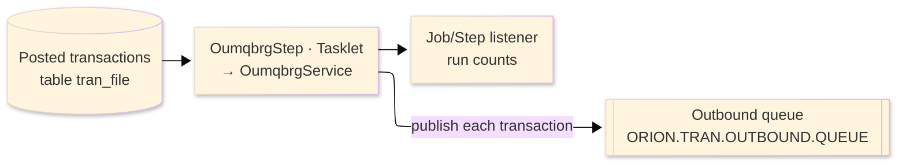
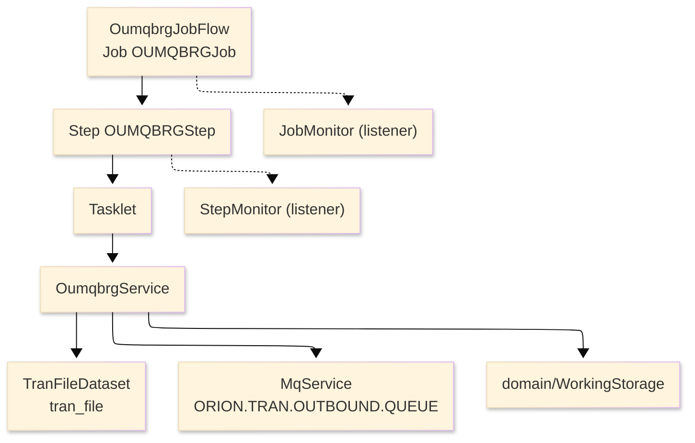

# TO-BE Batch Program Design — OUMQBRG_MQTransactionBridge

> **TO-BE = AS-IS in business terms.** The section order follows the AS-IS document so the two
> compare 1-to-1; what is added is the mapping onto the generated Spring Batch module. Anything
> forced to differ is stated in the section it belongs to, in business terms.

**Header**

| Item | Content |
|---|---|
| System | ORION-CCMS (ORION Credit Card Management System) |
| Source program | OUMQBRG（COBOL） |
| TO-BE module | `orion-batch/programs/oumqbrg` · package `com.generated.orion.oumqbrg` |
| Platform | Java 17 · Spring Boot 3.x · Spring Batch (Tasklet) · DB Oracle (H2 in dev) |
| Author ／ Date | modernizeX ／ 2026-09-28 |

> **Form-factor note:** this is a real Spring Batch Tasklet job. The transpiler produced it as the
> job `OUMQBRGJob` with a single step `OUMQBRGStep`, whose tasklet runs `OumqbrgService`; the
> business logic — draining the posted-transaction store and republishing every record to the
> outbound queue — is unchanged. The former VSAM transaction file is now the `tran_file` table (the
> job's input). It is launched by the batch runner (see §8), replacing `jcl/RUNMQBRG.jcl`.

## 1. Program overview

### 1.1 TO-BE I/O diagram

### 1.2 Function overview

Drain the posted-transaction store and republish it as a real-time transaction feed. The job reads
every transaction from the `tran_file` table in key order and, for each one, wraps the record image
in a small routing header and publishes it as a message on `ORION.TRAN.OUTBOUND.QUEUE` so downstream
systems (fraud, analytics, general ledger) receive the feed. It counts records read, messages
published, publish errors and records skipped. When the message system is unavailable the job still
reads the whole store but publishes nothing, counting every record as skipped. It runs unattended as
a batch job.

### 1.3 I/O table

| Business name | File ／ table | I/O |
|---|---|---|
| Posted transactions (was VSAM KSDS) | table `tran_file` | I |
| Outbound transaction feed | MQ queue `ORION.TRAN.OUTBOUND.QUEUE` | O |
| Run counters / status | in-memory work area (was COMMAREA) | I-O |

> The sequential (key-order) read of the transaction file becomes an ordered read of `tran_file` by
> its unique key `tr_id`, so transactions are republished in ascending transaction-id order
> (`ORDER BY tr_id`). No column of `tran_file` is changed — the job is read-only against the table.

### 1.4 Called subprograms / modules

| Item | Notes |
|---|---|
| `MqService` | opens, publishes to and closes the outbound queue (JMS-backed at runtime; a stub when no broker is present) |
| `TranFileDataset` | sequential, key-order read of the posted-transaction store (`tran_file`, key `tr_id`) |
| (no COBOL sub-program) | the former MQ verbs are provided by the runtime, not by external business programs |

### 1.5 DB tables & SQL

| Table | Operation | Columns |
|---|---|---|
| `tran_file` | SELECT (ordered read by `tr_id`) | the whole transaction record image is read; nothing is written |

The published message body is not a table — it is an MQ message (see §4). The job performs no
INSERT/UPDATE against the database.

### 1.6 Special notes

- The message system is an external dependency (JMS-backed `MqService`); the queue manager name
  (`ORIONQM1`) and outbound queue name (`ORION.TRAN.OUTBOUND.QUEUE`) are fixed configuration.
- Resilient by design: if the connect or open fails the job continues in read-only mode, reading
  every transaction and counting it as skipped, and finishes normally.
- The job performs no arithmetic — each transaction record (including its amount `tr_amt`,
  `DECIMAL(11,2)`) is carried into the message body verbatim, so no rounding is applied.

## 2. Processing details

_One row per business step, in execution order. Paragraph and method names are intentionally absent._

| 識別番号 | Business step | What happens | Condition ／ actual value |
|---|---|---|---|
| 0.0 | The bridge run starts | prepares the run, drains the transaction store one record at a time, then finalises |  |
| 1.0 | Prepare the run | opens the transaction store, connects to the message system, opens the outbound queue and reads the first transaction | an unreadable store leaves nothing to send |
| 1.1 | Connect to the message system | connects to the queue manager; on failure the run switches to read-only mode and carries on | connect fails → read-only mode |
| 1.2 | Open the outbound queue | opens the outbound transaction queue for output; on failure the run switches to read-only mode | open fails → read-only mode |
| 2.0 | Bridge one transaction | counts the transaction, publishes it when the queue is available or counts it as skipped otherwise, then reads the next one | skipped when the message system is unavailable |
| 2.1 | Read the next transaction | reads the next transaction in key order; the end of the store, or a read error, ends the run | end of store ends the run |
| 2.2 | Publish the transaction | wraps the transaction image in a routing header (record type and source system) and puts it on the outbound queue, counting a success or a publish error | publish error is counted, the run continues |
| 3.0 | Finalise the run | closes the outbound queue, disconnects from the message system, closes the transaction store and reports the run counts |  |
| 3.1 | Close the outbound queue | closes the outbound queue and logs any close problem |  |
| 3.2 | Disconnect from the message system | disconnects from the queue manager and logs any disconnect problem |  |
| 3.9 | Report the run counts | logs records read, messages published, publish errors and records skipped |  |

## 3. Structure diagram

_The call structure of the program as generated._

## 4. Output specifications (file / table)

The output is the outbound MQ message published for each transaction: a 362-byte body made of a
routing header plus the transaction record image copied verbatim.

### 4.1 Outbound MQ message (WS-OUT-MSG) — 362 bytes

| Level | Item name | Field ／ column | Type ／ bytes | Position | Java ／ SQL type | How it is set |
|---|---|---|---|---|---|---|
| 01 | Message | WS-OUT-MSG | group ／ 362 | 1 | MQ message body | whole message |
| 05 | Record type | OM-REC-TYPE | X(04) ／ 4 | 1 | `String` ／ — | constant `TRAN` |
| 05 | Source system | OM-SRC-SYSTEM | X(08) ／ 8 | 5 | `String` ／ — | constant `ORION` |
| 05 | Transaction image | OM-TRAN-DATA | X(350) ／ 350 | 13 | `String` ／ — | the 350-byte transaction record read from `tran_file`, verbatim |

> No arithmetic is performed on the payload — the transaction record (amount included) is copied
> into the message unchanged, so there is no rounding and no precision change against AS-IS.

## 5. In/out parameters & check specifications

### 5.1 Parameters

| Kind | Value | Notes |
|---|---|---|
| Input parameter | none from the operator; the input is the current contents of the `tran_file` table | the queue manager and outbound queue names are fixed configuration |
| Return value | a completion code (0 = normal) propagated to the step exit status | drives the job's success / failure outcome |
| Return counts | records read, messages published, publish errors and records skipped | written to the run log |

### 5.2 Checks

| No. | Kind | Condition | Error code | Behaviour |
|---|---|---|---|---|
| 1 | Message system | the connect or the open fails | — | the run switches to read-only mode: every record is read and counted as skipped, none are published |
| 2 | Message system | a publish (put) fails | — | the transaction is counted as a publish error and the run continues |
| 3 | Store access | reading the transaction store fails | — | the read ends and the run finalises with the counts collected so far |

## 6. Modification summary

| No. | Date | Title | Content |
|---|---|---|---|
| 1 | 2026-09-28 | Initial TO-BE mapping | Mapped from the AS-IS design onto the generated `OumqbrgService` and the `OUMQBRGJob` Spring Batch wiring; behaviour preserved. |

## 7. Screen

No screen — the job runs unattended and writes its run counts to the log.

## 8. TO-BE operations (replacing JCL/BAT)

| Item | Value |
|---|---|
| Trigger | `AppLauncher --spring.batch.job.name=OUMQBRGJob` (replacing `jcl/RUNMQBRG.jcl`) |
| Schedule | not determined (ask the team) |
| Input data | the posted transactions held in the `tran_file` table |
| Log | logback application log (run counts at the end); the Spring Batch `BATCH_*` metadata tables record the job and step status |
| Rerun | safe to rerun; each launch is a fresh job instance and republishes the store from the start, so downstream consumers should tolerate re-sent transactions |
