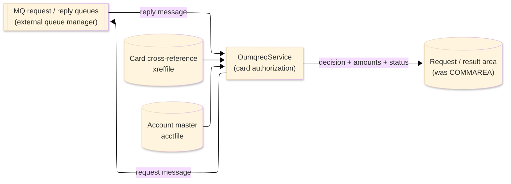
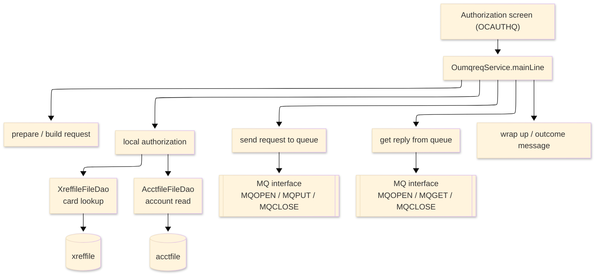

# TO-BE Batch Program Design — OUMQREQ_MQAuthRequester

> **TO-BE = AS-IS in business terms.** The section order follows the AS-IS document so the two
> compare 1-to-1; what is added is the mapping onto the generated Java/Spring module. Anything
> forced to differ is stated in the section it belongs to, in business terms.

**Header**

| Item | Content |
|---|---|
| System | ORION-CCMS (ORION Credit Card Management System) |
| Source program | OUMQREQ（COBOL） |
| TO-BE module | `orion-online/back-end/programs/oumqreq` · package `com.generated.orion.oumqreq` |
| Platform | Java 17 · Spring Boot 3.x · DB Oracle (H2 in dev) |
| Author ／ Date | modernizeX ／ 2026-09-28 |

> **Form-factor note (business impact):** in AS-IS this card-authorization requester was a routine
> called from the authorization screen (reached through a CICS program link). The transpiler produced
> it as an in-process service in the on-line back-end (`OumqreqService`), **not** as a stand-alone
> Spring Batch job; the business behaviour — build the request, decide the authorization locally, and
> exchange messages with the queue manager when it is available — is unchanged. It is still called
> in-process from the authorization screen. See §8.

## 1. Program overview

### 1.1 TO-BE I/O diagram

### 1.2 Function overview

Authorize one card purchase on demand. The routine builds an authorization request stamped with the
current time, then decides the outcome locally: it resolves the card to its account through the card
cross-reference, reads the account and approves the request only for an active account with enough
available credit — otherwise it declines with a reason. It also tries to put the request on the message
queue and read a reply; if the queue manager is unavailable, the request still stands on the local
decision. It returns the decision, the reason, the approved amount and the available credit to the
caller.

### 1.3 I/O table

| Business name | File ／ table | I/O |
|---|---|---|
| Card cross-reference (was VSAM KSDS) | table `xreffile` | I |
| Account master (was VSAM KSDS) | table `acctfile` | I |
| Request / result area | in-memory call area (was COMMAREA) | I-O |
| MQ request / reply queues | external message queues (queue manager) | I-O |

> The card cross-reference and the account master are read directly by key — mapped to primary-key
> lookups on `xreffile` (`xr_card_num`) and `acctfile` (`ac_id`). There is no browse (READ-NEXT), so
> record order does not apply; each read fetches a single record. Field widths and money precision are
> preserved (see §4 and §5).

### 1.4 Called subprograms / modules

| Item | Notes |
|---|---|
| `XreffileFileDao` · `AcctfileFileDao` | data access for the card cross-reference and the account master |
| `MQOPEN` · `MQPUT` · `MQGET` · `MQCLOSE` | the external message-queue interface (open / put / get / close); the queue manager is an external dependency |

### 1.5 DB tables & SQL

| Table | Operation | Columns |
|---|---|---|
| `xreffile` | SELECT by card number | primary-key lookup (`xr_card_num`) → account id |
| `acctfile` | SELECT by account id | primary-key lookup (`ac_id`) → status, balance, credit limit |

### 1.6 Special notes

- Called in-process from the authorization screen; in AS-IS it was reached through a CICS program link
  and was linked from OCAUTHQ.
- Uses the external message-queue interface (open / put / get / close). The queue manager is an
  external dependency; if it is unavailable the run marks messaging down and proceeds on the local
  decision, and a "no reply queued" reason is treated as a local decision.
- The authorization decision is made locally: the card is resolved to its account and the request is
  approved only for an active account with enough available credit.
- Amounts are held as `BigDecimal`; the available credit is the credit limit minus the current balance
  (a subtraction and comparison — no rounding).

## 2. Processing details

_One row per business step, in execution order. Paragraph and method names are intentionally absent._

| 識別番号 | Business step | What happens | Condition ／ actual value |
|---|---|---|---|
| 0.0 | The authorization run starts | drives preparation, the request build, the local decision, the queue exchange and the wrap-up in turn |  |
| 1.0 | Prepare the run | clears the working flags and the outcome message and sets the messaging connection to its default |  |
| 2.0 | Build the request | stamps the request with the current time and the card number and clears the response fields ready to be filled |  |
| 3.0 | Authorize the card locally | looks the card up and, if found, checks the account behind it to reach an approve or decline decision without needing the queue manager |  |
| 3.1 | Look up the card | reads the card cross-reference to find the account behind the card | found / not found / read failure |
| 3.2 | Read the account | reads the account behind the card | found / not found / read failure |
| 3.3 | Check the account was found | decides how to proceed based on the account read outcome | missing account → declined; read failure → error |
| 3.4 | Decline when the account is missing | records a decline because the account is not on file | reason "ACCOUNT NOT FOUND" |
| 3.5 | Decline when the card is missing | records a decline because the card is not on file | reason "CARD NOT FOUND" |
| 3.6 | Reach the decision | works out the available credit (credit limit minus current balance) and decides the outcome | inactive → "ACCOUNT INACTIVE"; over credit → "INSUFFICIENT CREDIT"; else "APPROVED OK" |
| 4.0 | Send the request to the queue | opens the request queue and, when the queue manager is available, puts the request message on it | only when messaging is up |
| 4.1 | Put the request message | writes the request message to the request queue and closes the queue |  |
| 5.0 | Get the reply from the queue | opens the reply queue and, when the queue manager is available, waits briefly for a reply | only when messaging is up |
| 5.1 | Read the reply message | reads any reply and closes the reply queue; when no reply is queued the run keeps the local decision | no reply → keep local decision |
| 8.0 | Check the messaging status | after each queue operation, marks the queue manager unavailable if the operation did not succeed, so the run falls back to the local decision | non-zero completion → messaging down |
| 8.5 | Read the current time | obtains the current date and time for the request and response stamps |  |
| 9.0 | Wrap up the run | stamps the response time, sets the error flag from the decision, builds the outcome message and returns it to the caller | message reads "AUTH … - …" |

## 3. Structure diagram

_The call structure of the routine as generated._

## 4. Output specifications (file / table)

The MQ handle work area is documented as in the AS-IS layout; the authorization decision itself is
returned in the shared call area (see §5.1). Byte positions are kept from the AS-IS layout.

### 4.1 MQ handle work area (KMQ) — 16 bytes

| Level | Item name | Field ／ column | Type ／ bytes | Position | Java ／ SQL type | How it is set |
|---|---|---|---|---|---|---|
| 01 | Handles | MQ-HANDLES | group ／ 16 | 1 | work area | whole handle block |
| 05 | Connection handle | MQ-HCONN | S9(09) ／ 4 | 1 | `int` | set to the default connection handle at start |
| 05 | Request object handle | MQ-HOBJ-REQ | S9(09) ／ 4 | 5 | `int` | reserved — not used on this path |
| 05 | Reply object handle | MQ-HOBJ-RPY | S9(09) ／ 4 | 9 | `int` | set when the reply queue is opened |
| 05 | Output object handle | MQ-HOBJ-OUT | S9(09) ／ 4 | 13 | `int` | set when the request queue is opened for output |

> The handles are binary fullwords (`int`) used only during the queue exchange; they are not business
> results. The approved amount and available credit returned to the caller are held as `BigDecimal`.

## 5. In/out parameters & check specifications

### 5.1 Parameters

| Kind | Value | Notes |
|---|---|---|
| Input parameter | the authorization request in the shared call area — card number (`AQ-CARD-NUM`) and requested amount (`AQ-AMOUNT`) | supplied by the authorization screen |
| Return value | the decision (`AS-DECISION` — APPROVED / DECLINED / ERROR) and a reason (`AS-REASON`) | tells the caller the outcome |
| Return amounts | the approved amount (`AS-APPROVED-AMT`) and the available credit (`AS-AVAIL-CREDIT`) | zero when declined |
| Work handles | the messaging connection and queue handles (`MQ-HANDLES`) | used only during the queue exchange |

### 5.2 Checks

| No. | Kind | Condition | Error code | Behaviour |
|---|---|---|---|---|
| 1 | File access | the card cross-reference read returns a response other than found or not-found | — | recorded as a file error; the decision becomes ERROR ("FILE READ ERROR") |
| 2 | File access | the account read returns a response other than found or not-found | — | recorded as a file error; the decision becomes ERROR ("FILE READ ERROR") |
| 3 | Business | the card is not on file | — | declined "CARD NOT FOUND" |
| 4 | Business | the account is not on file | — | declined "ACCOUNT NOT FOUND" |
| 5 | Business | the account is not active | — | declined "ACCOUNT INACTIVE" |
| 6 | Business | the requested amount exceeds the available credit | — | declined "INSUFFICIENT CREDIT" |
| 7 | Messaging | a queue operation returns a non-zero completion code | — | messaging is marked down and the run keeps the local decision |

## 6. Modification summary

| No. | Date | Title | Content |
|---|---|---|---|
| 1 | 2026-09-28 | Initial TO-BE mapping | Mapped from the AS-IS design onto the generated `OumqreqService`; behaviour preserved. |

## 7. Screen

No screen — the routine is called from the authorization screen and returns its decision there; nothing
is drawn by this routine.

## 8. TO-BE operations (replacing JCL/BAT)

| Item | Value |
|---|---|
| Trigger | called in-process from the authorization screen when a card authorization is requested (in AS-IS a CICS-linked routine from OCAUTHQ); it is now an in-process on-line service (`OumqreqService`), not a Spring Batch job, and is not scheduled |
| Schedule | not applicable — called on demand per authorization |
| Input data | the card number and requested amount from the calling screen; the card cross-reference and account master in the database; the MQ request / reply queues |
| Log | application log — queue failures and the final card decision are logged |
| Rerun | safe to rerun; each call re-reads the card and account and recomputes the decision; the queue exchange is best-effort and falls back to the local decision |
