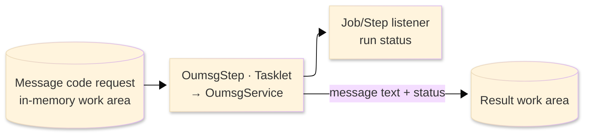
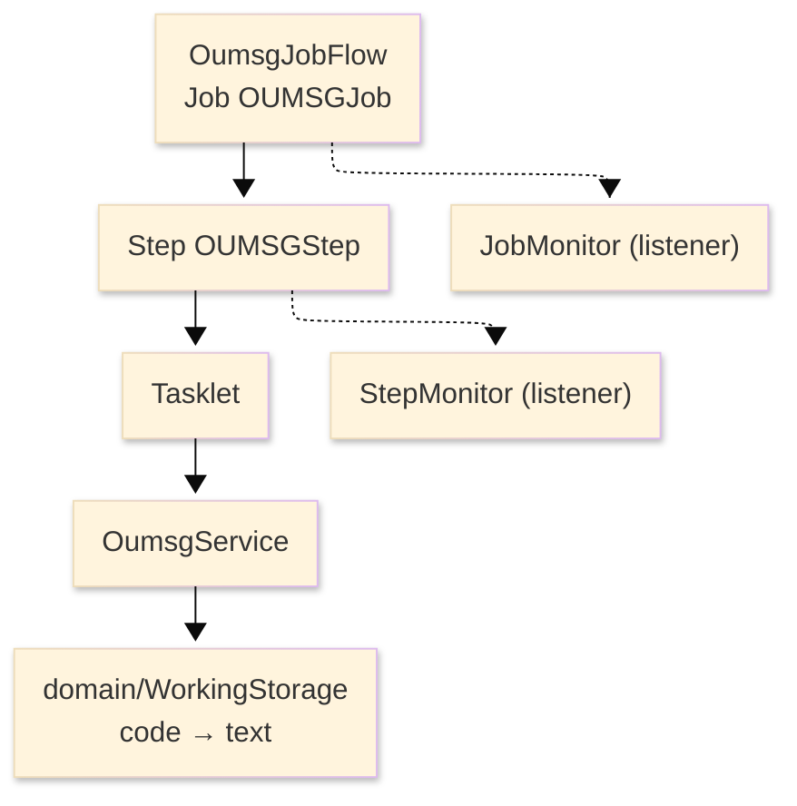

# TO-BE Batch Program Design — OUMSG_MessageRetriever

> **TO-BE = AS-IS in business terms.** The section order follows the AS-IS document so the two
> compare 1-to-1; what is added is the mapping onto the generated Spring Batch module. Anything
> forced to differ is stated in the section it belongs to, in business terms.

**Header**

| Item | Content |
|---|---|
| System | ORION-CCMS (ORION Credit Card Management System) |
| Source program | OUMSG（COBOL） |
| TO-BE module | `orion-batch/programs/oumsg` · package `com.generated.orion.oumsg` |
| Platform | Java 17 · Spring Boot 3.x · Spring Batch (Tasklet) · DB Oracle (H2 in dev) |
| Author ／ Date | modernizeX ／ 2026-09-28 |

> **Form-factor note:** this is a real Spring Batch Tasklet job. The transpiler produced it as the
> job `OUMSGJob` with a single step `OUMSGStep`, whose tasklet runs `OumsgService`; the business
> logic — turning a message code into its display text — is unchanged. The code-to-text mapping is
> held inside the program, so the job reads no file and touches no database. It is launched by the
> batch runner (see §8).

## 1. Program overview

### 1.1 TO-BE I/O diagram

### 1.2 Function overview

Return the display text for a message code. The job takes a six-character message code, matches it
against the set of codes the program knows, and returns the matching text with a success status. When
the code is not one it recognises, it returns the code itself as the text and a not-recognised
status. There is no file or database access — the mapping is held in the program.

### 1.3 I/O table

| Business name | File ／ table | I/O |
|---|---|---|
| Message code request | in-memory work area (was COMMAREA) | I |
| Message text / status result | in-memory work area (was COMMAREA) | O |

> No AS-IS file became a table here — the routine only reads and writes its own call area. The
> code-to-text mapping is held in the program, so there is no read order to preserve.

### 1.4 Called subprograms / modules

| Item | Notes |
|---|---|
| `OumsgService` | resolves the code to text inside the step tasklet |
| (no sub-program) | the routine calls no external business program and opens no store |

### 1.5 DB tables & SQL

No SQL — pure in-memory lookup. The message text for each code is held in the program; no file or
database is opened.

### 1.6 Special notes

- The recognised codes and their text are fixed in the program: `I0001` (operation completed),
  `E0001` (record not found), `E0002` (duplicate record), `E0003` (please enter required fields),
  `E0004` (invalid data entered), `E0005` (file access error) and `W0001` (no records to display).
- The job is a leaf routine: it opens no store, calls nothing and has no side effects.

## 2. Processing details

_One row per business step, in execution order. Paragraph and method names are intentionally absent._

| 識別番号 | Business step | What happens | Condition ／ actual value |
|---|---|---|---|
| 0.0 | The message lookup runs | receives a message code and resolves it to its display text and a status |  |
| 2.0 | Resolve the message | matches the code against the known set and sets the result: a known code returns its fixed wording with a success status, any other code returns the code itself with a not-recognised status | known code → success (00); otherwise not-recognised (01) |

## 3. Structure diagram

_The call structure of the program as generated._

## 4. Output specifications (file / table)

The output is the message parameter block returned in the call area; it is not a file or table.

### 4.1 Message parameter block (KMSG-PARM) — 88 bytes

| Level | Item name | Field ／ column | Type ／ bytes | Position | Java ／ SQL type | How it is set |
|---|---|---|---|---|---|---|
| 01 | Parameter block | KMSG-PARM | group ／ 88 | 1 | in-memory work area | whole block |
| 05 | Message code | KM-CODE | X(06) ／ 6 | 1 | `String` ／ — | the requested code (echoed back) |
| 05 | Message text | KM-TEXT | X(80) ／ 80 | 7 | `String` ／ — | the resolved display text, or the code itself when not recognised |
| 05 | Status | KM-STATUS | X(02) ／ 2 | 87 | `String` ／ — | `00` recognised, `01` not recognised |

> No numeric or money fields are involved, so there is no rounding consideration.

## 5. In/out parameters & check specifications

### 5.1 Parameters

| Kind | Value | Notes |
|---|---|---|
| Input parameter | a six-character message code (`KM-CODE`) | supplied by the caller |
| Return value | the resolved message text (`KM-TEXT`) and a status (`KM-STATUS`: `00` recognised, `01` not recognised) | returned in the call area |
| Return value | a completion code (0 = normal) propagated to the step exit status | drives the job outcome |

### 5.2 Checks

| No. | Kind | Condition | Error code | Behaviour |
|---|---|---|---|---|
| 1 | Business | the requested code is not one of the known message codes | — | the code is returned as the text and the status is set to not-recognised (`01`) |

## 6. Modification summary

| No. | Date | Title | Content |
|---|---|---|---|
| 1 | 2026-09-28 | Initial TO-BE mapping | Mapped from the AS-IS design onto the generated `OumsgService` and the `OUMSGJob` Spring Batch wiring; behaviour preserved. |

## 7. Screen

No screen — the resolved text and status are returned to the caller and written to the log.

## 8. TO-BE operations (replacing JCL/BAT)

| Item | Value |
|---|---|
| Trigger | `AppLauncher --spring.batch.job.name=OUMSGJob` |
| Schedule | not determined (ask the team) |
| Input data | the message code passed to the run |
| Log | logback application log; the Spring Batch `BATCH_*` metadata tables record the job and step status |
| Rerun | safe to rerun; the lookup is read-only and has no side effects |
