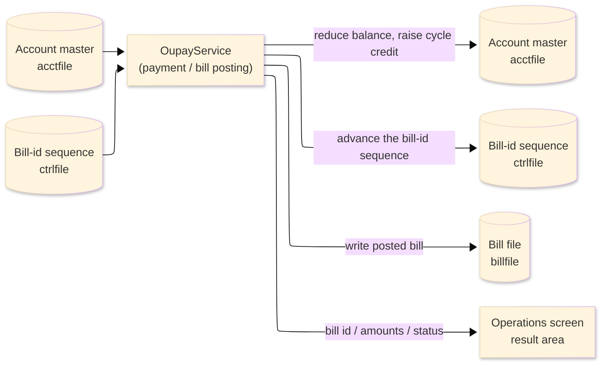
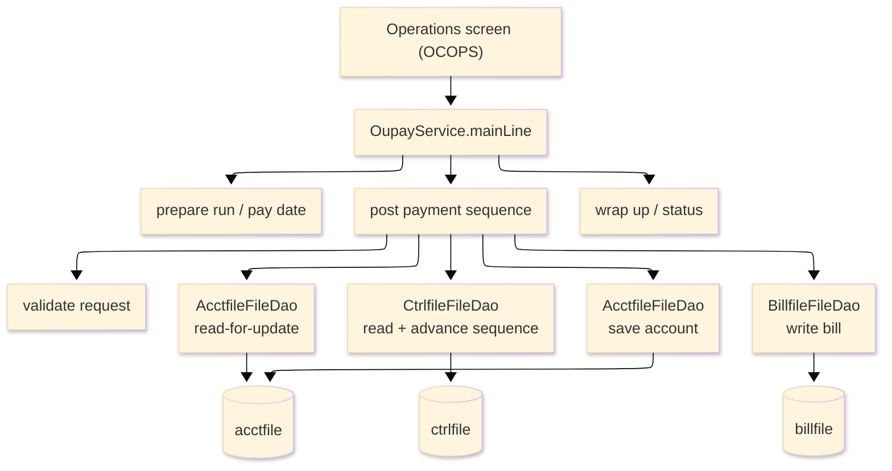

# TO-BE Batch Program Design — OUPAY_PaymentPosting

> **TO-BE = AS-IS in business terms.** The section order follows the AS-IS document so the two
> compare 1-to-1; what is added is the mapping onto the generated Java/Spring module. Anything
> forced to differ is stated in the section it belongs to, in business terms.

**Header**

| Item | Content |
|---|---|
| System | ORION-CCMS (ORION Credit Card Management System) |
| Source program | OUPAY（COBOL） |
| TO-BE module | `orion-online/back-end/programs/oupay` · package `com.generated.orion.oupay` |
| Platform | Java 17 · Spring Boot 3.x · DB Oracle (H2 in dev) |
| Author ／ Date | modernizeX ／ 2026-09-28 |

> **Form-factor note (business impact):** in AS-IS this payment/bill poster was a COBOL routine
> invoked from the Operations screen (a port of the VSAM and DB2 payment posters). The transpiler
> produced it as an in-process service in the on-line back-end (`OupayService`), **not** as a
> stand-alone Spring Batch job; the business logic — how a payment reduces the balance, raises the
> cycle credit and writes a posted bill — is unchanged. It is still launched from the Operations
> screen. See §8.

## 1. Program overview

### 1.1 TO-BE I/O diagram

### 1.2 Function overview

Post one bill payment against an account, on demand. The run validates the amount and the account
(which must exist and be active), reads the account for update, reduces the current balance by the
payment and raises the cycle-credit bucket by the same amount, and saves the account. It then draws
the next bill id from the control file, writes a posted bill record carrying a confirmation number,
and saves the advanced bill-id sequence. It returns whether the payment was posted or refused, the
assigned bill id, the amount posted and the new balance.

### 1.3 I/O table

| Business name | File ／ table | I/O |
|---|---|---|
| Account master (was VSAM KSDS) | table `acctfile` | I-O |
| Bill-id sequence / control file (was VSAM KSDS) | table `ctrlfile` | I-O |
| Bill file (was VSAM KSDS) | table `billfile` | O |
| Request / result area | in-memory call area (was COMMAREA) | I-O |

> Every access here is a single keyed read or write, not a browse, so there is no read-next ordering
> to preserve: the account is fetched by its primary key `ac_id`, the sequence record by `ct_key`
> (value `BILLID`), and the bill is inserted under its primary key `bl_id`. Field widths and money
> precision are preserved (see §4).

### 1.4 Called subprograms / modules

| Item | Notes |
|---|---|
| `AcctfileFileDao` · `CtrlfileFileDao` · `BillfileFileDao` | data access for the account master, the bill-id sequence and the bill file |
| (no sub-program) | the routine calls no external business program |

### 1.5 DB tables & SQL

| Table | Operation | Columns |
|---|---|---|
| `acctfile` | SELECT … FOR UPDATE, UPDATE | balance and cycle-credit columns via JdbcTemplate |
| `ctrlfile` | SELECT … FOR UPDATE, UPDATE, INSERT | the last bill-id value; a row is created when the sequence is new |
| `billfile` | INSERT | the posted bill record |

### 1.6 Special notes

- Launched on demand from the Operations screen. The request carries the account id
  (`KO-PARM-ACCT`), the payment amount (`KO-PARM-AMT`) and an optional pay date (`KO-PARM-DATE`); when
  no pay date is supplied the current run date is used.
- Money is held as `BigDecimal` with two-decimal scale. The payment is subtracted from the balance and
  added to the cycle-credit bucket exactly — no rounding is applied, because both the amount and the
  stored balances already carry two-decimal scale. The bill id is an integer sequence drawn from the
  control file and advanced by one.
- The posting steps run in order and stop at the first rejection; if the request is rejected while the
  account is held for update, the held record is released.
- If the payment posts but the sequence counter cannot be saved, the payment stands and a warning is
  returned.

## 2. Processing details

_One row per business step, in execution order. Paragraph and method names are intentionally absent._

| 識別番号 | Business step | What happens | Condition ／ actual value |
|---|---|---|---|
| 0.0 | The posting starts | the run is launched from the Operations screen and drives preparation, the posting sequence and the wrap-up in turn |  |
| 1.0 | Prepare the run | clears the result counters and status and settles the pay date | pay date defaults to the run date when none is supplied |
| 2.0 | Post the payment | runs the posting steps in order, stopping at the first rejection, and releases the account if it was left held after a rejection |  |
| 2.05 | Validate the request | refuses a non-positive amount or a missing account id before anything is read | amount ≤ 0 → refused; account id = 0 → refused |
| 2.1 | Read the account for update | fetches the account and holds it; a missing account or an inactive account is refused; a store error stops the run | not found → refused; inactive → refused; store error → run fails |
| 2.2 | Draw the bill id | fetches the bill-id sequence and takes the next number; when no sequence exists yet a new one is started; a store error stops the run | store error → run fails |
| 2.3 | Credit the account | subtracts the payment from the balance, adds it to the cycle-credit bucket and saves the account; a failed save stops the run | store error → the run stops in error |
| 2.4 | Write the posted bill | records a bill with the account, amount, pay date, a confirmation number and a posted status, and captures the assigned bill id, amount posted and new balance; a failed save stops the run | store error → the run stops in error |
| 2.5 | Save the bill id | saves the advanced sequence (creating the record if it is new); if this save fails the payment still stands and a counter-update warning is returned | save error → warning, payment kept |
| 2.9 | Release the held account | releases the account record held for update so it is not left locked | when the request was rejected while the account was held |
| 9.0 | Wrap up the run | sets the final status — success when the payment posted, a warning when it was refused, or error — and returns the counts and amounts to the operator | posted → success; not posted → refused |

## 3. Structure diagram

_The call structure of the routine as generated._

## 4. Output specifications (file / table)

Each output record keeps its original field widths; each field also maps to a column of the
corresponding table.

### 4.1 Account master (ACCT-REC) — 300 bytes

| Level | Item name | Field ／ column | Type ／ bytes | Position | Java ／ SQL type | How it is set |
|---|---|---|---|---|---|---|
| 01 | Record | ACCT-REC | group ／ 300 | 1 | row of `acctfile` | whole record |
| 05 | Account id | AC-ID | 9(11) ／ 11 | 1 | `long` ／ `NUMERIC(11)` | record key (unchanged) |
| 05 | Active status | AC-ACTIVE-STATUS | X(01) ／ 1 | 12 | `String` ／ `VARCHAR2(1)` | read to confirm the account is active; unchanged |
| 05 | Current balance | AC-CURR-BAL | S9(10)V99 ／ 12 | 13 | `BigDecimal` ／ `DECIMAL(12,2)` | balance minus the payment amount (exact, no rounding) |
| 05 | Credit limit | AC-CREDIT-LIMIT | S9(10)V99 ／ 12 | 25 | `BigDecimal` ／ `DECIMAL(12,2)` | unchanged |
| 05 | Cash limit | AC-CASH-LIMIT | S9(10)V99 ／ 12 | 37 | `BigDecimal` ／ `DECIMAL(12,2)` | unchanged |
| 05 | Open date | AC-OPEN-DATE | X(10) ／ 10 | 49 | `String` ／ `VARCHAR2(10)` | unchanged |
| 05 | Expiry date | AC-EXPIRY-DATE | X(10) ／ 10 | 59 | `String` ／ `VARCHAR2(10)` | unchanged |
| 05 | Reissue date | AC-REISSUE-DATE | X(10) ／ 10 | 69 | `String` ／ `VARCHAR2(10)` | unchanged |
| 05 | Cycle credit | AC-CYC-CREDIT | S9(10)V99 ／ 12 | 79 | `BigDecimal` ／ `DECIMAL(12,2)` | cycle credit plus the payment amount (exact, no rounding) |
| 05 | Cycle debit | AC-CYC-DEBIT | S9(10)V99 ／ 12 | 91 | `BigDecimal` ／ `DECIMAL(12,2)` | unchanged |
| 05 | Address zip | AC-ADDR-ZIP | X(10) ／ 10 | 103 | `String` ／ `VARCHAR2(10)` | unchanged |
| 05 | Group id | AC-GROUP-ID | X(10) ／ 10 | 113 | `String` ／ `VARCHAR2(10)` | unchanged |
| 05 | Filler | FILLER | X(178) ／ 178 | 123 | — | reserved |

### 4.2 Control file (CTRL-REC) — 60 bytes

| Level | Item name | Field ／ column | Type ／ bytes | Position | Java ／ SQL type | How it is set |
|---|---|---|---|---|---|---|
| 01 | Record | CTRL-REC | group ／ 60 | 1 | row of `ctrlfile` | whole record |
| 05 | Key | CT-KEY | X(08) ／ 8 | 1 | `String` ／ `VARCHAR2(8)` | record key (value `BILLID`) |
| 05 | Last value | CT-LAST-VALUE | 9(11) ／ 11 | 9 | `long` ／ `NUMERIC(11)` | the advanced bill-id sequence value |
| 05 | Description | CT-DESC | X(30) ／ 30 | 20 | `String` ／ `VARCHAR2(30)` | set to `BILL ID SEQUENCE` when the record is first created |
| 05 | Filler | FILLER | X(11) ／ 11 | 50 | — | reserved |

### 4.3 Bill file (BILL-REC) — 81 bytes

| Level | Item name | Field ／ column | Type ／ bytes | Position | Java ／ SQL type | How it is set |
|---|---|---|---|---|---|---|
| 01 | Record | BILL-REC | group ／ 81 | 1 | row of `billfile` | whole record |
| 05 | Bill id | BL-ID | 9(11) ／ 11 | 1 | `long` ／ `NUMERIC(11)` | record key — the assigned bill-id sequence value |
| 05 | Account id | BL-ACCT-ID | 9(11) ／ 11 | 12 | `long` ／ `NUMERIC(11)` | the account the payment is posted to |
| 05 | Amount | BL-AMOUNT | S9(10)V99 ／ 12 | 23 | `BigDecimal` ／ `DECIMAL(12,2)` | the payment amount (exact, no rounding) |
| 05 | Pay date | BL-PAY-DATE | X(10) ／ 10 | 35 | `String` ／ `VARCHAR2(10)` | the supplied pay date, or the run date |
| 05 | Confirm number | BL-CONFIRM-NUM | X(16) ／ 16 | 45 | `String` ／ `VARCHAR2(16)` | a confirmation number derived from the bill-id sequence |
| 05 | Status | BL-STATUS | X(01) ／ 1 | 61 | `String` ／ `VARCHAR2(1)` | set to posted ('P') |
| 05 | Filler | FILLER | X(20) ／ 20 | 62 | — | reserved |

> All money fields are `BigDecimal` with two-decimal scale. The payment is applied by exact subtraction
> and addition — there is no interest or proration here, so no rounding rule is invoked; amounts move
> penny for penny.

## 5. In/out parameters & check specifications

### 5.1 Parameters

| Kind | Value | Notes |
|---|---|---|
| Input parameter | account id (`KO-PARM-ACCT`), payment amount (`KO-PARM-AMT`), optional pay date (`KO-PARM-DATE`) | supplied by the Operations screen |
| Return value | status flag (`KO-STATUS`) — success, warning or error — with a status message (`KO-STATUS-MSG`) | tells the operator the outcome |
| Return counts | posted and rejected counts (`KO-POSTED-CNT`, `KO-REJECT-CNT`); read count (`KO-READ-CNT`) | shown back on the Operations screen |
| Return values | assigned bill id (`KO-C1`), amount posted (`KO-AMT-1`), new balance (`KO-AMT-2`) | shown back on the Operations screen |

### 5.2 Checks

| No. | Kind | Condition | Error code | Behaviour |
|---|---|---|---|---|
| 1 | Business | the payment amount is not positive | — | the payment is refused with "PAYMENT AMOUNT MUST BE POSITIVE." |
| 2 | Business | the account id is missing (zero) | — | the payment is refused with "ACCOUNT ID IS REQUIRED." |
| 3 | Business | the account does not exist | — | the payment is refused with "ACCOUNT NOT FOUND." |
| 4 | Business | the account is not active | — | the payment is refused with "ACCOUNT IS NOT ACTIVE." |
| 5 | Store access | the account cannot be read for update | — | the run ends in error with "READ ACCTFILE FOR UPDATE FAILED." |
| 6 | Store access | the bill-id sequence cannot be read | — | the run ends in error with "READ CTRLFILE BILLID FAILED." |
| 7 | Store access | the account cannot be saved | — | the run ends in error with "REWRITE ACCTFILE FAILED." |
| 8 | Store access | the bill record cannot be written | — | the run ends in error with "WRITE BILLFILE FAILED." |
| 9 | Store access | the advanced sequence cannot be saved | — | the payment stands and a warning is returned: "PAYMENT POSTED, COUNTER UPDATE WARNING." |

## 6. Modification summary

| No. | Date | Title | Content |
|---|---|---|---|
| 1 | 2026-09-28 | Initial TO-BE mapping | Mapped from the AS-IS design onto the generated `OupayService`; behaviour preserved. |

## 7. Screen

No screen — the routine is driven from the Operations screen and reports its outcome there.

## 8. TO-BE operations (replacing JCL/BAT)

| Item | Value |
|---|---|
| Trigger | launched on demand from the Operations screen with an account id, a payment amount and an optional pay date. In AS-IS this was a batch/utility poster; it now runs as the in-process service `OupayService`, not a stand-alone Spring Batch job — the business logic is unchanged |
| Schedule | not determined (ask the team) |
| Input data | the account balances and the bill-id sequence already held in the database |
| Log | written to the application log; the assigned bill id, the amount posted and the new balance are returned to the operator on screen |
| Rerun | each call posts a new bill with a fresh bill id and applies the payment again, so re-running is not idempotent — repeat only when the previous attempt was refused or failed |
