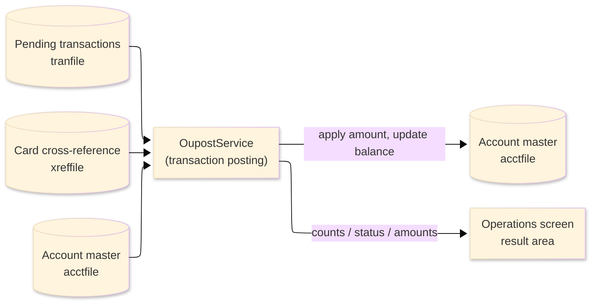
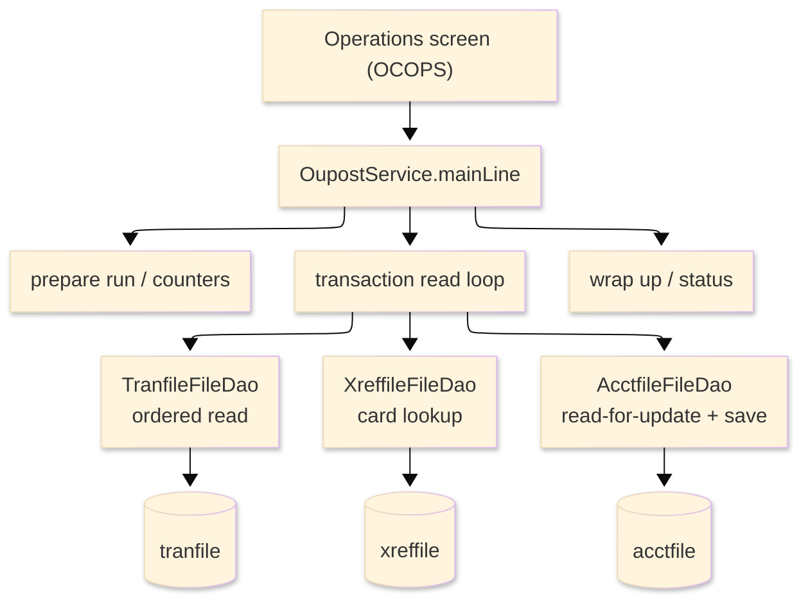

# TO-BE Batch Program Design — OUPOST_TransactionPosting

> **TO-BE = AS-IS in business terms.** The section order follows the AS-IS document so the two
> compare 1-to-1; what is added is the mapping onto the generated Java/Spring module. Anything
> forced to differ is stated in the section it belongs to, in business terms.

**Header**

| Item | Content |
|---|---|
| System | ORION-CCMS (ORION Credit Card Management System) |
| Source program | OUPOST（COBOL） |
| TO-BE module | `orion-online/back-end/programs/oupost` · package `com.generated.orion.oupost` |
| Platform | Java 17 · Spring Boot 3.x · DB Oracle (H2 in dev) |
| Author ／ Date | modernizeX ／ 2026-09-28 |

> **Form-factor note (business impact):** in AS-IS this daily posting run was a COBOL routine
> invoked from the Operations screen. The transpiler produced it as an in-process service in the
> on-line back-end (`OupostService`), **not** as a stand-alone Spring Batch job; the business logic —
> which transactions are applied and how each account balance moves — is unchanged. It is still
> launched from the Operations screen. See §8.

## 1. Program overview

### 1.1 TO-BE I/O diagram

### 1.2 Function overview

Apply the day's transactions to account balances, on demand. The run reads the transaction store in
key order; for each transaction it finds the owning account through the card cross-reference, reads
that account for update, and decides whether the transaction is a credit or a debit. A payment or
credit reduces the balance and raises the cycle-credit bucket; any other transaction is a debit that
raises the balance and the cycle-debit bucket, but only after the credit limit is checked — a debit
that would push the projected balance past the limit is refused and counted as over-limit. Each
applied transaction saves the account. The run reports how many transactions were read, selected,
posted and rejected, and the debit, credit and net money totals.

### 1.3 I/O table

| Business name | File ／ table | I/O |
|---|---|---|
| Pending transactions (was VSAM KSDS) | table `tranfile` | I |
| Card cross-reference (was VSAM KSDS) | table `xreffile` | I |
| Account master (was VSAM KSDS) | table `acctfile` | I-O |
| Request / result area | in-memory call area (was COMMAREA) | I-O |

> The keyed transaction browse (start / read-next) becomes an ordered read of `tranfile` by its
> primary key `tr_id`, so transactions are still processed in ascending id order. Field widths and the
> money precision are preserved (see §4).

### 1.4 Called subprograms / modules

| Item | Notes |
|---|---|
| `TranfileFileDao` · `XreffileFileDao` · `AcctfileFileDao` | data access for the transaction store, the card cross-reference and the account master |
| (no sub-program) | the routine calls no external business program |

### 1.5 DB tables & SQL

| Table | Operation | Columns |
|---|---|---|
| `tranfile` | START-browse + read-next (ordered read) | transaction key, card number, type, amount |
| `xreffile` | SELECT by card number | owning account id |
| `acctfile` | SELECT … FOR UPDATE, UPDATE | balance and cycle credit / debit columns via JdbcTemplate |

### 1.6 Special notes

- Launched on demand from the Operations screen; an optional single account may be requested
  (`KO-PARM-ACCT`; 0 means every account, applied through the cross-reference match).
- Money is held as `BigDecimal`; a credit subtracts the amount from the balance and a debit adds it —
  additions and subtractions only, so no rounding step is involved.
- A debit is refused when the projected balance would exceed the credit limit; that transaction is
  counted as over-limit and the account is left unchanged.

## 2. Processing details

_One row per business step, in execution order. Paragraph and method names are intentionally absent._

| 識別番号 | Business step | What happens | Condition ／ actual value |
|---|---|---|---|
| 0.0 | The posting run starts | the run is launched from the Operations screen and drives preparation, the transaction loop and the wrap-up in turn |  |
| 1.0 | Prepare the run | clears the result counters and sets the status to in-progress; if a single account was requested, switches on the filter for that one account | single account when the requested account is greater than zero |
| 3.0 | Read the transactions in order | positions at the first transaction and reads forward until the end |  |
| 3.1 | Position the read | starts reading the transaction store from the first record; when there is nothing to read it reports that there are no transactions to post; a store error stops the run | not-found → "no transactions on file to post"; other error → run fails |
| 3.2 | Take the next transaction | reads the next transaction and counts it; at end of file the loop finishes; a store error stops the run | end of transactions ends the loop |
| 4.0 | Handle one transaction | a transaction with no card number is rejected; otherwise the owning account is resolved and applied | rejected as bad-card when the card number is blank |
| 4.1 | Resolve the account | looks up the card in the cross-reference to find the owning account; a missing cross-reference rejects the transaction as unknown card | rejected when no cross-reference is on file |
| 4.15 | Apply the single-account filter | when a single account was requested, transactions for other accounts are passed over; the rest are selected for posting | selected only when the account matches the filter |
| 4.2 | Read the account for update | reads the owning account with a lock; a missing account rejects the transaction as no-account and a store error rejects it | rejected as no-account when the account is not found |
| 4.3 | Decide credit or debit | a payment or credit is treated as a credit; anything else is a debit, and a debit that would break the credit limit is refused as over-limit | over-limit when the projected balance exceeds the credit limit |
| 4.4 | Post to the balance | a credit lowers the balance and raises the cycle-credit bucket; a debit raises the balance and the cycle-debit bucket; the account is saved and counted as posted | counted as rejected when the save fails |
| 3.4 | Finish the read | ends the transaction read once the loop is done |  |
| 9.0 | Wrap up the run | sets the final status (complete, complete-with-warnings when any transaction was rejected, or failed), works out the net of debits over credits, and returns the counts and amounts to the operator | warning status when at least one transaction was rejected |

## 3. Structure diagram

_The call structure of the routine as generated._

## 4. Output specifications (file / table)

The account master record written back keeps the original field widths; each field also maps to a
column of the `acctfile` table.

### 4.1 Account master (ACCT-REC) — 300 bytes

| Level | Item name | Field ／ column | Type ／ bytes | Position | Java ／ SQL type | How it is set |
|---|---|---|---|---|---|---|
| 01 | Record | ACCT-REC | group ／ 300 | 1 | row of `acctfile` | whole record |
| 05 | Account id | AC-ID | 9(11) ／ 11 | 1 | `long` ／ `NUMERIC(11)` | record key (unchanged) |
| 05 | Active status | AC-ACTIVE-STATUS | X(01) ／ 1 | 12 | `String` ／ `VARCHAR2(1)` | unchanged |
| 05 | Current balance | AC-CURR-BAL | S9(10)V99 ／ 12 | 13 | `BigDecimal` ／ `DECIMAL(12,2)` | balance after a credit lowers it or a debit raises it |
| 05 | Credit limit | AC-CREDIT-LIMIT | S9(10)V99 ／ 12 | 25 | `BigDecimal` ／ `DECIMAL(12,2)` | unchanged |
| 05 | Cash limit | AC-CASH-LIMIT | S9(10)V99 ／ 12 | 37 | `BigDecimal` ／ `DECIMAL(12,2)` | unchanged |
| 05 | Open date | AC-OPEN-DATE | X(10) ／ 10 | 49 | `String` ／ `VARCHAR2(10)` | unchanged |
| 05 | Expiry date | AC-EXPIRY-DATE | X(10) ／ 10 | 59 | `String` ／ `VARCHAR2(10)` | unchanged |
| 05 | Reissue date | AC-REISSUE-DATE | X(10) ／ 10 | 69 | `String` ／ `VARCHAR2(10)` | unchanged |
| 05 | Cycle credit | AC-CYC-CREDIT | S9(10)V99 ／ 12 | 79 | `BigDecimal` ／ `DECIMAL(12,2)` | raised by a posted credit amount |
| 05 | Cycle debit | AC-CYC-DEBIT | S9(10)V99 ／ 12 | 91 | `BigDecimal` ／ `DECIMAL(12,2)` | raised by a posted debit amount |
| 05 | Address zip | AC-ADDR-ZIP | X(10) ／ 10 | 103 | `String` ／ `VARCHAR2(10)` | unchanged |
| 05 | Group id | AC-GROUP-ID | X(10) ／ 10 | 113 | `String` ／ `VARCHAR2(10)` | unchanged |
| 05 | Filler | FILLER | X(178) ／ 178 | 123 | — | reserved |

> Money is `BigDecimal` with two-decimal scale. The posting is a plain add or subtract of the
> transaction amount, so the stored balance matches the original penny for penny with no rounding.

## 5. In/out parameters & check specifications

### 5.1 Parameters

| Kind | Value | Notes |
|---|---|---|
| Input parameter | a single account to post, or 0 for all accounts (`KO-PARM-ACCT`) | supplied by the Operations screen |
| Return value | a status flag — complete, complete-with-warnings, or failed (`KO-STATUS`) plus a status message | tells the operator the outcome |
| Return counts | transactions read, selected, posted, rewritten and rejected (`KO-READ-CNT`, `KO-SELECT-CNT`, `KO-POSTED-CNT`, `KO-UPDATE-CNT`, `KO-REJECT-CNT`), plus bad-card, no-account and over-limit tallies (`KO-C1`, `KO-C2`, `KO-C3`) | shown back on the Operations screen |
| Return amounts | debit total, credit total and net of debit over credit (`KO-AMT-1`, `KO-AMT-2`, `KO-AMT-3`) | shown back on the Operations screen |

### 5.2 Checks

| No. | Kind | Condition | Error code | Behaviour |
|---|---|---|---|---|
| 1 | Store access | the transaction read cannot be positioned | — | the run stops and reports "STARTBR TRANFILE FAILED." |
| 2 | Store access | reading the next transaction fails | — | the run stops and reports "READNEXT TRANFILE FAILED." |
| 3 | Business | a transaction has no card, no cross-reference, or no account | — | that transaction is rejected and tallied, and the run ends with a warning |
| 4 | Business | a debit would break the credit limit | — | that transaction is refused as over-limit and the account is left unchanged |
| 5 | Business | no transactions are on file to post | — | the run ends normally reporting "NO TRANSACTIONS ON FILE TO POST." |

## 6. Modification summary

| No. | Date | Title | Content |
|---|---|---|---|
| 1 | 2026-09-28 | Initial TO-BE mapping | Mapped from the AS-IS design onto the generated `OupostService`; behaviour preserved. |

## 7. Screen

No screen — the routine is driven from the Operations screen and reports its outcome there.

## 8. TO-BE operations (replacing JCL/BAT)

| Item | Value |
|---|---|
| Trigger | launched on demand from the Operations screen; an optional single account can be entered, otherwise every account with pending transactions is posted |
| Schedule | not determined (ask the team) |
| Input data | the day's pending transactions, the card cross-reference and the current account balances already held in the database |
| Log | written to the application log; the outcome counts and money totals are returned to the operator on screen |
| Rerun | rerun only against transactions not yet posted; each posted transaction has already moved its account balance, so re-posting the same transactions would double-count |
