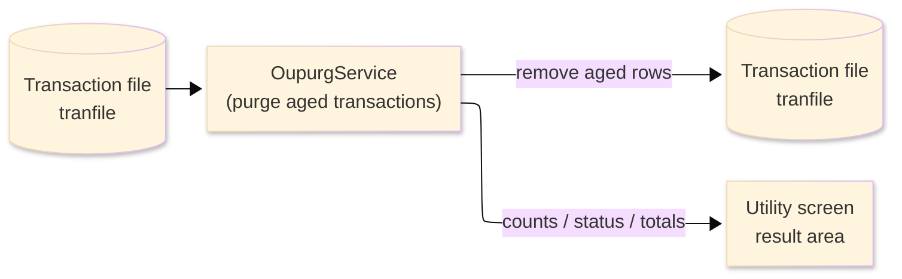
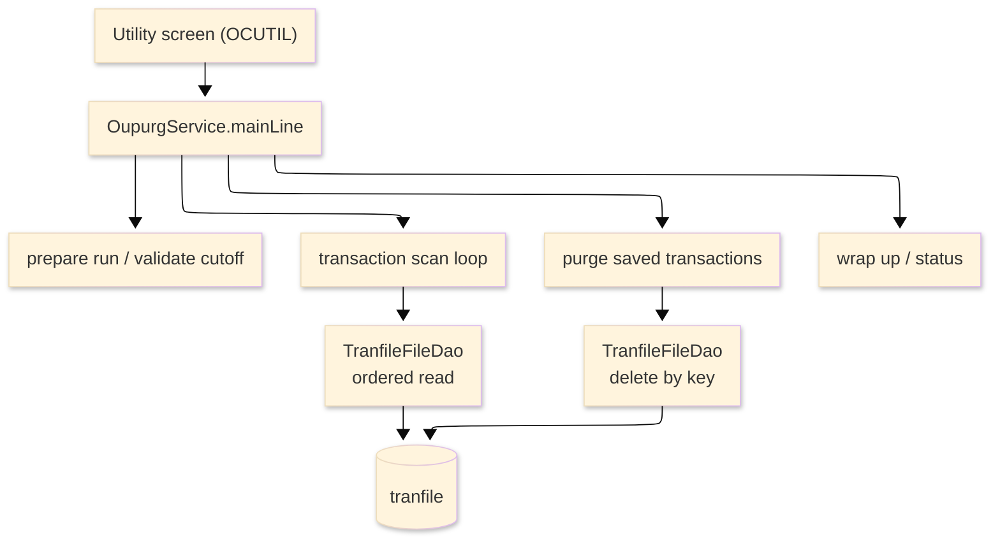

# TO-BE Batch Program Design — OUPURG_TransactionPurge

> **TO-BE = AS-IS in business terms.** The section order follows the AS-IS document so the two
> compare 1-to-1; what is added is the mapping onto the generated Java/Spring module. Anything
> forced to differ is stated in the section it belongs to, in business terms.

**Header**

| Item | Content |
|---|---|
| System | ORION-CCMS (ORION Credit Card Management System) |
| Source program | OUPURG（COBOL） |
| TO-BE module | `orion-online/back-end/programs/oupurg` · package `com.generated.orion.oupurg` |
| Platform | Java 17 · Spring Boot 3.x · DB Oracle (H2 in dev) |
| Author ／ Date | modernizeX ／ 2026-09-28 |

> **Form-factor note (business impact):** in AS-IS this purge-of-aged-transactions run was a COBOL
> routine linked from the utility screen. The transpiler produced it as an in-process service in the
> on-line back-end (`OupurgService`), **not** as a stand-alone Spring Batch job; the business logic —
> which aged transactions are removed, which are kept, and how the counts and money totals are built —
> is unchanged. It is still launched from the utility screen (OCUTIL). See §8.

## 1. Program overview

### 1.1 TO-BE I/O diagram

### 1.2 Function overview

Purge aged transactions on demand. The run reads the transaction file in key order; transactions whose
processing date falls before the requested cutoff date are captured (their key and amount) into a
bounded in-memory save list, and transactions on or after the cutoff are counted as kept with their
amount added to the kept total. Once the read ends, each captured transaction is removed from the live
file. The run reports how many transactions were read, purged, kept and rejected, plus the purged and
kept money totals, and hands back the next key so a large purge can be continued in further passes. An
optional start key and an optional maximum count limit the scope.

### 1.3 I/O table

| Business name | File ／ table | I/O |
|---|---|---|
| Transaction file (was VSAM KSDS) | table `tranfile` | I-O |
| Request / result area | in-memory call area (was COMMAREA) | I-O |

> The transaction keyed browse (start / read-next) becomes an ordered read of `tranfile` by its
> primary key `tr_id` (`SELECT … ORDER BY tr_id`), so transactions are still processed in ascending
> transaction-id order, and captured transactions are removed by that same key. Field widths and the
> money precision are preserved (see §4).

### 1.4 Called subprograms / modules

| Item | Notes |
|---|---|
| `TranfileFileDao` (`@Repository("TRANFILE")`) | data access for the transaction file — ordered read and delete-by-key |
| (no sub-program) | the routine calls no external business program |

### 1.5 DB tables & SQL

| Table | Operation | Columns |
|---|---|---|
| `tranfile` | SELECT (ordered read by `tr_id`), DELETE by key | whole transaction row via the shared JDBC file DAO |

No other store is used — the purge reads and deletes rows of `tranfile` only.

### 1.6 Special notes

- Launched on demand from the utility screen (OCUTIL); a start transaction id and a maximum count may
  be supplied (blank / zero mean "from the first record" and "no limit").
- The cutoff is validated as a `YYYY-MM-DD` date; an invalid cutoff stops the run before any read and
  returns the message "INVALID CUTOFF - USE YYYY-MM-DD".
- Captured transactions are held in a bounded in-memory save list; capture stops once the save cap (or
  the requested maximum) is reached, keeping the on-line unit of work short. The next key is returned
  so the remaining transactions can be purged in a later pass.
- Money is held as `BigDecimal`; the purged total and the kept total are plain running sums (no
  rounding applied).

## 2. Processing details

_One row per business step, in execution order. Paragraph and method names are intentionally absent._

| 識別番号 | Business step | What happens | Condition ／ actual value |
|---|---|---|---|
| 0.0 | The purge run starts | the run is launched from the utility screen and drives preparation, the transaction scan and the wrap-up in turn |  |
| 1.0 | Prepare the run | clears the result counters and the purged and kept amounts, sets the status to in-progress, works out the save cap from the requested maximum, and validates the cutoff date | an invalid cutoff stops the run before any read |
| 1.1 | Check the cutoff date | confirms the cutoff is a well-formed `YYYY-MM-DD` date; if not, the run is marked failed with a guidance message | dashes in the year-month and month-day positions and numeric year, month and day |
| 2.0 | Position the scan | positions the transaction read at the first record, or at the requested start key; when there is nothing to read the scan is skipped; a store error stops the run | not-found / end → nothing to scan; other error → run fails |
| 3.0 | Scan the transactions in order | reads forward through the transaction file, classifying each record, until the end of file or until the save cap (or the requested maximum) is reached |  |
| 3.1 | Take the next transaction | fetches the next transaction; at end of file the scan finishes; a read failure ends the scan and is counted as an error | end of transactions ends the scan |
| 3.2 | Classify the transaction | compares the transaction's processing date with the cutoff; earlier transactions have their key and amount set aside for purging (up to the cap), later ones are counted as kept and their amount added to the kept total | processing date before the cutoff → saved for purge; otherwise kept |
| 4.0 | Look past the scanned range | checks whether more transactions remain beyond the scanned range and, if so, returns the next start key for a later pass | more data → returns the next transaction id |
| 5.0 | Finish the scan | closes the transaction read once the loop is done |  |
| 5.5 | Purge the saved transactions | works through the saved list in turn, removing each one |  |
| 5.6 | Purge one transaction | deletes the saved transaction from the live file, counts it as purged and adds its amount to the purged total; a failed delete counts it as an error |  |
| 6.0 | Wrap up the run | sets the final status and message (complete, or "no transactions processed" when nothing was read) and returns the accumulated counts and totals to the operator | nothing read → "NO TRANSACTIONS PROCESSED" |

## 3. Structure diagram

_The call structure of the routine as generated._

## 4. Output specifications (file / table)

The purge run does not rewrite the transaction file; it deletes each purged row by its key. The layout
below is the transaction record as read; it also maps to columns of the `tranfile` table.

### 4.1 Transaction file (TRAN-REC) — 350 bytes

| Level | Item name | Field ／ column | Type ／ bytes | Position | Java ／ SQL type | How it is set |
|---|---|---|---|---|---|---|
| 01 | Record | TRAN-REC | group ／ 350 | 1 | row of `tranfile` | whole record (row deleted, not rewritten) |
| 05 | Transaction id | TR-ID | X(16) ／ 16 | 1 | `String` ／ `VARCHAR2(16)` (`tr_id`) | record key; identifies the row deleted |
| 05 | Type code | TR-TYPE-CD | X(02) ／ 2 | 17 | `String` ／ `VARCHAR2(2)` (`tr_type_cd`) | carried unchanged |
| 05 | Category code | TR-CAT-CD | 9(04) ／ 4 | 19 | `int` ／ `NUMERIC(4)` (`tr_cat_cd`) | carried unchanged |
| 05 | Source | TR-SOURCE | X(10) ／ 10 | 23 | `String` ／ `VARCHAR2(10)` (`tr_source`) | carried unchanged |
| 05 | Description | TR-DESC | X(100) ／ 100 | 33 | `String` ／ `VARCHAR2(100)` (`tr_desc`) | carried unchanged |
| 05 | Amount | TR-AMT | S9(09)V99 ／ 11 | 133 | `BigDecimal` ／ `NUMERIC(11,2)` (`tr_amt`) | carried unchanged; also summed into the purged or kept total |
| 05 | Merchant id | TR-MERCHANT-ID | 9(09) ／ 9 | 144 | `long` ／ `NUMERIC(9)` (`tr_merchant_id`) | carried unchanged |
| 05 | Merchant name | TR-MERCHANT-NAME | X(50) ／ 50 | 153 | `String` ／ `VARCHAR2(50)` (`tr_merchant_name`) | carried unchanged |
| 05 | Merchant city | TR-MERCHANT-CITY | X(50) ／ 50 | 203 | `String` ／ `VARCHAR2(50)` (`tr_merchant_city`) | carried unchanged |
| 05 | Merchant zip | TR-MERCHANT-ZIP | X(10) ／ 10 | 253 | `String` ／ `VARCHAR2(10)` (`tr_merchant_zip`) | carried unchanged |
| 05 | Card number | TR-CARD-NUM | X(16) ／ 16 | 263 | `String` ／ `VARCHAR2(16)` (`tr_card_num`) | carried unchanged |
| 05 | Original timestamp | TR-ORIG-TS | X(26) ／ 26 | 279 | `String` ／ `VARCHAR2(26)` (`tr_orig_ts`) | carried unchanged |
| 05 | Processing timestamp | TR-PROC-TS | X(26) ／ 26 | 305 | `String` ／ `VARCHAR2(26)` (`tr_proc_ts`) | first 10 characters are the processing date compared with the cutoff |
| 05 | Filler | FILLER | X(20) ／ 20 | 331 | — | reserved (no column) |

> `TR-AMT` (COMP display `S9(09)V99`) is a `BigDecimal` with two-decimal scale; the purged total and the
> kept total are running sums of these amounts, summed as `BigDecimal` with no rounding applied.

## 5. In/out parameters & check specifications

### 5.1 Parameters

| Kind | Value | Notes |
|---|---|---|
| Input parameter | cutoff date `YYYY-MM-DD` (`KPG-CUTOFF`), optional start transaction id (`KPG-START-TRAN`), optional maximum count (`KPG-MAX`) | supplied by the utility screen |
| Return value | a status flag — complete, no-work, or failed (`KPG-STATUS`) plus a status message (`KPG-MSG`) | tells the operator the outcome |
| Return counts | transactions read, purged, kept and errors (`KPG-READ`, `KPG-PURGED`, `KPG-KEPT`, `KPG-ERRORS`) | shown back on the utility screen |
| Return amounts | purged total and kept total (`KPG-PURGE-AMT`, `KPG-KEEP-AMT`) | shown back on the utility screen |
| Return continuation | more-data flag and next start key (`KPG-MORE`, `KPG-NEXT-TRAN`) | lets the operator continue a large purge in a later pass |

### 5.2 Checks

| No. | Kind | Condition | Error code | Behaviour |
|---|---|---|---|---|
| 1 | Format | the cutoff is not a valid `YYYY-MM-DD` date | — | the run is marked failed (status `99`) before any read and reports "INVALID CUTOFF - USE YYYY-MM-DD" |
| 2 | Store access | the transaction read cannot be positioned | — | the run stops (status `99`) and reports "TRANFILE STARTBR FAILED" |
| 3 | Store access | fetching the next transaction fails | — | the scan ends, the record is counted as an error and reports "TRANFILE READNEXT FAILED" |
| 4 | Business | a captured transaction cannot be removed from the live file | — | that transaction is counted as an error and the run continues |
| 5 | Business | no transactions were read | — | the run ends normally (status `10`) reporting "NO TRANSACTIONS PROCESSED" |

## 6. Modification summary

| No. | Date | Title | Content |
|---|---|---|---|
| 1 | 2026-09-28 | Initial TO-BE mapping | Mapped from the AS-IS design onto the generated `OupurgService`; behaviour preserved. |

## 7. Screen

No screen — the routine is driven from the utility screen and reports its outcome there.

## 8. TO-BE operations (replacing JCL/BAT)

| Item | Value |
|---|---|
| Trigger | launched on demand from the utility screen (OCUTIL); the transpiler produced it as an in-process on-line service (`OupurgService`), not a stand-alone Spring Batch job — a cutoff date is required, with an optional start key and maximum count |
| Schedule | not determined (ask the team) |
| Input data | the current transactions held in the `tranfile` table |
| Log | written to the application log; the outcome counts and totals are returned to the operator on the utility screen |
| Rerun | safe to rerun; a large purge can be continued by passing the returned next key as the start key for the next pass |
