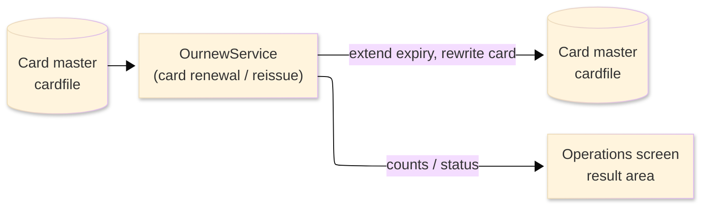
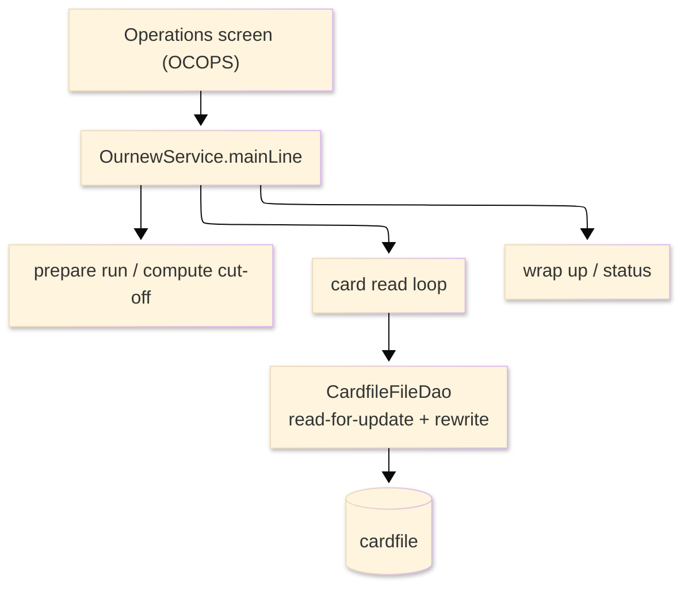

# TO-BE Batch Program Design — OURNEW_CardRenewal

> **TO-BE = AS-IS in business terms.** The section order follows the AS-IS document so the two
> compare 1-to-1; what is added is the mapping onto the generated Java/Spring module. Anything
> forced to differ is stated in the section it belongs to, in business terms.

**Header**

| Item | Content |
|---|---|
| System | ORION-CCMS (ORION Credit Card Management System) |
| Source program | OURNEW（COBOL） |
| TO-BE module | `orion-online/back-end/programs/ournew` · package `com.generated.orion.ournew` |
| Platform | Java 17 · Spring Boot 3.x · DB Oracle (H2 in dev) |
| Author ／ Date | modernizeX ／ 2026-09-28 |

> **Form-factor note (business impact):** in AS-IS this card renewal routine was a COBOL sub-program
> invoked from the Operations screen. The transpiler produced it as an in-process service in the
> on-line back-end (`OurnewService`), **not** as a stand-alone Spring Batch job; the business logic —
> which cards approach expiry and how they are reissued — is unchanged. It is still launched from the
> Operations screen. See §8.

## 1. Program overview

### 1.1 TO-BE I/O diagram

### 1.2 Function overview

Reissue cards approaching expiry, on demand. The run reads the card master in key order; for every
active card whose expiry date is valid and falls on or before a lead-time cut-off (today plus ninety
days) the expiry year is extended by three years, the card is re-read for update and written back.
A new expiry landing on 29 February in a non-leap year is pulled back to 28 February. Inactive cards,
cards with an unreadable expiry date and cards not yet due are counted but left unchanged. The run
reports how many cards were read, reissued, rewritten, left as not-yet-due, skipped as inactive and
skipped for a bad expiry date.

### 1.3 I/O table

| Business name | File ／ table | I/O |
|---|---|---|
| Card master (was VSAM KSDS) | table `cardfile` | I-O |
| Request / result area | in-memory call area (was COMMAREA) | I-O |

> The card master keyed browse (start / read-next) becomes an ordered read of `cardfile` by its
> primary key `cd_num`, so cards are still processed in ascending card-number order (ORDER BY
> `cd_num`). Field widths are preserved (see §4).

### 1.4 Called subprograms / modules

| Item | Notes |
|---|---|
| `CardfileFileDao` | data access for the card master |
| (no sub-program) | the routine calls no external business program |

### 1.5 DB tables & SQL

| Table | Operation | Columns |
|---|---|---|
| `cardfile` | SELECT (ordered read), SELECT … FOR UPDATE, UPDATE | expiry-date column via JdbcTemplate |

### 1.6 Special notes

- Launched on demand from the Operations screen; an optional single card may be requested
  (`KO-PARM-CARD`; blank means every card).
- The reissue cut-off is today plus a ninety-day lead time; an active card whose valid expiry falls
  on or before the cut-off is reissued by extending its expiry year by three years.
- The leap-year normalisation is preserved from the batch renewer: a reissued expiry on 29 February
  in a non-leap year becomes 28 February.
- No sub-programs; the run works against the single card table.

## 2. Processing details

_One row per business step, in execution order. Paragraph and method names are intentionally absent._

| 識別番号 | Business step | What happens | Condition ／ actual value |
|---|---|---|---|
| 0.0 | The renewal run starts | the run is launched from the Operations screen and drives preparation, the cut-off, the card loop and the wrap-up in turn |  |
| 1.0 | Prepare the run | clears the result counters and sets the status to in-progress; if a single card was requested, switches on the filter for that one card | single card when the requested card number is not blank |
| 1.3 | Work out the cut-off | takes today's date and adds the ninety-day lead time to get the reissue cut-off date |  |
| 3.0 | Read the cards in order | positions at the first (or requested) card and reads forward until the end |  |
| 3.1 | Position the read | starts reading the card master from the first or requested card; when there is nothing to read it reports there are no cards to process; a store error stops the run | not-found → no cards to process; other error → run fails |
| 3.2 | Take the next card | reads the next card and counts it; at end of file the loop finishes; a store error stops the run | end of cards ends the loop |
| 4.0 | Assess one card | an inactive card is counted as inactive, a card with an unreadable expiry is counted as bad-date, a card already inside the cut-off is reissued, and any other card is counted as not-yet-due | reissued only when active, the date is valid and the expiry is on or before the cut-off |
| 4.1 | Check the expiry date | confirms the year, month and day of the card's expiry are all numeric; otherwise the card is treated as having a bad date | any non-numeric part → bad date |
| 4.2 | Reissue the card | extends the expiry year by three years, re-reads the card for update, writes the new expiry back and counts it as reissued and rewritten; a failed read or save counts the card as rejected | only for a card that is due and valid |
| 4.25 | Handle the leap day | when the new expiry lands on 29 February in a non-leap year, pulls the day back to the 28th | non-leap year with a 29 February expiry |
| 3.4 | Finish the read | ends the card read once the loop is done |  |
| 9.0 | Wrap up the run | sets the final status (complete, or complete-with-warnings when any card was rejected) and returns the accumulated counts to the operator | warning status when at least one card was rejected |

## 3. Structure diagram

_The call structure of the routine as generated._

## 4. Output specifications (file / table)

The card master record written back keeps the original field widths; each field also maps to a column
of the `cardfile` table. Only the expiry date is changed.

### 4.1 Card master (CARD-REC) — 150 bytes

| Level | Item name | Field ／ column | Type ／ bytes | Position | Java ／ SQL type | How it is set |
|---|---|---|---|---|---|---|
| 01 | Record | CARD-REC | group ／ 150 | 1 | row of `cardfile` | whole record |
| 05 | Card number | CD-NUM | X(16) ／ 16 | 1 | `String` ／ `VARCHAR2(16)` | record key (unchanged) |
| 05 | Account id | CD-ACCT-ID | 9(11) ／ 11 | 17 | `long` ／ `NUMERIC(11)` | unchanged |
| 05 | Card verification value | CD-CVV | X(03) ／ 3 | 28 | `String` ／ `VARCHAR2(3)` | unchanged |
| 05 | Embossed name | CD-EMBOSSED-NAME | X(50) ／ 50 | 31 | `String` ／ `VARCHAR2(50)` | unchanged |
| 05 | Expiry date | CD-EXPIRY-DATE | X(10) ／ 10 | 81 | `String` ／ `VARCHAR2(10)` | new expiry (year + 3, leap-day clamped) |
| 05 | Active status | CD-ACTIVE-STATUS | X(01) ／ 1 | 91 | `String` ／ `VARCHAR2(1)` | unchanged |
| 05 | Filler | FILLER | X(59) ／ 59 | 92 | — | reserved |

> The expiry date stays a ten-character `YYYY-MM-DD` string; the extend-by-three-years and the
> leap-day pull-back are computed exactly as in the original renewer, so the stored expiry matches
> character for character.

## 5. In/out parameters & check specifications

### 5.1 Parameters

| Kind | Value | Notes |
|---|---|---|
| Input parameter | a single card to reissue, or blank for all cards (`KO-PARM-CARD`) | supplied by the Operations screen |
| Return value | a status flag — complete, complete-with-warnings, or failed (`KO-STATUS`) plus a status message | tells the operator the outcome |
| Return counts | cards read, reissued, rewritten, not-yet-due, inactive, bad expiry date, rejected | shown back on the Operations screen |

### 5.2 Checks

| No. | Kind | Condition | Error code | Behaviour |
|---|---|---|---|---|
| 1 | Store access | the card read cannot be positioned | — | the run stops and reports "STARTBR CARDFILE FAILED." |
| 2 | Store access | reading the next card fails | — | the run stops and reports "READNEXT CARDFILE FAILED." |
| 3 | Business | a card cannot be re-read or saved for update | — | that card is counted as rejected and the run ends with a warning |
| 4 | Business | no cards are approaching expiry | — | the run ends normally reporting "NO CARDS TO PROCESS." |

## 6. Modification summary

| No. | Date | Title | Content |
|---|---|---|---|
| 1 | 2026-09-28 | Initial TO-BE mapping | Mapped from the AS-IS design onto the generated `OurnewService`; behaviour preserved. |

## 7. Screen

No screen — the routine is driven from the Operations screen and reports its outcome there.

## 8. TO-BE operations (replacing JCL/BAT)

| Item | Value |
|---|---|
| Trigger | launched on demand from the Operations screen; an optional single card can be entered, otherwise every card is assessed |
| Schedule | not determined (ask the team) |
| Input data | the current card master already held in the database |
| Log | written to the application log; the outcome counts are returned to the operator on screen |
| Rerun | safe to rerun; a card already reissued this run simply falls outside the cut-off next time and is left as not-yet-due |
