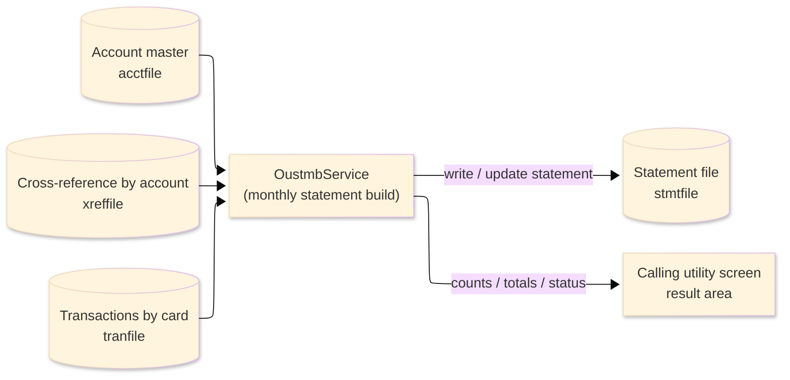
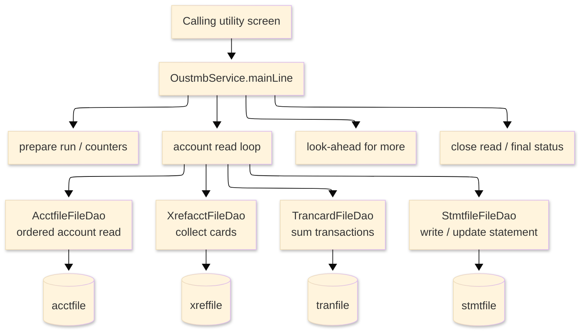

# TO-BE Batch Program Design — OUSTMB_StatementBuild

> **TO-BE = AS-IS in business terms.** The section order follows the AS-IS document so the two
> compare 1-to-1; what is added is the mapping onto the generated Java/Spring module. Anything
> forced to differ is stated in the section it belongs to, in business terms.

**Header**

| Item | Content |
|---|---|
| System | ORION-CCMS (ORION Credit Card Management System) |
| Source program | OUSTMB（COBOL） |
| TO-BE module | `orion-online/back-end/programs/oustmb` · package `com.generated.orion.oustmb` |
| Platform | Java 17 · Spring Boot 3.x · DB Oracle (H2 in dev) |
| Author ／ Date | modernizeX ／ 2026-09-28 |

> **Form-factor note (business impact):** in AS-IS this monthly statement build was an on-line
> port of the OBSTMT batch, invoked from the utility screen. The transpiler produced it as an
> in-process service in the on-line back-end (`OustmbService`), **not** as a stand-alone Spring
> Batch job; the business logic — which accounts get a statement, how each balance and minimum due
> is worked out — is unchanged. It is still driven in-process from the calling on-line program.
> See §8.

## 1. Program overview

### 1.1 TO-BE I/O diagram

### 1.2 Function overview

Build one month's statements, on demand for a given statement cycle. The run reads the account
master in key order; for each account it collects the cards that belong to the account from the
cross-reference, then totals every transaction on those cards that falls in the requested cycle into
a credit bucket and a debit bucket. From those it derives the opening and closing balance and the
minimum amount due, and writes a statement record for the account and cycle (updating an existing
one if it is already on file). An optional start account and a maximum count let the caller build a
page at a time. The run returns how many accounts were read, how many statements were written, how
many accounts had no transactions, the error count, and the grand credit and debit totals.

### 1.3 I/O table

| Business name | File ／ table | I/O |
|---|---|---|
| Account master (was VSAM KSDS) | table `acctfile` | I |
| Cross-reference by account (was VSAM alternate index) | table `xreffile` | I |
| Transactions by card (was VSAM alternate index) | table `tranfile` | I |
| Statement file (was VSAM KSDS) | table `stmtfile` | I-O |
| Request / result area | in-memory call area (was COMMAREA) | I-O |

> The account keyed browse (start / read-next) becomes an ordered read of `acctfile` by its primary
> key `ac_id`, so accounts are still processed in ascending account-id order. Cards are read by
> `xreffile.xr_acct_id` and transactions by `tranfile.tr_card_num`, each `ORDER BY` that key, so the
> collect-cards and sum-transactions order is preserved. The statement is keyed on
> (`st_acct_id`, `st_cycle`). Field widths and money precision are preserved (see §4).

### 1.4 Called subprograms / modules

| Item | Notes |
|---|---|
| `AcctfileFileDao` · `StmtfileFileDao` | data access for the account master and the statement file |
| `XrefacctFileDao` · `TrancardFileDao` | account-keyed and card-keyed access into `xreffile` and `tranfile` |
| (no sub-program) | the routine calls no external business program |

### 1.5 DB tables & SQL

| Table | Operation | Columns |
|---|---|---|
| `acctfile` | SELECT (ordered read by `ac_id`) | current balance and account status via JdbcTemplate |
| `xreffile` | SELECT by `xr_acct_id` (ordered) | card number for the account |
| `tranfile` | SELECT by `tr_card_num` (ordered) | transaction type, amount and processing timestamp |
| `stmtfile` | INSERT, SELECT … FOR UPDATE, UPDATE | statement balances, totals and minimum due |

### 1.6 Special notes

- Driven on demand from the calling utility program; a statement cycle (YYYYMM) is required, an
  optional start account and a maximum account count support paged builds.
- Money is held as `BigDecimal`; the minimum due is 2% of the closing balance, capped so a balance
  of 25.00 or less is billed in full and otherwise floored at 25.00, and set to zero when the
  closing balance is not positive. A transaction is treated as a credit when its type is a payment
  or a credit, otherwise as a debit.
- No sub-programs; the run stands alone against the four tables.

## 2. Processing details

_One row per business step, in execution order. Paragraph and method names are intentionally absent._

| 識別番号 | Business step | What happens | Condition ／ actual value |
|---|---|---|---|
| 0.0 | The statement build starts | drives preparation, positioning, the account loop, the look-ahead, closing the read and the final status in turn |  |
| 1.0 | Prepare the run | clears the result counters and grand totals, sets the status to in-progress and picks up the maximum account count; if no statement cycle was supplied the run is rejected | fatal when the statement cycle is zero |
| 2.0 | Position at the first account | positions the account read at the requested start account; if it cannot be positioned the run fails, and an empty file means there is nothing to build | position error → run fails |
| 3.0 | Process accounts in order | reads each account in turn and builds its statement, until the file ends or the maximum count is reached | stop once the maximum accounts are processed |
| 3.1 | Read the next account | reads the next account; the end of file ends the loop, a read error also ends the loop and is counted | end of file ends the loop |
| 3.2 | Build one account's statement | counts the account, resets its totals, gathers its cards, sums their transactions, computes the balances and writes the statement | counts the account with no transactions in the cycle |
| 3.21 | Reset the account totals | clears the per-account card count, the credit and debit totals, the balances and the minimum due |  |
| 3.22 | Gather the account's cards | reads the cross-reference for the account and collects every card that belongs to it, up to the card limit | stops at the first entry for another account |
| 3.23 | Read the next cross-reference | reads the next cross-reference entry; the end of file ends the collection, a read error is counted | end of file ends the collection |
| 3.3 | Sum each card's transactions | for every card collected, totals its transactions for the requested cycle |  |
| 3.31 | Read one card's transactions | reads the card's transactions in order and accumulates each one for the cycle | stops at the first transaction for another card |
| 3.32 | Read the next transaction | reads the next transaction; the end of file ends the card, a read error is counted | end of file ends the card |
| 3.33 | Accumulate a transaction | when the transaction falls in the statement cycle it is counted and its amount is added to the credit total for payments and credits, or to the debit total otherwise | only transactions in the requested cycle |
| 3.4 | Compute the statement balances | sets the closing balance from the account, derives the opening balance from the cycle credits and debits, and works out the minimum amount due | minimum due is zero when the closing balance is not positive |
| 3.5 | Write the statement | writes the statement record for the account and cycle and counts it; if one already exists it is updated instead; a write failure is counted | already on file → update instead |
| 3.51 | Update an existing statement | re-reads the existing statement for update, refreshes its balances and totals and saves it; a failed read or save is counted |  |
| 4.0 | Look ahead for more accounts | after the loop, checks whether another account follows and, if so, records that more remain and the next account id | end of file → no more accounts |
| 5.0 | Close the account read | ends the account read once the loop is done |  |
| 6.0 | Set the final status | unless the run already failed, sets the outcome to complete, or to "no accounts processed" when none were read, and returns the counts and grand totals to the caller | "no accounts processed" when zero accounts were read |

## 3. Structure diagram

_The call structure of the routine as generated._

## 4. Output specifications (file / table)

The statement record written keeps the original field widths; each field also maps to a column of
the `stmtfile` table.

### 4.1 Statement file (STMT-REC) — 107 bytes

| Level | Item name | Field ／ column | Type ／ bytes | Position | Java ／ SQL type | How it is set |
|---|---|---|---|---|---|---|
| 01 | Record | STMT-REC | group ／ 107 | 1 | row of `stmtfile` | whole record |
| 05 | Key | ST-KEY | group ／ 17 | 1 | (`st_acct_id`, `st_cycle`) | record key |
| 10 | Account id | ST-ACCT-ID ／ `st_acct_id` | 9(11) ／ 11 | 1 | `long` ／ `NUMERIC(11)` | the account being statemented |
| 10 | Cycle | ST-CYCLE ／ `st_cycle` | 9(06) ／ 6 | 12 | `int` ／ `NUMERIC(6)` | the requested statement cycle (YYYYMM) |
| 05 | Opening balance | ST-OPEN-BAL ／ `st_open_bal` | S9(10)V99 ／ 12 | 18 | `BigDecimal` ／ `DECIMAL(12,2)` | closing balance less cycle debits plus cycle credits |
| 05 | Closing balance | ST-CLOSE-BAL ／ `st_close_bal` | S9(10)V99 ／ 12 | 30 | `BigDecimal` ／ `DECIMAL(12,2)` | the account's current balance |
| 05 | Total credit | ST-TOTAL-CREDIT ／ `st_total_credit` | S9(10)V99 ／ 12 | 42 | `BigDecimal` ／ `DECIMAL(12,2)` | sum of cycle payments and credits |
| 05 | Total debit | ST-TOTAL-DEBIT ／ `st_total_debit` | S9(10)V99 ／ 12 | 54 | `BigDecimal` ／ `DECIMAL(12,2)` | sum of cycle debits |
| 05 | Minimum due | ST-MIN-DUE ／ `st_min_due` | S9(10)V99 ／ 12 | 66 | `BigDecimal` ／ `DECIMAL(12,2)` | 2% of closing balance, floored at 25.00 (whole balance if 25.00 or less; zero if not positive) |
| 05 | Due date | ST-DUE-DATE ／ `st_due_date` | X(10) ／ 10 | 78 | `String` ／ `VARCHAR2(10)` | the due date supplied on the request |
| 05 | Filler | FILLER | X(20) ／ 20 | 88 | — | reserved |

> Money is `BigDecimal` with two-decimal scale. The minimum due is computed as closing balance
> × 0.02 and then capped/floored as above; balances and totals are persisted at two-decimal scale so
> the stored statement matches the original penny for penny.

## 5. In/out parameters & check specifications

### 5.1 Parameters

| Kind | Value | Notes |
|---|---|---|
| Input parameter | statement cycle (YYYYMM, required), due date, start account, maximum accounts (`KSM-CYCLE`, `KSM-DUE-DATE`, `KSM-START-ACCT`, `KSM-MAX`) | supplied by the calling utility screen |
| Return value | a status flag — complete, no accounts processed, or fatal error (`KSM-STATUS`) plus a status message (`KSM-MSG`) | tells the caller the outcome |
| Return counts | accounts read, statements written, accounts with no transactions and errors (`KSM-ACCT-READ`, `KSM-STMT-WRITTEN`, `KSM-NO-TRAN`, `KSM-ERRORS`) | returned to the caller |
| Return amounts | grand total credit and grand total debit (`KSM-TOT-CREDIT`, `KSM-TOT-DEBIT`) | returned to the caller |
| Paging | whether more accounts remain and the next account id (`KSM-MORE`, `KSM-NEXT-ACCT`) | supports a paged, on-demand build |

### 5.2 Checks

| No. | Kind | Condition | Error code | Behaviour |
|---|---|---|---|---|
| 1 | Business | no statement cycle was supplied | — | the run stops immediately and reports "STATEMENT CYCLE (YYYYMM) REQUIRED" |
| 2 | Store access | the account read cannot be positioned | — | the run stops and reports "ACCTFILE STARTBR FAILED" |
| 3 | Store access | reading the next account fails | — | the loop ends, the error is counted and reported as "ACCTFILE READNEXT FAILED" |
| 4 | Store access | a card, transaction, or statement read/write fails | — | that item is counted as an error and the run continues |
| 5 | Business | no accounts were read | — | the run ends normally reporting "NO ACCOUNTS PROCESSED" |

## 6. Modification summary

| No. | Date | Title | Content |
|---|---|---|---|
| 1 | 2026-09-28 | Initial TO-BE mapping | Mapped from the AS-IS design onto the generated `OustmbService`; behaviour preserved. |

## 7. Screen

No screen — the routine is driven from the calling utility screen and returns its counts, totals and
status there.

## 8. TO-BE operations (replacing JCL/BAT)

| Item | Value |
|---|---|
| Trigger | invoked in-process from the calling utility screen for a given statement cycle; this is now an on-line service (`OustmbService`), not a stand-alone Spring Batch job |
| Schedule | not determined (ask the team) |
| Input data | the account balances, the account-to-card cross-reference and the posted transactions already held in the database |
| Log | written to the application log; the outcome counts and totals are returned to the caller on the utility screen |
| Rerun | safe to rerun; a statement already on file for the account and cycle is updated in place, so a repeat build refreshes rather than duplicates |
