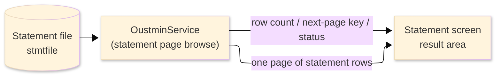
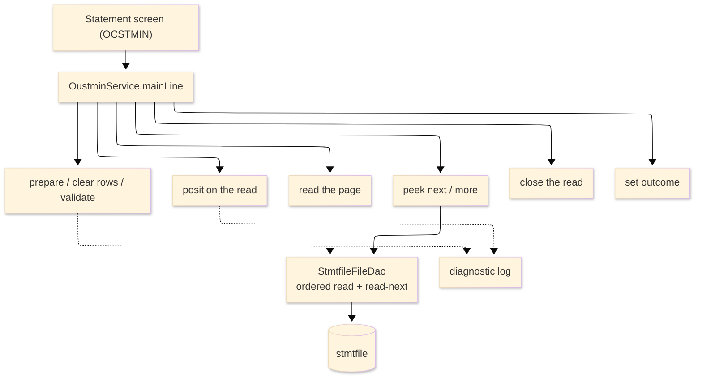

# TO-BE Batch Program Design — OUSTMIN_StatementBrowse

> **TO-BE = AS-IS in business terms.** The section order follows the AS-IS document so the two
> compare 1-to-1; what is added is the mapping onto the generated Java/Spring module. Anything
> forced to differ is stated in the section it belongs to, in business terms.

**Header**

| Item | Content |
|---|---|
| System | ORION-CCMS (ORION Credit Card Management System) |
| Source program | OUSTMIN（COBOL） |
| TO-BE module | `orion-online/back-end/programs/oustmin` · package `com.generated.orion.oustmin` |
| Platform | Java 17 · Spring Boot 3.x · DB Oracle (H2 in dev) |
| Author ／ Date | modernizeX ／ 2026-09-28 |

> **Form-factor note (business impact):** in AS-IS this statement browse was a COBOL subroutine that the
> statement screen called on line (a LINK that ended with GOBACK) to fill one page of statement rows. The
> transpiler produced it as an in-process service in the on-line back-end (`OustminService`), **not** as
> a stand-alone Spring Batch job; the business logic — which statements are returned for an account and
> the figures shown for them — is unchanged. It is still invoked from the statement screen. See §8.

## 1. Program overview

### 1.1 TO-BE I/O diagram

### 1.2 Function overview

Return one page of statement rows for a requested account, starting at or after a requested account and
cycle. The run validates the request (only account-mode browsing is supported and the page size is held
between one and six), positions the statement read at the requested account and cycle, and reads forward
up to the requested number of rows, copying each statement's account, cycle, opening and closing
balances, total credit and debit, minimum due and due date into the page. It then peeks one further
statement: if one exists, its account and cycle become the next-page start and a more indicator is set so
the screen can page forward. Finally it reports the row count and a completion status. The run only reads;
it never changes a statement.

### 1.3 I/O table

| Business name | File ／ table | I/O |
|---|---|---|
| Statement file (was VSAM KSDS) | table `stmtfile` | I |
| Request / result area | in-memory call area (was COMMAREA) | I-O |

> The keyed statement browse (start greater-than-or-equal / read-next / end) becomes an ordered read of
> `stmtfile` by its composite primary key (`st_acct_id`, `st_cycle`), so statements are still processed
> in ascending account-then-cycle order (`ORDER BY st_acct_id, st_cycle`), starting at or after the
> requested account and cycle. Field widths and money precision are preserved (see §4). No statement row
> is written back.

### 1.4 Called subprograms / modules

| Item | Notes |
|---|---|
| `StmtfileFileDao` | data access for the statement file; ordered browse and read-next by the account/cycle key |
| (no sub-program) | the routine calls no external business program |

### 1.5 DB tables & SQL

| Table | Operation | Columns |
|---|---|---|
| `stmtfile` | SELECT (ordered read from `st_acct_id`, `st_cycle` ≥ the requested key), sequential browse forward | account, cycle, opening and closing balances, total credit and debit, minimum due and due date via JdbcTemplate |

### 1.6 Special notes

- Called on demand from the statement screen; the request names the browse mode, the account and cycle to
  start at (`KSB-START-ACCT`, `KSB-START-CYCLE`) and the page size (`KSB-MAX-ROWS`).
- Only account-mode browsing is supported; any other mode is rejected with an error status. The page size
  is held between one and six rows; an out-of-range request is capped at six.
- Money is held as `BigDecimal` at two-decimal scale. The balances and amounts are copied straight from
  the statement record — nothing is computed, so no rounding is applied.
- Read-only: the run reports figures and never updates the statement file, so it is safe to repeat.

## 2. Processing details

_One row per business step, in execution order. Paragraph and method names are intentionally absent._

| 識別番号 | Business step | What happens | Condition ／ actual value |
|---|---|---|---|
| 0.0 | The statement request starts | the run is called from the statement screen and drives preparation, positioning, the page read, the peek, the close and the outcome in turn | positioning is skipped when the request is rejected |
| 1.0 | Prepare the run | clears the switches and result counters, sets the status to in-progress, empties the result rows and validates the request |  |
| 1.1 | Clear the result rows | resets all six result-row slots to zero balances and blank dates |  |
| 1.2 | Validate the request | accepts only account-mode browsing and holds the page size between one and six; any other mode is rejected and a diagnostic is logged | mode not "ACCT" → rejected; page size outside 1–6 → capped at six |
| 2.0 | Position the read | opens the statement read at or after the requested account and cycle; when there is nothing at or beyond the key the browse is treated as finished; an unexpected store response is flagged and logged | not-found or end → nothing to read; other → error |
| 3.0 | Read the page | reads statements forward until the page is full or the file ends | stops at the page size or end of file |
| 3.1 | Read one statement | reads the next statement and copies it into the page; at end of file the page read finishes; an unexpected store response is flagged and logged | end of statements ends the page |
| 3.2 | Copy the statement into the page | moves the account, cycle, opening and closing balances, total credit and debit, minimum due and due date into the next page slot |  |
| 4.0 | Peek at the next statement | reads one further statement; when one exists, remembers its account and cycle as the next-page start and flags that more remain; otherwise flags no more | store failure on the peek is flagged and logged |
| 5.0 | Close the read | ends the statement read; a store failure closing the read is logged |  |
| 6.0 | Set the outcome | publishes the row count and the final status — success, no statements found, or error | no rows → not-found status; store failure → error status |
| 9.5 | Log a diagnostic | on a bad request or a store failure, writes the context and the store response to the application log | replaces the former diagnostic queue |

## 3. Structure diagram

_The call structure of the routine as generated._

## 4. Output specifications (file / table)

The result call area returned to the screen keeps the original field widths and money precision; it is
the former COMMAREA, now an in-memory object, and no field maps to a written table column.

### 4.1 Result call area (KSTMB-PARM) — 567 bytes

| Level | Item name | Field | Type ／ bytes | Position | Java type | How it is set |
|---|---|---|---|---|---|---|
| 01 | Parm | KSTMB-PARM | group ／ 567 | 1 | call area | whole request / result area |
| 05 | Request | KSB-REQUEST | group ／ 23 | 1 | fields | request block (input) |
| 10 | Mode | KSB-MODE | X(04) ／ 4 | 1 | `String` | browse mode; only "ACCT" is supported (input) |
| 10 | Start account | KSB-START-ACCT | 9(11) ／ 11 | 5 | `long` | account to start at (input) |
| 10 | Start cycle | KSB-START-CYCLE | 9(06) ／ 6 | 16 | `int` | cycle to start at (input) |
| 10 | Max rows | KSB-MAX-ROWS | 9(02) ／ 2 | 22 | `int` | page size, held between 1 and 6 (input) |
| 05 | Result | KSB-RESULT | group ／ 22 | 24 | fields | result block |
| 10 | Status | KSB-STATUS | X(02) ／ 2 | 24 | `String` | outcome — "00" ok, "10" none, "99" error |
| 10 | Row count | KSB-ROW-CNT | 9(02) ／ 2 | 26 | `int` | statements returned on the page |
| 10 | Next account | KSB-NEXT-ACCT | 9(11) ／ 11 | 28 | `long` | next-page start account |
| 10 | Next cycle | KSB-NEXT-CYCLE | 9(06) ／ 6 | 39 | `int` | next-page start cycle |
| 10 | More | KSB-MORE | X(01) ／ 1 | 45 | `String` | more-statements indicator |
| 05 | Rows (occurs 6) | KSB-ROW | group ／ 522 | 46 | list | one entry per returned statement |
| 15 | Account | KSB-R-ACCT | 9(11) ／ 11 | 46 | `long` | account id |
| 15 | Cycle | KSB-R-CYCLE | 9(06) ／ 6 | 57 | `int` | statement cycle |
| 15 | Opening balance | KSB-R-OPEN | S9(10)V99 ／ 12 | 63 | `BigDecimal` | opening balance |
| 15 | Closing balance | KSB-R-CLOSE | S9(10)V99 ／ 12 | 75 | `BigDecimal` | closing balance |
| 15 | Total credit | KSB-R-CREDIT | S9(10)V99 ／ 12 | 87 | `BigDecimal` | total credit |
| 15 | Total debit | KSB-R-DEBIT | S9(10)V99 ／ 12 | 99 | `BigDecimal` | total debit |
| 15 | Minimum due | KSB-R-MINDUE | S9(10)V99 ／ 12 | 111 | `BigDecimal` | minimum due |
| 15 | Due date | KSB-R-DUEDT | X(10) ／ 10 | 123 | `String` | due date |

> The page holds up to six statements (`KSB-ROW` occurs 6). Money is `BigDecimal` at two-decimal scale;
> the balances and amounts are copied straight from the statement record, so no computation or rounding
> is applied.

## 5. In/out parameters & check specifications

### 5.1 Parameters

| Kind | Value | Notes |
|---|---|---|
| Input parameter | the browse mode, the account and cycle to start at, and the page size (`KSB-MODE`, `KSB-START-ACCT`, `KSB-START-CYCLE`, `KSB-MAX-ROWS`) | supplied by the statement screen |
| Return value | a status — "00" success, "10" no statements found, or "99" error (`KSB-STATUS`) | tells the screen the outcome |
| Return page | up to six statement rows with account, cycle, balances, credit, debit, minimum due and due date (`KSB-ROW`) | shown on the statement screen |
| Return paging | the row count, the next-page account and cycle and the more indicator (`KSB-ROW-CNT`, `KSB-NEXT-ACCT`, `KSB-NEXT-CYCLE`, `KSB-MORE`) | drive paging |

### 5.2 Checks

| No. | Kind | Condition | Error code | Behaviour |
|---|---|---|---|---|
| 1 | Business | the browse mode is not account-mode | `99` | the request is rejected, an error status is set and a diagnostic is logged; no browse is opened |
| 2 | Store access | positioning, reading, peeking or closing the statement read returns an unexpected response | `99` | the error status is set, the browse ends, and the context and response are written to the application log |
| 3 | Business | no statement is found at or beyond the requested account and cycle | `10` | the page comes back empty with the no-statements status and the more indicator turned off |

## 6. Modification summary

| No. | Date | Title | Content |
|---|---|---|---|
| 1 | 2026-09-28 | Initial TO-BE mapping | Mapped from the AS-IS design onto the generated `OustminService`; behaviour preserved. |

## 7. Screen

No screen — the routine is driven from the statement screen and returns its page and status there.

## 8. TO-BE operations (replacing JCL/BAT)

| Item | Value |
|---|---|
| Trigger | called on demand from the statement screen each time the operator opens an account's statements or pages forward; there is no stand-alone Spring Batch job |
| Schedule | not determined (ask the team) |
| Input data | the statement balances, amounts and due dates already held in the database |
| Log | written to the application log (the former diagnostic queue); the row count and status are returned to the operator on screen |
| Rerun | safe to rerun; the run only reads the statement file and re-reads the page each time |
