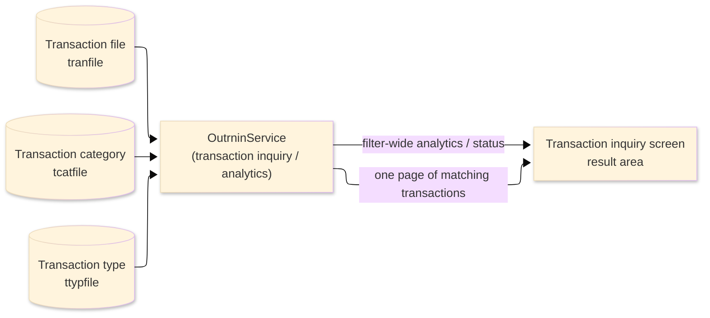
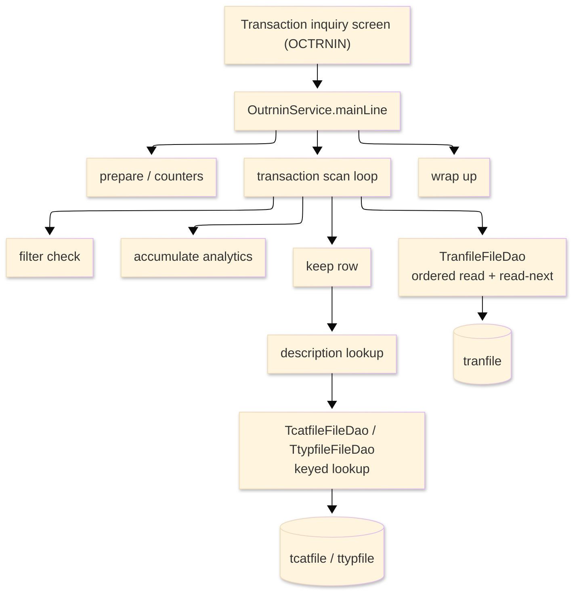

# TO-BE Batch Program Design — OUTRNIN_TransactionInquiryBrowse

> **TO-BE = AS-IS in business terms.** The section order follows the AS-IS document so the two
> compare 1-to-1; what is added is the mapping onto the generated Java/Spring module. Anything
> forced to differ is stated in the section it belongs to, in business terms.

**Header**

| Item | Content |
|---|---|
| System | ORION-CCMS (ORION Credit Card Management System) |
| Source program | OUTRNIN（COBOL） |
| TO-BE module | `orion-online/back-end/programs/outrnin` · package `com.generated.orion.outrnin` |
| Platform | Java 17 · Spring Boot 3.x · DB Oracle (H2 in dev) |
| Author ／ Date | modernizeX ／ 2026-09-28 |

> **Form-factor note (business impact):** in AS-IS this transaction browse and analytics engine was a
> COBOL routine that the transaction-inquiry screen called on line to fill one page of results. The
> transpiler produced it as an in-process service in the on-line back-end (`OutrninService`), **not** as
> a stand-alone Spring Batch job; the business logic — which transactions belong to each filter and the
> analytics reported for them — is unchanged. It is still invoked from the transaction-inquiry screen.
> See §8.

## 1. Program overview

### 1.1 TO-BE I/O diagram

### 1.2 Function overview

Return one page of transactions that match the filter chosen on the transaction-inquiry screen, together
with the analytics for the whole filtered set. The run reads the transaction file in transaction-id
order and tests each transaction against the selected filter — card, date range, merchant, type with
category, or amount threshold. Because the analytics must be genuine filter-wide totals (the same
figures the former summary, daily and per-merchant roll-ups produced), the full transaction file is
scanned on every call; while scanning, the first six matches whose transaction id is beyond the resume
key are captured as the page, and a further match sets the more indicator so the screen can page forward.
Each page row carries the transaction id, card, a type/category tag with its looked-up description, the
merchant name, the amount and the date. Alongside the page the run returns the match count and net total,
the purchase, payment, fee and interest subtotals with their counts, and the single largest transaction.
The run only reads; it never changes a transaction.

### 1.3 I/O table

| Business name | File ／ table | I/O |
|---|---|---|
| Transaction file (was VSAM KSDS) | table `tranfile` | I |
| Transaction category (was VSAM KSDS) | table `tcatfile` | I |
| Transaction type (was VSAM KSDS) | table `ttypfile` | I |
| Request / result area | in-memory call area (was COMMAREA) | I-O |

> The keyed transaction browse (start / read-next / end) becomes an ordered read of `tranfile` by its
> primary key `tr_id`, so transactions are still processed in ascending transaction-id order
> (`ORDER BY tr_id`); the scan starts at the first transaction. The category and type files are direct
> keyed lookups, not browses: `tcatfile` by its key (`tc_type_cd`, `tc_cd`) and `ttypfile` by its key
> (`tt_cd`). Field widths and money precision are preserved (see §4). No transaction row is written back.

### 1.4 Called subprograms / modules

| Item | Notes |
|---|---|
| `TranfileFileDao` | data access for the transaction file; ordered browse and read-next by transaction id |
| `TcatfileFileDao` · `TtypfileFileDao` | keyed lookups for the category and type descriptions shown on each row |
| (no sub-program) | the routine calls no external business program |

### 1.5 DB tables & SQL

| Table | Operation | Columns |
|---|---|---|
| `tranfile` | SELECT (ordered read by `tr_id`), sequential browse forward | card, type and category codes, merchant id and name, amount and processing date via JdbcTemplate |
| `tcatfile` | SELECT by (`tc_type_cd`, `tc_cd`) | category description |
| `ttypfile` | SELECT by `tt_cd` | type description (fallback) |

### 1.6 Special notes

- Called on demand from the transaction-inquiry screen; the request names the filter and its card, date
  range, merchant, type/category or amount threshold, plus the transaction to resume after
  (`KTI-START-KEY`).
- The whole transaction file is scanned every call so the analytics are true filter-wide totals, not
  just the page.
- Money is held as `BigDecimal`. The net total and the purchase, payment, fee and interest subtotals are
  running sums of the matched amounts kept at two-decimal scale; they are additions only, so no rounding
  is applied. The largest transaction is decided by comparing amounts.
- Read-only: the run reports figures and never updates the transaction file, so it is safe to repeat.

## 2. Processing details

_One row per business step, in execution order. Paragraph and method names are intentionally absent._

| 識別番号 | Business step | What happens | Condition ／ actual value |
|---|---|---|---|
| 0.0 | The inquiry starts | the run is called from the transaction-inquiry screen and drives preparation, the transaction scan and the wrap-up in turn |  |
| 1.0 | Prepare the run | clears the counters and sets the net total, the subtotals and the largest amount to zero, and sets the status to normal |  |
| 2.0 | Scan the transactions | positions the read and reads every transaction forward, testing each against the filter, until the file ends | the whole filtered set is scanned |
| 2.1 | Position the read | starts the transaction read at the first transaction; when there is nothing to read the scan is treated as finished; an unexpected store response stops the scan and is flagged | not-found or end → nothing to scan; other → flagged as error |
| 2.2 | Take the next transaction | reads the next transaction and hands it on to be considered; at end of file the scan finishes | end of transactions ends the scan |
| 2.25 | Consider the transaction | counts it as scanned; when it matches the filter, updates the analytics and — if its id is beyond the resume key — keeps it on the page while the page is not yet full, otherwise flags that more remain | page holds up to six |
| 2.4 | Apply the chosen filter | marks the transaction as matching only when it belongs to the selected filter — its card, a processing date within the range, its merchant, its type with category, or an amount at or above the threshold | the filter is chosen on the screen |
| 2.5 | Keep the matching transaction | adds the transaction to the page with its id, card, type/category tag, description, merchant name, amount and date, and remembers its id as the resume point |  |
| 2.6 | Look up the description | reads the category description for the transaction's type and category; when none is on file, falls back to the type description; when neither is found, shows "UNKNOWN" | fallback to type, then "UNKNOWN" |
| 2.7 | Update the analytics | counts the match, adds the amount to the net total, adds it to the purchase, payment, fee or interest subtotal according to the transaction type, and keeps the largest single transaction seen | subtotal chosen by type code |
| 3.0 | Wrap up the run | returns the page, the counts and the analytics to the screen | net total and subtotals kept at two-decimal scale |

## 3. Structure diagram

_The call structure of the routine as generated._

## 4. Output specifications (file / table)

The result call area returned to the screen keeps the original field widths and money precision; it is
the former COMMAREA, now an in-memory object, and no field maps to a written table column.

### 4.1 Result call area (KTRNIN-AREA) — 842 bytes

| Level | Item name | Field | Type ／ bytes | Position | Java type | How it is set |
|---|---|---|---|---|---|---|
| 01 | Area | KTRNIN-AREA | group ／ 842 | 1 | call area | whole request / result area |
| 05 | Request | KTI-REQUEST | group ／ 78 | 1 | fields | request block (input) |
| 10 | Filter | KTI-FILTER | X(01) ／ 0 | 1 | `String` | requested filter (input) |
| 10 | Card | KTI-CARD | X(16) ／ 16 | 1 | `String` | card filter value (input) |
| 10 | Date from | KTI-DATE-FROM | X(10) ／ 10 | 17 | `String` | date-range start (input) |
| 10 | Date to | KTI-DATE-TO | X(10) ／ 10 | 27 | `String` | date-range end (input) |
| 10 | Merchant id | KTI-MERCH-ID | 9(09) ／ 9 | 37 | `int` | merchant filter value (input) |
| 10 | Type | KTI-F-TYPE | X(02) ／ 2 | 46 | `String` | type filter value (input) |
| 10 | Category | KTI-F-CAT | 9(04) ／ 4 | 48 | `int` | category filter value (input) |
| 10 | Amount threshold | KTI-AMT-THRESH | S9(09)V99 ／ 11 | 52 | `BigDecimal` | amount threshold (input) |
| 10 | Start key | KTI-START-KEY | X(16) ／ 16 | 63 | `String` | transaction to resume after (input) |
| 05 | Response | KTI-RESPONSE | group ／ 164 | 79 | fields | response block |
| 10 | Return code | KTI-RETURN-CD | X(01) ／ 0 | 79 | `String` | normal or error, set at wrap-up |
| 10 | Row count | KTI-ROW-COUNT | 9(02) ／ 2 | 79 | `int` | transactions kept on the page |
| 10 | More switch | KTI-MORE-SW | X(01) ／ 0 | 81 | `String` | more-transactions indicator |
| 10 | Next key | KTI-NEXT-KEY | X(16) ／ 16 | 81 | `String` | next-page resume transaction |
| 10 | Scan count | KTI-SCAN-COUNT | 9(07) ／ 7 | 97 | `int` | transactions read |
| 10 | Match count | KTI-MATCH-COUNT | 9(07) ／ 7 | 104 | `int` | transactions matching the filter |
| 10 | Net total | KTI-NET-TOTAL | S9(13)V99 ／ 15 | 111 | `BigDecimal` | sum of matched amounts |
| 10 | Max amount | KTI-MAX-AMT | S9(11)V99 ／ 13 | 126 | `BigDecimal` | largest single matched amount |
| 10 | Max id | KTI-MAX-ID | X(16) ／ 16 | 139 | `String` | id of the largest transaction |
| 10 | Purchase count | KTI-PURCH-CNT | 9(07) ／ 7 | 155 | `int` | count of purchase transactions |
| 10 | Purchase sum | KTI-PURCH-SUM | S9(13)V99 ／ 15 | 162 | `BigDecimal` | sum of purchase amounts |
| 10 | Payment count | KTI-PAY-CNT | 9(07) ／ 7 | 177 | `int` | count of payment transactions |
| 10 | Payment sum | KTI-PAY-SUM | S9(13)V99 ／ 15 | 184 | `BigDecimal` | sum of payment amounts |
| 10 | Fee count | KTI-FEE-CNT | 9(07) ／ 7 | 199 | `int` | count of fee transactions |
| 10 | Fee sum | KTI-FEE-SUM | S9(13)V99 ／ 15 | 206 | `BigDecimal` | sum of fee amounts |
| 10 | Interest count | KTI-INT-CNT | 9(07) ／ 7 | 221 | `int` | count of interest transactions |
| 10 | Interest sum | KTI-INT-SUM | S9(13)V99 ／ 15 | 228 | `BigDecimal` | sum of interest amounts |
| 05 | Rows (occurs 6) | KTI-ROW | group ／ 600 | 243 | list | one entry per kept transaction |
| 15 | Id | KTR-ID | X(16) ／ 16 | 243 | `String` | transaction id |
| 15 | Card | KTR-CARD | X(16) ／ 16 | 259 | `String` | card number |
| 15 | Type/category | KTR-TYCAT | X(07) ／ 7 | 275 | `String` | type/category tag |
| 15 | Description | KTR-DESC | X(20) ／ 20 | 282 | `String` | looked-up description |
| 15 | Merchant | KTR-MERCH | X(20) ／ 20 | 302 | `String` | merchant name |
| 15 | Amount | KTR-AMT | S9(09)V99 ／ 11 | 322 | `BigDecimal` | transaction amount |
| 15 | Date | KTR-DATE | X(10) ／ 10 | 333 | `String` | processing date |

> The page holds up to six transactions (`KTI-ROW` occurs 6). Money is `BigDecimal` at two-decimal
> scale; the net total and the four subtotals are running sums (additions only, so no rounding is
> applied), and the largest transaction is chosen by comparing amounts.

## 5. In/out parameters & check specifications

### 5.1 Parameters

| Kind | Value | Notes |
|---|---|---|
| Input parameter | the filter to browse and its card, date range, merchant, type/category or amount threshold (`KTI-FILTER`, `KTI-CARD`, `KTI-DATE-FROM`, `KTI-DATE-TO`, `KTI-MERCH-ID`, `KTI-F-TYPE`, `KTI-F-CAT`, `KTI-AMT-THRESH`) | supplied by the transaction-inquiry screen |
| Input parameter | the transaction to resume after (`KTI-START-KEY`) | drives paging |
| Return value | an outcome code — normal or error (`KTI-RETURN-CD`) | tells the screen whether the page is reliable |
| Return page | up to six matching transactions with id, card, type/category, description, merchant, amount and date (`KTI-ROW`) | shown on the inquiry screen |
| Return counts | transactions kept, transactions read, the more indicator and the resume key (`KTI-ROW-COUNT`, `KTI-SCAN-COUNT`, `KTI-MORE-SW`, `KTI-NEXT-KEY`) | drive paging |
| Return analytics | match count, net total, largest transaction and the purchase / payment / fee / interest counts and sums (`KTI-MATCH-COUNT`, `KTI-NET-TOTAL`, `KTI-MAX-AMT`, `KTI-MAX-ID`, `KTI-PURCH-CNT`, `KTI-PURCH-SUM`, `KTI-PAY-CNT`, `KTI-PAY-SUM`, `KTI-FEE-CNT`, `KTI-FEE-SUM`, `KTI-INT-CNT`, `KTI-INT-SUM`) | filter-wide totals |

### 5.2 Checks

| No. | Kind | Condition | Error code | Behaviour |
|---|---|---|---|---|
| 1 | Store access | positioning the transaction read returns an unexpected response | — | the outcome code is set to error and the scan ends |
| 2 | Store access | reading the next transaction returns an unexpected response | — | the outcome code is set to error and the scan ends |
| 3 | Business | the category and type lookups both miss for a kept transaction | — | the row description is shown as "UNKNOWN" and the run continues |

## 6. Modification summary

| No. | Date | Title | Content |
|---|---|---|---|
| 1 | 2026-09-28 | Initial TO-BE mapping | Mapped from the AS-IS design onto the generated `OutrninService`; behaviour preserved. |

## 7. Screen

No screen — the routine is driven from the transaction-inquiry screen and returns its page and analytics there.

## 8. TO-BE operations (replacing JCL/BAT)

| Item | Value |
|---|---|
| Trigger | called on demand from the transaction-inquiry screen each time the operator selects a filter or pages forward; there is no stand-alone Spring Batch job |
| Schedule | not determined (ask the team) |
| Input data | the transactions, together with the category and type descriptions, already held in the database |
| Log | written to the application log; the counts and analytics are returned to the operator on screen |
| Rerun | safe to rerun; the run only reads the transaction, category and type data and recomputes the analytics each time |
