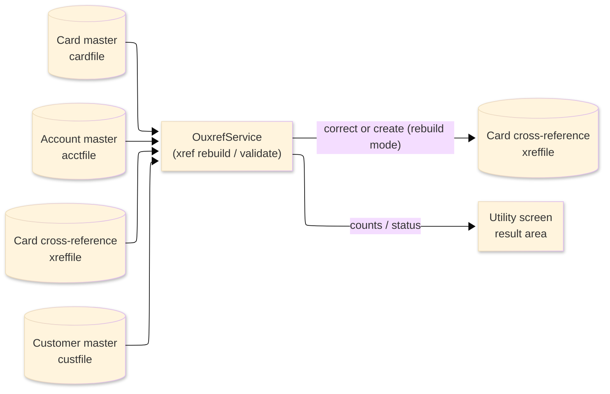
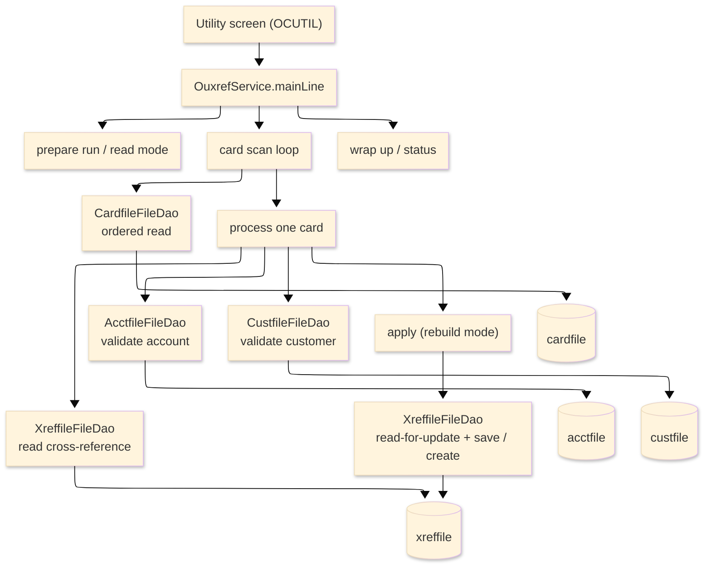

# TO-BE Batch Program Design — OUXREF_XrefRebuild

> **TO-BE = AS-IS in business terms.** The section order follows the AS-IS document so the two
> compare 1-to-1; what is added is the mapping onto the generated Java/Spring module. Anything
> forced to differ is stated in the section it belongs to, in business terms.

**Header**

| Item | Content |
|---|---|
| System | ORION-CCMS (ORION Credit Card Management System) |
| Source program | OUXREF（COBOL） |
| TO-BE module | `orion-online/back-end/programs/ouxref` · package `com.generated.orion.ouxref` |
| Platform | Java 17 · Spring Boot 3.x · DB Oracle (H2 in dev) |
| Author ／ Date | modernizeX ／ 2026-09-28 |

> **Form-factor note (business impact):** in AS-IS this card cross-reference rebuild / validate run was
> a COBOL routine linked from the utility screen. The transpiler produced it as an in-process service in
> the on-line back-end (`OuxrefService`), **not** as a stand-alone Spring Batch job; the business logic
> — how each card is validated against the account and customer masters and how the cross-reference is
> corrected or created in rebuild mode — is unchanged. It is still launched from the utility screen
> (OCUTIL). See §8.

## 1. Program overview

### 1.1 TO-BE I/O diagram

### 1.2 Function overview

Rebuild or validate the card cross-reference on demand. The run reads the card master in card-number
order; for each card it validates the owning account against the account master, carries the customer id
forward from the existing cross-reference record, and validates that customer against the customer
master. In validate mode a valid card is simply counted; in rebuild mode the cross-reference is
corrected in place (its account id and customer id are re-set and the record is saved), or a fresh
record is created if the cross-reference had vanished. Cards that fail account, cross-reference or
customer validation are skipped and counted by reason. The run reports how many cards were read, written,
updated and skipped (by reason), plus errors, and hands back the next card so a large run can be
continued in further passes. The mode is required; an optional start card and maximum count limit the
scope.

### 1.3 I/O table

| Business name | File ／ table | I/O |
|---|---|---|
| Card master (was VSAM KSDS) | table `cardfile` | I |
| Account master (was VSAM KSDS) | table `acctfile` | I |
| Card cross-reference (was VSAM KSDS) | table `xreffile` | I-O |
| Customer master (was VSAM KSDS) | table `custfile` | I |
| Request / result area | in-memory call area (was COMMAREA) | I-O |

> The card keyed browse (start / read-next) becomes an ordered read of `cardfile` by its primary key
> `cd_num` (`SELECT … ORDER BY cd_num`), so cards are still processed in ascending card-number order.
> The account (`acctfile`.`ac_id`), cross-reference (`xreffile`.`xr_card_num`) and customer
> (`custfile`.`cu_id`) reads are keyed single-row lookups. Field widths are preserved (see §4).

### 1.4 Called subprograms / modules

| Item | Notes |
|---|---|
| `CardfileFileDao` (`@Repository("CARDFILE")`) | ordered read of the card master |
| `AcctfileFileDao` · `CustfileFileDao` | keyed lookups that validate the owning account and the customer |
| `XreffileFileDao` (`@Repository("XREFFILE")`) | read, read-for-update, save (rewrite) and create (write) of the cross-reference |
| (no sub-program) | the routine calls no external business program |

### 1.5 DB tables & SQL

| Table | Operation | Columns |
|---|---|---|
| `cardfile` | SELECT (ordered read by `cd_num`) | whole card row via the shared JDBC file DAO |
| `acctfile` | SELECT by `ac_id` | keyed existence check |
| `custfile` | SELECT by `cu_id` | keyed existence check |
| `xreffile` | SELECT by `xr_card_num`, SELECT … FOR UPDATE, UPDATE, INSERT | `xr_card_num`, `xr_acct_id`, `xr_cust_id` |

### 1.6 Special notes

- Launched on demand from the utility screen (OCUTIL); the mode is required (rebuild or validate), and a
  start card and a maximum count may be supplied (blank / zero mean "from the first record" and "no
  limit").
- The mode value must be `REBL` (rebuild) or `VALD` (validate); any other value stops the run before any
  read and returns the message "INVALID MODE - USE REBL OR VALD".
- In validate mode the cross-reference is not changed — valid cards are only counted. In rebuild mode the
  cross-reference is corrected in place, or created if it had vanished.
- The next card is returned so a large run can be continued in a later pass.

## 2. Processing details

_One row per business step, in execution order. Paragraph and method names are intentionally absent._

| 識別番号 | Business step | What happens | Condition ／ actual value |
|---|---|---|---|
| 0.0 | The cross-reference run starts | the run is launched from the utility screen and drives preparation, the card scan and the wrap-up in turn |  |
| 1.0 | Prepare the run | clears the result counters, sets the status to in-progress, takes the requested maximum, and reads the mode | mode must be rebuild or validate, otherwise the run fails before any read |
| 2.0 | Position the scan | positions the card read at the first card, or at the requested start card; when there is nothing to read the scan is skipped; a store error stops the run | not-found / end → nothing to scan; other error → run fails |
| 3.0 | Scan the cards in order | reads forward through the card master, processing each card, until the end of file or until the requested maximum is reached |  |
| 3.1 | Take the next card | fetches the next card; at end of file the scan finishes; a read failure ends the scan and is counted as an error | end of cards ends the scan |
| 3.2 | Process one card | validates the card's account, existing cross-reference and customer in turn; if all are valid the cross-reference is applied | any failed validation skips the card |
| 3.3 | Validate the owning account | confirms the card's account exists on the account master; a missing account skips the card and is counted, a store error skips it and is counted as an error | account not found → skip (account) |
| 3.4 | Read the existing cross-reference | reads the card's current cross-reference and carries its customer id forward; a missing cross-reference skips the card and is counted, a store error skips it and is counted as an error | cross-reference not found → skip (cross-reference) |
| 3.5 | Validate the customer | confirms the carried customer id exists on the customer master; a missing customer skips the card and is counted, a store error skips it and is counted as an error | customer not found → skip (customer) |
| 3.6 | Apply the cross-reference | in validate mode the card is simply counted as validated; in rebuild mode the cross-reference is corrected | validate mode → count only; rebuild mode → correct/create |
| 3.7 | Correct the cross-reference | re-reads the cross-reference for update, re-sets its account id and customer id and saves it, counting it as updated; if the cross-reference has vanished a fresh record is created instead; a failed save is counted as an error | cross-reference gone → create a fresh record |
| 3.8 | Create the cross-reference | writes a fresh cross-reference for the card with its account id and customer id and counts it as written; a failed create is counted as an error |  |
| 4.0 | Look past the scanned range | checks whether more cards remain beyond the scanned range and, if so, returns the next start card for a later pass | more data → returns the next card number |
| 5.0 | Finish the scan | closes the card read once the loop is done |  |
| 6.0 | Wrap up the run | sets the final status and message (rebuild complete, validation complete, or "no cards processed" when nothing was read) and returns the accumulated counts to the operator | nothing read → "NO CARDS PROCESSED" |

## 3. Structure diagram

_The call structure of the routine as generated._

## 4. Output specifications (file / table)

In rebuild mode the run saves or creates cross-reference records; the layout keeps the original 50-byte
record and maps to columns of the `xreffile` table.

### 4.1 Card cross-reference (XREF-REC) — 50 bytes

| Level | Item name | Field ／ column | Type ／ bytes | Position | Java ／ SQL type | How it is set |
|---|---|---|---|---|---|---|
| 01 | Record | XREF-REC | group ／ 50 | 1 | row of `xreffile` | whole cross-reference record |
| 05 | Card number | XR-CARD-NUM | X(16) ／ 16 | 1 | `String` ／ `VARCHAR2(16)` (`xr_card_num`) | record key; the card being processed |
| 05 | Account id | XR-ACCT-ID | 9(11) ／ 11 | 17 | `long` ／ `NUMERIC(11)` (`xr_acct_id`) | set from the card's owning account id |
| 05 | Customer id | XR-CUST-ID | 9(09) ／ 9 | 28 | `long` ／ `NUMERIC(9)` (`xr_cust_id`) | carried from the existing cross-reference record |
| 05 | Filler | FILLER | X(14) ／ 14 | 37 | — | reserved (no column) |

> The identifier fields are stored numerically (`CAST … AS NUMERIC` in the generated DAO); no money or
> rounding is involved in this program.

## 5. In/out parameters & check specifications

### 5.1 Parameters

| Kind | Value | Notes |
|---|---|---|
| Input parameter | mode `REBL` (rebuild) or `VALD` (validate) (`KUX-MODE`), optional start card (`KUX-START-CARD`), optional maximum count (`KUX-MAX`) | supplied by the utility screen |
| Return value | a status flag — complete, no-work, or failed (`KUX-STATUS`) plus a status message (`KUX-MSG`) | tells the operator the outcome |
| Return counts | cards read, written, updated and errors (`KUX-READ`, `KUX-WRITTEN`, `KUX-UPDATED`, `KUX-ERRORS`) | shown back on the utility screen |
| Return skip counts | skipped for missing account, cross-reference and customer (`KUX-SKIP-ACCT`, `KUX-SKIP-XREF`, `KUX-SKIP-CUST`) | shown back on the utility screen |
| Return continuation | more-data flag and next start card (`KUX-MORE`, `KUX-NEXT-CARD`) | lets the operator continue a large run in a later pass |

### 5.2 Checks

| No. | Kind | Condition | Error code | Behaviour |
|---|---|---|---|---|
| 1 | Format | the mode is not `REBL` or `VALD` | — | the run is marked failed (status `99`) before any read and reports "INVALID MODE - USE REBL OR VALD" |
| 2 | Store access | the card read cannot be positioned | — | the run stops (status `99`) and reports "CARDFILE STARTBR FAILED" |
| 3 | Store access | fetching the next card fails | — | the scan ends, the card is counted as an error and reports "CARDFILE READNEXT FAILED" |
| 4 | Business | the card's owning account is missing | — | the card is skipped and counted as skipped for account |
| 5 | Business | the card's existing cross-reference is missing | — | the card is skipped and counted as skipped for cross-reference |
| 6 | Business | the carried customer is missing | — | the card is skipped and counted as skipped for customer |
| 7 | Business | no cards were read | — | the run ends normally (status `10`) reporting "NO CARDS PROCESSED" |

## 6. Modification summary

| No. | Date | Title | Content |
|---|---|---|---|
| 1 | 2026-09-28 | Initial TO-BE mapping | Mapped from the AS-IS design onto the generated `OuxrefService`; behaviour preserved. |

## 7. Screen

No screen — the routine is driven from the utility screen and reports its outcome there.

## 8. TO-BE operations (replacing JCL/BAT)

| Item | Value |
|---|---|
| Trigger | launched on demand from the utility screen (OCUTIL); the transpiler produced it as an in-process on-line service (`OuxrefService`), not a stand-alone Spring Batch job — a mode (rebuild or validate) is required, with an optional start card and maximum count |
| Schedule | not determined (ask the team) |
| Input data | the current card, account, cross-reference and customer rows held in the `cardfile`, `acctfile`, `xreffile` and `custfile` tables |
| Log | written to the application log; the outcome counts are returned to the operator on the utility screen |
| Rerun | safe to rerun; validate mode makes no change, and a large run can be continued by passing the returned next card as the start card for the next pass |
