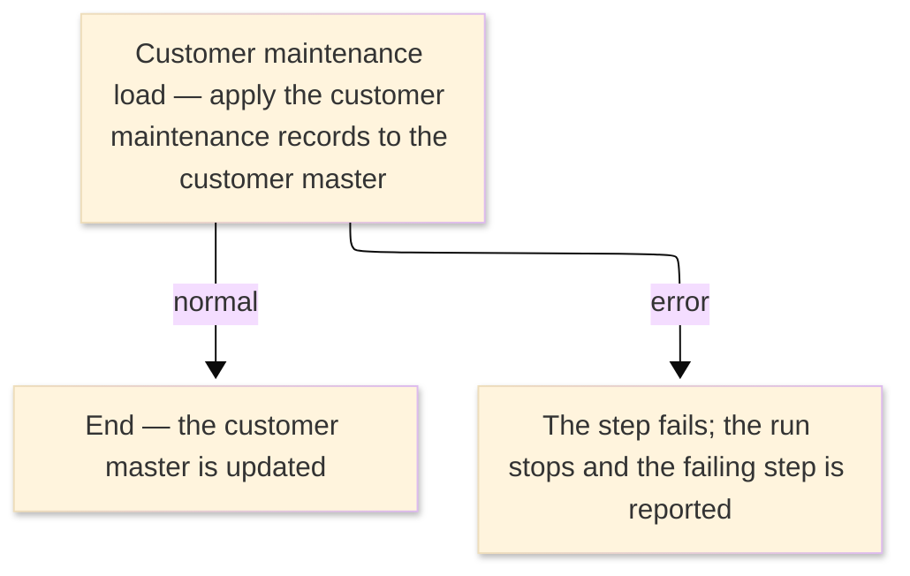

# TO-BE Job Flow — RUNDCUST

> The TO-BE counterpart of `RUNDCUST_DB2CustomerLoad_JobFlow.md`. The step order and the branch
> conditions are preserved; where a step changes form factor it is recorded in §4.

| Item | Value |
|---|---|
| JOBID | RUNDCUST (DB2 customer maintenance load) |
| Process name | DB2 customer maintenance load — unchanged in business terms |
| Platform | Java 17 · Spring Boot 3.x · Oracle (H2 in dev) — handled in the database / by the on-line customer service, not Spring Batch |
| How it is run | there is no `batch-runner` job for this run; the customer maintenance is applied by the customer load / import logic and the on-line customer maintenance services (see §4) |
| Schedule | not determined (ask the team) — historically submitted manually or by the operations schedule |
| Log ／ monitoring | the database / application log |
| Author | modernizeX |

> **Form-factor change (business impact):** in AS-IS this job ran an external DB2 plan (`ODCUSTP`)
> under TSO batch (`DSN RUN`); the plan has **no COBOL source** in the reg (external module). In TO-BE
> there is **no Spring Batch job** for it — the customer rows now live in the relational table
> `custfile`, and the equivalent maintenance load is handled by the customer load / import logic
> (`OUIMP`) and the on-line customer maintenance services. The business content — the customer records
> that get created or updated — is the same; only the run mechanism changed. See §4.

### Job flow diagram

## 1. Step table — 1-to-1 mapping

One bold row per step, one sub-row per I/O.

| Step | Program | I/O | File ／ table | Notes |
|---|---|---|---|---|
| **◆ Overview** |  | ・Overall: | customer maintenance records → `custfile` + run report |  |
| **◆ P0 Main processing** |  |  |  |  |
| **DCUSTP** | (none — DB2 DSN RUN; no COBOL business logic) |  |  | was `IKJEFT01` running DB2 plan `ODCUSTP`; now handled by the customer load / import logic (`OUIMP`) — see §4 |
|  |  | IN | customer maintenance data (was `ORION.CUST.MAINT.SEQ`) | the sequential maintenance records that create or update customers |
|  |  | OUT | table `custfile` | keyed by `cu_id`; the customer master updated by the maintenance records |
|  |  | OUT | run report | the maintenance run summary (was the SYSOUT report) |

## 2. Branch conditions & dependencies

| Condition | Flow |
|---|---|
| the customer master must exist before the maintenance load runs | the schema/seed builds `custfile` before this load applies changes to it |
| the step ends normally (was RC=0 below the COND threshold) | the customer master is updated and the run completes |
| the step fails (was a return code above the COND threshold, or an abend) | the run stops and the failing step is reported |

## 3. Termination & abnormal handling

| Item | Value |
|---|---|
| Normal termination | the maintenance records are applied and the run completes successfully (was RC=0) |
| Business error | a failure stops the run and the failing step is reported (was a return code above the COND threshold, or an abend captured to CEEDUMP/SYSUDUMP) |
| Rerun | re-run the load with the same maintenance input; already-applied changes are idempotent by customer key |
| Cleanup | none — no temporary datasets remain; correct the input and re-run if records were rejected |

## 4. Programs in the job

| # | Program | Module | Detailed document |
|---|---|---|---|
| 1 | (none — DB2 DSN RUN; no COBOL business logic) | external DB2 plan `ODCUSTP`, replaced by the customer load / import logic `OUIMP` and the on-line customer maintenance services; the customer data lives in `custfile` | no program design — external DB2 plan, no COBOL business logic |
