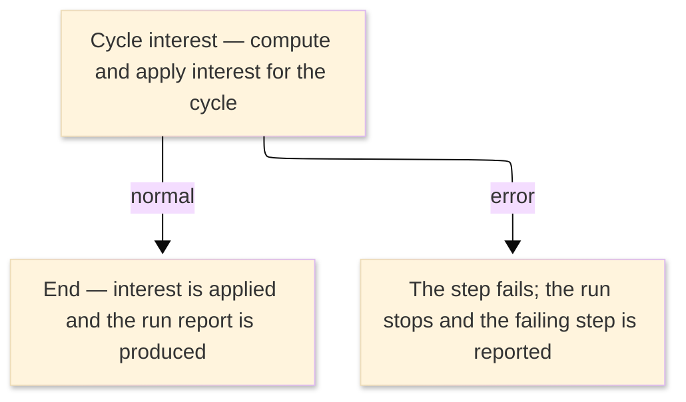

# TO-BE Job Flow — RUNDINTC

> The TO-BE counterpart of `RUNDINTC_DB2InterestCalc_JobFlow.md`. The step order and the branch
> conditions are preserved; where a step changes form factor it is recorded in §4.

| Item | Value |
|---|---|
| JOBID | RUNDINTC (DB2 cycle interest calculation) |
| Process name | DB2 cycle interest calculation — unchanged in business terms |
| Platform | Java 17 · Spring Boot 3.x · Oracle (H2 in dev) — handled in the database / by the on-line interest service, not Spring Batch |
| How it is run | there is no `batch-runner` job for this run; the cycle interest is computed by the on-line interest assessment service (see §4) |
| Schedule | not determined (ask the team) — historically submitted manually or by the operations schedule |
| Log ／ monitoring | the database / application log |
| Author | modernizeX |

> **Form-factor change (business impact):** in AS-IS this job ran an external DB2 plan (`ODINTC`)
> under TSO batch (`DSN RUN`); the plan has **no COBOL source** in the reg (external module). In TO-BE
> there is **no Spring Batch job** for it — the cycle interest is computed by the on-line interest
> assessment service `OUINT`, working against the relational account and transaction tables. The
> business content — the interest applied for the cycle — is the same; only the run mechanism changed.
> See §4.

### Job flow diagram

## 1. Step table — 1-to-1 mapping

One bold row per step, one sub-row per I/O.

| Step | Program | I/O | File ／ table | Notes |
|---|---|---|---|---|
| **◆ Overview** |  | ・Overall: | account and transaction data → updated balances + run report |  |
| **◆ P0 Main processing** |  |  |  |  |
| **DINTC** | (none — DB2 DSN RUN; no COBOL business logic) |  |  | was `IKJEFT01` running DB2 plan `ODINTC`; now handled by `OUINT` — see §4 |
|  |  | IN | tables `acctfile`, `tranfile` | keyed by `ac_id` / `tr_id`; the account balances and transactions the interest is computed from |
|  |  | OUT | table `acctfile` | keyed by `ac_id`; the account balances updated with the assessed interest |
|  |  | OUT | run report | the interest run summary (was the SYSOUT report) |

## 2. Branch conditions & dependencies

| Condition | Flow |
|---|---|
| the account and transaction data must exist before interest is computed | the account and transaction tables are populated before the interest run |
| the step ends normally (was RC=0 below the COND threshold) | the interest is applied and the run completes |
| the step fails (was a return code above the COND threshold, or an abend) | the run stops and the failing step is reported |

## 3. Termination & abnormal handling

| Item | Value |
|---|---|
| Normal termination | the cycle interest is applied and the run completes successfully (was RC=0) |
| Business error | a failure stops the run and the failing step is reported (was a return code above the COND threshold, or an abend captured to CEEDUMP/SYSUDUMP) |
| Rerun | re-run the interest computation for the cycle; the assessment is keyed to the cycle so it is not double-applied |
| Cleanup | none — no temporary datasets remain; re-run for the cycle if the run failed part-way |

## 4. Programs in the job

| # | Program | Module | Detailed document |
|---|---|---|---|
| 1 | (none — DB2 DSN RUN; no COBOL business logic) | external DB2 plan `ODINTC`, replaced by the on-line interest assessment service `OUINT`; interest is computed against `acctfile` / `tranfile` | no program design — external DB2 plan, no COBOL business logic |
