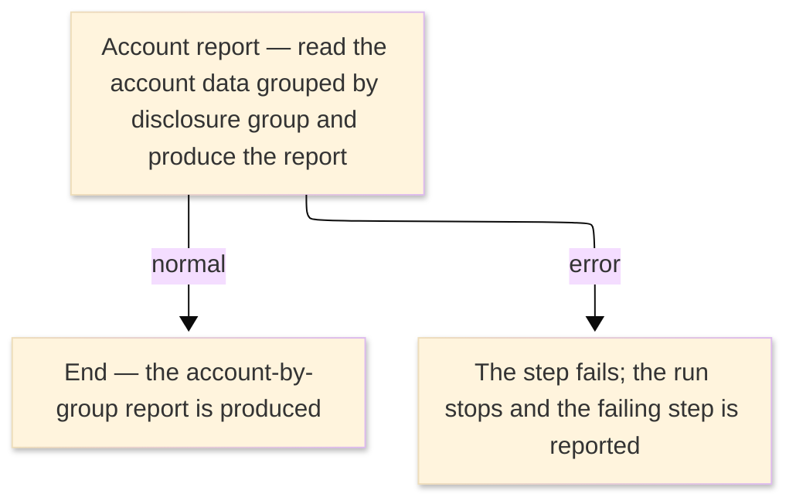

# TO-BE Job Flow — RUNDRACC

> The TO-BE counterpart of `RUNDRACC_DB2AccountReport_JobFlow.md`. The step order and the branch
> conditions are preserved; where a step changes form factor it is recorded in §4.

| Item | Value |
|---|---|
| JOBID | RUNDRACC (DB2 account report by group) |
| Process name | DB2 account report by group — unchanged in business terms |
| Platform | Java 17 · Spring Boot 3.x · Oracle (H2 in dev) — handled in the database / by the on-line account and report services, not Spring Batch |
| How it is run | there is no `batch-runner` job for this run; the account-by-group report is produced by the on-line account browse and report-request logic (see §4) |
| Schedule | not determined (ask the team) — historically submitted manually or by the operations schedule |
| Log ／ monitoring | the database / application log |
| Author | modernizeX |

> **Form-factor change (business impact):** in AS-IS this job ran an external DB2 plan (`ODRACCT`)
> under TSO batch (`DSN RUN`); the plan has **no COBOL source** in the reg (external module). In TO-BE
> there is **no Spring Batch job** for it — the account-by-group report is produced by the on-line
> account browse service `OUACTIN` and the report-request logic, reading the account data grouped by
> disclosure group. The business content — the account report by group — is the same; only the run
> mechanism changed. See §4.

### Job flow diagram

## 1. Step table — 1-to-1 mapping

One bold row per step, one sub-row per I/O.

| Step | Program | I/O | File ／ table | Notes |
|---|---|---|---|---|
| **◆ Overview** |  | ・Overall: | account data grouped by disclosure group → account report |  |
| **◆ P0 Main processing** |  |  |  |  |
| **DRACCT** | (none — DB2 DSN RUN; no COBOL business logic) |  |  | was `IKJEFT01` running DB2 plan `ODRACCT`; now handled in the database / by `OUACTIN` and the report-request logic — see §4 |
|  |  | IN | tables `acctfile`, `dgrpfile` | account rows (`ac_id`) grouped by disclosure group (`dg_acct_group, dg_type_cd, dg_cat_cd`) |
|  |  | OUT | account-by-group report | the grouped report (was the SYSOUT report) |

## 2. Branch conditions & dependencies

| Condition | Flow |
|---|---|
| the account and disclosure-group data must exist before the report is produced | the account and disclosure-group tables are populated before the report run |
| the step ends normally (was RC=0 below the COND threshold) | the report is produced and the run completes |
| the step fails (was a return code above the COND threshold, or an abend) | the run stops and the failing step is reported |

## 3. Termination & abnormal handling

| Item | Value |
|---|---|
| Normal termination | the account-by-group report is produced and the run completes successfully (was RC=0) |
| Business error | a failure stops the run and the failing step is reported (was a return code above the COND threshold, or an abend captured to CEEDUMP/SYSUDUMP) |
| Rerun | re-run the report; it reads the current account and group data and reproduces the output |
| Cleanup | none — the report is regenerated on each run; no temporary datasets remain |

## 4. Programs in the job

| # | Program | Module | Detailed document |
|---|---|---|---|
| 1 | (none — DB2 DSN RUN; no COBOL business logic) | external DB2 plan `ODRACCT`, replaced by the on-line account browse service `OUACTIN` and the report-request logic; the account data lives in `acctfile`, grouped through `dgrpfile` | no program design — external DB2 plan, no COBOL business logic |
