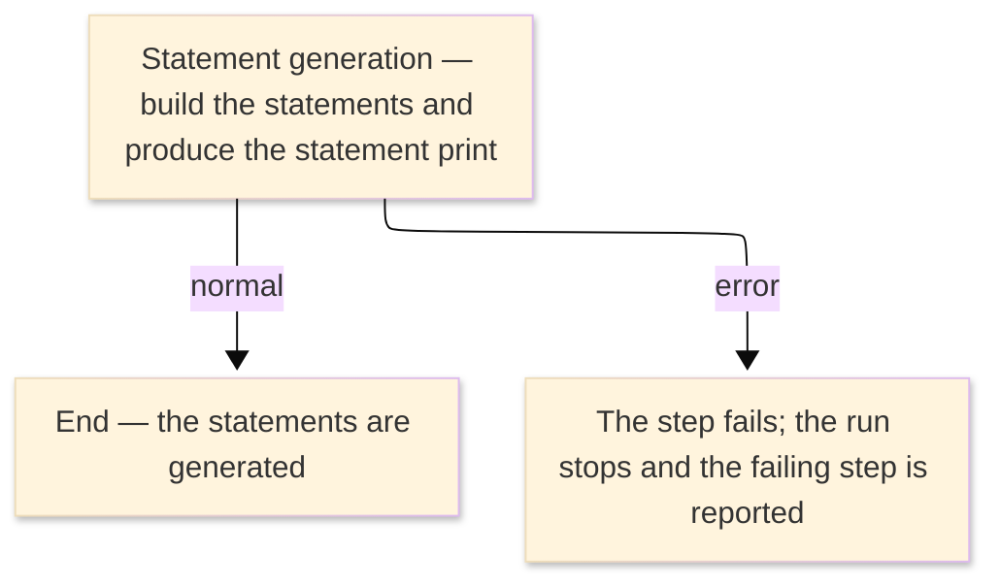

# TO-BE Job Flow — RUNDSTMT

> The TO-BE counterpart of `RUNDSTMT_DB2StatementGen_JobFlow.md`. The step order and the branch
> conditions are preserved; where a step changes form factor it is recorded in §4.

| Item | Value |
|---|---|
| JOBID | RUNDSTMT (DB2 statement generation) |
| Process name | DB2 statement generation — unchanged in business terms |
| Platform | Java 17 · Spring Boot 3.x · Oracle (H2 in dev) — handled in the database / by the on-line statement service, not Spring Batch |
| How it is run | there is no `batch-runner` job for this run; the statements are built by the on-line statement build service (see §4) |
| Schedule | not determined (ask the team) — historically submitted manually or by the operations schedule |
| Log ／ monitoring | the database / application log |
| Author | modernizeX |

> **Form-factor change (business impact):** in AS-IS this job ran an external DB2 plan (`ODSTMT`)
> under TSO batch (`DSN RUN`); the plan has **no COBOL source** in the reg (external module). In TO-BE
> there is **no Spring Batch job** for it — the statements are built by the on-line statement build
> service `OUSTMB`, reading the account and transaction data and writing the statement records. The
> business content — the generated statements — is the same; only the run mechanism changed. See §4.

### Job flow diagram

## 1. Step table — 1-to-1 mapping

One bold row per step, one sub-row per I/O.

| Step | Program | I/O | File ／ table | Notes |
|---|---|---|---|---|
| **◆ Overview** |  | ・Overall: | account and transaction data → `stmtfile` + statement print |  |
| **◆ P0 Main processing** |  |  |  |  |
| **DSTMT** | (none — DB2 DSN RUN; no COBOL business logic) |  |  | was `IKJEFT01` running DB2 plan `ODSTMT`; now handled by `OUSTMB` — see §4 |
|  |  | IN | tables `acctfile`, `tranfile` | keyed by `ac_id` / `tr_id`; the account balances and transactions the statement is built from |
|  |  | OUT | table `stmtfile` | keyed by `st_acct_id, st_cycle`; the generated statement records |
|  |  | OUT | statement print (was `ORION.DB2.STMT.PRINT`) | the printable statement output |

## 2. Branch conditions & dependencies

| Condition | Flow |
|---|---|
| the account and transaction data must exist before the statements are built | the account and transaction tables are populated before the statement run |
| the step ends normally (was RC=0 below the COND threshold) | the statements are generated and the run completes |
| the step fails (was a return code above the COND threshold, or an abend) | the run stops and the failing step is reported |

## 3. Termination & abnormal handling

| Item | Value |
|---|---|
| Normal termination | the statements are generated and the run completes successfully (was RC=0) |
| Business error | a failure stops the run and the failing step is reported (was a return code above the COND threshold, or an abend captured to CEEDUMP/SYSUDUMP) |
| Rerun | re-run the generation for the cycle; statements are keyed by account and cycle so they are not duplicated |
| Cleanup | none — the statement print is regenerated on each run; no temporary datasets remain |

## 4. Programs in the job

| # | Program | Module | Detailed document |
|---|---|---|---|
| 1 | (none — DB2 DSN RUN; no COBOL business logic) | external DB2 plan `ODSTMT`, replaced by the on-line statement build service `OUSTMB`; the statement records live in `stmtfile` | no program design — external DB2 plan, no COBOL business logic |
