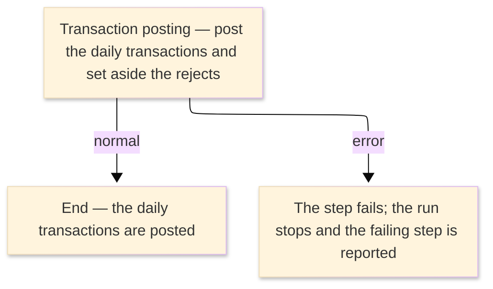

# TO-BE Job Flow — RUNDTRAN

> The TO-BE counterpart of `RUNDTRAN_DB2TransactionPost_JobFlow.md`. The step order and the branch
> conditions are preserved; where a step changes form factor it is recorded in §4.

| Item | Value |
|---|---|
| JOBID | RUNDTRAN (DB2 daily transaction posting) |
| Process name | DB2 daily transaction posting — unchanged in business terms |
| Platform | Java 17 · Spring Boot 3.x · Oracle (H2 in dev) — handled in the database / by the on-line posting service, not Spring Batch |
| How it is run | there is no `batch-runner` job for this run; the daily transactions are posted by the on-line transaction posting service (see §4) |
| Schedule | not determined (ask the team) — historically submitted manually or by the operations schedule |
| Log ／ monitoring | the database / application log |
| Author | modernizeX |

> **Form-factor change (business impact):** in AS-IS this job ran an external DB2 plan (`ODTRANP`)
> under TSO batch (`DSN RUN`); the plan has **no COBOL source** in the reg (external module). In TO-BE
> there is **no Spring Batch job** for it — the daily transactions are posted by the on-line
> transaction posting service `OUPOST`, which updates the transaction and account tables and sets
> aside the transactions it cannot post. The business content — the posted transactions and the
> rejects — is the same; only the run mechanism changed. See §4.

### Job flow diagram

## 1. Step table — 1-to-1 mapping

One bold row per step, one sub-row per I/O.

| Step | Program | I/O | File ／ table | Notes |
|---|---|---|---|---|
| **◆ Overview** |  | ・Overall: | daily transactions → `tranfile` / `acctfile` + rejects |  |
| **◆ P0 Main processing** |  |  |  |  |
| **DTRANP** | (none — DB2 DSN RUN; no COBOL business logic) |  |  | was `IKJEFT01` running DB2 plan `ODTRANP`; now handled by `OUPOST` — see §4 |
|  |  | IN | daily transactions (was `ORION.DALYTRAN.SEQ`) | the day's transactions to be posted |
|  |  | OUT | tables `tranfile`, `acctfile` | keyed by `tr_id` / `ac_id`; the posted transactions and the updated account balances |
|  |  | OUT | rejected transactions (was `ORION.DB2.TRANP.REJECT`) | the transactions that could not be posted |

## 2. Branch conditions & dependencies

| Condition | Flow |
|---|---|
| the account master must exist before transactions are posted | the account table is populated before posting so balances can be updated |
| the step ends normally (was RC=0 below the COND threshold) | the daily transactions are posted and the run completes |
| the step fails (was a return code above the COND threshold, or an abend) | the run stops and the failing step is reported |

## 3. Termination & abnormal handling

| Item | Value |
|---|---|
| Normal termination | the daily transactions are posted, the rejects are set aside, and the run completes successfully (was RC=0) |
| Business error | a failure stops the run and the failing step is reported (was a return code above the COND threshold, or an abend captured to CEEDUMP/SYSUDUMP) |
| Rerun | re-run the posting for the day; posted transactions are keyed by transaction id so they are not double-posted |
| Cleanup | none — no temporary datasets remain; correct and re-submit the rejected transactions |

## 4. Programs in the job

| # | Program | Module | Detailed document |
|---|---|---|---|
| 1 | (none — DB2 DSN RUN; no COBOL business logic) | external DB2 plan `ODTRANP`, replaced by the on-line transaction posting service `OUPOST`; postings update `tranfile` / `acctfile` | no program design — external DB2 plan, no COBOL business logic |
