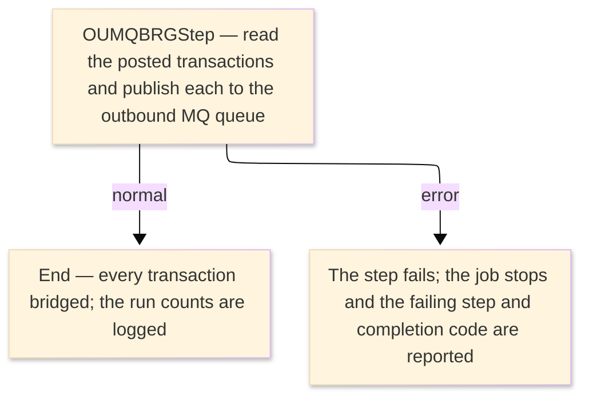

# TO-BE Job Flow — RUNMQBRG

> The TO-BE counterpart of `RUNMQBRG_MQBridgeRun_JobFlow.md`. The step order and the branch
> conditions are preserved; where a step changes form factor it is recorded in §4.

| Item | Value |
|---|---|
| JOBID | Job `OUMQBRGJob` (RUNMQBRG — VSAM-to-MQ transaction bridge run) |
| Process name | VSAM-to-MQ transaction bridge run — unchanged in business terms |
| Platform | Java 17 · Spring Boot 3.x · Spring Batch |
| How it is run | `AppLauncher --spring.batch.job.name=OUMQBRGJob` (module `orion-batch/programs/oumqbrg`) |
| Schedule | not determined (ask the team) — historically submitted manually or by the operations schedule |
| Log ／ monitoring | logback + the Spring Batch metadata (`BATCH_JOB_EXECUTION`); the job and step monitors log the start, the final status and the completion code |
| Author | modernizeX |

> **Form-factor change (business impact):** in AS-IS this job ran the MQ batch program `OUMQBRG` under
> z/OS MQ batch (native MQI `CALL`s). In TO-BE it is a **real Spring Batch tasklet job** — Job
> `OUMQBRGJob`, Step `OUMQBRGStep` (module `orion-batch/programs/oumqbrg`) — that runs the same bridge
> logic: it reads the posted transactions in key order and publishes each one to the outbound MQ queue
> for downstream consumers. The business behaviour is unchanged; the MQI call interface became a
> JMS-backed MQ service, the transaction store is now the relational table `tranfile`, and the job is
> launched by the Spring Batch launcher. See §4.

### Job flow diagram

## 1. Step table — 1-to-1 mapping

One bold row per step, one sub-row per I/O.

| Step | Program | I/O | File ／ table | Notes |
|---|---|---|---|---|
| **◆ Overview** |  | ・Overall: | posted transactions (`tranfile`) → outbound MQ queue |  |
| **◆ P0 Main processing** |  |  |  |  |
| **OUMQBRGStep** | OUMQBRG |  |  | Spring Batch tasklet running the bridge (Job `OUMQBRGJob`); was step BRIDGE, PGM=OUMQBRG — see §4 |
|  |  | IN | table `tranfile` | keyed by `tr_id`; the posted-transaction store (was VSAM `ORION.TRANFILE`), read in key order |
|  |  | OUT | outbound MQ queue `ORION.TRAN.OUTBOUND.QUEUE` | each transaction is wrapped and published for downstream consumers (JMS-backed) |
|  |  | OUT | run counts / completion code | the step and job monitors log the put/error counts and the completion code |

## 2. Branch conditions & dependencies

| Condition | Flow |
|---|---|
| the posted transactions must exist before the bridge runs | the transaction store (`tranfile`) is populated by posting before the bridge publishes it |
| the step ends normally (the bridge completes and every transaction is published) | the job completes and the run counts are logged |
| the step fails (a non-zero MQ completion/reason code or an exception) | the job stops and the failing step and completion code are reported |

## 3. Termination & abnormal handling

| Item | Value |
|---|---|
| Normal termination | the job completes; every posted transaction has been published and the run counts are logged (completion code 0) |
| Business error | a failed step marks the job FAILED; the completion code (12 on exception, 255 on abort) and the failing step are logged |
| Rerun | re-launch the job; the run-id incrementer makes each launch a fresh run, so a re-launch is not refused as a restart |
| Cleanup | none — the job re-reads the transaction store on each run; no temporary datasets remain |

## 4. Programs in the job

| # | Program | Module | Detailed document |
|---|---|---|---|
| 1 | OUMQBRG | `orion-batch/programs/oumqbrg` — real Spring Batch tasklet job `OUMQBRGJob` / step `OUMQBRGStep`; reads `tranfile` and publishes each transaction to the outbound MQ queue | OUMQBRG program design (TO-BE) |
