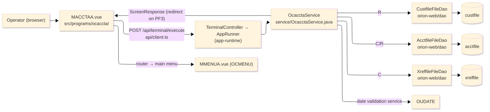
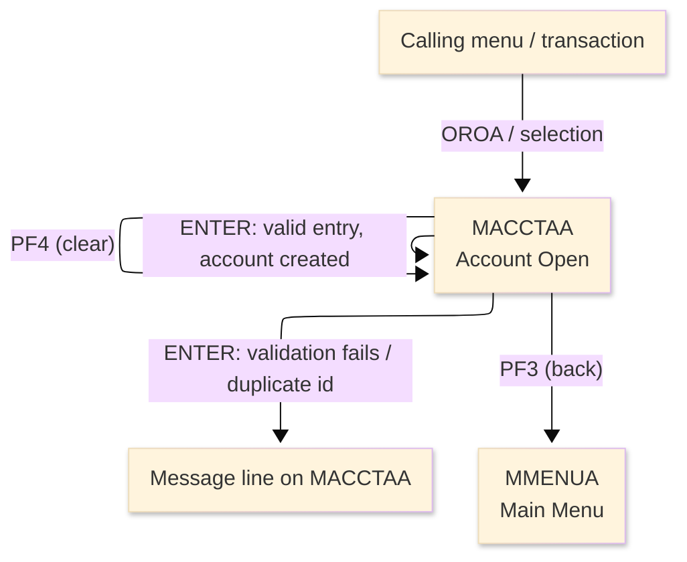
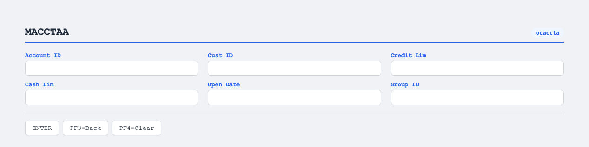

# TO-BE Screen Design — OCACCTA_AccountOpen

> **Rule 1: TO-BE = AS-IS in business terms.** The interface moves to a web SPA, but the
> input/output data, the check conditions, the business flow and the database results are
> preserved. The section order follows the AS-IS document so the two compare 1-to-1.

## 0. Cover

| Item | Content |
|---|---|
| System | ORION-CCMS (ORION Credit Card Management System) |
| Subsystem | On-line (was CICS/BMS; now Vue SPA + REST) |
| Function name | Account Open |
| Function ID | OCACCTA（COBOL program）／Trans-ID `OROA`／Map `MACCTAA` |
| Module | `ocaccta` |
| Platform | Java 17 · Spring Boot 3.x · Vue 3 + TypeScript · DB Oracle (H2 in dev) |
| Version ／ Author ／ Date | 1 ／ modernizeX ／ 2026-09-28 |

## 1. Function overview

### 1.1 Overview diagram

System architecture — the screen, the request path to the server, the program service it runs,
the data stores it touches, and where it hands control.

### 1.2 Function overview

| # | Function | Implementation |
|---|---|---|
| 1 | Accept the details for a new account | The operator keys the account id, customer id, credit and cash limits, open date and disclosure group |
| 2 | Validate the entered values against the business rules | Numbers, amounts and the open date are checked, and the customer must already exist while the account id must be unused |
| 3 | Create the new account on a valid entry | A new row is written to `acctfile` and a matching card cross-reference row is written to `xreffile` |
| 4 | Return to the calling menu when finished | The back action ends the entry and returns the operator to the main menu |

**Roles ／ authorisation**: authenticated operator (signed on through the Sign On screen). Sign-on
state travels in the conversation carried between requests; no framework role gate is wired yet.

**Keys → operations** (the SPA renders each former PF key as a button):

| Key | Label as rendered (verbatim) | What it does |
|---|---|---|
| `ENTER` | `ENTER=PROCESS` | validate the entry and, when everything passes, create the account |
| `PF3` | `PF3=BACK` | return to the main menu |
| `PF4` | `PF4=CLEAR` | clear the entered values so the operator can start again |

> The middle column is the string the button really shows, copied from the program's button
> definitions. The physical PF keystrokes are not reproduced as keyboard shortcuts, so operators
> used to typing PF3 now click the `PF3=BACK` button — same action, one extra pointer move.

### 1.3 Databases used

| № | Business name | Table | C | R | U | D |
|---|---|---|---|---|---|---|
| 1 | Customer master — read to confirm the customer exists | `custfile` | - | 〇 | - | - |
| 2 | Account master — read to check the id is unused, then written | `acctfile` | 〇 | 〇 | - | - |
| 3 | Card cross-reference — written to link the new account | `xreffile` | 〇 | - | - | - |

## 2. Screen spec

Screen transition of the whole function — every screen a box, every edge labelled with what moves
the operator.

### 2.1 MACCTAA — Account Open

**Layout**

**Archetype applied**: data-entry form with a create action (`_archetypes/screenModel`). The header
carries the transaction/program/date/time meta strip; the body has six entry boxes for the new
account; a message line and a button row close the screen.

| Area | Notes |
|---|---|
| Header (Tran/Prog/Date/Time) | meta strip above the title, filled by the server |
| Input area | six entry boxes — account id, customer id, credit limit, cash limit, open date, group id |
| Message line | inline alert below the form (was row 23 `ERRMSG`) |
| Button row | `ENTER=PROCESS`, `PF3=BACK`, `PF4=CLEAR` |

**Screen items**

_State legend: ○ shown · 必 must be entered · □ read-only · － not shown._

| № | Item name | Field | Type ／ length | Control | Required | Initial | Key prompt | Record shown | Notes |
|---|---|---|---|---|---|---|---|---|---|
| 1 | Account ID | `ACCTID` | numeric text, 11 | entry box, 11 chars | 必 | ○ | 必 | － | must be numeric; up to 11 digits |
| 2 | Customer ID | `CUSTID` | numeric text, 9 | entry box, 9 chars | 必 | ○ | － | － | must be numeric and already exist |
| 3 | Credit limit | `ACCRLIM` | amount text, 13 | entry box, 13 chars | 必 | ○ | － | － | valid amount up to two decimals |
| 4 | Cash limit | `ACCSLIM` | amount text, 13 | entry box, 13 chars | 必 | ○ | － | － | valid amount; cannot exceed credit limit |
| 5 | Open date | `ACOPEN` | date text, 10 | entry box, 10 chars | ○ | ○ | － | － | YYYY-MM-DD; blank defaults to today |
| 6 | Group ID | `ACGRP` | text, 10 | entry box, 10 chars | 必 | ○ | － | － | disclosure group; required |

> **Length and format unchanged**: each entry box keeps the same width as the terminal field (11 / 9
> / 13 / 13 / 10 / 10 characters) and the server validates against the same rules.

## 3. Check specifications

### 3.1 MACCTAA — Account Open

All strings below are the literal messages the server returns to the on-screen message line.
Type: E=Error / I=Information.

| No. | What is checked | When it is checked | Message code | Message shown | If it fails |
|---|---|---|---|---|---|
| 1 | Opening prompt (informational) | when the screen first appears | — | Enter new account details and press ENTER. | not a failure; guides the operator |
| 2 | The account id must be numeric | on `ENTER`, before the record is written | — | Account id must be numeric. | the entry stays; nothing is written |
| 3 | The customer id must be numeric | on `ENTER`, before the record is written | — | Customer id must be numeric. | the entry stays; nothing is written |
| 4 | The credit limit must be a valid amount | on `ENTER`, before the record is written | — | Credit limit is not a valid amount. | the entry stays; nothing is written |
| 5 | The cash limit must be a valid amount | on `ENTER`, before the record is written | — | Cash limit is not a valid amount. | the entry stays; nothing is written |
| 6 | The cash limit must not exceed the credit limit | on `ENTER`, after both amounts parse | — | Cash limit cannot exceed credit limit. | the entry stays; nothing is written |
| 7 | The open date must be a real date | on `ENTER`, when a date was typed | — | Open date invalid, use YYYY-MM-DD. | the entry stays; nothing is written |
| 8 | The disclosure group id must be entered | on `ENTER`, before the record is written | — | Disclosure group id is required. | the entry stays; nothing is written |
| 9 | The customer must already exist | on `ENTER`, after the customer is read | — | Customer does not exist. | the entry stays; nothing is written |
| 10 | The account id must be unused | on `ENTER`, after the account is read | — | Account id already exists. | the entry stays; nothing is written |
| 11 | The account write must succeed | on `ENTER`, while writing the account | — | Error writing the account file. | the entry stays; the account is not created |
| 12 | The cross-reference write must succeed | on `ENTER`, after the account is written | — | Account written; cross-ref write failed. | the account exists but the link failed |
| 13 | Account created (confirmation) | on `ENTER`, once everything succeeds | — | Account opened successfully. | not a failure; confirms the create |
| 14 | Only a supported key may be used | on any key press | — | Invalid key pressed. Please try again. | the screen is redisplayed unchanged |

## 4. Event specifications

### 4.1 MACCTAA — Account Open

| No. | Event | What the system does | Result ／ next screen |
|---|---|---|---|
| 1 | The operator fills the boxes and presses `ENTER` | the entries are validated and, when all rules pass, a new account and its card cross-reference are created | stays on Account Open with a success message, or a message when a rule fails |
| 2 | The operator presses `PF3` | the entry ends and control returns to the calling menu | the main menu appears |
| 3 | The operator presses `PF4` | the entered values are cleared and the opening prompt returns | stays on Account Open, ready for a new entry |
| 4 | The operator presses an unsupported key | the request is rejected and a message is shown | stays on Account Open, unchanged |

## 5. DB CRUD

**Update spec**

On a valid entry the account row is created in `acctfile` and a matching card cross-reference row is
created in `xreffile`; the customer row in `custfile` is only read to confirm the customer exists.

**Column-level CRUD (per event ／ business type)**

| Table | Operation | Field | Value source | Transaction |
|---|---|---|---|---|
| `custfile` | SELECT (read by key) | whole record | the customer id the operator entered | read-only; existence check |
| `acctfile` | SELECT (read by key) | whole record | the account id the operator entered | uniqueness check before create |
| `acctfile` | INSERT (create) | id, active status, balances, limits, open date, group id | screen input plus defaults set by the service | commit on `ENTER` |
| `xreffile` | INSERT (create) | card number, account id, customer id | derived from the new account and the entered customer | commit on `ENTER` |

## 6. API contract

| Request | Response | What it does | Errors |
|---|---|---|---|
| `POST /api/terminal/execute` — `{ programName: "OCACCTA", aidKey, fields: { ACCTID, CUSTID, ACCRLIM, ACCSLIM, ACOPEN, ACGRP } }` | `ScreenResponse` — `{ fields, message, buttons }` | validates the entry and, when valid, creates the account and its cross-reference, returning a confirmation or an error message | non-numeric id → "Account id must be numeric."; missing customer → "Customer does not exist."; duplicate id → "Account id already exists."; write failure → "Error writing the account file." |

FE types: `src/programs/ocaccta/schemas.d.ts` (`MACCTAAFields`) · client: `src/api/client.ts` ·
endpoint: `TerminalController` (`/api/terminal/execute`), one round-trip per key press (CICS
pseudo-conversation preserved through the HTTP session).
