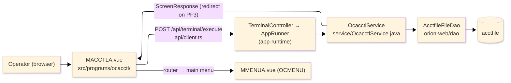
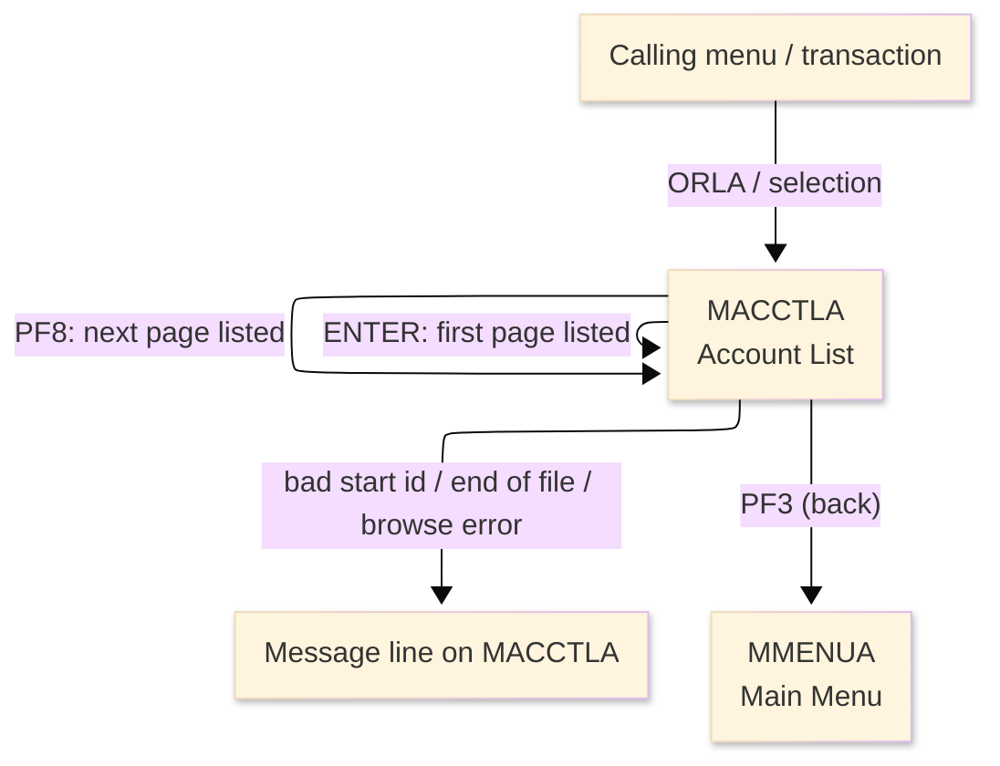
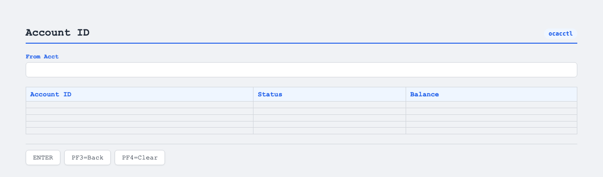

# TO-BE Screen Design — OCACCTL_AccountList

> **Rule 1: TO-BE = AS-IS in business terms.** The interface moves to a web SPA, but the
> input/output data, the check conditions, the business flow and the database results are
> preserved. The section order follows the AS-IS document so the two compare 1-to-1.

## 0. Cover

| Item | Content |
|---|---|
| System | ORION-CCMS (ORION Credit Card Management System) |
| Subsystem | On-line (was CICS/BMS; now Vue SPA + REST) |
| Function name | Account List |
| Function ID | OCACCTL（COBOL program）／Trans-ID `ORLA`／Map `MACCTLA` |
| Module | `ocacctl` |
| Platform | Java 17 · Spring Boot 3.x · Vue 3 + TypeScript · DB Oracle (H2 in dev) |
| Version ／ Author ／ Date | 1 ／ modernizeX ／ 2026-09-28 |

## 1. Function overview

### 1.1 Overview diagram

System architecture — the screen, the request path to the server, the program service it runs,
and the data store it reads.

### 1.2 Function overview

| # | Function | Implementation |
|---|---|---|
| 1 | List account records a page at a time | Up to five accounts are read in ascending id order from `acctfile`, starting at the id the operator enters |
| 2 | Let the operator page forward through the result set | The forward action continues the browse from where the previous page ended |
| 3 | Show a running count of what was listed | A summary line reports how many accounts the current page displayed |
| 4 | Return to the calling menu when finished | The back action ends the list and returns the operator to the main menu |

**Roles ／ authorisation**: authenticated operator (signed on through the Sign On screen). Sign-on
state travels in the conversation carried between requests; no framework role gate is wired yet.

**Keys → operations** (the SPA renders each former PF key as a button):

| Key | Label as rendered (verbatim) | What it does |
|---|---|---|
| `ENTER` | `ENTER=PROCESS` | list the first page of accounts from the keyed start id |
| `PF3` | `PF3=BACK` | return to the main menu |
| `PF4` | `PF4=CLEAR` | clear the entry and return to the opening prompt |
| `PF8` | `PF8` | page forward to the next page of accounts |

> The middle column is the string the button really shows, copied from the program's button
> definitions. The physical PF keystrokes are not reproduced as keyboard shortcuts, so operators
> used to typing PF8 now click the `PF8` button — same action, one extra pointer move.

### 1.3 Databases used

| № | Business name | Table | C | R | U | D |
|---|---|---|---|---|---|---|
| 1 | Account master — browsed in id order to fill the page | `acctfile` | - | 〇 | - | - |

## 2. Screen spec

Screen transition of the whole function — every screen a box, every edge labelled with what moves
the operator.

### 2.1 MACCTLA — Account List

**Layout**

**Archetype applied**: paged browse list with a single start-key entry (`_archetypes/screenModel`).
The header carries the transaction/program/date/time meta strip; the body has one start-id box and a
five-row grid of account id, status and balance; a message line and a button row close the screen.

| Area | Notes |
|---|---|
| Header (Tran/Prog/Date/Time) | meta strip above the title, filled by the server |
| Input area | one entry box — the start account id (blank means from the beginning) |
| List area | five rows of account id, status and balance, filled top-down each page |
| Message line | inline alert / summary count below the grid (was row 23 `ERRMSG`) |
| Button row | `ENTER=PROCESS`, `PF3=BACK`, `PF4=CLEAR`, `PF8` |

**Screen items**

_State legend: ○ shown · 必 must be entered · □ read-only · － not shown._

| № | Item name | Field | Type ／ length | Control | Required | Initial | Key prompt | Record shown | Notes |
|---|---|---|---|---|---|---|---|---|---|
| 1 | Start account id | `FRACCT` | numeric text, 11 | entry box, 11 chars | ○ | ○ | 必 | － | blank lists from the first account |
| 2 | Account ID (rows 1–5) | `ACL1`…`ACL5` | numeric text, 11 | read-only | - | － | □ | □ | one id per grid row |
| 3 | Status (rows 1–5) | `ACS1`…`ACS5` | text, 1 | read-only | - | － | □ | □ | active status code |
| 4 | Balance (rows 1–5) | `ACB1`…`ACB5` | amount text, 15 | read-only | - | － | □ | □ | edited current balance |

> **Length and format unchanged**: the start box accepts 11 characters and each grid column keeps the
> same width as the terminal screen (11 / 1 / 15 characters); a page still shows at most five rows.

## 3. Check specifications

### 3.1 MACCTLA — Account List

All strings below are the literal messages the server returns to the on-screen message line.
Type: E=Error / I=Information.

| No. | What is checked | When it is checked | Message code | Message shown | If it fails |
|---|---|---|---|---|---|
| 1 | Opening prompt (informational) | when the screen first appears | — | Enter start account id (or blank) and ENTER. | not a failure; guides the operator |
| 2 | The start account id must be numeric | on `ENTER`, when a start id was typed | — | Start account id must be numeric. | the entry stays; no page is listed |
| 3 | The account store must be browsable | on `ENTER` / `PF8`, while browsing | — | Error browsing the account file. | the grid is cleared; no rows are shown |
| 4 | Some account must exist from that point | on `ENTER`, when the page is empty | — | No accounts found from that point. | the grid stays empty |
| 5 | There must be more rows to page to | on `PF8`, when the next page is empty | — | End of file - no more accounts. | the grid stays on the last page |
| 6 | Page summary (informational) | after a page is listed | — | _n_ account(s) displayed. | not a failure; reports the row count |
| 7 | Only a supported key may be used | on any key press | — | Invalid key pressed. Please try again. | the screen is redisplayed unchanged |

## 4. Event specifications

### 4.1 MACCTLA — Account List

| No. | Event | What the system does | Result ／ next screen |
|---|---|---|---|
| 1 | The operator keys a start id (or leaves it blank) and presses `ENTER` | the first page of accounts is read in id order and the summary count is shown | stays on Account List with the page filled, or a message when the id is bad or nothing is found |
| 2 | The operator presses `PF8` | the next page of accounts is read, continuing from where the last page ended | stays on Account List with the next page, or an end-of-file message |
| 3 | The operator presses `PF3` | the list ends and control returns to the calling menu | the main menu appears |
| 4 | The operator presses `PF4` | the entry is cleared and the opening prompt returns | stays on Account List, ready for a new start id |
| 5 | The operator presses an unsupported key | the request is rejected and a message is shown | stays on Account List, unchanged |

## 5. DB CRUD

**Update spec**

Not applicable — Account List only reads; no row is created, updated or deleted.

**Column-level CRUD (per event ／ business type)**

| Table | Operation | Field | Value source | Transaction |
|---|---|---|---|---|
| `acctfile` | Browse (start / read next by key) | id, active status, current balance | the start account id, then the next key each page | read-only; no commit |

## 6. API contract

| Request | Response | What it does | Errors |
|---|---|---|---|
| `POST /api/terminal/execute` — `{ programName: "OCACCTL", aidKey, fields: { FRACCT } }` | `ScreenResponse` — `{ fields: { ACL1..ACL5, ACS1..ACS5, ACB1..ACB5 }, message, buttons }` | browses accounts from the start id and returns up to five rows plus a summary count | non-numeric start → "Start account id must be numeric."; empty page → "No accounts found from that point."; past the end → "End of file - no more accounts." |

FE types: `src/programs/ocacctl/schemas.d.ts` (`MACCTLAFields`) · client: `src/api/client.ts` ·
endpoint: `TerminalController` (`/api/terminal/execute`), one round-trip per key press (CICS
pseudo-conversation preserved through the HTTP session; the next-page start key travels in the
conversation between requests).
