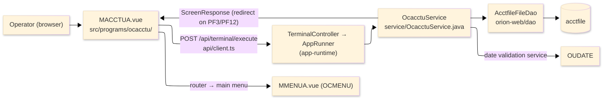
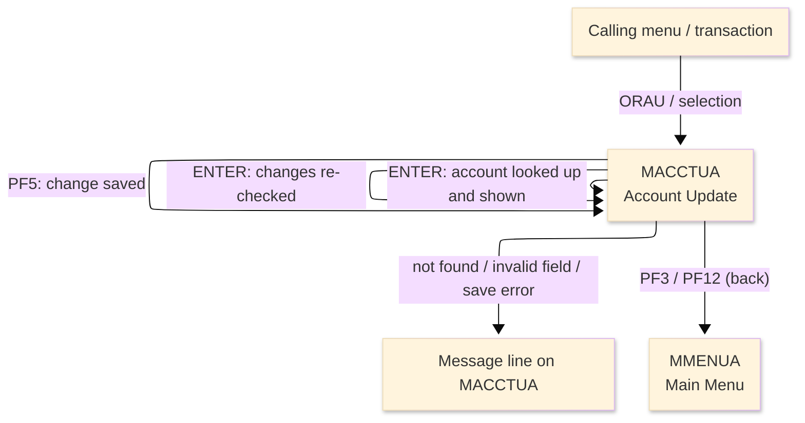
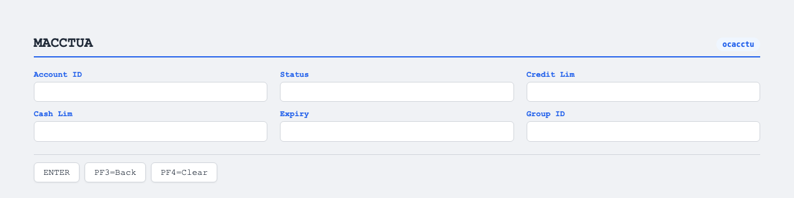

# TO-BE Screen Design — OCACCTU_AccountUpdate

> **Rule 1: TO-BE = AS-IS in business terms.** The interface moves to a web SPA, but the
> input/output data, the check conditions, the business flow and the database results are
> preserved. The section order follows the AS-IS document so the two compare 1-to-1.

## 0. Cover

| Item | Content |
|---|---|
| System | ORION-CCMS (ORION Credit Card Management System) |
| Subsystem | On-line (was CICS/BMS; now Vue SPA + REST) |
| Function name | Account Update |
| Function ID | OCACCTU（COBOL program）／Trans-ID `ORAU`／Map `MACCTUA` |
| Module | `ocacctu` |
| Platform | Java 17 · Spring Boot 3.x · Vue 3 + TypeScript · DB Oracle (H2 in dev) |
| Version ／ Author ／ Date | 1 ／ modernizeX ／ 2026-09-28 |

## 1. Function overview

### 1.1 Overview diagram

System architecture — the screen, the request path to the server, the program service it runs,
the data store it maintains, and where it hands control.

### 1.2 Function overview

| # | Function | Implementation |
|---|---|---|
| 1 | Look up an account by its key and show the current values | The account is read by id from `acctfile` and its status, limits, expiry and group are shown for editing |
| 2 | Let the operator change the editable fields and check them | Status, credit and cash limits, expiry date and group are validated against the business rules |
| 3 | Save the confirmed changes back to the account | The record is re-read for update and rewritten to `acctfile` when the operator confirms |
| 4 | Return to the calling menu when finished | The back action ends the update and returns the operator to the main menu |

**Roles ／ authorisation**: authenticated operator (signed on through the Sign On screen). Sign-on
state travels in the conversation carried between requests; no framework role gate is wired yet.

**Keys → operations** (the SPA renders each former PF key as a button):

| Key | Label as rendered (verbatim) | What it does |
|---|---|---|
| `ENTER` | `ENTER=PROCESS` | look up the keyed account, then re-check the changed fields |
| `PF3` | `PF3=BACK` | return to the main menu |
| `PF4` | `PF4=CLEAR` | clear the entry and return to the opening prompt |
| `PF12` | `PF12` | cancel the update and return to the main menu |
| `CLEAR` | `Clear` | clear the screen and redisplay the opening prompt |
| `PF5` | `PF5` | confirm and save the change to the account |

> The middle column is the string the button really shows, copied from the program's button
> definitions. The physical PF keystrokes are not reproduced as keyboard shortcuts, so operators
> used to typing PF5 now click the `PF5` button — same action, one extra pointer move.

### 1.3 Databases used

| № | Business name | Table | C | R | U | D |
|---|---|---|---|---|---|---|
| 1 | Account master — read to show, then rewritten on save | `acctfile` | - | 〇 | 〇 | - |

## 2. Screen spec

Screen transition of the whole function — every screen a box, every edge labelled with what moves
the operator.

### 2.1 MACCTUA — Account Update

**Layout**

**Archetype applied**: lookup-then-edit form with a save action (`_archetypes/screenModel`). The
header carries the transaction/program/date/time meta strip; the body has the account-id key box and
five editable fields; a message line and a button row close the screen.

| Area | Notes |
|---|---|
| Header (Tran/Prog/Date/Time) | meta strip above the title, filled by the server |
| Input area | key box (account id) plus editable status, credit limit, cash limit, expiry, group id |
| Message line | inline alert / prompt below the form (was row 23 `ERRMSG`) |
| Button row | `ENTER=PROCESS`, `PF3=BACK`, `PF4=CLEAR`, `PF12`, `Clear`, `PF5` |

**Screen items**

_State legend: ○ shown · 必 must be entered · □ read-only · － not shown._

| № | Item name | Field | Type ／ length | Control | Required | Initial | Key prompt | Record shown | Notes |
|---|---|---|---|---|---|---|---|---|---|
| 1 | Account ID | `ACCTID` | numeric text, 11 | entry box, 11 chars | 必 | ○ | 必 | □ | lookup key; must be numeric |
| 2 | Status | `ACSTAT` | text, 1 | entry box, 1 char | 必 | ○ | － | □ | must be Y or N |
| 3 | Credit limit | `ACCRLIM` | amount text, 13 | entry box, 13 chars | 必 | ○ | － | □ | valid amount; must cover the balance |
| 4 | Cash limit | `ACCSLIM` | amount text, 13 | entry box, 13 chars | 必 | ○ | － | □ | valid amount; cannot exceed credit limit |
| 5 | Expiry | `ACEXP` | date text, 10 | entry box, 10 chars | 必 | ○ | － | □ | YYYY-MM-DD |
| 6 | Group ID | `ACGRP` | text, 10 | entry box, 10 chars | 必 | ○ | － | □ | disclosure group; required |

> **Length and format unchanged**: each entry box keeps the same width as the terminal field (11 / 1
> / 13 / 13 / 10 / 10 characters); the account id is the key and is not changed by the update.

## 3. Check specifications

### 3.1 MACCTUA — Account Update

All strings below are the literal messages the server returns to the on-screen message line.
Type: E=Error / I=Information / C=Confirm.

| No. | What is checked | When it is checked | Message code | Message shown | If it fails |
|---|---|---|---|---|---|
| 1 | Opening prompt (informational) | when the screen first appears | — | Enter account id and press ENTER. | not a failure; guides the operator |
| 2 | The account id must be entered | on `ENTER`, before the lookup | — | Please enter all required fields. | the entry stays; nothing is read |
| 3 | The account id must be numeric | on `ENTER`, before the lookup | — | Account id must be numeric. | the entry stays; nothing is read |
| 4 | The keyed account must exist | on `ENTER`, after the lookup | — | Record not found. | the entry stays; no fields are loaded |
| 5 | Account loaded (informational) | on `ENTER`, after a successful lookup | — | Account found. Change fields, PF5 to save. | not a failure; the fields become editable |
| 6 | Active status must be Y or N | on `ENTER` / `PF5`, while validating | — | Active status must be Y or N. | the entry stays; nothing is saved |
| 7 | The credit limit must be a valid amount | on `ENTER` / `PF5`, while validating | — | Credit limit is not a valid amount. | the entry stays; nothing is saved |
| 8 | The cash limit must be a valid amount | on `ENTER` / `PF5`, while validating | — | Cash limit is not a valid amount. | the entry stays; nothing is saved |
| 9 | The cash limit must not exceed the credit limit | on `ENTER` / `PF5`, after both amounts parse | — | Cash limit cannot exceed credit limit. | the entry stays; nothing is saved |
| 10 | The expiry date must be a real date | on `ENTER` / `PF5`, while validating | — | Expiry date invalid, use YYYY-MM-DD. | the entry stays; nothing is saved |
| 11 | The group id must be entered | on `ENTER` / `PF5`, while validating | — | Group id is required. | the entry stays; nothing is saved |
| 12 | Changes valid (confirm prompt) | on `ENTER`, once every field passes | — | Changes are valid.  Press PF5 to confirm save. | not a failure; asks for confirmation |
| 13 | An account must be looked up before saving | on `PF5`, before the save | — | Enter an account id and press ENTER first. | the entry stays; nothing is saved |
| 14 | The account must still exist at save | on `PF5`, when re-reading for update | — | Account no longer exists. Update aborted. | nothing is saved |
| 15 | The credit limit must cover the balance | on `PF5`, before the rewrite | — | Credit limit below current balance. Not saved. | nothing is saved |
| 16 | The save must succeed | on `PF5`, during the rewrite | — | Update failed during REWRITE. | nothing is saved |
| 17 | Account updated (confirmation) | on `PF5`, once the rewrite succeeds | — | Account updated successfully. | not a failure; confirms the save |
| 18 | Only a supported key may be used | on any key press | — | Invalid key pressed. Please try again. | the screen is redisplayed unchanged |

## 4. Event specifications

### 4.1 MACCTUA — Account Update

| No. | Event | What the system does | Result ／ next screen |
|---|---|---|---|
| 1 | The operator keys an account id and presses `ENTER` | the account is read and its current values are shown for editing | stays on Account Update with the fields loaded, or a message when the id is bad or not found |
| 2 | The operator changes fields and presses `ENTER` again | the changed fields are re-checked and, when all pass, the operator is asked to confirm | stays on Account Update with the confirm prompt, or a message when a rule fails |
| 3 | The operator presses `PF5` | the account is re-read for update and the confirmed changes are written back | stays on Account Update with a success or error message |
| 4 | The operator presses `PF3` or `PF12` | the update ends and control returns to the calling menu | the main menu appears |
| 5 | The operator presses `PF4` or `Clear` | the entry is cleared and the opening prompt returns | stays on Account Update, ready for a new id |
| 6 | The operator presses an unsupported key | the request is rejected and a message is shown | stays on Account Update, unchanged |

## 5. DB CRUD

**Update spec**

On confirmation the account row is re-read for update and rewritten in place; the active status,
credit and cash limits, expiry date and group id carry the operator's new values while the account
id (key) and current balance are unchanged.

**Column-level CRUD (per event ／ business type)**

| Table | Operation | Field | Value source | Transaction |
|---|---|---|---|---|
| `acctfile` | SELECT (read by key) | whole record | the account id the operator entered | display of current values |
| `acctfile` | UPDATE (rewrite by key) | active status, credit limit, cash limit, expiry date, group id | the validated screen input | commit on `PF5` |

## 6. API contract

| Request | Response | What it does | Errors |
|---|---|---|---|
| `POST /api/terminal/execute` — `{ programName: "OCACCTU", aidKey, fields: { ACCTID, ACSTAT, ACCRLIM, ACCSLIM, ACEXP, ACGRP } }` | `ScreenResponse` — `{ fields: { ACSTAT, ACCRLIM, ACCSLIM, ACEXP, ACGRP }, message, buttons }` | looks up the account and shows it, validates changes, and rewrites the record on confirmation | not found → "Record not found."; bad status → "Active status must be Y or N."; limit below balance → "Credit limit below current balance. Not saved." |

FE types: `src/programs/ocacctu/schemas.d.ts` (`MACCTUAFields`) · client: `src/api/client.ts` ·
endpoint: `TerminalController` (`/api/terminal/execute`), one round-trip per key press (CICS
pseudo-conversation preserved through the HTTP session; the lookup/edit state travels in the
conversation between requests).
