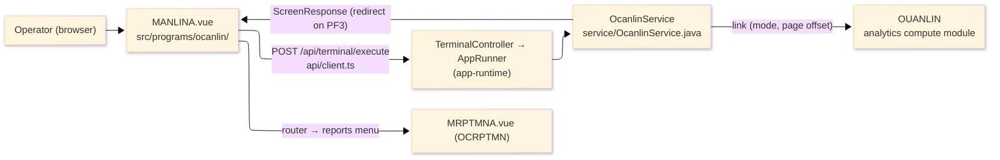
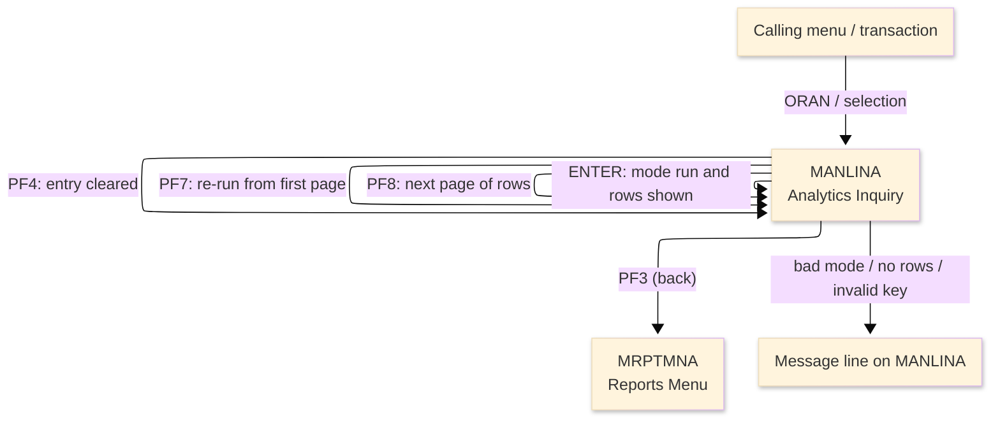
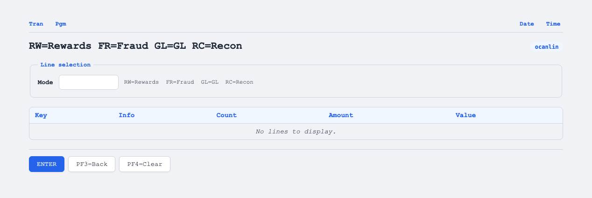

# TO-BE Screen Design — OCANLIN_AnalyticsInquiry

> **Rule 1: TO-BE = AS-IS in business terms.** The interface moves to a web SPA, but the
> input/output data, the check conditions, the business flow and the database results are
> preserved. The section order follows the AS-IS document so the two compare 1-to-1.

## 0. Cover

| Item | Content |
|---|---|
| System | ORION-CCMS (ORION Credit Card Management System) |
| Subsystem | On-line (was CICS/BMS; now Vue SPA + REST) |
| Function name | Analytics Inquiry |
| Function ID | OCANLIN（COBOL program）／Trans-ID `ORAN`／Map `MANLINA` |
| Module | `ocanlin` |
| Platform | Java 17 · Spring Boot 3.x · Vue 3 + TypeScript · DB Oracle (H2 in dev) |
| Version ／ Author ／ Date | 1 ／ modernizeX ／ 2026-09-28 |

## 1. Function overview

### 1.1 Overview diagram

System architecture — the screen, the request path to the server, the program service it runs,
and the analytics compute module it calls to build the figures.

### 1.2 Function overview

| # | Function | Implementation |
|---|---|---|
| 1 | Choose an analytics mode | The operator types one of the four modes — rewards, fraud, general ledger or reconciliation — and the choice drives the whole inquiry |
| 2 | Compute and show the analytics for that mode | The figures are built by the linked analytics compute module and returned as a page of rows with two mode-specific totals lines |
| 3 | Page through more rows | The operator can move to the next page, or re-run the current mode from the first page, without re-typing anything |
| 4 | Return to the reports menu when finished | The back action ends the inquiry and returns the operator to the reports menu |

**Roles ／ authorisation**: authenticated operator (signed on through the Sign On screen). Sign-on
state travels in the conversation carried between requests; no framework role gate is wired yet.

**Keys → operations** (the SPA renders each former PF key as a button):

| Key | Label as rendered (verbatim) | What it does |
|---|---|---|
| `ENTER` | `ENTER=PROCESS` | run the analytics for the entered mode and show the first page |
| `PF3` | `PF3=BACK` | return to the reports menu |
| `PF4` | `PF4=CLEAR` | clear the entry so the operator can start again |
| `PF7` | `PF7` | re-run the current mode from the first page |
| `PF8` | `PF8` | page forward to the next page of rows |

> The middle column is the string the button really shows, copied from the program's button
> definitions. The physical PF keystrokes are not reproduced as keyboard shortcuts, so operators
> used to typing PF3 now click the `PF3=BACK` button — same action, one extra pointer move.

### 1.3 Databases used

| № | Business name | Table | C | R | U | D |
|---|---|---|---|---|---|---|
| 1 | Analytics figures — computed by the linked module, not read from a table here | — | - | - | - | - |

## 2. Screen spec

Screen transition of the whole function — every screen a box, every edge labelled with what moves
the operator.

### 2.1 MANLINA — Analytics Inquiry

**Layout**

**Archetype applied**: display form with a single mode key over a fixed six-row result grid
(`_archetypes/screenModel`). The header carries the transaction/program/date/time meta strip; the
body has one entry box, a heading line, a six-row grid and two totals lines; a message line and a
button row close the screen.

| Area | Notes |
|---|---|
| Header (Tran/Prog/Date/Time) | meta strip above the title, filled by the server |
| Input area | one entry box — the mode key, with the legend `RW=Rewards FR=Fraud GL=GL RC=Recon` |
| Results grid | a heading line and up to six read-only rows of Key / Info / Count / Amount / Value |
| Totals area | two read-only totals lines, worded for the chosen mode |
| Message line | inline alert below the form (was row 23 `ERRMSG`) |
| Button row | `ENTER=PROCESS`, `PF3=BACK`, `PF4=CLEAR`, `PF7`, `PF8` |

**Screen items**

_State legend: ○ shown · 必 must be entered · □ read-only · － not shown._

| № | Item name | Field | Type ／ length | Control | Required | Initial | Key prompt | Record shown | Notes |
|---|---|---|---|---|---|---|---|---|---|
| 1 | Mode | `ANMODE` | text, 7 | entry box, 7 chars | 必 | ○ | 必 | □ | RW / FR / GL / RC (full words Rewards / Fraud / GL / Recon also accepted) |
| 2 | Result heading | `ANHEAD` | text, 60 | read-only | - | － | □ | □ | column legend for the chosen mode |
| 3 | Row key | `ANK1`–`ANK6` | text, 16 | read-only | - | － | □ | □ | up to six result rows; the key of each row |
| 4 | Row info | `ANI1`–`ANI6` | text, 10 | read-only | - | － | □ | □ | secondary info of each row |
| 5 | Row count | `ANC1`–`ANC6` | text, 9 | read-only | - | － | □ | □ | count of each row |
| 6 | Row amount | `ANA1`–`ANA6` | amount, 14 | read-only | - | － | □ | □ | edited amount of each row |
| 7 | Row value | `ANV1`–`ANV6` | text, 14 | read-only | - | － | □ | □ | points or value of each row |
| 8 | Totals line 1 | `ANTOT1` | text, 78 | read-only | - | － | □ | □ | first totals line for the mode |
| 9 | Totals line 2 | `ANTOT2` | text, 78 | read-only | - | － | □ | □ | second totals line for the mode |

> **Length and format unchanged**: the mode entry accepts 7 characters as in the source, and every
> grid column and totals line is shown with the same width as the terminal screen.

## 3. Check specifications

### 3.1 MANLINA — Analytics Inquiry

All strings below are the literal messages the server returns to the on-screen message line.
Type: E=Error / I=Information.

| No. | What is checked | When it is checked | Message code | Message shown | If it fails |
|---|---|---|---|---|---|
| 1 | Opening prompt (informational) | when the screen first appears | — | Enter mode RW/FR/GL/RC and press ENTER. | not a failure; guides the operator |
| 2 | The mode must be one of the four codes | on `ENTER`, before the compute | — | Mode must be RW, FR, GL or RC. | the entry stays; nothing is computed |
| 3 | The analytics compute must succeed | on `ENTER`, `PF7` or `PF8`, after the request | — | Error computing analytics. | no rows are shown; the entry stays |
| 4 | At least one row must match the mode | on `ENTER`, `PF7` or `PF8`, after the compute | — | No analytics rows for that mode. | no rows are shown |
| 5 | There must be more rows to page to | on `PF8`, when already at the last page | — | End of results - no more rows. | the current page stays as it was |
| 6 | Only a supported key may be used | on any other key press | — | Invalid key pressed. Please try again. | the screen is redisplayed unchanged |

## 4. Event specifications

### 4.1 MANLINA — Analytics Inquiry

| No. | Event | What the system does | Result ／ next screen |
|---|---|---|---|
| 1 | The operator types a mode and presses `ENTER` | the analytics for that mode are computed and the first page of rows with its totals is shown | stays on Analytics Inquiry with the rows and totals, or a message when the mode is invalid or nothing matches |
| 2 | The operator presses `PF8` | the next page of rows for the current mode is shown | stays on Analytics Inquiry with the next page, or a message when there are no more rows |
| 3 | The operator presses `PF7` | the current mode is re-run from the first page | stays on Analytics Inquiry with the first page again, or the opening prompt when no mode has been run yet |
| 4 | The operator presses `PF3` | the inquiry ends and control returns to the reports menu | the reports menu appears |
| 5 | The operator presses `PF4` | the entered mode is cleared and the opening prompt returns | stays on Analytics Inquiry, ready for a new mode |
| 6 | The operator presses an unsupported key | the request is rejected and a message is shown | stays on Analytics Inquiry, unchanged |

## 5. DB CRUD

**Update spec**

Not applicable — Analytics Inquiry only requests figures through the linked compute module; no row is
created, updated or deleted.

**Column-level CRUD (per event ／ business type)**

| Table | Operation | Field | Value source | Transaction |
|---|---|---|---|---|
| — | computed through the linked compute module | the result rows and the two totals lines | the mode the operator entered and the current page offset | read-only; no commit |

## 6. API contract

| Request | Response | What it does | Errors |
|---|---|---|---|
| `POST /api/terminal/execute` — `{ programName: "OCANLIN", aidKey, fields: { ANMODE } }` | `ScreenResponse` — `{ fields: { ANHEAD, ANK1, ANI1, ANC1, ANA1, ANV1, ANTOT1, ANTOT2 }, message, buttons }` | computes the analytics for the entered mode and returns a page of rows plus totals, or a message | bad mode → "Mode must be RW, FR, GL or RC."; no rows → "No analytics rows for that mode."; compute error → "Error computing analytics."; last page → "End of results - no more rows." |

FE types: `src/programs/ocanlin/schemas.d.ts` (`MANLINAFields`) · client: `src/api/client.ts` ·
endpoint: `TerminalController` (`/api/terminal/execute`), one round-trip per key press (CICS
pseudo-conversation preserved through the HTTP session).
