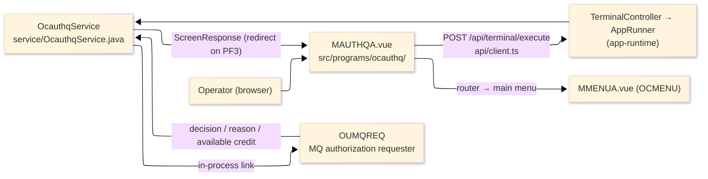
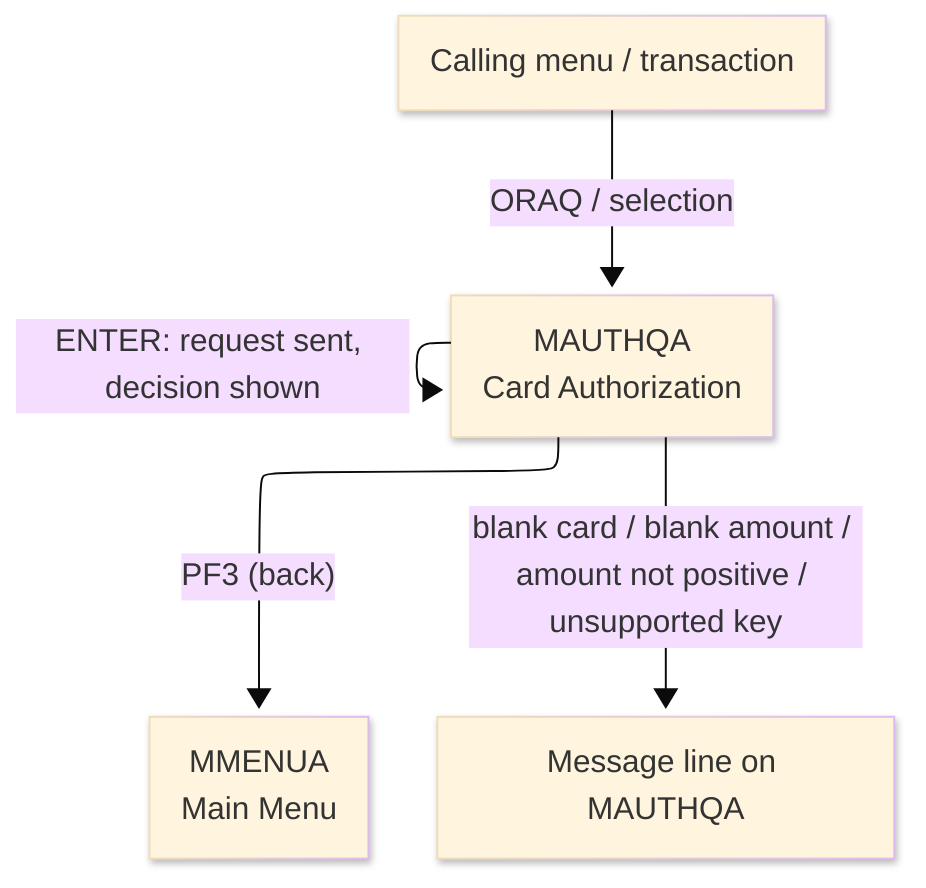
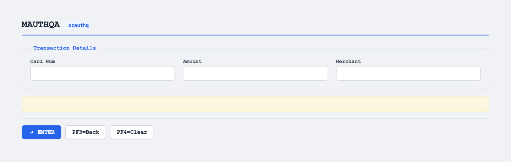

# TO-BE Screen Design — OCAUTHQ_CardAuthorization

> **Rule 1: TO-BE = AS-IS in business terms.** The interface moves to a web SPA, but the
> input/output data, the check conditions, the business flow and the database results are
> preserved. The section order follows the AS-IS document so the two compare 1-to-1.

## 0. Cover

| Item | Content |
|---|---|
| System | ORION-CCMS (ORION Credit Card Management System) |
| Subsystem | On-line (was CICS/BMS; now Vue SPA + REST) |
| Function name | Card Authorization |
| Function ID | OCAUTHQ（COBOL program）／Trans-ID `ORAQ`／Map `MAUTHQA` |
| Module | `ocauthq` |
| Platform | Java 17 · Spring Boot 3.x · Vue 3 + TypeScript · DB Oracle (H2 in dev) |
| Version ／ Author ／ Date | 1 ／ modernizeX ／ 2026-09-28 |

## 1. Function overview

### 1.1 Overview diagram

System architecture — the screen, the request path to the server, the program service it runs,
and the authorization requester it hands the request to.

### 1.2 Function overview

| # | Function | Implementation |
|---|---|---|
| 1 | Accept a card authorization request | The operator enters the card number, the amount and the merchant |
| 2 | Send the request for a decision | Once the entries pass the checks the request is handed to the message-queue authorization requester |
| 3 | Show the decision that comes back | The decision, the reason and the remaining credit are filled in and a completion note appears |

**Roles ／ authorisation**: authenticated operator (signed on through the Sign On screen). Sign-on
state travels in the conversation carried between requests; no framework role gate is wired yet.

**Keys → operations** (the SPA renders each former PF key as a button):

| Key | Label as rendered (verbatim) | What it does |
|---|---|---|
| `ENTER` | `ENTER=PROCESS` | check the request and send it for an authorization decision |
| `PF3` | `PF3=BACK` | return to the main menu |
| `PF4` | `PF4=CLEAR` | clear the entered values so the operator can start again |

> The middle column is the string the button really shows, copied from the program's button
> definitions. The physical PF keystrokes are not reproduced as keyboard shortcuts, so operators
> used to typing PF3 now click the `PF3=BACK` button — same action, one extra pointer move.

### 1.3 Databases used

| № | Business name | Table | C | R | U | D |
|---|---|---|---|---|---|---|
| 1 | Not applicable — the request is forwarded to the authorization requester, which performs any file access | — | - | - | - | - |

## 2. Screen spec

Screen transition of the whole function — every screen a box, every edge labelled with what moves
the operator.

### 2.1 MAUTHQA — Card Authorization

**Layout**

**Archetype applied**: request form with a returned-result block (`_archetypes/screenModel`). The
header carries the transaction/program/date/time meta strip; the body has three entry boxes and a
read-only decision block; a message line and a button row close the screen.

| Area | Notes |
|---|---|
| Header (Tran/Prog/Date/Time) | meta strip above the title, filled by the server |
| Input area | three entry boxes — card number, amount, merchant |
| Decision area | read-only outputs: decision, reason, available credit |
| Message line | inline alert below the form (was row 23 `ERRMSG`) |
| Button row | `ENTER=PROCESS`, `PF3=BACK`, `PF4=CLEAR` |

**Screen items**

_State legend: ○ shown · 必 must be entered · □ read-only · － not shown._

| № | Item name | Field | Type ／ length | Control | Required | Initial | Request entry | Decision shown | Notes |
|---|---|---|---|---|---|---|---|---|---|
| 1 | Card number | `CARDNUM` | text, 16 | entry box, 16 chars | 必 | ○ | ○ | □ | the card to authorize; kept at 16 as in the source |
| 2 | Amount | `AMOUNT` | amount text, 12 | entry box, 12 chars | 必 | ○ | ○ | □ | must be greater than zero; kept at 12 |
| 3 | Merchant | `MERCH` | text, 20 | entry box, 20 chars | - | ○ | ○ | □ | merchant name sent with the request; kept at 20 |
| 4 | Decision | `DECISN` | text, 8 | read-only | - | － | － | □ | authorization outcome returned |
| 5 | Reason | `REASON` | text, 20 | read-only | - | － | － | □ | explanation for the outcome |
| 6 | Available credit | `AVAIL` | amount, 15 | read-only | - | － | － | □ | remaining credit returned |

> **Length and format unchanged**: the entry boxes accept the same widths as the terminal screen and
> the returned decision, reason and available credit are shown with the same widths.

## 3. Check specifications

### 3.1 MAUTHQA — Card Authorization

All strings below are the literal messages the server returns; the decision and reason values are the
literal outcome strings placed in the result fields. Type: E=Error / I=Information.

| No. | What is checked | When it is checked | Message code | Message shown | If it fails |
|---|---|---|---|---|---|
| 1 | Opening prompt (informational) | when the screen first appears | — | Enter card, amount, merchant; press ENTER. | not a failure; guides the operator |
| 2 | The card number must be entered | on `ENTER`, before the request is sent | — | Card number is required. | the entry stays; nothing is sent |
| 3 | The amount must be entered | on `ENTER`, before the request is sent | — | Amount is required. | the entry stays; nothing is sent |
| 4 | The amount must be greater than zero | on `ENTER`, before the request is sent | — | Amount must be greater than zero. | the entry stays; nothing is sent |
| 5 | Confirmation of a completed authorization (informational) | on `ENTER`, after the decision returns | — | Authorization complete. PF3=Back. | not a failure; the decision, reason and available credit are shown |
| 6 | The authorization requester must be reachable | on `ENTER`, when the request is sent | — | decision `ERROR`, reason `LINK OUMQREQ FAILED` | the result block shows the failure; no decision is available |
| 7 | Only a supported key may be used | on any other key press | — | Invalid key pressed. Please try again. | the screen is redisplayed unchanged |

## 4. Event specifications

### 4.1 MAUTHQA — Card Authorization

| No. | Event | What the system does | Result ／ next screen |
|---|---|---|---|
| 1 | The operator fills the request and presses `ENTER` | the card, amount and merchant are checked and the request is handed to the authorization requester | stays on Card Authorization with the decision shown, or a message when a field is missing or invalid |
| 2 | The authorization requester returns a decision | the decision, the reason and the remaining credit are filled in and a completion note is shown | stays on Card Authorization with the outcome displayed |
| 3 | The authorization requester cannot be reached | the outcome is marked as an error and the reason explains the request could not be sent | stays on Card Authorization with the error outcome |
| 4 | The operator presses `PF3` | the request screen ends and control returns to the main menu | the main menu appears |
| 5 | The operator presses `PF4` | the entered values are cleared and the opening prompt returns | stays on Card Authorization, ready for a fresh request |
| 6 | The operator presses an unsupported key | the request is rejected and a message is shown | stays on Card Authorization, unchanged |

## 5. DB CRUD

**Update spec**

Not applicable — Card Authorization forwards the request to the message-queue authorization
requester and reads or writes no table directly.

**Column-level CRUD (per event ／ business type)**

| Table | Operation | Field | Value source | Transaction |
|---|---|---|---|---|
| — | none | — | the request is forwarded to the authorization requester | no database change is made by this screen |

## 6. API contract

| Request | Response | What it does | Errors |
|---|---|---|---|
| `POST /api/terminal/execute` — `{ programName: "OCAUTHQ", aidKey, fields: { CARDNUM, AMOUNT, MERCH } }` | `ScreenResponse` — `{ fields: { DECISN, REASON, AVAIL }, message, buttons }` | checks the request, forwards it to the authorization requester and returns the decision | blank card → "Card number is required."; blank amount → "Amount is required."; not positive → "Amount must be greater than zero." |

FE types: `src/programs/ocauthq/schemas.d.ts` (`MAUTHQAFields`) · client: `src/api/client.ts` ·
endpoint: `TerminalController` (`/api/terminal/execute`), one round-trip per key press (CICS
pseudo-conversation preserved through the HTTP session).
