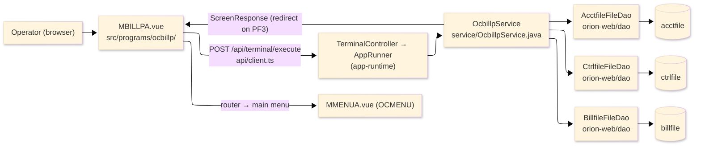
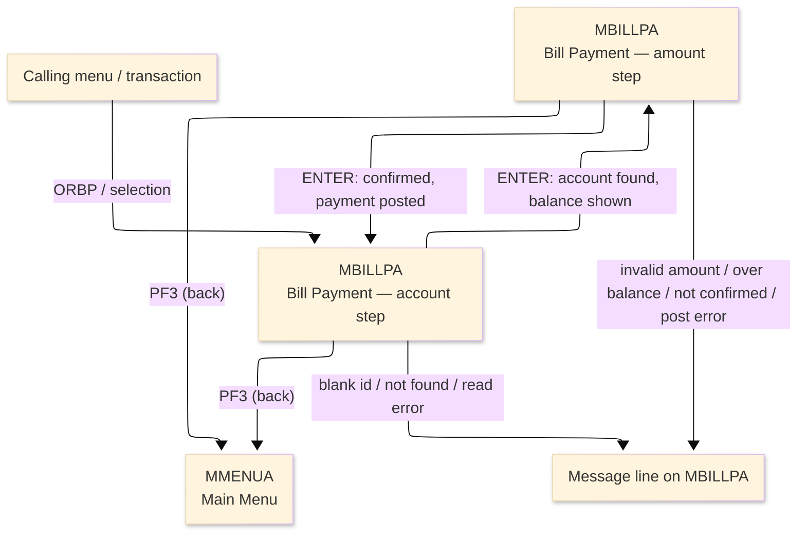
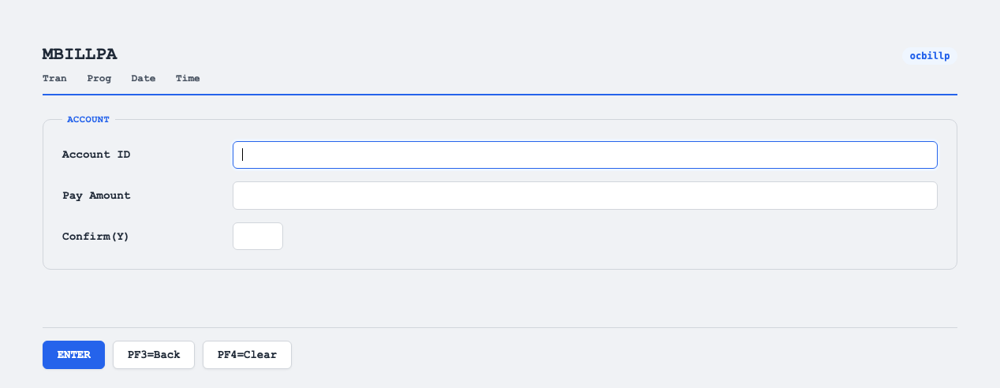

# TO-BE Screen Design — OCBILLP_BillPayment

> **Rule 1: TO-BE = AS-IS in business terms.** The interface moves to a web SPA, but the
> input/output data, the check conditions, the business flow and the database results are
> preserved. The section order follows the AS-IS document so the two compare 1-to-1.

## 0. Cover

| Item | Content |
|---|---|
| System | ORION-CCMS (ORION Credit Card Management System) |
| Subsystem | On-line (was CICS/BMS; now Vue SPA + REST) |
| Function name | Bill Payment |
| Function ID | OCBILLP（COBOL program）／Trans-ID `ORBP`／Map `MBILLPA` |
| Module | `ocbillp` |
| Platform | Java 17 · Spring Boot 3.x · Vue 3 + TypeScript · DB Oracle (H2 in dev) |
| Version ／ Author ／ Date | 1 ／ modernizeX ／ 2026-09-28 |

## 1. Function overview

### 1.1 Overview diagram

System architecture — the screen, the request path to the server, the program service it runs,
and the data stores it reads and updates when a payment is posted.

### 1.2 Function overview

| # | Function | Implementation |
|---|---|---|
| 1 | Look up the account and show its balance | The operator enters the account id and the account is read by key from `acctfile` |
| 2 | Accept and check the payment amount | The amount must be a valid number, greater than zero and no larger than the current balance |
| 3 | Post the confirmed payment | A new bill record is written, the balance is reduced and a confirmation number is returned |

**Roles ／ authorisation**: authenticated operator (signed on through the Sign On screen). Sign-on
state travels in the conversation carried between requests; no framework role gate is wired yet.

**Keys → operations** (the SPA renders each former PF key as a button):

| Key | Label as rendered (verbatim) | What it does |
|---|---|---|
| `ENTER` | `ENTER=PROCESS` | read the account, then check and post the payment |
| `PF3` | `PF3=BACK` | return to the main menu |
| `PF4` | `PF4=CLEAR` | clear the entered values so the operator can start again |
| `PF1` | `PF1` | no dedicated action; the key returns the unsupported-key notice |

> The middle column is the string the button really shows, copied from the program's button
> definitions. The physical PF keystrokes are not reproduced as keyboard shortcuts, so operators
> used to typing PF3 now click the `PF3=BACK` button — same action, one extra pointer move.

### 1.3 Databases used

| № | Business name | Table | C | R | U | D |
|---|---|---|---|---|---|---|
| 1 | Account master — read for the balance, then the balance is reduced | `acctfile` | - | 〇 | 〇 | - |
| 2 | Control file — supplies and advances the next bill number | `ctrlfile` | - | 〇 | 〇 | - |
| 3 | Bill file — the posted payment is recorded here | `billfile` | 〇 | - | - | - |

## 2. Screen spec

Screen transition of the whole function — every screen a box, every edge labelled with what moves
the operator.

### 2.1 MBILLPA — Bill Payment

**Layout**

**Archetype applied**: two-step payment form (`_archetypes/screenModel`). The header carries the
transaction/program/date/time meta strip; the body first takes the account id, then reveals the
balance and takes the amount and confirmation; a message line and a button row close the screen.

| Area | Notes |
|---|---|
| Header (Tran/Prog/Date/Time) | meta strip above the title, filled by the server |
| Input area | account id, then pay amount and a one-character confirm |
| Balance area | read-only current balance, shown after the account is found |
| Message line | inline alert below the form (was row 23 `ERRMSG`) |
| Button row | `ENTER=PROCESS`, `PF3=BACK`, `PF4=CLEAR`, `PF1` |

**Screen items**

_State legend: ○ shown · 必 must be entered · □ read-only · － not shown._

| № | Item name | Field | Type ／ length | Control | Required | Initial | Amount step | Payment posted | Notes |
|---|---|---|---|---|---|---|---|---|---|
| 1 | Account ID | `ACCTID` | numeric text, 11 | entry box, 11 chars | 必 | ○ | □ | □ | lookup key; kept at 11 as in the source |
| 2 | Current balance | `BLBAL` | amount, 15 | read-only | - | － | □ | □ | shown after the account is found |
| 3 | Pay amount | `BLAMT` | amount text, 12 | entry box, 12 chars | 必 | － | 必 | □ | the payment amount; kept at 12 |
| 4 | Confirm (Y) | `BLCONF` | text, 1 | entry box, 1 char | 必 | － | 必 | □ | must be Y to post the payment; kept at 1 |

> **Length and format unchanged**: the account entry accepts 11 characters and the amount 12, exactly
> as the terminal screen did; the balance is shown with the same width.

## 3. Check specifications

### 3.1 MBILLPA — Bill Payment

All strings below are the literal messages the server returns to the on-screen message line.
Type: E=Error / I=Information.

| No. | What is checked | When it is checked | Message code | Message shown | If it fails |
|---|---|---|---|---|---|
| 1 | Opening prompt (informational) | when the screen first appears | — | Enter account id and press ENTER. | not a failure; guides the operator |
| 2 | The account id must be entered | on `ENTER` at the account step, before the lookup | — | Please enter all required fields. | the entry stays; nothing is read |
| 3 | The keyed account must exist | on `ENTER` at the account step, after the lookup | — | Record not found. | the entry stays; no balance is shown |
| 4 | The account store must be readable | on `ENTER` at the account step, during the lookup | — | Error reading account file. | the entry stays; no balance is shown |
| 5 | Guidance after the balance is shown (informational) | on `ENTER` once the account is found | — | Enter amount, set confirm to Y, press ENTER. | not a failure; prompts for the amount |
| 6 | A payment amount must be entered | on `ENTER` at the amount step | — | Please enter a payment amount. | the amount step is redisplayed |
| 7 | The amount must be a valid number | on `ENTER` at the amount step | — | Amount is not a valid number. | the amount step is redisplayed |
| 8 | The amount must be greater than zero | on `ENTER` at the amount step | — | Amount must be greater than zero. | the amount step is redisplayed |
| 9 | The amount must not exceed the balance | on `ENTER` at the amount step | — | Amount exceeds current balance. | the amount step is redisplayed |
| 10 | Confirmation must be set to Y | on `ENTER` at the amount step, before posting | — | Set confirm to Y to post this payment. | the amount step is redisplayed; nothing is posted |
| 11 | The bill-number control record must exist | on `ENTER` when posting | — | Control record BILLID missing. | the amount step is redisplayed; nothing is posted |
| 12 | The control store must be readable | on `ENTER` when posting | — | Error reading control file. | the amount step is redisplayed; nothing is posted |
| 13 | The control store must accept the update | on `ENTER` when posting | — | Error updating control file. | the amount step is redisplayed; nothing is posted |
| 14 | The generated bill id must be unique | on `ENTER` when posting | — | Duplicate bill id generated. | the amount step is redisplayed; nothing is posted |
| 15 | The bill store must accept the new record | on `ENTER` when posting | — | Error writing bill file. | the amount step is redisplayed; nothing is posted |
| 16 | The account must still exist for the balance update | on `ENTER` when posting | — | Account not found on update. | the amount step is redisplayed; nothing is posted |
| 17 | The account must be readable for the balance update | on `ENTER` when posting | — | Error reading account for update. | the amount step is redisplayed; nothing is posted |
| 18 | The account store must accept the balance update | on `ENTER` when posting | — | Error updating account balance. | the amount step is redisplayed; nothing is posted |
| 19 | Confirmation of a posted payment (informational) | on `ENTER` after posting succeeds | — | Payment posted. Confirmation: (number) | not a failure; the new balance and confirmation number are shown |
| 20 | Only a supported key may be used | on any other key press | — | Invalid key pressed. Please try again. | the screen is redisplayed unchanged |

## 4. Event specifications

### 4.1 MBILLPA — Bill Payment

| No. | Event | What the system does | Result ／ next screen |
|---|---|---|---|
| 1 | The operator enters an account id and presses `ENTER` | the account is read by id and its current balance is shown | moves to the amount step, or a message when the id is blank or not found |
| 2 | The operator enters the amount, sets confirm to Y and presses `ENTER` | the amount is checked against the balance and, once confirmed, the payment is recorded and the balance is reduced | stays on Bill Payment with the confirmation number and the new balance, or a message when a check fails |
| 3 | The operator presses `PF3` | the payment is abandoned and control returns to the main menu | the main menu appears |
| 4 | The operator presses `PF4` | the entered values are cleared and the account step returns | stays on Bill Payment, ready for a new account |
| 5 | The operator presses `PF1` or any other unsupported key | the key is not wired to an action and is rejected | stays on Bill Payment, unchanged |

## 5. DB CRUD

**Update spec**

| Table | Operation | Field | Value source | Transaction |
|---|---|---|---|---|
| `acctfile` | UPDATE (rewrite by key) | current balance and cycle credit | the payment amount applied to the read account | committed with the payment |
| `ctrlfile` | UPDATE (rewrite by key) | last-used bill number | the next number after the stored one | committed with the payment |
| `billfile` | INSERT (write new record) | account id, amount, pay date, confirmation number, status | the posted payment | committed with the payment |

**Column-level CRUD (per event ／ business type)**

| Table | Operation | Field | Value source | Transaction |
|---|---|---|---|---|
| `acctfile` | SELECT (read) | whole record | the account id the operator entered | read at the account step |
| `acctfile` | SELECT then UPDATE | current balance, cycle credit | the payment amount | read for update, then rewrite |
| `ctrlfile` | SELECT then UPDATE | last-used bill number | the stored number plus one | read for update, then rewrite |
| `billfile` | INSERT | whole record | the posted payment details | a new record is written |

## 6. API contract

| Request | Response | What it does | Errors |
|---|---|---|---|
| `POST /api/terminal/execute` — `{ programName: "OCBILLP", aidKey, fields: { ACCTID, BLAMT, BLCONF } }` | `ScreenResponse` — `{ fields: { BLBAL }, message, buttons }` | reads the account and shows the balance, then posts the confirmed payment | blank id → "Please enter all required fields."; missing → "Record not found."; over balance → "Amount exceeds current balance."; unconfirmed → "Set confirm to Y to post this payment." |

FE types: `src/programs/ocbillp/schemas.d.ts` (`MBILLPAFields`) · client: `src/api/client.ts` ·
endpoint: `TerminalController` (`/api/terminal/execute`), one round-trip per key press (CICS
pseudo-conversation preserved through the HTTP session).
