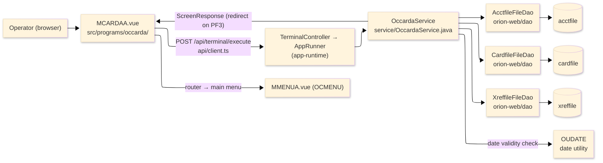
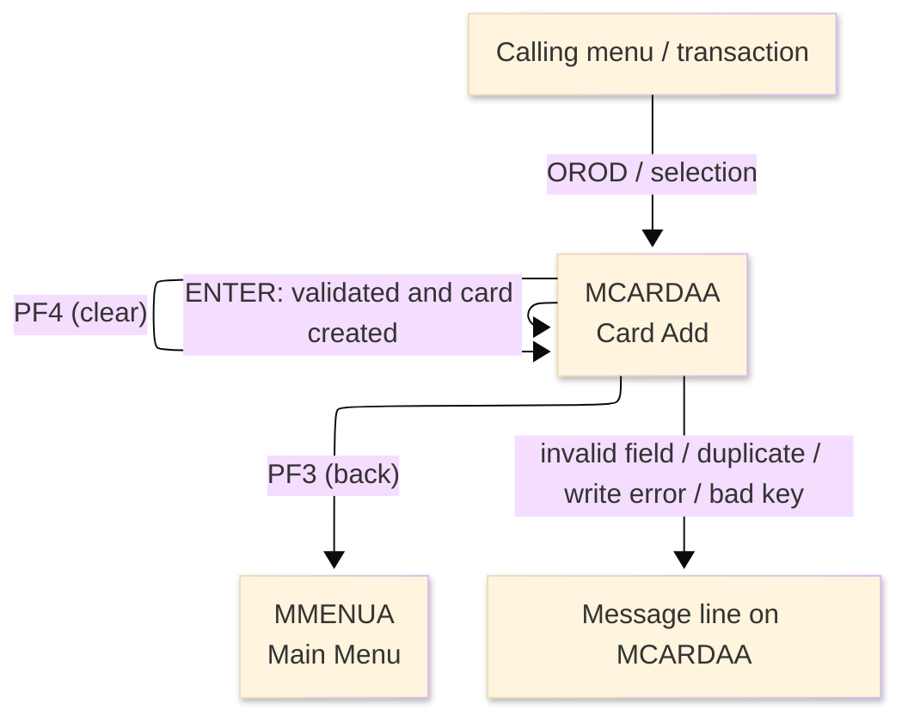
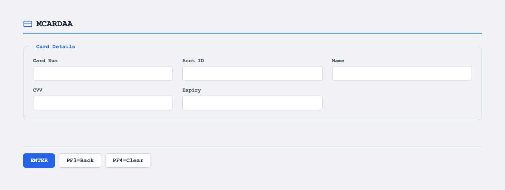

# TO-BE Screen Design — OCCARDA_CardAdd

> **Rule 1: TO-BE = AS-IS in business terms.** The interface moves to a web SPA, but the
> input/output data, the check conditions, the business flow and the database results are
> preserved. The section order follows the AS-IS document so the two compare 1-to-1.

## 0. Cover

| Item | Content |
|---|---|
| System | ORION-CCMS (ORION Credit Card Management System) |
| Subsystem | On-line (was CICS/BMS; now Vue SPA + REST) |
| Function name | Card Add |
| Function ID | OCCARDA（COBOL program）／Trans-ID `OROD`／Map `MCARDAA` |
| Module | `occarda` |
| Platform | Java 17 · Spring Boot 3.x · Vue 3 + TypeScript · DB Oracle (H2 in dev) |
| Version ／ Author ／ Date | 1 ／ modernizeX ／ 2026-09-28 |

## 1. Function overview

### 1.1 Overview diagram

System architecture — the screen, the request path to the server, the program service it runs,
and the data stores it reads and writes.

### 1.2 Function overview

| # | Function | Implementation |
|---|---|---|
| 1 | Accept the details for a new card | The operator types card number, account id, embossed name, CVV and expiry into the entry boxes |
| 2 | Validate the entered values against the business rules | Each field is checked in turn; the account must exist and the card number must be new before anything is stored |
| 3 | Create the new card on confirmation | A card record is added to `cardfile` and a matching cross-reference is added to `xreffile` |

**Roles ／ authorisation**: authenticated operator (signed on through the Sign On screen). Sign-on
state travels in the conversation carried between requests; no framework role gate is wired yet.

**Keys → operations** (the SPA renders each former PF key as a button):

| Key | Label as rendered (verbatim) | What it does |
|---|---|---|
| `ENTER` | `ENTER=PROCESS` | validate the entered card details and, when they pass, create the card |
| `PF3` | `PF3=BACK` | cancel and return to the main menu |
| `PF4` | `PF4=CLEAR` | clear the entered values so the operator can start again |

> The middle column is the string the button really shows, copied from the program's button
> definitions. The physical PF keystrokes are not reproduced as keyboard shortcuts, so operators
> used to typing PF3 now click the `PF3=BACK` button — same action, one extra pointer move.

### 1.3 Databases used

| № | Business name | Table | C | R | U | D |
|---|---|---|---|---|---|---|
| 1 | Account master — read to confirm the account exists | `acctfile` | - | 〇 | - | - |
| 2 | Card master — read to check uniqueness, then written | `cardfile` | 〇 | 〇 | - | - |
| 3 | Card cross-reference — read for the customer link, then written | `xreffile` | 〇 | 〇 | - | - |

## 2. Screen spec

Screen transition of the whole function — every screen a box, every edge labelled with what moves
the operator.

### 2.1 MCARDAA — Card Add

**Layout**

**Archetype applied**: data-entry form that creates one record (`_archetypes/screenModel`). The
header carries the transaction/program/date/time meta strip; the body has five entry boxes; a
message line and a button row close the screen.

| Area | Notes |
|---|---|
| Header (Tran/Prog/Date/Time) | meta strip above the title, filled by the server |
| Input area | five entry boxes — card number, account id, embossed name, CVV, expiry |
| Message line | inline alert below the form (was row 23 `ERRMSG`) |
| Button row | `ENTER=PROCESS`, `PF3=BACK`, `PF4=CLEAR` |

**Screen items**

_State legend: ○ shown · 必 must be entered · □ read-only · － not shown._

| № | Item name | Field | Type ／ length | Control | Required | Initial | Key prompt | Record written | Notes |
|---|---|---|---|---|---|---|---|---|---|
| 1 | Card number | `CARDNUM` | numeric text, 16 | entry box, 16 chars | 必 | ○ | 必 | 〇 | must be exactly sixteen digits |
| 2 | Account ID | `CDACCT` | numeric text, 11 | entry box, 11 chars | 必 | ○ | 必 | 〇 | must be numeric, up to eleven digits; account must exist |
| 3 | Embossed name | `CDNAME` | text, 50 | entry box, 50 chars | 必 | ○ | 必 | 〇 | printed on the card |
| 4 | CVV | `CDCVV` | numeric text, 3 | entry box, 3 chars | 必 | ○ | 必 | 〇 | must be three numeric digits |
| 5 | Expiry | `CDEXP` | date text, 10 | entry box, 10 chars | 必 | ○ | 必 | 〇 | validated as a real date (YYYY-MM-DD) |

> **Length and format unchanged**: each entry box accepts the same character count as the terminal
> field and the server stores the same widths; nothing on this screen is widened or narrowed.

## 3. Check specifications

### 3.1 MCARDAA — Card Add

All strings below are the literal messages the server returns to the on-screen message line.
Type: E=Error / I=Information.

| No. | What is checked | When it is checked | Message code | Message shown | If it fails |
|---|---|---|---|---|---|
| 1 | Opening prompt (informational) | when the screen first appears | — | Enter new card details and press ENTER. | not a failure; guides the operator |
| 2 | The card number must be sixteen digits | on `ENTER`, before storing | — | Card number must be sixteen digits. | the entry stays; nothing is stored |
| 3 | The account id must be numeric | on `ENTER`, before storing | — | Account id must be numeric. | the entry stays; nothing is stored |
| 4 | The embossed name must be entered | on `ENTER`, before storing | — | Embossed name is required. | the entry stays; nothing is stored |
| 5 | The CVV must be three numeric digits | on `ENTER`, before storing | — | CVV must be three numeric digits. | the entry stays; nothing is stored |
| 6 | The expiry must be a valid date | on `ENTER`, checked by the date utility | — | Expiry date invalid, use YYYY-MM-DD. | the entry stays; nothing is stored |
| 7 | The account must already exist | on `ENTER`, after the field checks | — | Account does not exist. | the entry stays; nothing is stored |
| 8 | The card number must be new | on `ENTER`, after the field checks | — | Card number already exists. | the entry stays; nothing is stored |
| 9 | The card record must save | on `ENTER`, during the write | — | Error writing the card file. | the card is not created |
| 10 | The cross-reference must save | on `ENTER`, after the card is written | — | Card written; cross-ref write failed. | the card exists but its customer link did not save |
| 11 | The card was created (informational) | on `ENTER`, after both writes succeed | — | Card issued successfully. | not a failure; confirms the new card |
| 12 | Only a supported key may be used | on any key press | — | Invalid key pressed. Please try again. | the screen is redisplayed unchanged |

## 4. Event specifications

### 4.1 MCARDAA — Card Add

| No. | Event | What the system does | Result ／ next screen |
|---|---|---|---|
| 1 | The operator fills the fields and presses `ENTER` | the values are validated one by one; when all pass, the card and its cross-reference are created | stays on Card Add with a success message, or a message when a field is wrong or the write fails |
| 2 | The operator presses `PF3` | the add is cancelled and control returns to the calling menu | the main menu appears |
| 3 | The operator presses `PF4` | the entered values are cleared and the opening prompt returns | stays on Card Add, ready for a new entry |
| 4 | The operator presses an unsupported key | the request is rejected and a message is shown | stays on Card Add, unchanged |

## 5. DB CRUD

**Update spec**

On confirmation a new card row is written to `cardfile` (card number as key, plus account id, CVV,
embossed name, expiry date, and active status set on) and a new cross-reference row is written to
`xreffile` (card number as key, account id, customer id). The account master is only read.

**Column-level CRUD (per event ／ business type)**

| Table | Operation | Field | Value source | Transaction |
|---|---|---|---|---|
| `acctfile` | SELECT (read by key) | whole record | the account id the operator entered | read-only; confirms the account |
| `cardfile` | SELECT then INSERT | whole record | the card number, account id, CVV, name, expiry the operator entered | read checks uniqueness; insert creates the card |
| `xreffile` | SELECT then INSERT | whole record | the card number, account id and the linked customer id | read fetches the customer link; insert stores the cross-reference |

## 6. API contract

| Request | Response | What it does | Errors |
|---|---|---|---|
| `POST /api/terminal/execute` — `{ programName: "OCCARDA", aidKey, fields: { CARDNUM, CDACCT, CDNAME, CDCVV, CDEXP } }` | `ScreenResponse` — `{ fields, message, buttons }` | validates the entered card details and, when they pass, creates the card and its cross-reference | field errors return the matching message; existing card → "Card number already exists."; missing account → "Account does not exist."; write failure → "Error writing the card file." |

FE types: `src/programs/occarda/schemas.d.ts` (`MCARDAAFields`) · client: `src/api/client.ts` ·
endpoint: `TerminalController` (`/api/terminal/execute`), one round-trip per key press (CICS
pseudo-conversation preserved through the HTTP session).
