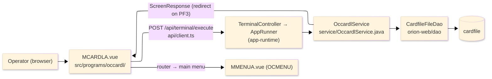
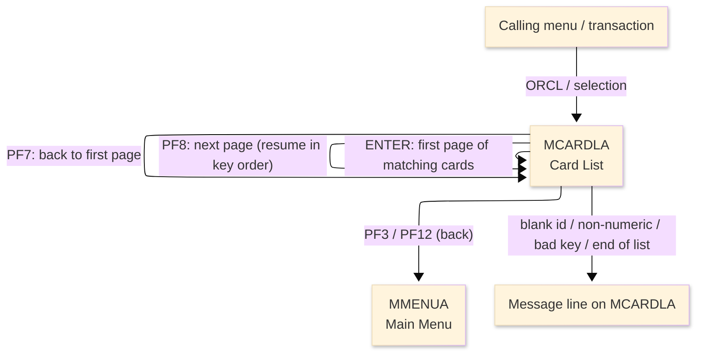
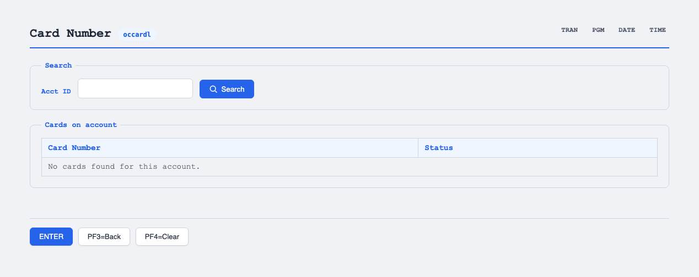

# TO-BE Screen Design — OCCARDL_CardList

> **Rule 1: TO-BE = AS-IS in business terms.** The interface moves to a web SPA, but the
> input/output data, the check conditions, the business flow and the database results are
> preserved. The section order follows the AS-IS document so the two compare 1-to-1.

## 0. Cover

| Item | Content |
|---|---|
| System | ORION-CCMS (ORION Credit Card Management System) |
| Subsystem | On-line (was CICS/BMS; now Vue SPA + REST) |
| Function name | Card List for an account |
| Function ID | OCCARDL（COBOL program）／Trans-ID `ORCL`／Map `MCARDLA` |
| Module | `occardl` |
| Platform | Java 17 · Spring Boot 3.x · Vue 3 + TypeScript · DB Oracle (H2 in dev) |
| Version ／ Author ／ Date | 1 ／ modernizeX ／ 2026-09-28 |

## 1. Function overview

### 1.1 Overview diagram

System architecture — the screen, the request path to the server, the program service it runs,
and the data store it reads a page at a time.

### 1.2 Function overview

| # | Function | Implementation |
|---|---|---|
| 1 | List the cards for one account a page at a time | The cards are read in card-number order from `cardfile` and up to five that belong to the entered account are shown per page |
| 2 | Let the operator page forward and back to the top | A next action resumes the ordered read from where the last page stopped; a top action restarts from the first matching card |
| 3 | Show each card with its status | Every listed row shows the card number and its active status |

**Roles ／ authorisation**: authenticated operator (signed on through the Sign On screen). Sign-on
state travels in the conversation carried between requests; no framework role gate is wired yet.

**Keys → operations** (the SPA renders each former PF key as a button):

| Key | Label as rendered (verbatim) | What it does |
|---|---|---|
| `ENTER` | `ENTER=PROCESS` | accept the account id and list the first page of its cards |
| `PF3` | `PF3=BACK` | return to the main menu |
| `PF4` | `PF4=CLEAR` | clear the entry and start again |
| `PF12` | `PF12` | cancel and return to the main menu |
| `CLEAR` | `Clear` | clear the screen and redisplay it |
| `PF7` | `PF7` | page back to the top (first page of cards) |
| `PF8` | `PF8` | page forward to the next page of cards |

> The middle column is the string the button really shows, copied from the program's button
> definitions. The physical PF keystrokes are not reproduced as keyboard shortcuts, so operators
> used to typing PF8 now click the `PF8` button — same paging action, one extra pointer move.

### 1.3 Databases used

| № | Business name | Table | C | R | U | D |
|---|---|---|---|---|---|---|
| 1 | Card master — read in key order and filtered to the account | `cardfile` | - | 〇 | - | - |

## 2. Screen spec

Screen transition of the whole function — every screen a box, every edge labelled with what moves
the operator. The list is paged: each page shows up to five cards read in card-number order.

### 2.1 MCARDLA — Card List for an account

**Layout**

**Archetype applied**: paged list with one lookup key (`_archetypes/screenModel`, LIST). The header
carries the transaction/program/date/time meta strip; the body has one account-id entry box and a
five-row result block (card number + status); a message line and a button row close the screen.

| Area | Notes |
|---|---|
| Header (Tran/Prog/Date/Time) | meta strip above the title, filled by the server |
| Input area | one entry box — the account id whose cards are listed |
| List area | up to five rows, each a card number and its status, read in card-number order |
| Message line | inline alert / paging hint below the list (was row 23 `ERRMSG`) |
| Button row | `ENTER=PROCESS`, `PF3=BACK`, `PF4=CLEAR`, `PF12`, `Clear`, `PF7`, `PF8` |

**Screen items**

_State legend: ○ shown · 必 must be entered · □ read-only · － not shown._

| № | Item name | Field | Type ／ length | Control | Required | Initial | Key prompt | Record shown | Notes |
|---|---|---|---|---|---|---|---|---|---|
| 1 | Account ID | `ACCTID` | numeric text, 11 | entry box, 11 chars | 必 | ○ | 必 | □ | lookup key; the account whose cards are listed |
| 2 | Card number (row 1) | `CARD1` | text, 16 | read-only | - | － | □ | □ | first card on the page |
| 3 | Status (row 1) | `STAT1` | text, 1 | read-only | - | － | □ | □ | active status of row 1 |
| 4 | Card number (row 2) | `CARD2` | text, 16 | read-only | - | － | □ | □ | second card on the page |
| 5 | Status (row 2) | `STAT2` | text, 1 | read-only | - | － | □ | □ | active status of row 2 |
| 6 | Card number (row 3) | `CARD3` | text, 16 | read-only | - | － | □ | □ | third card on the page |
| 7 | Status (row 3) | `STAT3` | text, 1 | read-only | - | － | □ | □ | active status of row 3 |
| 8 | Card number (row 4) | `CARD4` | text, 16 | read-only | - | － | □ | □ | fourth card on the page |
| 9 | Status (row 4) | `STAT4` | text, 1 | read-only | - | － | □ | □ | active status of row 4 |
| 10 | Card number (row 5) | `CARD5` | text, 16 | read-only | - | － | □ | □ | fifth card on the page |
| 11 | Status (row 5) | `STAT5` | text, 1 | read-only | - | － | □ | □ | active status of row 5 |

> **Length and format unchanged**: the entry box accepts 11 characters and each listed card is shown
> as its 16-character number and 1-character status, exactly as on the terminal screen; the page size
> stays at five rows.

## 3. Check specifications

### 3.1 MCARDLA — Card List for an account

All strings below are the literal messages the server returns to the on-screen message line.
Type: E=Error / I=Information.

| No. | What is checked | When it is checked | Message code | Message shown | If it fails |
|---|---|---|---|---|---|
| 1 | Opening prompt (informational) | when the screen first appears | — | Enter account id and press ENTER to list cards. | not a failure; guides the operator |
| 2 | The account id must be entered | on `ENTER`, before the read | — | Please enter all required fields. | nothing is listed; the entry stays |
| 3 | The account id must be numeric | on `ENTER`, before the read | — | Account id must be numeric. | nothing is listed; the entry stays |
| 4 | An account must be listed before paging | on `PF8`, when no page is active | — | List an account first (press ENTER). | no paging happens |
| 5 | There must be more cards to page to | on `PF8`, after the read | — | No more cards for this account. | the page stays as it was |
| 6 | The account must have at least one card | on `ENTER`, after the read | — | No cards found for this account. | an empty list is shown |
| 7 | More pages remain (informational) | after a page that filled and has more | — | Cards listed. PF8=next PF7=top PF3=menu. | not a failure; offers paging |
| 8 | The last page has been reached (informational) | after a page with nothing further | — | End of list. PF7=top PF3=menu. | not a failure; offers restart |
| 9 | Only a supported key may be used | on any key press | — | Invalid key pressed. Please try again. | the screen is redisplayed unchanged |

## 4. Event specifications

### 4.1 MCARDLA — Card List for an account

| No. | Event | What the system does | Result ／ next screen |
|---|---|---|---|
| 1 | The operator enters an account id and presses `ENTER` | the cards are read in card-number order and the first five that belong to the account are listed | stays on Card List with the first page, or a message when the id is blank / non-numeric / has no cards |
| 2 | The operator presses `PF8` | the read resumes from where the last page stopped and the next five matching cards are shown | stays on Card List with the next page, or a message when there are no more |
| 3 | The operator presses `PF7` | the list restarts from the first matching card | stays on Card List showing the top page |
| 4 | The operator presses `PF3` or `PF12` | the list ends and control returns to the calling menu | the main menu appears |
| 5 | The operator presses `PF4` or `CLEAR` | the entry is cleared and the opening prompt returns | stays on Card List, ready for a new account |
| 6 | The operator presses an unsupported key | the request is rejected and a message is shown | stays on Card List, unchanged |

## 5. DB CRUD

**Update spec**

Not applicable — Card List only reads; no row is created, updated or deleted. The read is an ordered
browse of `cardfile` by its card-number key (ORDER BY `cd_num`); the service starts the browse from a
saved resume key, reads forward in order, keeps the rows whose account id matches the entered account,
and stops after five matches so the page carries the resume point for the next page.

**Column-level CRUD (per event ／ business type)**

| Table | Operation | Field | Value source | Transaction |
|---|---|---|---|---|
| `cardfile` | SELECT (ordered browse by `cd_num`) | card number, active status | resumes from the saved key; filtered to the entered account id | read-only; no commit |

## 6. API contract

| Request | Response | What it does | Errors |
|---|---|---|---|
| `POST /api/terminal/execute` — `{ programName: "OCCARDL", aidKey, fields: { ACCTID } }` | `ScreenResponse` — `{ fields: { CARD1..CARD5, STAT1..STAT5 }, message, buttons }` | lists a page of cards for the account; `aidKey` selects first page (`ENTER`/`PF7`) or next page (`PF8`) | blank id → "Please enter all required fields."; non-numeric → "Account id must be numeric."; none → "No cards found for this account."; page past end → "No more cards for this account." |

FE types: `src/programs/occardl/schemas.d.ts` (`MCARDLAFields`) · client: `src/api/client.ts` ·
endpoint: `TerminalController` (`/api/terminal/execute`), one round-trip per key press (CICS
pseudo-conversation, and the paging resume key, preserved through the HTTP session).
