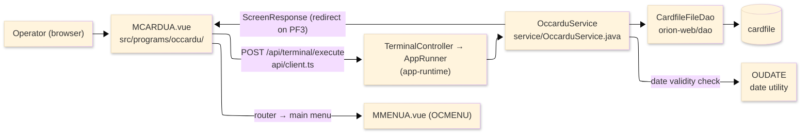
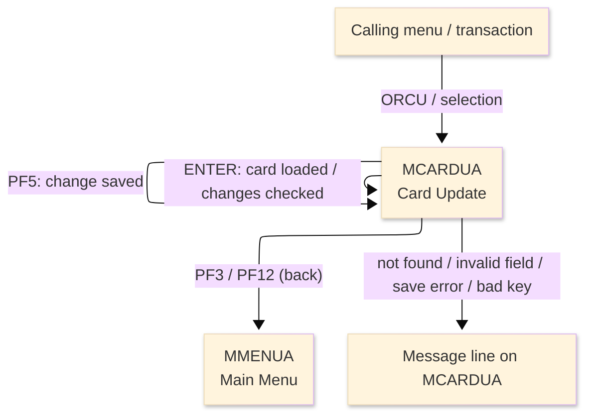
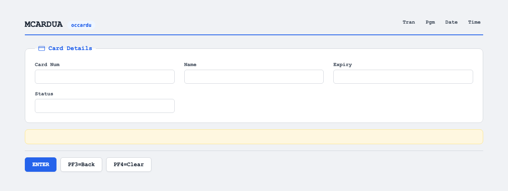

# TO-BE Screen Design — OCCARDU_CardUpdate

> **Rule 1: TO-BE = AS-IS in business terms.** The interface moves to a web SPA, but the
> input/output data, the check conditions, the business flow and the database results are
> preserved. The section order follows the AS-IS document so the two compare 1-to-1.

## 0. Cover

| Item | Content |
|---|---|
| System | ORION-CCMS (ORION Credit Card Management System) |
| Subsystem | On-line (was CICS/BMS; now Vue SPA + REST) |
| Function name | Card Update |
| Function ID | OCCARDU（COBOL program）／Trans-ID `ORCU`／Map `MCARDUA` |
| Module | `occardu` |
| Platform | Java 17 · Spring Boot 3.x · Vue 3 + TypeScript · DB Oracle (H2 in dev) |
| Version ／ Author ／ Date | 1 ／ modernizeX ／ 2026-09-28 |

## 1. Function overview

### 1.1 Overview diagram

System architecture — the screen, the request path to the server, the program service it runs,
and the data store it reads and updates.

### 1.2 Function overview

| # | Function | Implementation |
|---|---|---|
| 1 | Look up a card by its number and show its current values | The operator keys the card number; the card is read from `cardfile` and its name, expiry and status are shown |
| 2 | Let the operator change the editable fields | Embossed name, expiry date and active status can be changed; the card number itself stays fixed |
| 3 | Validate the changes and save them | On confirmation the changed values are written back over the same card record |

**Roles ／ authorisation**: authenticated operator (signed on through the Sign On screen). Sign-on
state travels in the conversation carried between requests; no framework role gate is wired yet.

**Keys → operations** (the SPA renders each former PF key as a button):

| Key | Label as rendered (verbatim) | What it does |
|---|---|---|
| `ENTER` | `ENTER=PROCESS` | load the keyed card, or re-check the changed fields once a card is loaded |
| `PF3` | `PF3=BACK` | return to the main menu |
| `PF4` | `PF4=CLEAR` | clear the entry and start again |
| `PF12` | `PF12` | cancel and return to the main menu |
| `CLEAR` | `Clear` | clear the screen and redisplay it |
| `PF5` | `PF5` | confirm and save the change to the card |

> The middle column is the string the button really shows, copied from the program's button
> definitions. The physical PF keystrokes are not reproduced as keyboard shortcuts, so operators
> used to typing PF5 now click the `PF5` button — same save action, one extra pointer move.

### 1.3 Databases used

| № | Business name | Table | C | R | U | D |
|---|---|---|---|---|---|---|
| 1 | Card master — read by number, then updated in place | `cardfile` | - | 〇 | 〇 | - |

## 2. Screen spec

Screen transition of the whole function — every screen a box, every edge labelled with what moves
the operator.

### 2.1 MCARDUA — Card Update

**Layout**

**Archetype applied**: lookup-then-edit form (`_archetypes/screenModel`). The header carries the
transaction/program/date/time meta strip; the body has the card-number key box and three editable
fields; a message line and a button row close the screen.

| Area | Notes |
|---|---|
| Header (Tran/Prog/Date/Time) | meta strip above the title, filled by the server |
| Input area | card-number key box plus the editable name, expiry and status boxes |
| Message line | inline alert / step hint below the form (was row 23 `ERRMSG`) |
| Button row | `ENTER=PROCESS`, `PF3=BACK`, `PF4=CLEAR`, `PF12`, `Clear`, `PF5` |

**Screen items**

_State legend: ○ shown · 必 must be entered · □ read-only · － not shown._

| № | Item name | Field | Type ／ length | Control | Required | Initial | Key prompt | Record shown | Notes |
|---|---|---|---|---|---|---|---|---|---|
| 1 | Card number | `CARDNUM` | numeric text, 16 | entry box, 16 chars | 必 | ○ | 必 | □ | lookup key; must be exactly sixteen digits; stays fixed on save |
| 2 | Embossed name | `CDNAME` | text, 50 | entry box, 50 chars | 必 | ○ | - | □ | filled from the card, then editable |
| 3 | Expiry | `CDEXP` | date text, 10 | entry box, 10 chars | 必 | ○ | - | □ | filled from the card; validated as a real date (YYYY-MM-DD) |
| 4 | Active status | `CDSTAT` | text, 1 | entry box, 1 char | 必 | ○ | - | □ | filled from the card; must be Y or N |

> **Length and format unchanged**: each entry box accepts the same character count as the terminal
> field and the server stores the same widths; the card number stays sixteen characters and is not
> altered by the save.

## 3. Check specifications

### 3.1 MCARDUA — Card Update

All strings below are the literal messages the server returns to the on-screen message line.
Type: E=Error / I=Information.

| No. | What is checked | When it is checked | Message code | Message shown | If it fails |
|---|---|---|---|---|---|
| 1 | Opening prompt (informational) | when the screen first appears with no card | — | Enter card number and press ENTER. | not a failure; guides the operator |
| 2 | Pre-selected card prompt (informational) | when the screen first appears with a card carried in | — | Press ENTER to load the selected card. | not a failure; guides the operator |
| 3 | The card number must be entered | on `ENTER`, before the lookup | — | Please enter all required fields. | nothing is read; the entry stays |
| 4 | The card number must be sixteen digits | on `ENTER`, before the lookup | — | Card number must be exactly 16 digits. | nothing is read; the entry stays |
| 5 | The keyed card must exist | on `ENTER`, after the lookup | — | Record not found. | no card is loaded |
| 6 | Card loaded (informational) | on `ENTER`, when the card is found | — | Card found. Change fields, PF5 to save. | not a failure; fields become editable |
| 7 | The embossed name must be entered | on `ENTER` re-check and on `PF5` | — | Embossed name is required. | the change is not saved |
| 8 | The expiry must be a valid date | on `ENTER` re-check and on `PF5` | — | Expiry date invalid, use YYYY-MM-DD. | the change is not saved |
| 9 | The active status must be Y or N | on `ENTER` re-check and on `PF5` | — | Active status must be Y or N. | the change is not saved |
| 10 | Changes valid (informational) | on `ENTER`, once the fields pass | — | Changes are valid.  Press PF5 to confirm save. | not a failure; prompts the save |
| 11 | A card must be loaded before saving | on `PF5`, when no card is loaded | — | Enter a card number and press ENTER first. | nothing is saved |
| 12 | The card must still exist at save time | on `PF5`, during the update | — | Card no longer exists. Update aborted. | nothing is saved |
| 13 | The card must save | on `PF5`, during the write-back | — | Update failed during REWRITE. | the change is not saved |
| 14 | The card was updated (informational) | on `PF5`, after the write-back succeeds | — | Card updated successfully. | not a failure; confirms the update |
| 15 | Only a supported key may be used | on any key press | — | Invalid key pressed. Please try again. | the screen is redisplayed unchanged |

## 4. Event specifications

### 4.1 MCARDUA — Card Update

| No. | Event | What the system does | Result ／ next screen |
|---|---|---|---|
| 1 | The operator keys a card number and presses `ENTER` | the card is read and its name, expiry and status are shown, ready to change | stays on Card Update with the card loaded, or a message when the number is wrong or the card is missing |
| 2 | The operator changes fields and presses `ENTER` again | the changed values are re-checked and a prompt to confirm the save is shown | stays on Card Update, ready to save, or a message when a field is wrong |
| 3 | The operator presses `PF5` | the changed name, expiry and status are written back over the same card | stays on Card Update with a success message, or a message when the card is gone or the save fails |
| 4 | The operator presses `PF3` or `PF12` | the update is cancelled and control returns to the calling menu | the main menu appears |
| 5 | The operator presses `PF4` or `CLEAR` | the screen is cleared and the opening prompt returns | stays on Card Update, ready for a new number |
| 6 | The operator presses an unsupported key | the request is rejected and a message is shown | stays on Card Update, unchanged |

## 5. DB CRUD

**Update spec**

On confirmation the card is read by its number, and the embossed name, expiry date and active status
are written back over the same record; the card number is the key and is never changed.

**Column-level CRUD (per event ／ business type)**

| Table | Operation | Field | Value source | Transaction |
|---|---|---|---|---|
| `cardfile` | SELECT (read by key) | whole record | the card number the operator entered | loads the current values |
| `cardfile` | UPDATE (rewrite by key) | embossed name, expiry date, active status | the changed values on the screen | commits the change on save |

## 6. API contract

| Request | Response | What it does | Errors |
|---|---|---|---|
| `POST /api/terminal/execute` — `{ programName: "OCCARDU", aidKey, fields: { CARDNUM, CDNAME, CDEXP, CDSTAT } }` | `ScreenResponse` — `{ fields: { CDNAME, CDEXP, CDSTAT }, message, buttons }` | `ENTER` loads the card or re-checks the fields; `PF5` writes the change back | missing card → "Record not found."; field errors return the matching message; save without a loaded card → "Enter a card number and press ENTER first."; write failure → "Update failed during REWRITE." |

FE types: `src/programs/occardu/schemas.d.ts` (`MCARDUAFields`) · client: `src/api/client.ts` ·
endpoint: `TerminalController` (`/api/terminal/execute`), one round-trip per key press (CICS
pseudo-conversation preserved through the HTTP session).
