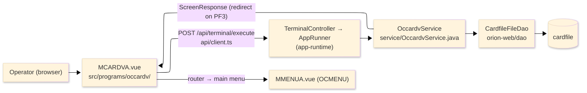
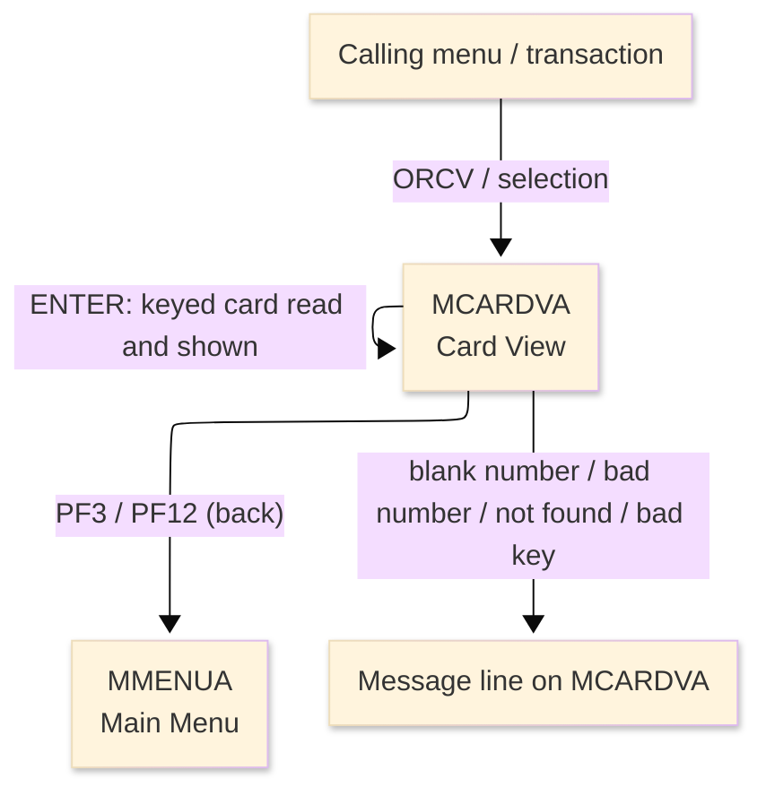
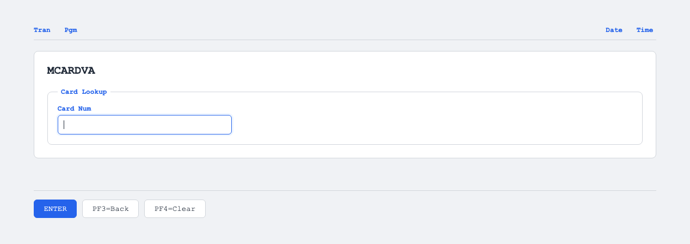

# TO-BE Screen Design — OCCARDV_CardView

> **Rule 1: TO-BE = AS-IS in business terms.** The interface moves to a web SPA, but the
> input/output data, the check conditions, the business flow and the database results are
> preserved. The section order follows the AS-IS document so the two compare 1-to-1.

## 0. Cover

| Item | Content |
|---|---|
| System | ORION-CCMS (ORION Credit Card Management System) |
| Subsystem | On-line (was CICS/BMS; now Vue SPA + REST) |
| Function name | Card View |
| Function ID | OCCARDV（COBOL program）／Trans-ID `ORCV`／Map `MCARDVA` |
| Module | `occardv` |
| Platform | Java 17 · Spring Boot 3.x · Vue 3 + TypeScript · DB Oracle (H2 in dev) |
| Version ／ Author ／ Date | 1 ／ modernizeX ／ 2026-09-28 |

## 1. Function overview

### 1.1 Overview diagram

System architecture — the screen, the request path to the server, the program service it runs,
and the data store it reads.

### 1.2 Function overview

| # | Function | Implementation |
|---|---|---|
| 1 | Look up a card by its number | The operator enters the card number and the card record is read by primary key from `cardfile` |
| 2 | Show the current card details in read-only form | Account id, embossed name, expiry and status are displayed; nothing on this screen is editable |
| 3 | Return to the calling menu when finished | The back action ends the view and returns the operator to the main menu |

**Roles ／ authorisation**: authenticated operator (signed on through the Sign On screen). Sign-on
state travels in the conversation carried between requests; no framework role gate is wired yet.

**Keys → operations** (the SPA renders each former PF key as a button):

| Key | Label as rendered (verbatim) | What it does |
|---|---|---|
| `ENTER` | `ENTER=PROCESS` | read the keyed card and show its details |
| `PF3` | `PF3=BACK` | return to the main menu |
| `PF4` | `PF4=CLEAR` | clear the entry so the operator can start again |
| `PF12` | `PF12` | cancel and return to the main menu |
| `CLEAR` | `Clear` | clear the screen and redisplay it |

> The middle column is the string the button really shows, copied from the program's button
> definitions. The physical PF keystrokes are not reproduced as keyboard shortcuts, so operators
> used to typing PF3 now click the `PF3=BACK` button — same action, one extra pointer move.

### 1.3 Databases used

| № | Business name | Table | C | R | U | D |
|---|---|---|---|---|---|---|
| 1 | Card master — read by card number to show the detail | `cardfile` | - | 〇 | - | - |

## 2. Screen spec

Screen transition of the whole function — every screen a box, every edge labelled with what moves
the operator.

### 2.1 MCARDVA — Card View

**Layout**

**Archetype applied**: display form with a single lookup key (`_archetypes/screenModel`). The header
carries the transaction/program/date/time meta strip; the body has one entry box and a read-only
details block; a message line and a button row close the screen.

| Area | Notes |
|---|---|
| Header (Tran/Prog/Date/Time) | meta strip above the title, filled by the server |
| Input area | one entry box — the card number lookup key |
| Details area | read-only outputs: account id, embossed name, expiry, status |
| Message line | inline alert below the form (was row 23 `ERRMSG`) |
| Button row | `ENTER=PROCESS`, `PF3=BACK`, `PF4=CLEAR`, `PF12`, `Clear` |

**Screen items**

_State legend: ○ shown · 必 must be entered · □ read-only · － not shown._

| № | Item name | Field | Type ／ length | Control | Required | Initial | Key prompt | Record shown | Notes |
|---|---|---|---|---|---|---|---|---|---|
| 1 | Card number | `CARDNUM` | numeric text, 16 | entry box, 16 chars | 必 | ○ | 必 | □ | lookup key; must be exactly sixteen digits |
| 2 | Account ID | `CDACCT` | numeric text, 11 | read-only | - | － | □ | □ | owning account |
| 3 | Embossed name | `CDNAME` | text, 50 | read-only | - | － | □ | □ | printed on the card |
| 4 | Expiry | `CDEXP` | date text, 10 | read-only | - | － | □ | □ | as stored |
| 5 | Active status | `CDSTAT` | text, 1 | read-only | - | － | □ | □ | active status code |

> **Length and format unchanged**: the entry box accepts 16 characters and the server reads the same
> 16-character key; the detail fields are shown with the same widths as the terminal screen.

## 3. Check specifications

### 3.1 MCARDVA — Card View

All strings below are the literal messages the server returns to the on-screen message line.
Type: E=Error / I=Information.

| No. | What is checked | When it is checked | Message code | Message shown | If it fails |
|---|---|---|---|---|---|
| 1 | Opening prompt (informational) | when the screen first appears with no card | — | Enter card number and press ENTER. | not a failure; guides the operator |
| 2 | Pre-selected card prompt (informational) | when the screen first appears with a card carried in | — | Press ENTER to view the selected card. | not a failure; guides the operator |
| 3 | The card number must be entered | on `ENTER`, before the lookup | — | Please enter all required fields. | the entry stays; nothing is read |
| 4 | The card number must be sixteen digits | on `ENTER`, before the lookup | — | Card number must be exactly 16 digits. | the entry stays; nothing is read |
| 5 | The keyed card must exist | on `ENTER`, after the lookup | — | Record not found. | the entry stays; no details are shown |
| 6 | The card was displayed (informational) | on `ENTER`, after a successful read | — | Card displayed. | not a failure; confirms the detail |
| 7 | Only a supported key may be used | on any key press | — | Invalid key pressed. Please try again. | the screen is redisplayed unchanged |

## 4. Event specifications

### 4.1 MCARDVA — Card View

| No. | Event | What the system does | Result ／ next screen |
|---|---|---|---|
| 1 | The operator enters a card number and presses `ENTER` | the keyed card is read and its details are filled in | stays on Card View with the details shown, or a message when the number is blank / wrong / not found |
| 2 | The operator presses `PF3` or `PF12` | the view ends and control returns to the calling menu | the main menu appears |
| 3 | The operator presses `PF4` or `CLEAR` | the entered value is cleared and the opening prompt returns | stays on Card View, ready for a new number |
| 4 | The operator presses an unsupported key | the request is rejected and a message is shown | stays on Card View, unchanged |

## 5. DB CRUD

**Update spec**

Not applicable — Card View only reads; no row is created, updated or deleted.

**Column-level CRUD (per event ／ business type)**

| Table | Operation | Field | Value source | Transaction |
|---|---|---|---|---|
| `cardfile` | SELECT (read by key) | whole record | the card number the operator entered | read-only; no commit |

## 6. API contract

| Request | Response | What it does | Errors |
|---|---|---|---|
| `POST /api/terminal/execute` — `{ programName: "OCCARDV", aidKey, fields: { CARDNUM } }` | `ScreenResponse` — `{ fields: { CDACCT, CDNAME, CDEXP, CDSTAT }, message, buttons }` | reads the card by key and returns its detail fields, or a message | blank number → "Please enter all required fields."; wrong length → "Card number must be exactly 16 digits."; missing → "Record not found." |

FE types: `src/programs/occardv/schemas.d.ts` (`MCARDVAFields`) · client: `src/api/client.ts` ·
endpoint: `TerminalController` (`/api/terminal/execute`), one round-trip per key press (CICS
pseudo-conversation preserved through the HTTP session).
