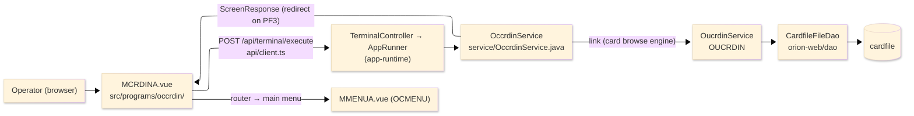
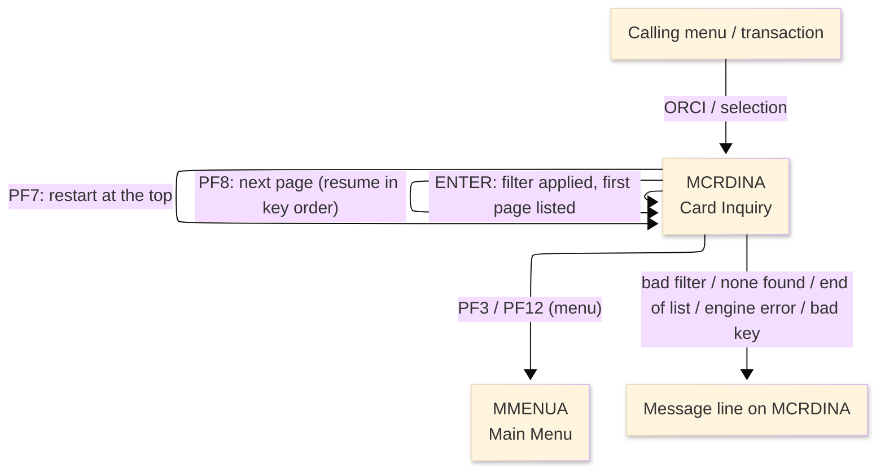
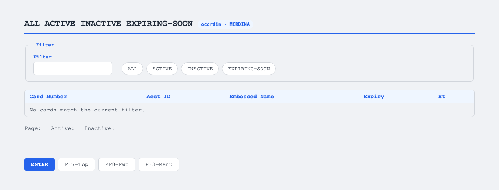

# TO-BE Screen Design — OCCRDIN_CardInquiry

> **Rule 1: TO-BE = AS-IS in business terms.** The interface moves to a web SPA, but the
> input/output data, the check conditions, the business flow and the database results are
> preserved. The section order follows the AS-IS document so the two compare 1-to-1.

## 0. Cover

| Item | Content |
|---|---|
| System | ORION-CCMS (ORION Credit Card Management System) |
| Subsystem | On-line (was CICS/BMS; now Vue SPA + REST) |
| Function name | Card Inquiry (consolidated) |
| Function ID | OCCRDIN（COBOL program）／Trans-ID `ORCI`／Map `MCRDINA` |
| Module | `occrdin` |
| Platform | Java 17 · Spring Boot 3.x · Vue 3 + TypeScript · DB Oracle (H2 in dev) |
| Version ／ Author ／ Date | 1 ／ modernizeX ／ 2026-09-28 |

## 1. Function overview

### 1.1 Overview diagram

System architecture — the screen, the request path to the server, the program service it runs, the
linked card browse engine, and the data store the engine reads a page at a time.

### 1.2 Function overview

| # | Function | Implementation |
|---|---|---|
| 1 | Accept a status filter for the inquiry | The operator types a filter word (ALL, ACTIVE, INACTIVE or EXPIRING) into the entry box |
| 2 | Retrieve and display the matching cards for review | The linked card browse engine reads the cards in key order and returns a page of up to thirteen that match the filter, with active and inactive totals |
| 3 | Let the operator page through and refine the filter | A next action fetches the following page; a top action restarts the list; a new filter re-runs the inquiry |

**Roles ／ authorisation**: authenticated operator (signed on through the Sign On screen). Sign-on
state travels in the conversation carried between requests; no framework role gate is wired yet.

**Keys → operations** (the SPA renders each former PF key as a button):

| Key | Label as rendered (verbatim) | What it does |
|---|---|---|
| `ENTER` | `ENTER=APPLY` | apply the typed filter and list the first page of matching cards |
| `PF7` | `PF7=TOP` | restart the list from the top |
| `PF8` | `PF8=FWD` | page forward to the next page of matching cards |
| `PF3` | `PF3=MENU` | return to the main menu |
| `PF12` | `PF12` | cancel and return to the main menu |
| `PF4` | `PF4` | clear the entry and start again |
| `CLEAR` | `Clear` | clear the screen and redisplay it |

> The middle column is the string the button really shows, copied from the program's button
> definitions. The physical PF keystrokes are not reproduced as keyboard shortcuts, so operators
> used to typing PF8 now click the `PF8=FWD` button — same paging action, one extra pointer move.

### 1.3 Databases used

| № | Business name | Table | C | R | U | D |
|---|---|---|---|---|---|---|
| 1 | Card master — read in key order by the linked browse engine | `cardfile` | - | 〇 | - | - |

> This program itself opens no file; the read is performed by the linked card browse engine (OUCRDIN),
> which browses `cardfile` and returns each page of matching cards.

## 2. Screen spec

Screen transition of the whole function — every screen a box, every edge labelled with what moves
the operator. The list is paged: each page shows up to thirteen cards, read in card-number order by
the linked browse engine, and each next page resumes from the key the previous page returned.

### 2.1 MCRDINA — Card Inquiry (consolidated)

**Layout**

**Archetype applied**: filtered paged list (`_archetypes/screenModel`, LIST). The header carries the
transaction/program/date/time meta strip; the body has one filter box, a thirteen-row result grid
(card number, account id, embossed name, expiry, status), and a totals line; a message line and a
button row close the screen.

| Area | Notes |
|---|---|
| Header (Tran/Prog/Date/Time) | meta strip above the title, filled by the server |
| Input area | one filter box, with the recognised words shown beside it (ALL, ACTIVE, INACTIVE, EXPIRING-SOON) |
| List area | up to thirteen rows, each a card number, account id, embossed name, expiry and status |
| Totals line | current page number and the active / inactive counts |
| Message line | inline alert / paging hint below the list (was row 23 `ERRMSG`) |
| Button row | `ENTER=APPLY`, `PF7=TOP`, `PF8=FWD`, `PF3=MENU`, `PF12`, `PF4`, `Clear` |

**Screen items**

_State legend: ○ shown · 必 must be entered · □ read-only · － not shown._

| № | Item name | Field | Type ／ length | Control | Required | Initial | Key prompt | Record shown | Notes |
|---|---|---|---|---|---|---|---|---|---|
| 1 | Filter | `FILT` | text, 10 | entry box, 10 chars | ○ | ○ | ○ | □ | ALL / ACTIVE / INACTIVE / EXPIRING; blank is treated as ALL |
| 2 | Filter description | `FDESC` | text, 12 | read-only | - | ○ | - | □ | the filter now in effect, in words |
| 3 | Card number (each row) | `CNM1`…`CNM13` | text, 16 | read-only | - | － | □ | □ | card number for each listed row |
| 4 | Account ID (each row) | `CAC1`…`CAC13` | numeric text, 11 | read-only | - | － | □ | □ | owning account for each listed row |
| 5 | Embossed name (each row) | `CNA1`…`CNA13` | text, 20 | read-only | - | － | □ | □ | cardholder name for each listed row |
| 6 | Expiry (each row) | `CEX1`…`CEX13` | date text, 10 | read-only | - | － | □ | □ | expiry for each listed row |
| 7 | Status (each row) | `CST1`…`CST13` | text, 1 | read-only | - | － | □ | □ | active status for each listed row |
| 8 | Page number | `PAGENO` | numeric text, 3 | read-only | - | ○ | - | □ | current page of the result set |
| 9 | Active count | `ACTCNT` | numeric text, 7 | read-only | - | ○ | - | □ | number of active cards for the filter |
| 10 | Inactive count | `INACNT` | numeric text, 7 | read-only | - | ○ | - | □ | number of inactive cards for the filter |

> **Length and format unchanged**: the filter box accepts 10 characters and each result row shows the
> same column widths (card number 16, account id 11, name 20, expiry 10, status 1) as the terminal
> screen; the grid keeps its thirteen rows per page.

## 3. Check specifications

### 3.1 MCRDINA — Card Inquiry (consolidated)

All strings below are the literal messages the server returns to the on-screen message line.
Type: E=Error / I=Information.

| No. | What is checked | When it is checked | Message code | Message shown | If it fails |
|---|---|---|---|---|---|
| 1 | Opening prompt (informational) | when the screen first appears | — | Type a filter and press ENTER. | not a failure; guides the operator |
| 2 | The filter word must be recognised | on `ENTER`, before the inquiry | — | Filter not recognised - see the list above. | nothing is listed; the entry stays |
| 3 | A filter must be applied before paging | on `PF7` / `PF8`, when no list is active | — | Apply a filter first (press ENTER). | no paging happens |
| 4 | There must be more cards to page to | on `PF8`, when the last page is reached | — | End of selection - no more cards. | the page stays as it was |
| 5 | The filter must match at least one card | on `ENTER`, after the inquiry | — | No cards match that filter. | an empty list is shown |
| 6 | The browse engine must be reachable | on `ENTER` / `PF7` / `PF8`, during the inquiry | — | Unable to reach the card browse engine. | no page is shown |
| 7 | The card file must be browseable | on `ENTER` / `PF7` / `PF8`, during the inquiry | — | Error browsing the card file. | no page is shown |
| 8 | More pages remain (informational) | after a page that has more cards | — | … shown - PF8=more PF7=top | not a failure; offers paging |
| 9 | The last page has been reached (informational) | after the final page | — | … shown - end of selection | not a failure; the list is complete |
| 10 | Only a supported key may be used | on any key press | — | Invalid key pressed. Please try again. | the screen is redisplayed unchanged |

## 4. Event specifications

### 4.1 MCRDINA — Card Inquiry (consolidated)

| No. | Event | What the system does | Result ／ next screen |
|---|---|---|---|
| 1 | The operator types a filter and presses `ENTER` | the filter is recognised and the browse engine returns the first page of matching cards with the active and inactive totals | stays on Card Inquiry with the first page, or a message when the filter is unknown or nothing matches |
| 2 | The operator presses `PF8` | the browse engine resumes from where the last page stopped and returns the next page | stays on Card Inquiry with the next page, or a message when there are no more |
| 3 | The operator presses `PF7` | the list restarts from the top for the same filter | stays on Card Inquiry showing the first page |
| 4 | The operator presses `PF3` or `PF12` | the inquiry ends and control returns to the calling menu | the main menu appears |
| 5 | The operator presses `PF4` or `CLEAR` | the screen is cleared and the opening prompt returns | stays on Card Inquiry, ready for a new filter |
| 6 | The operator presses an unsupported key | the request is rejected and a message is shown | stays on Card Inquiry, unchanged |

## 5. DB CRUD

**Update spec**

Not applicable — Card Inquiry only reads, and it does so through the linked card browse engine; no row
is created, updated or deleted. The engine reads `cardfile` in card-number order (ORDER BY `cd_num`),
keeps the rows that match the chosen status filter, returns a page of up to thirteen with the active
and inactive totals, and hands back a resume key so the next page continues in order.

**Column-level CRUD (per event ／ business type)**

| Table | Operation | Field | Value source | Transaction |
|---|---|---|---|---|
| `cardfile` | SELECT (ordered browse by `cd_num`, via the linked engine) | card number, account id, embossed name, expiry, active status | resumes from the saved key; filtered by the chosen status | read-only; no commit |

## 6. API contract

| Request | Response | What it does | Errors |
|---|---|---|---|
| `POST /api/terminal/execute` — `{ programName: "OCCRDIN", aidKey, fields: { FILT } }` | `ScreenResponse` — `{ fields: { CNM1..CNM13, CAC1..CAC13, CNA1..CNA13, CEX1..CEX13, CST1..CST13, PAGENO, ACTCNT, INACNT }, message, buttons }` | applies the filter and returns a page of matching cards; `aidKey` selects apply (`ENTER`), top (`PF7`) or next (`PF8`) | unknown filter → "Filter not recognised - see the list above."; none → "No cards match that filter."; page past end → "End of selection - no more cards."; engine down → "Unable to reach the card browse engine." |

FE types: `src/programs/occrdin/schemas.d.ts` (`MCRDINAFields`) · client: `src/api/client.ts` ·
endpoint: `TerminalController` (`/api/terminal/execute`), one round-trip per key press (CICS
pseudo-conversation, and the paging resume key, preserved through the HTTP session).
