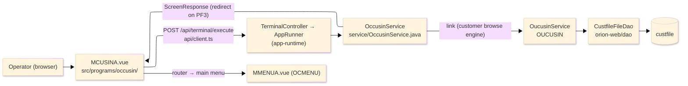
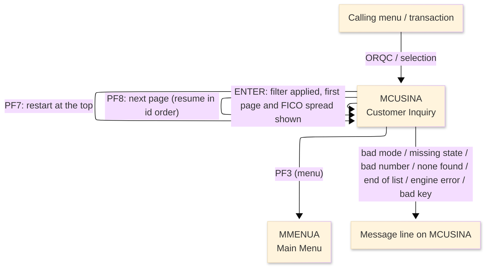
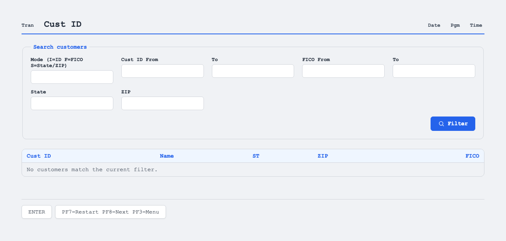

# TO-BE Screen Design — OCCUSIN_CustomerInquiry

> **Rule 1: TO-BE = AS-IS in business terms.** The interface moves to a web SPA, but the
> input/output data, the check conditions, the business flow and the database results are
> preserved. The section order follows the AS-IS document so the two compare 1-to-1.

## 0. Cover

| Item | Content |
|---|---|
| System | ORION-CCMS (ORION Credit Card Management System) |
| Subsystem | On-line (was CICS/BMS; now Vue SPA + REST) |
| Function name | Customer Inquiry |
| Function ID | OCCUSIN（COBOL program）／Trans-ID `ORQC`／Map `MCUSINA` |
| Module | `occusin` |
| Platform | Java 17 · Spring Boot 3.x · Vue 3 + TypeScript · DB Oracle (H2 in dev) |
| Version ／ Author ／ Date | 1 ／ modernizeX ／ 2026-09-28 |

## 1. Function overview

### 1.1 Overview diagram

System architecture — the screen, the request path to the server, the program service it runs, the
linked customer browse engine, and the data store the engine reads a page at a time.

### 1.2 Function overview

| # | Function | Implementation |
|---|---|---|
| 1 | Accept a search filter for the inquiry | The operator picks a filter mode (customer id range, FICO range, or state / ZIP) and keys the matching arguments |
| 2 | Retrieve and display the matching customers for review | The linked customer browse engine reads customers in id order and returns a page of up to thirteen that match, with a count and the minimum, average and maximum FICO |
| 3 | Let the operator page through and refine the filter | A next action fetches the following page, a restart action lists from the top, and a new filter re-runs the inquiry |
| 4 | Return to the calling menu when finished | The menu action ends the inquiry and returns the operator to the main menu |

**Roles ／ authorisation**: authenticated operator (signed on through the Sign On screen). Sign-on
state travels in the conversation carried between requests; no framework role gate is wired yet.

**Keys → operations** (the SPA renders each former PF key as a button):

| Key | Label as rendered (verbatim) | What it does |
|---|---|---|
| `ENTER` | `ENTER=FILTER` | apply the chosen filter and list the first page of matching customers |
| `PF7` | `PF7=RESTART` | restart the list from the top |
| `PF8` | `PF8=NEXT` | page forward to the next page of matching customers |
| `PF3` | `PF3=MENU` | return to the main menu |

> The middle column is the string the button really shows, copied from the program's button
> definitions. The physical PF keystrokes are not reproduced as keyboard shortcuts, so operators
> used to typing PF8 now click the `PF8=NEXT` button — same paging action, one extra pointer move.

### 1.3 Databases used

| № | Business name | Table | C | R | U | D |
|---|---|---|---|---|---|---|
| 1 | Customer master — read in id order by the linked browse engine | `custfile` | - | 〇 | - | - |

> This program itself opens no file; the read is performed by the linked customer browse engine
> (OUCUSIN), which browses `custfile` in customer-id order and returns each page of matching customers.

## 2. Screen spec

Screen transition of the whole function — every screen a box, every edge labelled with what moves
the operator. The list is paged: each page shows up to thirteen customers, read in customer-id order by
the linked browse engine, and each next page resumes from the key the previous page returned.

### 2.1 MCUSINA — Customer Inquiry

**Layout**

**Archetype applied**: filtered paged list with a summary line (`_archetypes/screenModel`, LIST). The
header carries the transaction/program/date/time meta strip; the body has a mode letter and the filter
argument boxes, a thirteen-row result grid (customer id, name, state, ZIP, FICO), and a summary line;
a message line and a button row close the screen.

| Area | Notes |
|---|---|
| Header (Tran/Prog/Date/Time) | meta strip above the title, filled by the server |
| Input area | one mode letter box plus the filter argument boxes (customer id from/to, FICO from/to, state, ZIP) |
| List area | up to thirteen rows, each a customer id, name, state, ZIP and FICO |
| Summary line | count and the minimum / average / maximum FICO across the matched customers |
| Message line | inline alert / paging hint below the list (was row 23 `ERRMSG`) |
| Button row | `ENTER=FILTER`, `PF7=RESTART`, `PF8=NEXT`, `PF3=MENU` |

**Screen items**

_State legend: ○ shown · 必 must be entered · □ read-only · － not shown._

| № | Item name | Field | Type ／ length | Control | Required | Initial | Key prompt | Record shown | Notes |
|---|---|---|---|---|---|---|---|---|---|
| 1 | Filter mode | `FMODE` | text, 1 | entry box, 1 char | 必 | ○ | 必 | □ | I id range · F FICO range · S state/ZIP; defaults to I |
| 2 | Customer id from | `FRID` | numeric text, 9 | entry box, 9 chars | - | ○ | ○ | □ | low end of the id range when the mode is id |
| 3 | Customer id to | `TOID` | numeric text, 9 | entry box, 9 chars | - | ○ | ○ | □ | high end of the id range when the mode is id |
| 4 | FICO from | `FRFICO` | numeric text, 3 | entry box, 3 chars | - | ○ | ○ | □ | low end of the FICO range when the mode is FICO |
| 5 | FICO to | `TOFICO` | numeric text, 3 | entry box, 3 chars | - | ○ | ○ | □ | high end of the FICO range when the mode is FICO |
| 6 | State | `FSTATE` | text, 2 | entry box, 2 chars | - | ○ | ○ | □ | required when the mode is state/ZIP |
| 7 | ZIP | `FZIP` | text, 10 | entry box, 10 chars | - | ○ | ○ | □ | optional ZIP when the mode is state/ZIP |
| 8 | Customer ID (each row) | `CUL1`…`CUL13` | numeric text, 9 | read-only | - | － | □ | □ | customer id for each listed row |
| 9 | Name (each row) | `CUN1`…`CUN13` | text, 30 | read-only | - | － | □ | □ | customer name for each listed row |
| 10 | State (each row) | `CST1`…`CST13` | text, 2 | read-only | - | － | □ | □ | state for each listed row |
| 11 | ZIP (each row) | `CZP1`…`CZP13` | text, 10 | read-only | - | － | □ | □ | ZIP for each listed row |
| 12 | FICO (each row) | `CFI1`…`CFI13` | numeric text, 3 | read-only | - | － | □ | □ | FICO score for each listed row |

> **Length and format unchanged**: the argument boxes keep their widths (mode 1, id from/to 9, FICO
> from/to 3, state 2, ZIP 10) and each result row keeps the same column widths (customer id 9, name 30,
> state 2, ZIP 10, FICO 3) as the terminal screen; the grid keeps its thirteen rows per page.

## 3. Check specifications

### 3.1 MCUSINA — Customer Inquiry

All strings below are the literal messages the server returns to the on-screen message line.
Type: E=Error / I=Information.

| No. | What is checked | When it is checked | Message code | Message shown | If it fails |
|---|---|---|---|---|---|
| 1 | Opening prompt (informational) | when the screen first appears | — | Choose filter mode I/F/S, key args, press ENTER. | not a failure; guides the operator |
| 2 | The filter mode must be one of the supported letters | on `ENTER`, before the inquiry | — | Mode must be I (id) F (fico) or S (state/zip). | nothing is listed; the entry stays |
| 3 | A keyed numeric argument must be valid | on `ENTER`, when a numeric argument is keyed | — | Numeric filter argument is not valid. | nothing is listed; the entry stays |
| 4 | A state must be given for the state/zip filter | on `ENTER`, when the mode is state/ZIP | — | State is required for the state/zip filter. | nothing is listed; the entry stays |
| 5 | The filter must match at least one customer | on `ENTER`, after the inquiry | — | No customers match the filter. | an empty list is shown |
| 6 | There must be more customers to page to | on `PF8`, when the last page is reached | — | End of list - no more customers. | the page stays as it was |
| 7 | The browse engine must be reachable | on `ENTER` / `PF7` / `PF8`, during the inquiry | — | Unable to link to browse engine OUCUSIN. | no page is shown |
| 8 | Result summary while more remain (informational) | after a page that has more customers | — | … match, FICO min/avg/max …  PF8=more PF7=top | not a failure; reports the count and FICO spread and offers paging |
| 9 | Result summary at the end (informational) | after the final page | — | … match, FICO min/avg/max …  End of list. | not a failure; the list is complete |
| 10 | Only a supported key may be used | on any key press | — | Invalid key pressed. Please try again. | the screen is redisplayed unchanged |

## 4. Event specifications

### 4.1 MCUSINA — Customer Inquiry

| No. | Event | What the system does | Result ／ next screen |
|---|---|---|---|
| 1 | The operator picks a mode, keys the arguments and presses `ENTER` | the filter is validated and the browse engine returns the first page of matching customers with the count and FICO spread | stays on Customer Inquiry with the first page, or a message when the mode or an argument is invalid or nothing matches |
| 2 | The operator presses `PF8` | the browse engine resumes from where the last page stopped and returns the next page | stays on Customer Inquiry with the next page, or a message when there are no more |
| 3 | The operator presses `PF7` | the list restarts from the top for the same filter | stays on Customer Inquiry showing the first page |
| 4 | The operator presses `PF3` | the inquiry ends and control returns to the calling menu | the main menu appears |
| 5 | The operator presses an unsupported key | the request is rejected and a message is shown | stays on Customer Inquiry, unchanged |

## 5. DB CRUD

**Update spec**

Not applicable — Customer Inquiry only reads, and it does so through the linked customer browse engine;
no row is created, updated or deleted. The engine browses `custfile` in customer-id order
(ORDER BY `cu_id`), keeps the rows that match the chosen filter, returns a page of up to thirteen with a
count and the minimum, average and maximum FICO, and hands back a resume key so the next page continues
in order.

**Column-level CRUD (per event ／ business type)**

| Table | Operation | Field | Value source | Transaction |
|---|---|---|---|---|
| `custfile` | SELECT (ordered browse by `cu_id`, via the linked engine) | customer id, name, state, ZIP, FICO | resumes from the saved key; filtered by the chosen mode and arguments | read-only; no commit |

## 6. API contract

| Request | Response | What it does | Errors |
|---|---|---|---|
| `POST /api/terminal/execute` — `{ programName: "OCCUSIN", aidKey, fields: { FMODE, FRID, TOID, FRFICO, TOFICO, FSTATE, FZIP } }` | `ScreenResponse` — `{ fields: { CUL1..CUL13, CUN1..CUN13, CST1..CST13, CZP1..CZP13, CFI1..CFI13 }, message, buttons }` | applies the filter and returns a page of matching customers with the count and FICO spread; `aidKey` selects filter (`ENTER`), restart (`PF7`) or next (`PF8`) | bad mode → "Mode must be I (id) F (fico) or S (state/zip)."; none → "No customers match the filter."; page past end → "End of list - no more customers."; engine down → "Unable to link to browse engine OUCUSIN." |

FE types: `src/programs/occusin/schemas.d.ts` (`MCUSINAFields`) · client: `src/api/client.ts` ·
endpoint: `TerminalController` (`/api/terminal/execute`), one round-trip per key press (CICS
pseudo-conversation, and the paging resume key, preserved through the HTTP session).
