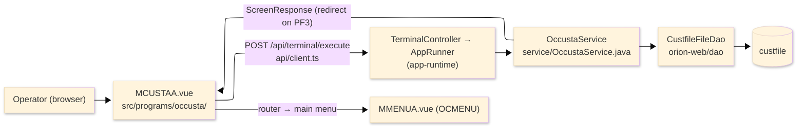
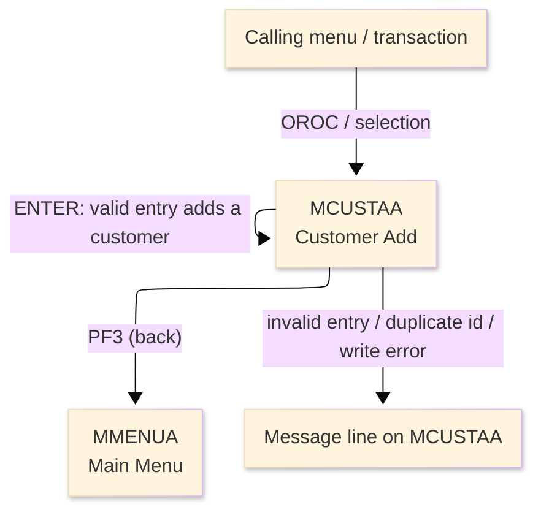
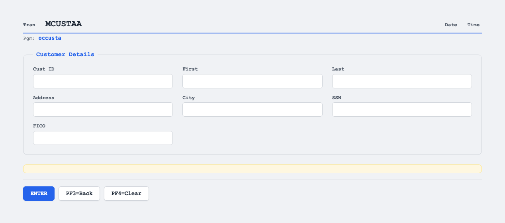

# TO-BE Screen Design — OCCUSTA_CustomerAdd

> **Rule 1: TO-BE = AS-IS in business terms.** The interface moves to a web SPA, but the
> input/output data, the check conditions, the business flow and the database results are
> preserved. The section order follows the AS-IS document so the two compare 1-to-1.

## 0. Cover

| Item | Content |
|---|---|
| System | ORION-CCMS (ORION Credit Card Management System) |
| Subsystem | On-line (was CICS/BMS; now Vue SPA + REST) |
| Function name | Customer Add |
| Function ID | OCCUSTA（COBOL program）／Trans-ID `OROC`／Map `MCUSTAA` |
| Module | `occusta` |
| Platform | Java 17 · Spring Boot 3.x · Vue 3 + TypeScript · DB Oracle (H2 in dev) |
| Version ／ Author ／ Date | 1 ／ modernizeX ／ 2026-09-28 |

## 1. Function overview

### 1.1 Overview diagram

System architecture — the screen, the request path to the server, the program service it runs,
and the data store it writes.

### 1.2 Function overview

| # | Function | Implementation |
|---|---|---|
| 1 | Accept the details for a new customer | The operator keys the id, names, address, city, social-security number and credit score into an entry form |
| 2 | Validate the entered values against the business rules | Each field is checked in turn and the first problem stops the add with a message on the screen |
| 3 | Create the new customer record on confirmation | When every field passes, a new row is inserted into `custfile` and the operator is told the customer was added |

**Roles ／ authorisation**: authenticated operator (signed on through the Sign On screen). Sign-on
state travels in the conversation carried between requests; no framework role gate is wired yet.

**Keys → operations** (the SPA renders each former PF key as a button):

| Key | Label as rendered (verbatim) | What it does |
|---|---|---|
| `ENTER` | `ENTER=PROCESS` | validate the entered values and add the new customer |
| `PF3` | `PF3=BACK` | return to the main menu |
| `PF4` | `PF4=CLEAR` | clear the entered values so the operator can start again |

> The middle column is the string the button really shows, copied from the program's button
> definitions. The physical PF keystrokes are not reproduced as keyboard shortcuts, so operators
> used to typing PF3 now click the `PF3=BACK` button — same action, one extra pointer move.

### 1.3 Databases used

| № | Business name | Table | C | R | U | D |
|---|---|---|---|---|---|---|
| 1 | Customer master — a new row is inserted on confirm | `custfile` | 〇 | - | - | - |

## 2. Screen spec

Screen transition of the whole function — every screen a box, every edge labelled with what moves
the operator.

### 2.1 MCUSTAA — Customer Add

**Layout**

**Archetype applied**: entry form that creates a record (`_archetypes/screenModel`). The header
carries the transaction/program/date/time meta strip; the body holds a column of entry boxes; a
message line and a button row close the screen.

| Area | Notes |
|---|---|
| Header (Tran/Prog/Date/Time) | meta strip above the title, filled by the server |
| Input area | seven entry boxes — id, first name, last name, address, city, SSN, FICO |
| Message line | inline alert below the form (was row 23 `ERRMSG`) |
| Button row | `ENTER=PROCESS`, `PF3=BACK`, `PF4=CLEAR` |

**Screen items**

_State legend: ○ shown · 必 must be entered · □ read-only · － not shown._

| № | Item name | Field | Type ／ length | Control | Required | Initial | Entry | After add | Notes |
|---|---|---|---|---|---|---|---|---|---|
| 1 | Customer ID | `CUSTID` | numeric text, 9 | entry box, 9 chars | 必 | ○ | 必 | ○ | must be numeric, up to 9 digits |
| 2 | First name | `CUFNAM` | text, 25 | entry box, 25 chars | 必 | ○ | 必 | ○ | required |
| 3 | Last name | `CULNAM` | text, 25 | entry box, 25 chars | 必 | ○ | 必 | ○ | required |
| 4 | Address | `CUADDR` | text, 50 | entry box, 50 chars | 必 | ○ | 必 | ○ | stored as address line 1 |
| 5 | City | `CUCITY` | text, 50 | entry box, 50 chars | 必 | ○ | 必 | ○ | required |
| 6 | SSN | `CUSSN` | numeric text, 9 | entry box, 9 chars | 必 | ○ | 必 | ○ | exactly nine numeric digits |
| 7 | FICO | `CUFICO` | numeric text, 3 | entry box, 3 chars | 必 | ○ | 必 | ○ | numeric, 300 through 850 |

> **Length and format unchanged**: each entry box accepts the same number of characters as the
> terminal field (id 9, names 25, address and city 50, SSN 9, FICO 3) and the server checks the same
> widths; after a successful add the screen re-initialises, ready for the next customer.

## 3. Check specifications

### 3.1 MCUSTAA — Customer Add

All strings below are the literal messages the server returns to the on-screen message line.
Type: E=Error / I=Information.

| No. | What is checked | When it is checked | Message code | Message shown | If it fails |
|---|---|---|---|---|---|
| 1 | Opening prompt (informational) | when the screen first appears | — | Enter new customer details and press ENTER. | not a failure; guides the operator |
| 2 | The customer id must be numeric | on `ENTER`, before the record is written | — | Customer id must be numeric. | the entry stays; the customer is not added |
| 3 | The first name must be entered | on `ENTER`, before the record is written | — | First name is required. | the entry stays; the customer is not added |
| 4 | The last name must be entered | on `ENTER`, before the record is written | — | Last name is required. | the entry stays; the customer is not added |
| 5 | The address must be entered | on `ENTER`, before the record is written | — | Address line 1 is required. | the entry stays; the customer is not added |
| 6 | The city must be entered | on `ENTER`, before the record is written | — | City is required. | the entry stays; the customer is not added |
| 7 | The SSN must be nine numeric digits | on `ENTER`, before the record is written | — | SSN must be nine numeric digits. | the entry stays; the customer is not added |
| 8 | The FICO score must be numeric | on `ENTER`, before the record is written | — | FICO score must be numeric. | the entry stays; the customer is not added |
| 9 | The FICO score must be in range | on `ENTER`, after it parses as a number | — | FICO score must be 300 through 850. | the entry stays; the customer is not added |
| 10 | The customer id must be unique | on `ENTER`, when the row is written | — | Customer id already exists. | no row is added; the operator picks another id |
| 11 | The customer store must be writable | on `ENTER`, when the row is written | — | Error writing the customer file. | no row is added; the entry stays |
| 12 | Only a supported key may be used | on any key press | — | Invalid key pressed. Please try again. | the screen is redisplayed unchanged |

## 4. Event specifications

### 4.1 MCUSTAA — Customer Add

| No. | Event | What the system does | Result ／ next screen |
|---|---|---|---|
| 1 | The operator fills the form and presses `ENTER` | every field is validated and, when all pass and the id is free, a new customer row is written | stays on Customer Add: "Customer added successfully." on success, or the first failing message |
| 2 | The operator presses `PF3` | the add is abandoned and control returns to the calling menu | the main menu appears |
| 3 | The operator presses `PF4` | the entered values are cleared and the opening prompt returns | stays on Customer Add, ready for a new entry |
| 4 | The operator presses an unsupported key | the request is rejected and a message is shown | stays on Customer Add, unchanged |

## 5. DB CRUD

**Update spec**

| Table | Operation | Field | Value source | Transaction |
|---|---|---|---|---|
| `custfile` | INSERT (add on `ENTER`) | whole customer row | the values the operator entered | one add; committed together |

**Column-level CRUD (per event ／ business type)**

| Table | Operation | Field | Value source | Transaction |
|---|---|---|---|---|
| `custfile` | INSERT | `cu_id` | the customer id the operator entered (PK) | add on `ENTER` |
| `custfile` | INSERT | `cu_first_name` | the first name the operator entered | add on `ENTER` |
| `custfile` | INSERT | `cu_middle_name` | space (not captured on this screen) | add on `ENTER` |
| `custfile` | INSERT | `cu_last_name` | the last name the operator entered | add on `ENTER` |
| `custfile` | INSERT | `cu_addr_line_1` | the address the operator entered | add on `ENTER` |
| `custfile` | INSERT | `cu_addr_line_2` | space (not captured on this screen) | add on `ENTER` |
| `custfile` | INSERT | `cu_addr_city` | the city the operator entered | add on `ENTER` |
| `custfile` | INSERT | `cu_addr_state` | space (not captured on this screen) | add on `ENTER` |
| `custfile` | INSERT | `cu_addr_country` | space (not captured on this screen) | add on `ENTER` |
| `custfile` | INSERT | `cu_addr_zip` | space (not captured on this screen) | add on `ENTER` |
| `custfile` | INSERT | `cu_phone_1` | space (not captured on this screen) | add on `ENTER` |
| `custfile` | INSERT | `cu_phone_2` | space (not captured on this screen) | add on `ENTER` |
| `custfile` | INSERT | `cu_ssn` | the SSN the operator entered | add on `ENTER` |
| `custfile` | INSERT | `cu_govt_id` | space (not captured on this screen) | add on `ENTER` |
| `custfile` | INSERT | `cu_dob` | space (not captured on this screen) | add on `ENTER` |
| `custfile` | INSERT | `cu_fico_score` | the FICO score the operator entered | add on `ENTER` |

## 6. API contract

| Request | Response | What it does | Errors |
|---|---|---|---|
| `POST /api/terminal/execute` — `{ programName: "OCCUSTA", aidKey, fields: { CUSTID, CUFNAM, CULNAM, CUADDR, CUCITY, CUSSN, CUFICO } }` | `ScreenResponse` — `{ fields, message, buttons }` | validates the fields and inserts a new customer row, or returns the first failing message | invalid field → the matching message; duplicate id → "Customer id already exists."; write failure → "Error writing the customer file." |

FE types: `src/programs/occusta/schemas.d.ts` (`MCUSTAAFields`) · client: `src/api/client.ts` ·
endpoint: `TerminalController` (`/api/terminal/execute`), one round-trip per key press (CICS
pseudo-conversation preserved through the HTTP session).
