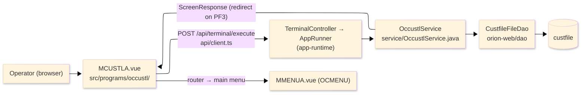
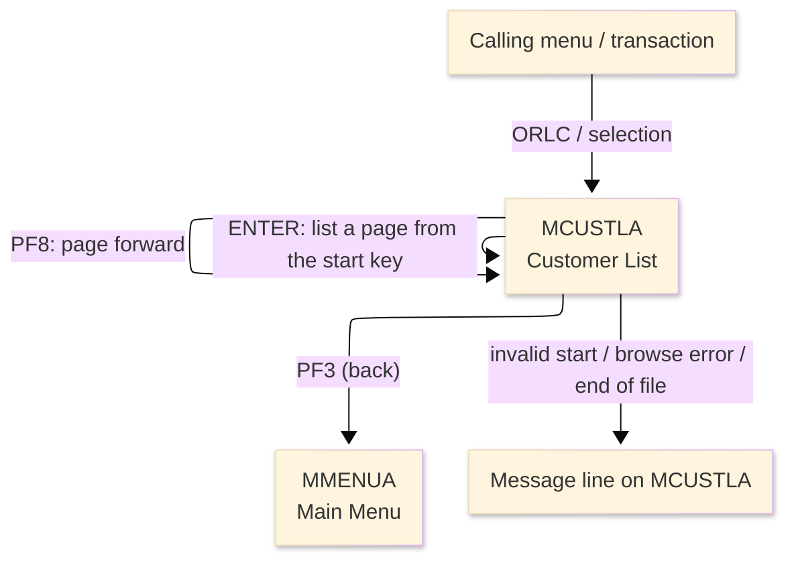
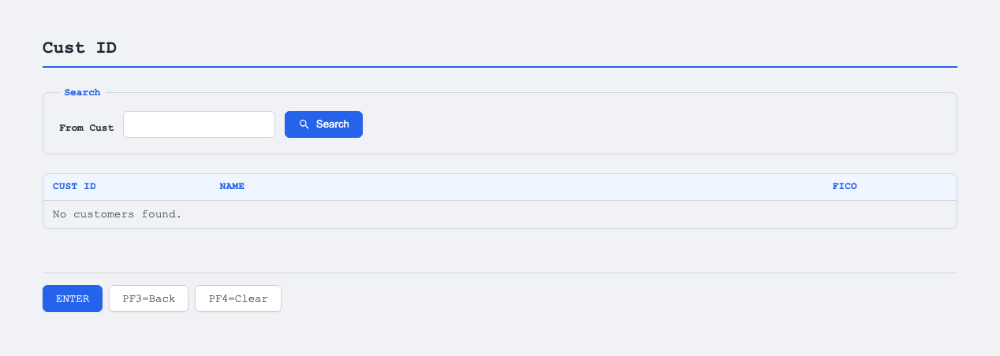

# TO-BE Screen Design — OCCUSTL_CustomerList

> **Rule 1: TO-BE = AS-IS in business terms.** The interface moves to a web SPA, but the
> input/output data, the check conditions, the business flow and the database results are
> preserved. The section order follows the AS-IS document so the two compare 1-to-1.

## 0. Cover

| Item | Content |
|---|---|
| System | ORION-CCMS (ORION Credit Card Management System) |
| Subsystem | On-line (was CICS/BMS; now Vue SPA + REST) |
| Function name | Customer List |
| Function ID | OCCUSTL（COBOL program）／Trans-ID `ORLC`／Map `MCUSTLA` |
| Module | `occustl` |
| Platform | Java 17 · Spring Boot 3.x · Vue 3 + TypeScript · DB Oracle (H2 in dev) |
| Version ／ Author ／ Date | 1 ／ modernizeX ／ 2026-09-28 |

## 1. Function overview

### 1.1 Overview diagram

System architecture — the screen, the request path to the server, the program service it runs,
and the data store it reads.

### 1.2 Function overview

| # | Function | Implementation |
|---|---|---|
| 1 | List customer records a page at a time | Starting at the keyed customer id, up to four rows are read in id order from `custfile` |
| 2 | Let the operator page forward through the result set | The next-page position is remembered so the following page continues where the last one ended |
| 3 | Show each customer's id, name and credit score | Each listed row displays the id, the last-and-first name and the FICO score |

**Roles ／ authorisation**: authenticated operator (signed on through the Sign On screen). Sign-on
state travels in the conversation carried between requests; no framework role gate is wired yet.

**Keys → operations** (the SPA renders each former PF key as a button):

| Key | Label as rendered (verbatim) | What it does |
|---|---|---|
| `ENTER` | `ENTER=PROCESS` | read the start key and list the first page of customers |
| `PF3` | `PF3=BACK` | return to the main menu |
| `PF4` | `PF4=CLEAR` | clear the start key and reset the list |
| `PF8` | `PF8` | page forward to the next set of customers |

> The middle column is the string the button really shows, copied from the program's button
> definitions. The physical PF keystrokes are not reproduced as keyboard shortcuts, so operators
> used to typing PF8 now click the `PF8` button — same action, one extra pointer move.

### 1.3 Databases used

| № | Business name | Table | C | R | U | D |
|---|---|---|---|---|---|---|
| 1 | Customer master — browsed in id order to build each page | `custfile` | - | 〇 | - | - |

## 2. Screen spec

Screen transition of the whole function — every screen a box, every edge labelled with what moves
the operator.

### 2.1 MCUSTLA — Customer List

**Layout**

**Archetype applied**: paged list with a start-key entry (`_archetypes/screenModel`). The header
carries the transaction/program/date/time meta strip; the body has one start-key box above a table
of up to four customer rows; a message line and a button row close the screen.

| Area | Notes |
|---|---|
| Header (Tran/Prog/Date/Time) | meta strip above the title, filled by the server |
| Input area | one entry box — the start customer id (blank starts from the first) |
| List area | up to four rows, each with Cust ID, Name and FICO columns |
| Message line | inline alert / count summary below the list (was row 23 `ERRMSG`) |
| Button row | `ENTER=PROCESS`, `PF3=BACK`, `PF4=CLEAR`, `PF8` |

**Screen items**

_State legend: ○ shown · 必 must be entered · □ read-only · － not shown._

| № | Item name | Field | Type ／ length | Control | Required | Initial | Before list | Page shown | Notes |
|---|---|---|---|---|---|---|---|---|---|
| 1 | Start customer id | `FRCUST` | numeric text, 9 | entry box, 9 chars | - | ○ | ○ | □ | blank starts from the first; else numeric up to 9 digits |
| 2 | Cust ID (row) | `CUL1`..`CUL4` | numeric text, 9 | read-only list cell | - | － | － | □ | id, right-aligned to 9 digits; repeats for up to 4 rows |
| 3 | Name (row) | `CUN1`..`CUN4` | text, 30 | read-only list cell | - | － | － | □ | last name, first name; repeats for up to 4 rows |
| 4 | FICO (row) | `CUF1`..`CUF4` | numeric text, 3 | read-only list cell | - | － | － | □ | credit score, 3 digits; repeats for up to 4 rows |

> **Length and format unchanged**: the start-key box accepts 9 characters as on the terminal, each
> page holds the same four rows, and the id/name/score columns keep their 9/30/3 widths.

## 3. Check specifications

### 3.1 MCUSTLA — Customer List

All strings below are the literal messages the server returns to the on-screen message line.
Type: E=Error / I=Information.

| No. | What is checked | When it is checked | Message code | Message shown | If it fails |
|---|---|---|---|---|---|
| 1 | Opening prompt (informational) | when the screen first appears | — | Enter start customer id (or blank) and ENTER. | not a failure; guides the operator |
| 2 | A typed start id must be numeric | on `ENTER`, when the start box is not blank | — | Start customer id must be numeric. | the list is not built; the start box keeps focus |
| 3 | Customers must exist from that point | on `ENTER`, after the page is read | — | No customers found from that point. | the list stays empty |
| 4 | The customer store must be browsable | on `ENTER` / `PF8`, during the read | — | Error browsing the customer file. | the list stays empty |
| 5 | There must be more customers to page to | on `PF8`, when no further rows are read | — | End of file - no more customers. | the current page stays; nothing new is added |
| 6 | Count of rows displayed (informational) | on `ENTER` / `PF8`, after a page is built | — | (count) customer(s) displayed. | not a failure; confirms how many rows are shown |
| 7 | Only a supported key may be used | on any key press | — | Invalid key pressed. Please try again. | the screen is redisplayed unchanged |

## 4. Event specifications

### 4.1 MCUSTLA — Customer List

| No. | Event | What the system does | Result ／ next screen |
|---|---|---|---|
| 1 | The operator enters a start id (or leaves it blank) and presses `ENTER` | up to four customers are read in id order from the start point and listed | stays on Customer List with the page and a count, or a message when none are found |
| 2 | The operator presses `PF8` | the next page of customers is read from the remembered position and listed | stays on Customer List with the next page, or "End of file - no more customers." |
| 3 | The operator presses `PF3` | the list ends and control returns to the calling menu | the main menu appears |
| 4 | The operator presses `PF4` | the start key and the list are cleared and the opening prompt returns | stays on Customer List, ready for a new start id |
| 5 | The operator presses an unsupported key | the request is rejected and a message is shown | stays on Customer List, unchanged |

## 5. DB CRUD

**Update spec**

Not applicable — the Customer List only reads; no row is created, updated or deleted.

**Column-level CRUD (per event ／ business type)**

| Table | Operation | Field | Value source | Transaction |
|---|---|---|---|---|
| `custfile` | SELECT (browse from key) | `cu_id` | the start customer id, then the remembered next-page position | read-only; no commit |
| `custfile` | SELECT (browse from key) | `cu_last_name`, `cu_first_name` | shown together as the Name column | read-only; no commit |
| `custfile` | SELECT (browse from key) | `cu_fico_score` | shown as the FICO column | read-only; no commit |

## 6. API contract

| Request | Response | What it does | Errors |
|---|---|---|---|
| `POST /api/terminal/execute` — `{ programName: "OCCUSTL", aidKey, fields: { FRCUST } }` | `ScreenResponse` — `{ fields: { CUL1..CUL4, CUN1..CUN4, CUF1..CUF4 }, message, buttons }` | reads up to four customers in id order from the start key, or pages forward | non-numeric start → "Start customer id must be numeric."; none → "No customers found from that point."; end → "End of file - no more customers." |

FE types: `src/programs/occustl/schemas.d.ts` (`MCUSTLAFields`) · client: `src/api/client.ts` ·
endpoint: `TerminalController` (`/api/terminal/execute`), one round-trip per key press (CICS
pseudo-conversation preserved through the HTTP session).
