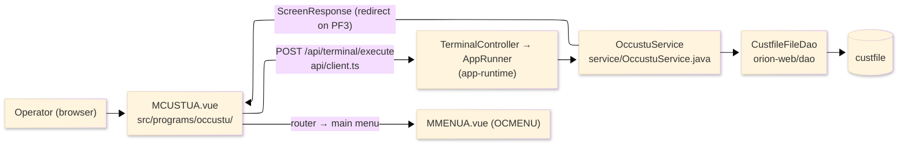
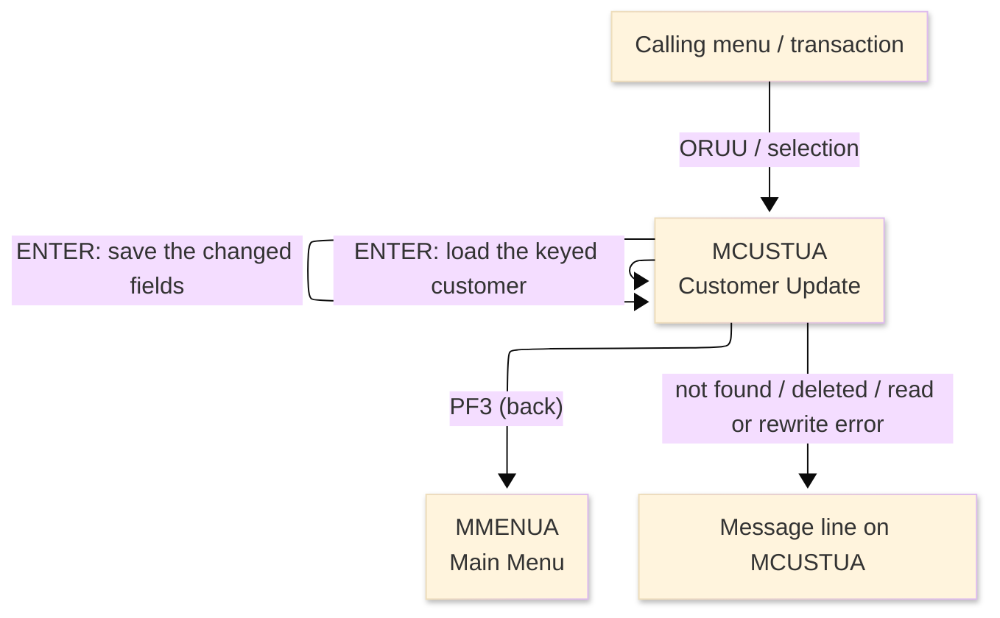
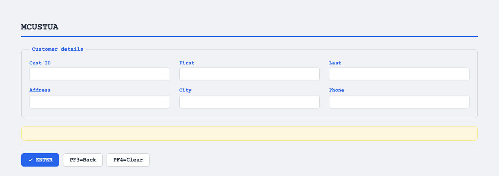

# TO-BE Screen Design — OCCUSTU_CustomerUpdate

> **Rule 1: TO-BE = AS-IS in business terms.** The interface moves to a web SPA, but the
> input/output data, the check conditions, the business flow and the database results are
> preserved. The section order follows the AS-IS document so the two compare 1-to-1.

## 0. Cover

| Item | Content |
|---|---|
| System | ORION-CCMS (ORION Credit Card Management System) |
| Subsystem | On-line (was CICS/BMS; now Vue SPA + REST) |
| Function name | Customer Update |
| Function ID | OCCUSTU（COBOL program）／Trans-ID `ORUU`／Map `MCUSTUA` |
| Module | `occustu` |
| Platform | Java 17 · Spring Boot 3.x · Vue 3 + TypeScript · DB Oracle (H2 in dev) |
| Version ／ Author ／ Date | 1 ／ modernizeX ／ 2026-09-28 |

## 1. Function overview

### 1.1 Overview diagram

System architecture — the screen, the request path to the server, the program service it runs,
and the data store it reads and rewrites.

### 1.2 Function overview

| # | Function | Implementation |
|---|---|---|
| 1 | Look up a customer by id and show the current values | The keyed id is read by primary key from `custfile` and the editable fields are filled in |
| 2 | Let the operator change the editable fields | First name, last name, address, city and phone can be re-typed once the record is loaded |
| 3 | Validate the changes and save them back on confirmation | The changed fields are re-checked, the row is re-read for update and rewritten in place |

**Roles ／ authorisation**: authenticated operator (signed on through the Sign On screen). Sign-on
state travels in the conversation carried between requests; no framework role gate is wired yet.

**Keys → operations** (the SPA renders each former PF key as a button):

| Key | Label as rendered (verbatim) | What it does |
|---|---|---|
| `ENTER` | `ENTER=PROCESS` | load the keyed customer, then save the changes on the next press |
| `PF3` | `PF3=BACK` | return to the main menu |
| `PF4` | `PF4=CLEAR` | clear the screen so the operator can start again |

> The middle column is the string the button really shows, copied from the program's button
> definitions. The physical PF keystrokes are not reproduced as keyboard shortcuts, so operators
> used to typing PF3 now click the `PF3=BACK` button — same action, one extra pointer move.

### 1.3 Databases used

| № | Business name | Table | C | R | U | D |
|---|---|---|---|---|---|---|
| 1 | Customer master — read by id, then rewritten in place on save | `custfile` | - | 〇 | 〇 | - |

## 2. Screen spec

Screen transition of the whole function — every screen a box, every edge labelled with what moves
the operator.

### 2.1 MCUSTUA — Customer Update

**Layout**

**Archetype applied**: load-then-edit form with a single lookup key (`_archetypes/screenModel`). The
header carries the transaction/program/date/time meta strip; the body has the id lookup box above the
editable customer fields; a message line and a button row close the screen.

| Area | Notes |
|---|---|
| Header (Tran/Prog/Date/Time) | meta strip above the title, filled by the server |
| Input area | the id lookup box plus first name, last name, address, city and phone |
| Message line | inline alert below the form (was row 23 `ERRMSG`) |
| Button row | `ENTER=PROCESS`, `PF3=BACK`, `PF4=CLEAR` |

**Screen items**

_State legend: ○ shown · 必 must be entered · □ read-only · － not shown._

| № | Item name | Field | Type ／ length | Control | Required | Initial | Record loaded | Confirm save | Notes |
|---|---|---|---|---|---|---|---|---|---|
| 1 | Customer ID | `CUSTID` | numeric text, 9 | entry box, 9 chars | 必 | ○ | ○ | □ | lookup key; must be numeric |
| 2 | First name | `CUFNAM` | text, 25 | entry box, 25 chars | 必 | ○ | ○ | □ | filled from the record, then editable |
| 3 | Last name | `CULNAM` | text, 25 | entry box, 25 chars | 必 | ○ | ○ | □ | filled from the record, then editable |
| 4 | Address | `CUADDR` | text, 50 | entry box, 50 chars | 必 | ○ | ○ | □ | stored as address line 1 |
| 5 | City | `CUCITY` | text, 50 | entry box, 50 chars | 必 | ○ | ○ | □ | filled from the record, then editable |
| 6 | Phone | `CUPHONE` | text, 15 | entry box, 15 chars | 必 | ○ | ○ | □ | stored as primary phone |

> **Length and format unchanged**: each entry box accepts the same number of characters as the
> terminal field (id 9, names 25, address and city 50, phone 15) and the server checks the same
> widths; only first name, last name, address, city and phone are written back.

## 3. Check specifications

### 3.1 MCUSTUA — Customer Update

All strings below are the literal messages the server returns to the on-screen message line.
Type: E=Error / I=Information.

| No. | What is checked | When it is checked | Message code | Message shown | If it fails |
|---|---|---|---|---|---|
| 1 | Opening prompt (informational) | when the screen first appears | — | Enter a customer id and press ENTER to load. | not a failure; guides the operator |
| 2 | The customer id must be entered | on `ENTER`, before the load | — | Customer id is required. | the cursor stays on the id; nothing is read |
| 3 | The customer id must be numeric | on `ENTER`, before the load | — | Customer id must be numeric. | the cursor stays on the id; nothing is read |
| 4 | The keyed customer must exist | on `ENTER`, after the load read | — | Customer not found - check the id and retry. | the fields stay empty; nothing is loaded |
| 5 | Record loaded (informational) | on `ENTER`, after a successful load | — | Record loaded - change fields and ENTER to save. | not a failure; the fields are now editable |
| 6 | The first name must be entered | on `ENTER`, before the save | — | First name is required. | the row is not rewritten; focus returns to first name |
| 7 | The last name must be entered | on `ENTER`, before the save | — | Last name is required. | the row is not rewritten; focus returns to last name |
| 8 | The address must be entered | on `ENTER`, before the save | — | Address line 1 is required. | the row is not rewritten; focus returns to address |
| 9 | The city must be entered | on `ENTER`, before the save | — | City is required. | the row is not rewritten; focus returns to city |
| 10 | The primary phone must be entered | on `ENTER`, before the save | — | Primary phone is required. | the row is not rewritten; focus returns to phone |
| 11 | The record must still be on file | on `ENTER`, when re-read for update | — | Record no longer on file - reload the id. | nothing is written; the operator reloads the id |
| 12 | The customer store must be readable | on `ENTER`, during a read | — | Error reading the customer file. | the fields stay as they were; nothing is loaded |
| 13 | The rewrite must succeed | on `ENTER`, when the row is written back | — | Error rewriting the customer record. | the row is left unchanged |
| 14 | Saved (informational) | on `ENTER`, after a successful rewrite | — | Customer updated successfully. | not a failure; the change is committed |
| 15 | Only a supported key may be used | on any key press | — | Invalid key pressed. Please try again. | the screen is redisplayed unchanged |

## 4. Event specifications

### 4.1 MCUSTUA — Customer Update

| No. | Event | What the system does | Result ／ next screen |
|---|---|---|---|
| 1 | The operator enters an id and presses `ENTER` | the keyed customer is read and its current values are shown for editing | stays on Customer Update with the record loaded, or "Customer not found - check the id and retry." |
| 2 | The operator changes fields and presses `ENTER` with a record loaded | the changed fields are validated, the row is re-read and rewritten in place | stays on Customer Update: "Customer updated successfully." on success, or the first failing message |
| 3 | The operator presses `PF3` | the update is abandoned and control returns to the calling menu | the main menu appears |
| 4 | The operator presses `PF4` | the screen is cleared and the opening prompt returns | stays on Customer Update, ready for a new id |
| 5 | The operator presses an unsupported key | the request is rejected and a message is shown | stays on Customer Update, unchanged |

## 5. DB CRUD

**Update spec**

| Table | Operation | Field | Value source | Transaction |
|---|---|---|---|---|
| `custfile` | UPDATE (read then rewrite by key) | `cu_first_name`, `cu_last_name`, `cu_addr_line_1`, `cu_addr_city`, `cu_phone_1` | the values the operator changed | one save; re-read for update then rewrite in place |

**Column-level CRUD (per event ／ business type)**

| Table | Operation | Field | Value source | Transaction |
|---|---|---|---|---|
| `custfile` | SELECT (read by key) | whole record | the customer id the operator entered | load step; no commit |
| `custfile` | SELECT FOR UPDATE (read by key) | whole record | the loaded customer id (unchanged) | save step; locks the row |
| `custfile` | UPDATE | `cu_first_name` | the first name the operator entered | save on `ENTER` |
| `custfile` | UPDATE | `cu_last_name` | the last name the operator entered | save on `ENTER` |
| `custfile` | UPDATE | `cu_addr_line_1` | the address the operator entered | save on `ENTER` |
| `custfile` | UPDATE | `cu_addr_city` | the city the operator entered | save on `ENTER` |
| `custfile` | UPDATE | `cu_phone_1` | the phone the operator entered | save on `ENTER` |

## 6. API contract

| Request | Response | What it does | Errors |
|---|---|---|---|
| `POST /api/terminal/execute` — `{ programName: "OCCUSTU", aidKey, fields: { CUSTID, CUFNAM, CULNAM, CUADDR, CUCITY, CUPHONE } }` | `ScreenResponse` — `{ fields, message, buttons }` | loads the keyed customer, then validates and rewrites the changed fields | blank id → "Customer id is required."; missing → "Customer not found - check the id and retry."; rewrite failure → "Error rewriting the customer record." |

FE types: `src/programs/occustu/schemas.d.ts` (`MCUSTUAFields`) · client: `src/api/client.ts` ·
endpoint: `TerminalController` (`/api/terminal/execute`), one round-trip per key press (CICS
pseudo-conversation preserved through the HTTP session).
