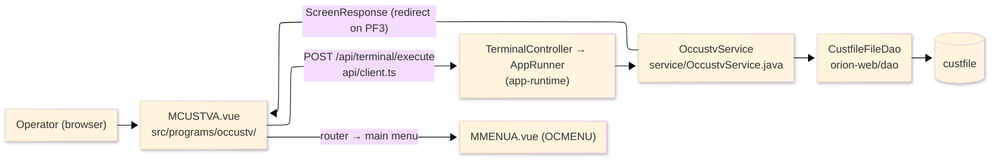
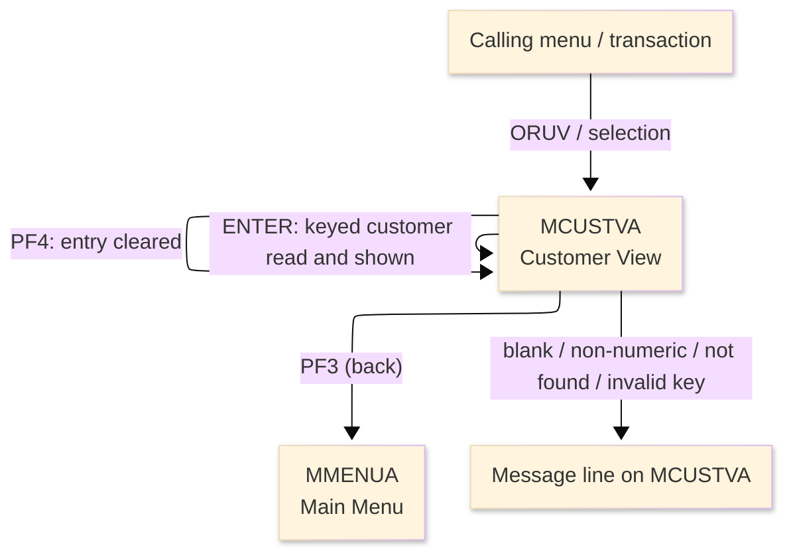
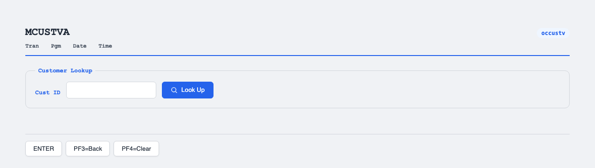

# TO-BE Screen Design — OCCUSTV_CustomerView

> **Rule 1: TO-BE = AS-IS in business terms.** The interface moves to a web SPA, but the
> input/output data, the check conditions, the business flow and the database results are
> preserved. The section order follows the AS-IS document so the two compare 1-to-1.

## 0. Cover

| Item | Content |
|---|---|
| System | ORION-CCMS (ORION Credit Card Management System) |
| Subsystem | On-line (was CICS/BMS; now Vue SPA + REST) |
| Function name | Customer View |
| Function ID | OCCUSTV（COBOL program）／Trans-ID `ORUV`／Map `MCUSTVA` |
| Module | `occustv` |
| Platform | Java 17 · Spring Boot 3.x · Vue 3 + TypeScript · DB Oracle (H2 in dev) |
| Version ／ Author ／ Date | 1 ／ modernizeX ／ 2026-09-28 |

## 1. Function overview

### 1.1 Overview diagram

System architecture — the screen, the request path to the server, the program service it runs,
and the data store it reads.

### 1.2 Function overview

| # | Function | Implementation |
|---|---|---|
| 1 | Look up a customer by its customer id | The operator enters the id and the customer record is read by primary key from `custfile` |
| 2 | Show the current customer details in read-only form | Name, address, city, phone and score are displayed; nothing on this screen is editable |
| 3 | Return to the calling menu when finished | The back action ends the view and returns the operator to the main menu |

**Roles ／ authorisation**: authenticated operator (signed on through the Sign On screen). Sign-on
state travels in the conversation carried between requests; no framework role gate is wired yet.

**Keys → operations** (the SPA renders each former PF key as a button):

| Key | Label as rendered (verbatim) | What it does |
|---|---|---|
| `ENTER` | `ENTER=PROCESS` | read the keyed customer and show its details |
| `PF3` | `PF3=BACK` | return to the main menu |
| `PF4` | `PF4=CLEAR` | clear the entry so the operator can start again |

> The middle column is the string the button really shows, copied from the program's button
> definitions. The physical PF keystrokes are not reproduced as keyboard shortcuts, so operators
> used to typing PF3 now click the `PF3=BACK` button — same action, one extra pointer move.

### 1.3 Databases used

| № | Business name | Table | C | R | U | D |
|---|---|---|---|---|---|---|
| 1 | Customer master — read by customer id to show the detail | `custfile` | - | 〇 | - | - |

## 2. Screen spec

Screen transition of the whole function — every screen a box, every edge labelled with what moves
the operator.

### 2.1 MCUSTVA — Customer View

**Layout**

**Archetype applied**: display form with a single lookup key (`_archetypes/screenModel`). The header
carries the transaction/program/date/time meta strip; the body has one entry box and a read-only
details block; a message line and a button row close the screen.

| Area | Notes |
|---|---|
| Header (Tran/Prog/Date/Time) | meta strip above the title, filled by the server |
| Input area | one entry box — the customer id lookup key |
| Details area | read-only outputs: name, address, city, phone, score |
| Message line | inline alert below the form (was row 23 `ERRMSG`) |
| Button row | `ENTER=PROCESS`, `PF3=BACK`, `PF4=CLEAR` |

**Screen items**

_State legend: ○ shown · 必 must be entered · □ read-only · － not shown._

| № | Item name | Field | Type ／ length | Control | Required | Initial | Key prompt | Record shown | Notes |
|---|---|---|---|---|---|---|---|---|---|
| 1 | Customer ID | `CUSTID` | numeric text, 9 | entry box, 9 chars | 必 | ○ | 必 | □ | lookup key; kept at 9 as in the source |
| 2 | Name | `CUNAME` | text, 50 | read-only | - | － | □ | □ | first and last name joined |
| 3 | Address | `CUADDR` | text, 50 | read-only | - | － | □ | □ | first address line |
| 4 | City | `CUCITY` | text, 50 | read-only | - | － | □ | □ | city as stored |
| 5 | Phone | `CUPHONE` | text, 15 | read-only | - | － | □ | □ | primary phone number |
| 6 | FICO | `CUFICO` | numeric text, 3 | read-only | - | － | □ | □ | credit score, shown as 3 digits |

> **Length and format unchanged**: the entry box accepts 9 characters and the server reads the same
> 9-digit key; the name, address, phone and score are shown with the same widths as the terminal
> screen.

## 3. Check specifications

### 3.1 MCUSTVA — Customer View

All strings below are the literal messages the server returns to the on-screen message line.
Type: E=Error / I=Information.

| No. | What is checked | When it is checked | Message code | Message shown | If it fails |
|---|---|---|---|---|---|
| 1 | Opening prompt (informational) | when the screen first appears | — | Enter a customer id and press ENTER. | not a failure; guides the operator |
| 2 | The customer id must be entered | on `ENTER`, before the lookup | — | Customer id is required. | the entry stays; nothing is read |
| 3 | The customer id must be numeric | on `ENTER`, before the lookup | — | Customer id must be numeric. | the entry stays; nothing is read |
| 4 | The keyed customer must exist | on `ENTER`, after the lookup | — | Customer not found - check the id and retry. | no details are shown |
| 5 | The customer store must be readable | on `ENTER`, during the lookup | — | Error reading the customer file. | no details are shown |
| 6 | Only a supported key may be used | on any other key press | — | Invalid key pressed. Please try again. | the screen is redisplayed unchanged |

## 4. Event specifications

### 4.1 MCUSTVA — Customer View

| No. | Event | What the system does | Result ／ next screen |
|---|---|---|---|
| 1 | The operator enters an id and presses `ENTER` | the keyed customer is read and the name, address, city, phone and score are filled in | stays on Customer View with the details shown, or a message when the id is blank, non-numeric or not found |
| 2 | The operator presses `PF3` | the view ends and control returns to the calling menu | the main menu appears |
| 3 | The operator presses `PF4` | the entered value is cleared and the opening prompt returns | stays on Customer View, ready for a new id |
| 4 | The operator presses an unsupported key | the request is rejected and a message is shown | stays on Customer View, unchanged |

## 5. DB CRUD

**Update spec**

Not applicable — Customer View only reads; no row is created, updated or deleted.

**Column-level CRUD (per event ／ business type)**

| Table | Operation | Field | Value source | Transaction |
|---|---|---|---|---|
| `custfile` | SELECT (read by key) | whole record | the customer id the operator entered | read-only; no commit |

## 6. API contract

| Request | Response | What it does | Errors |
|---|---|---|---|
| `POST /api/terminal/execute` — `{ programName: "OCCUSTV", aidKey, fields: { CUSTID } }` | `ScreenResponse` — `{ fields: { CUNAME, CUADDR, CUCITY, CUPHONE, CUFICO }, message, buttons }` | reads the customer by key and returns its detail fields, or a message | blank id → "Customer id is required."; non-numeric → "Customer id must be numeric."; missing → "Customer not found - check the id and retry."; read error → "Error reading the customer file." |

FE types: `src/programs/occustv/schemas.d.ts` (`MCUSTVAFields`) · client: `src/api/client.ts` ·
endpoint: `TerminalController` (`/api/terminal/execute`), one round-trip per key press (CICS
pseudo-conversation preserved through the HTTP session).
