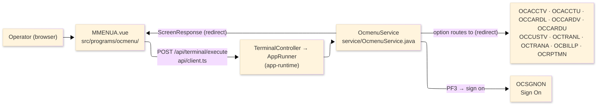
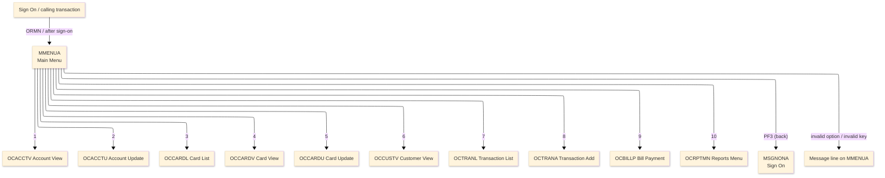
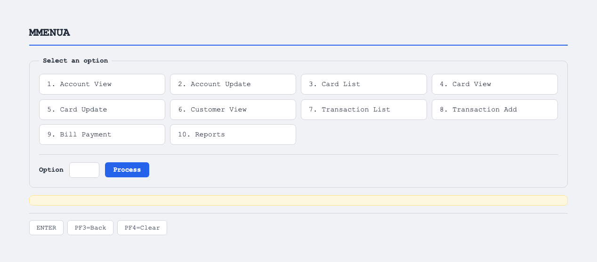

# TO-BE Screen Design — OCMENU_MainMenu

> **Rule 1: TO-BE = AS-IS in business terms.** The interface moves to a web SPA, but the
> input/output data, the check conditions, the business flow and the routing are preserved. The
> section order follows the AS-IS document so the two compare 1-to-1.

## 0. Cover

| Item | Content |
|---|---|
| System | ORION-CCMS (ORION Credit Card Management System) |
| Subsystem | On-line (was CICS/BMS; now Vue SPA + REST) |
| Function name | Main Menu |
| Function ID | OCMENU（COBOL program）／Trans-ID `ORMN`／Map `MMENUA` |
| Module | `ocmenu` |
| Platform | Java 17 · Spring Boot 3.x · Vue 3 + TypeScript · DB Oracle (H2 in dev) |
| Version ／ Author ／ Date | 1 ／ modernizeX ／ 2026-09-28 |

## 1. Function overview

### 1.1 Overview diagram

System architecture — the screen, the request path to the server, the program service it runs, and
the functions it routes the operator to.

### 1.2 Function overview

| # | Function | Implementation |
|---|---|---|
| 1 | Present the available functions as a numbered option list | Ten menu choices are shown and the operator types the number of the one they want |
| 2 | Route the operator to the matching function | The chosen number is checked and control passes to the corresponding program |
| 3 | Return the operator to the sign-on screen on exit | The back action leaves the menu and returns to the sign-on screen |

**Roles ／ authorisation**: authenticated operator (signed on through the Sign On screen). When the
menu is reached without an active conversation the operator is first sent to the sign-on screen.

**Keys → operations** (the SPA renders each former PF key as a button):

| Key | Label as rendered (verbatim) | What it does |
|---|---|---|
| `ENTER` | `ENTER=PROCESS` | check the chosen option and route to the matching function |
| `PF3` | `PF3=BACK` | return to the sign-on screen |
| `PF4` | `PF4=CLEAR` | rendered button; the program acts only on ENTER and PF3, so any other key returns the unsupported-key message |

> The middle column is the string the button really shows, copied from the program's button
> definitions. The physical PF keystrokes are not reproduced as keyboard shortcuts, so operators
> used to typing PF3 now click the `PF3=BACK` button — same action, one extra pointer move.

### 1.3 Databases used

| № | Business name | Table | C | R | U | D |
|---|---|---|---|---|---|---|
| 1 | Navigation only — the target function opens its own data | — | - | - | - | - |

## 2. Screen spec

Screen transition of the whole function — every screen a box, every edge labelled with what moves
the operator. Each menu number routes to one function.

### 2.1 MMENUA — Main Menu

**Layout**

**Archetype applied**: routing menu with a single option entry (`_archetypes/screenModel`). The
header carries the transaction/program/date/time meta strip; the body lists the ten numbered
choices with one option box; a message line and a button row close the screen.

| Area | Notes |
|---|---|
| Header (Tran/Prog/Date/Time) | meta strip above the title, filled by the server |
| Option list | ten fixed captions: Account View, Account Update, Card List, Card View, Card Update, Customer View, Transaction List, Transaction Add, Bill Payment, Reports |
| Input area | one entry box — the option number (1–10) |
| Message line | inline alert below the list (was row 23 `ERRMSG`) |
| Button row | `ENTER=PROCESS`, `PF3=BACK`, `PF4=CLEAR` |

**Screen items**

_State legend: ○ shown · 必 must be entered · □ read-only · － not shown._

| № | Item name | Field | Type ／ length | Control | Required | Initial | Key prompt | Record shown | Notes |
|---|---|---|---|---|---|---|---|---|---|
| 1 | Option | `OPTION` | numeric text, 2 | entry box, 2 chars | 必 | ○ | 必 | － | the menu number 1–10 |

> **Length and format unchanged**: the option box accepts the same 2 characters as the terminal
> field and the ten captions keep their original wording.

## 3. Check specifications

### 3.1 MMENUA — Main Menu

All strings below are the literal messages the server returns to the on-screen message line.
Type: E=Error / I=Information.

| No. | What is checked | When it is checked | Message code | Message shown | If it fails |
|---|---|---|---|---|---|
| 1 | Opening prompt (informational) | when the screen first appears | — | Select an option (1-10) and press ENTER. | not a failure; guides the operator |
| 2 | The chosen option must be one of 1–10 | on `ENTER`, before routing | — | Invalid option. | the menu is redisplayed; no routing happens |
| 3 | Only a supported key may be used | on any key press | — | Invalid key pressed. Please try again. | the screen is redisplayed unchanged |

## 4. Event specifications

### 4.1 MMENUA — Main Menu

| No. | Event | What the system does | Result ／ next screen |
|---|---|---|---|
| 1 | The operator types an option and presses `ENTER` | the number is checked and, when it is 1–10, control passes to the matching function | routes to Account View (1), Account Update (2), Card List (3), Card View (4), Card Update (5), Customer View (6), Transaction List (7), Transaction Add (8), Bill Payment (9) or Reports (10) |
| 2 | The operator types a number outside 1–10 and presses `ENTER` | the choice is rejected and a message is shown | stays on Main Menu with the invalid-option message |
| 3 | The operator presses `PF3` | the menu ends and the operator is returned to the sign-on screen | the sign-on screen appears |
| 4 | The operator presses an unsupported key | the request is rejected and a message is shown | stays on Main Menu, unchanged |

## 5. DB CRUD

**Update spec**

Not applicable — the Main Menu only routes to other functions; it does not create, read, update or
delete any record. File access is performed by the target program the operator selects.

**Column-level CRUD (per event ／ business type)**

| Table | Operation | Field | Value source | Transaction |
|---|---|---|---|---|
| — (navigation only) | none | — | the option the operator selected | routing only; no commit |

## 6. API contract

| Request | Response | What it does | Errors |
|---|---|---|---|
| `POST /api/terminal/execute` — `{ programName: "OCMENU", aidKey, fields: { OPTION } }` | `ScreenResponse` — `{ redirect, message, buttons }` | checks the option and returns a redirect to the chosen program, or a message | out of range → "Invalid option."; unsupported key → "Invalid key pressed. Please try again." |

FE types: `src/programs/ocmenu/schemas.d.ts` (`MMENUAFields`) · client: `src/api/client.ts` ·
endpoint: `TerminalController` (`/api/terminal/execute`); a valid option returns a redirect that the
SPA router follows to the next program (CICS pseudo-conversation preserved through the HTTP session).
