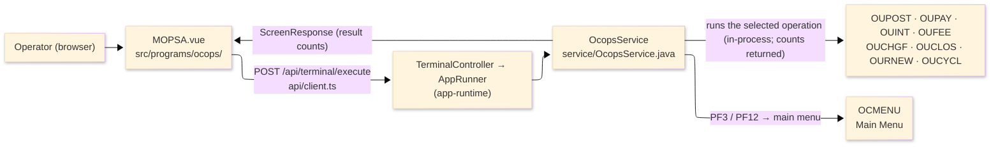
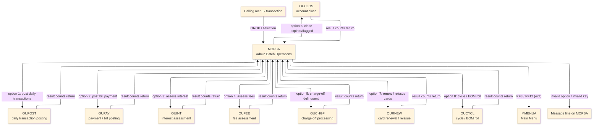
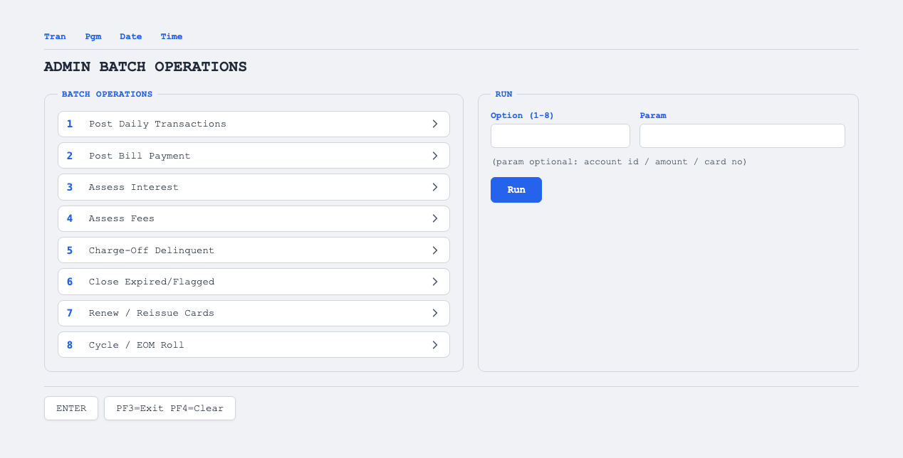

# TO-BE Screen Design — OCOPS_BatchOperations

> **Rule 1: TO-BE = AS-IS in business terms.** The interface moves to a web SPA, but the
> input/output data, the check conditions, the business flow and the operation result counts are
> preserved. The section order follows the AS-IS document so the two compare 1-to-1.

## 0. Cover

| Item | Content |
|---|---|
| System | ORION-CCMS (ORION Credit Card Management System) |
| Subsystem | On-line (was CICS/BMS; now Vue SPA + REST) |
| Function name | Admin Batch Operations |
| Function ID | OCOPS（COBOL program）／Trans-ID `OROP`／Map `MOPSA` |
| Module | `ocops` |
| Platform | Java 17 · Spring Boot 3.x · Vue 3 + TypeScript · DB Oracle (H2 in dev) |
| Version ／ Author ／ Date | 1 ／ modernizeX ／ 2026-09-28 |

## 1. Function overview

### 1.1 Overview diagram

System architecture — the screen, the request path to the server, the program service it runs, and
the back-office operation programs it launches on demand.

### 1.2 Function overview

| # | Function | Implementation |
|---|---|---|
| 1 | Present the back-office operations as a numbered option list | Eight operations are shown and the operator types the number of the one to run |
| 2 | Run the selected operation and pass any optional parameter | The chosen operation is started in-process and an optional account id, amount or card number is passed to it |
| 3 | Show the operation result and its record counts | The status, message and the read, selected, posted, updated, rejected and transaction counts plus two amounts are displayed |

**Operations launched (business meaning)** — the on-demand back-office routines this screen starts:

| Option | On-screen caption | Business operation |
|---|---|---|
| 1 | 1. Post Daily Transactions | posts the day's captured card transactions onto the accounts |
| 2 | 2. Post Bill Payment | applies a customer bill payment or credit to the account |
| 3 | 3. Assess Interest | calculates and applies interest charges to eligible accounts |
| 4 | 4. Assess Fees | calculates and applies the periodic fees due |
| 5 | 5. Charge-Off Delinquent | writes off the balances of severely delinquent accounts |
| 6 | 6. Close Expired/Flagged | closes accounts that are expired or flagged for closure |
| 7 | 7. Renew / Reissue Cards | renews or reissues cards, optionally for the card number entered |
| 8 | 8. Cycle / EOM Roll | runs the billing cycle and end-of-month roll |

**Roles ／ authorisation**: authenticated operator (signed on through the Sign On screen), running
administrator back-office operations. Sign-on state travels in the conversation carried between
requests; no framework role gate is wired yet.

**Keys → operations** (the SPA renders each former PF key as a button):

| Key | Label as rendered (verbatim) | What it does |
|---|---|---|
| `ENTER` | `ENTER=RUN` | run the selected operation and show its result counts |
| `PF3` | `PF3=EXIT` | return to the main menu |
| `PF4` | `PF4=CLEAR` | clear the entered values so the operator can start again |
| `PF12` | `PF12` | cancel and return to the main menu |
| `CLEAR` | `Clear` | clear the screen and redisplay it |

> The middle column is the string the button really shows, copied from the program's button
> definitions. The physical PF keystrokes are not reproduced as keyboard shortcuts, so operators
> used to typing PF3 now click the `PF3=EXIT` button — same action, one extra pointer move.

### 1.3 Databases used

| № | Business name | Table | C | R | U | D |
|---|---|---|---|---|---|---|
| 1 | Orchestration only — each operation program opens its own data | — | - | - | - | - |

## 2. Screen spec

Screen transition of the whole function — every screen a box, every edge labelled with what moves
the operator. Each option runs one back-office operation in-process and its counts come back to the
same screen.

### 2.1 MOPSA — Admin Batch Operations

**Layout**

**Archetype applied**: operations console with a single option entry, an optional parameter box and a
result-counts panel (`_archetypes/screenModel`). The header carries the transaction/program/date/time
meta strip; the body has the eight numbered operations, the option and parameter boxes and the result
panel; a message line and a button row close the screen.

| Area | Notes |
|---|---|
| Header (Tran/Prog/Date/Time) | meta strip above the title, filled by the server |
| Operation list | eight fixed captions: Post Daily Transactions, Post Bill Payment, Assess Interest, Assess Fees, Charge-Off Delinquent, Close Expired/Flagged, Renew / Reissue Cards, Cycle / EOM Roll |
| Input area | option box (1–8) plus an optional parameter box (account id / amount / card no) |
| Result panel | status, message and the read / selected / posted / updated / rejected / transaction counts and two amounts |
| Message line | inline alert below the panel (was row 23 `ERRMSG`) |
| Button row | `ENTER=RUN`, `PF3=EXIT`, `PF4=CLEAR`, `PF12`, `Clear` |

**Screen items**

_State legend: ○ shown · 必 must be entered · □ read-only · － not shown._

| № | Item name | Field | Type ／ length | Control | Required | Initial | On entry | After run | Notes |
|---|---|---|---|---|---|---|---|---|---|
| 1 | Transaction id | `TRNNAME` | text, 4 | read-only | - | ○ | □ | □ | header meta, server-filled |
| 2 | Screen title | `TITLE` | text, 40 | read-only | - | ○ | □ | □ | header meta |
| 3 | Current date | `CURDATE` | date text, 10 | read-only | - | ○ | □ | □ | header meta |
| 4 | Program name | `PGMNAME` | text, 8 | read-only | - | ○ | □ | □ | header meta |
| 5 | Current time | `CURTIME` | time text, 8 | read-only | - | ○ | □ | □ | header meta |
| 6 | Option | `OPTION` | numeric text, 2 | entry box, 2 chars | 必 | ○ | 必 | □ | the operation number 1–8 |
| 7 | Param | `PARM` | text, 16 | entry box, 16 chars | - | ○ | ○ | □ | optional account id / amount / card no |
| 8 | Result status | `RSTAT` | text, 8 | read-only | - | － | － | □ | OK / WARNING / ERROR |
| 9 | Result message | `RMSG` | text, 58 | read-only | - | － | － | □ | message returned by the operation |
| 10 | Records read | `RCREAD` | numeric text, 11 | read-only | - | － | － | □ | count of records read |
| 11 | Records selected | `RCSEL` | numeric text, 11 | read-only | - | － | － | □ | count of records selected |
| 12 | Records posted | `RCPOST` | numeric text, 11 | read-only | - | － | － | □ | count of records posted |
| 13 | Records updated | `RCUPD` | numeric text, 11 | read-only | - | － | － | □ | count of records updated |
| 14 | Records rejected | `RCREJ` | numeric text, 11 | read-only | - | － | － | □ | count of records rejected |
| 15 | Transactions written | `RCTRAN` | numeric text, 11 | read-only | - | － | － | □ | count of transactions written |
| 16 | Amount 1 | `RAMT1` | amount, 18 | read-only | - | － | － | □ | first result amount |
| 17 | Amount 2 | `RAMT2` | amount, 18 | read-only | - | － | － | □ | second result amount |
| 18 | Message line | `ERRMSG` | text, 78 | read-only | - | － | － | □ | prompt and result messages |

> **Length and format unchanged**: the option box accepts 2 characters, the parameter box 16, and the
> result counts and amounts keep the same widths the terminal screen used.

## 3. Check specifications

### 3.1 MOPSA — Admin Batch Operations

All strings below are the literal messages the server returns to the on-screen message line.
Type: E=Error / I=Information.

| No. | What is checked | When it is checked | Message code | Message shown | If it fails |
|---|---|---|---|---|---|
| 1 | Opening prompt (informational) | when the screen first appears | — | Select an operation (1-8) and press ENTER. | not a failure; guides the operator |
| 2 | The chosen operation must be one of 1–8 | on `ENTER`, before the operation runs | — | Invalid option. Enter 1 through 8. | the screen is redisplayed; nothing runs |
| 3 | The operation must start successfully | on `ENTER`, when the operation is launched | — | Operation could not be started. Contact support. | no counts are shown; the entry stays on the screen |
| 4 | Operation finished (informational) | on `ENTER`, after the operation completes | — | Operation complete. Review the counts below. | not a failure; the result counts are shown |
| 5 | Only a supported key may be used | on any key press | — | Invalid key pressed. Please try again. | the screen is redisplayed unchanged |

## 4. Event specifications

### 4.1 MOPSA — Admin Batch Operations

| No. | Event | What the system does | Result ／ next screen |
|---|---|---|---|
| 1 | The operator types an operation number and optional parameter and presses `ENTER` | the chosen back-office operation is run and its status, message and record counts come back | stays on the screen with the result counts, or the invalid-option / could-not-start message |
| 2 | The operator presses `PF3` | the screen ends and control returns to the main menu | the main menu appears |
| 3 | The operator presses `PF4` | the entered values are cleared and the opening prompt returns | stays on the screen, ready for a new operation |
| 4 | The operator presses `PF12` | the current action is cancelled and control returns to the main menu | the main menu appears |
| 5 | The operator presses `CLEAR` | the screen is cleared and redisplayed | stays on the screen, ready for a new operation |
| 6 | The operator presses an unsupported key | the request is rejected and a message is shown | stays on the screen, unchanged |

## 5. DB CRUD

**Update spec**

Not applicable — the Batch Operations screen starts the operation programs and shows the counts they
return; it does not itself create, read, update or delete any record. Each launched operation program
reads and writes its own tables under its own commit.

**Column-level CRUD (per event ／ business type)**

| Table | Operation | Field | Value source | Transaction |
|---|---|---|---|---|
| — (orchestration only) | none | — | the operation number and optional parameter the operator entered | the launched operation program commits its own changes |

## 6. API contract

| Request | Response | What it does | Errors |
|---|---|---|---|
| `POST /api/terminal/execute` — `{ programName: "OCOPS", aidKey, fields: { OPTION, PARM } }` | `ScreenResponse` — `{ fields: { RSTAT, RMSG, RCREAD, RCSEL, RCPOST, RCUPD, RCREJ, RCTRAN, RAMT1, RAMT2 }, message, buttons }` | runs the selected operation and returns its status, message and record counts | out of range → "Invalid option. Enter 1 through 8."; start failure → "Operation could not be started. Contact support."; unsupported key → "Invalid key pressed. Please try again." |

FE types: `src/programs/ocops/schemas.d.ts` (`MOPSAFields`) · client: `src/api/client.ts` ·
endpoint: `TerminalController` (`/api/terminal/execute`), one round-trip per operation run (CICS
pseudo-conversation preserved through the HTTP session).
