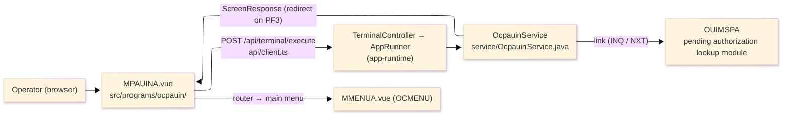
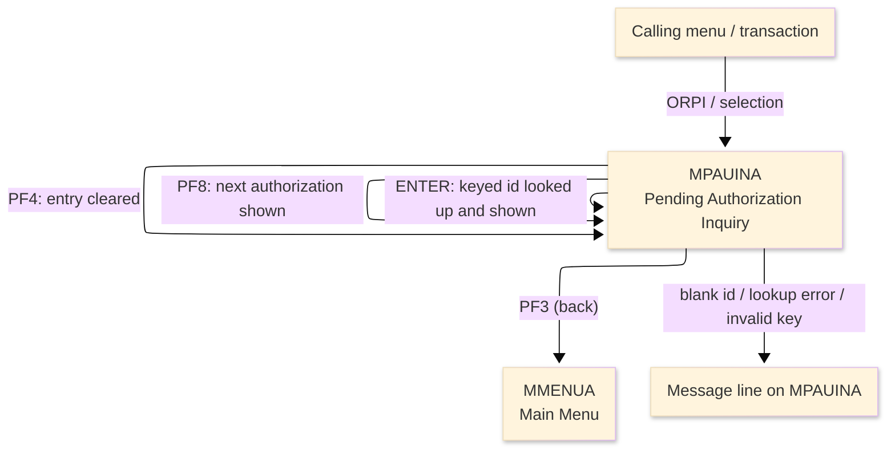
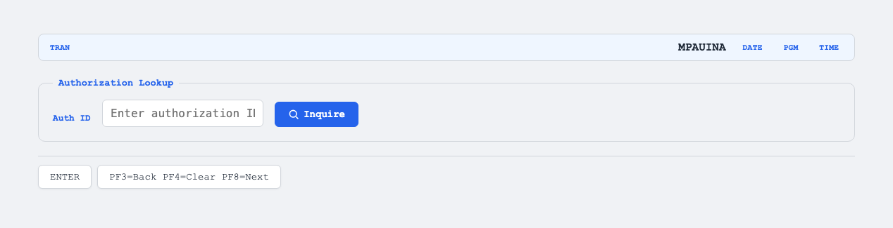

# TO-BE Screen Design — OCPAUIN_PendingAuthInquiry

> **Rule 1: TO-BE = AS-IS in business terms.** The interface moves to a web SPA, but the
> input/output data, the check conditions, the business flow and the database results are
> preserved. The section order follows the AS-IS document so the two compare 1-to-1.

## 0. Cover

| Item | Content |
|---|---|
| System | ORION-CCMS (ORION Credit Card Management System) |
| Subsystem | On-line (was CICS/BMS; now Vue SPA + REST) |
| Function name | Pending Authorization Inquiry |
| Function ID | OCPAUIN（COBOL program）／Trans-ID `ORPI`／Map `MPAUINA` |
| Module | `ocpauin` |
| Platform | Java 17 · Spring Boot 3.x · Vue 3 + TypeScript · DB Oracle (H2 in dev) |
| Version ／ Author ／ Date | 1 ／ modernizeX ／ 2026-09-28 |

## 1. Function overview

### 1.1 Overview diagram

System architecture — the screen, the request path to the server, the program service it runs,
and the lookup module it calls for the authorization detail.

### 1.2 Function overview

| # | Function | Implementation |
|---|---|---|
| 1 | Look up a pending authorization by its authorization id | The operator enters the id and the matching authorization detail is fetched through the linked pending-authorization lookup module |
| 2 | Show the authorization detail in read-only form | The card, account, amount, merchant, request time, status word and decision are displayed; nothing on this screen is editable |
| 3 | Page forward to the next pending authorization | The operator can step to the next record in sequence without re-typing the key |
| 4 | Return to the calling menu when finished | The back action ends the inquiry and returns the operator to the main menu |

**Roles ／ authorisation**: authenticated operator (signed on through the Sign On screen). Sign-on
state travels in the conversation carried between requests; no framework role gate is wired yet.

**Keys → operations** (the SPA renders each former PF key as a button):

| Key | Label as rendered (verbatim) | What it does |
|---|---|---|
| `ENTER` | `ENTER=INQUIRE` | look up the keyed authorization and show its detail |
| `PF3` | `PF3=BACK` | return to the main menu |
| `PF4` | `PF4=CLEAR` | clear the entry so the operator can start again |
| `PF8` | `PF8=NEXT` | page forward to the next pending authorization |

> The middle column is the string the button really shows, copied from the program's button
> definitions. The physical PF keystrokes are not reproduced as keyboard shortcuts, so operators
> used to typing PF3 now click the `PF3=BACK` button — same action, one extra pointer move.

### 1.3 Databases used

| № | Business name | Table | C | R | U | D |
|---|---|---|---|---|---|---|
| 1 | Pending authorization detail — obtained through the linked lookup module, not from a table here | — | - | - | - | - |

## 2. Screen spec

Screen transition of the whole function — every screen a box, every edge labelled with what moves
the operator.

### 2.1 MPAUINA — Pending Authorization Inquiry

**Layout**

**Archetype applied**: display form with a single lookup key (`_archetypes/screenModel`). The header
carries the transaction/program/date/time meta strip; the body has one entry box and a read-only
detail block; a message line and a button row close the screen.

| Area | Notes |
|---|---|
| Header (Tran/Prog/Date/Time) | meta strip above the title, filled by the server |
| Input area | one entry box — the authorization id lookup key |
| Details area | read-only outputs: card, account, amount, merchant, request time, status, decision |
| Message line | inline alert below the form (was row 23 `ERRMSG`) |
| Button row | `ENTER=INQUIRE`, `PF3=BACK`, `PF4=CLEAR`, `PF8=NEXT` |

**Screen items**

_State legend: ○ shown · 必 must be entered · □ read-only · － not shown._

| № | Item name | Field | Type ／ length | Control | Required | Initial | Key prompt | Record shown | Notes |
|---|---|---|---|---|---|---|---|---|---|
| 1 | Authorization ID | `AUTHID` | text, 16 | entry box, 16 chars | 必 | ○ | 必 | □ | lookup key; kept at 16 as in the source |
| 2 | Card number | `PACARD` | text, 16 | read-only | - | － | □ | □ | from the looked-up authorization |
| 3 | Account ID | `PAACCT` | numeric text, 11 | read-only | - | － | □ | □ | shown as 11 digits |
| 4 | Amount | `PAAMT` | amount, 16 | read-only | - | － | □ | □ | edited amount |
| 5 | Merchant | `PAMERCH` | text, 50 | read-only | - | － | □ | □ | merchant name |
| 6 | Request timestamp | `PAREQTS` | text, 26 | read-only | - | － | □ | □ | request time stamp as stored |
| 7 | Status | `PASTAT` | text, 12 | read-only | - | － | □ | □ | status word: PENDING / APPROVED / DECLINED / PURGED / UNKNOWN |
| 8 | Decision | `PADEC` | text, 30 | read-only | - | － | □ | □ | decision reason |

> **Length and format unchanged**: the entry box accepts 16 characters and the server sends the same
> 16-character key to the lookup module; the amounts, timestamp and text are shown with the same
> widths as the terminal screen.

## 3. Check specifications

### 3.1 MPAUINA — Pending Authorization Inquiry

All strings below are the literal messages the server returns to the on-screen message line.
Type: E=Error / I=Information.

| No. | What is checked | When it is checked | Message code | Message shown | If it fails |
|---|---|---|---|---|---|
| 1 | Opening prompt (informational) | when the screen first appears | — | Enter an authorization id and press ENTER. | not a failure; guides the operator |
| 2 | The authorization id must be entered | on `ENTER`, before the lookup | — | Please enter all required fields. | the entry stays; nothing is looked up |
| 3 | The pending authorization lookup must succeed | on `ENTER` or `PF8`, if the lookup module cannot be reached | — | Unable to link to IMS module OUIMSPA. | the entry stays; no detail is shown |
| 4 | Only a supported key may be used | on any other key press | — | Invalid key pressed. Please try again. | the screen is redisplayed unchanged |

## 4. Event specifications

### 4.1 MPAUINA — Pending Authorization Inquiry

| No. | Event | What the system does | Result ／ next screen |
|---|---|---|---|
| 1 | The operator enters an id and presses `ENTER` | the keyed authorization is looked up and its detail is filled in | stays on Pending Authorization Inquiry with the detail shown, or a message when the id is blank or the lookup fails |
| 2 | The operator presses `PF8` | the next pending authorization in sequence is looked up and shown | stays on Pending Authorization Inquiry with the next record, or a message |
| 3 | The operator presses `PF3` | the inquiry ends and control returns to the calling menu | the main menu appears |
| 4 | The operator presses `PF4` | the entered value is cleared and the opening prompt returns | stays on Pending Authorization Inquiry, ready for a new id |
| 5 | The operator presses an unsupported key | the request is rejected and a message is shown | stays on Pending Authorization Inquiry, unchanged |

## 5. DB CRUD

**Update spec**

Not applicable — Pending Authorization Inquiry only requests data through the linked lookup module;
no row is created, updated or deleted.

**Column-level CRUD (per event ／ business type)**

| Table | Operation | Field | Value source | Transaction |
|---|---|---|---|---|
| — | read through the linked lookup module | whole authorization record | the authorization id the operator entered | read-only; no commit |

## 6. API contract

| Request | Response | What it does | Errors |
|---|---|---|---|
| `POST /api/terminal/execute` — `{ programName: "OCPAUIN", aidKey, fields: { AUTHID } }` | `ScreenResponse` — `{ fields: { PACARD, PAACCT, PAAMT, PAMERCH, PAREQTS, PASTAT, PADEC }, message, buttons }` | looks up the keyed authorization through the lookup module and returns its detail fields, or a message | blank id → "Please enter all required fields."; lookup unreachable → "Unable to link to IMS module OUIMSPA."; bad key → "Invalid key pressed. Please try again." |

FE types: `src/programs/ocpauin/schemas.d.ts` (`MPAUINAFields`) · client: `src/api/client.ts` ·
endpoint: `TerminalController` (`/api/terminal/execute`), one round-trip per key press (CICS
pseudo-conversation preserved through the HTTP session).
