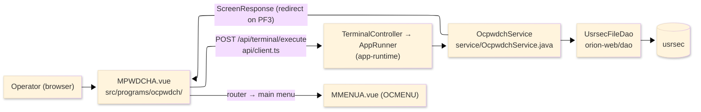
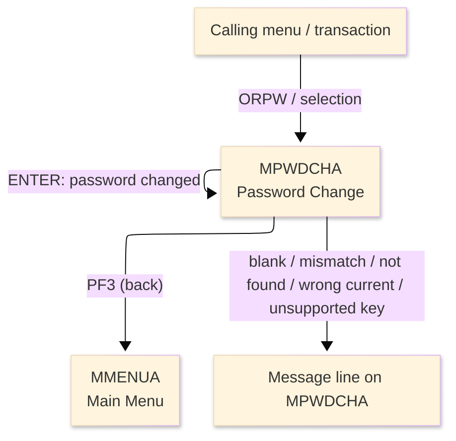
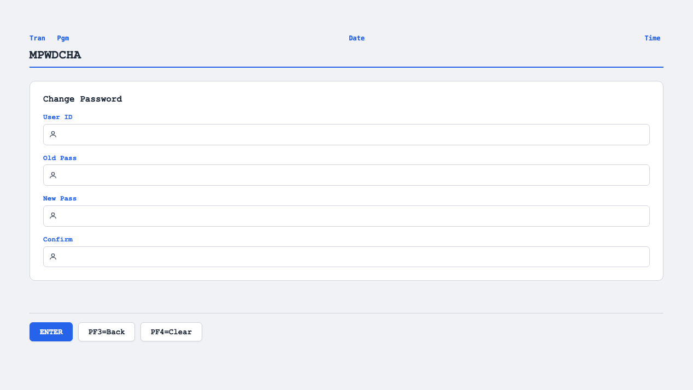

# TO-BE Screen Design — OCPWDCH_PasswordChange

> **Rule 1: TO-BE = AS-IS in business terms.** The interface moves to a web SPA, but the
> input/output data, the check conditions, the business flow and the database results are
> preserved. The section order follows the AS-IS document so the two compare 1-to-1.

## 0. Cover

| Item | Content |
|---|---|
| System | ORION-CCMS (ORION Credit Card Management System) |
| Subsystem | On-line (was CICS/BMS; now Vue SPA + REST) |
| Function name | Password Change |
| Function ID | OCPWDCH（COBOL program）／Trans-ID `ORPW`／Map `MPWDCHA` |
| Module | `ocpwdch` |
| Platform | Java 17 · Spring Boot 3.x · Vue 3 + TypeScript · DB Oracle (H2 in dev) |
| Version ／ Author ／ Date | 1 ／ modernizeX ／ 2026-09-28 |

## 1. Function overview

### 1.1 Overview diagram

System architecture — the screen, the request path to the server, the program service it runs,
and the data store it reads and rewrites.

### 1.2 Function overview

| # | Function | Implementation |
|---|---|---|
| 1 | Prompt the operator for the user id, current and new password | The screen opens with entries for the user id, the old password, the new password and its confirmation |
| 2 | Verify the change is allowed | The new and confirm entries must agree, the user is read from `usrsec` and the current password is checked |
| 3 | Store the new password | When every check passes the stored password is replaced and the operator is told it succeeded |

**Roles ／ authorisation**: authenticated operator (signed on through the Sign On screen). Sign-on
state travels in the conversation carried between requests; no framework role gate is wired yet.

**Keys → operations** (the SPA renders each former PF key as a button):

| Key | Label as rendered (verbatim) | What it does |
|---|---|---|
| `ENTER` | `ENTER=PROCESS` | check the entries and store the new password |
| `PF3` | `PF3=BACK` | abandon the change and return to the main menu |
| `PF4` | `PF4=CLEAR` | clear the entered values so the operator can start again |

> The middle column is the string the button really shows, copied from the program's button
> definitions. The physical PF keystrokes are not reproduced as keyboard shortcuts, so operators
> used to typing PF3 now click the `PF3=BACK` button — same action, one extra pointer move.

### 1.3 Databases used

| № | Business name | Table | C | R | U | D |
|---|---|---|---|---|---|---|
| 1 | User security — read by user id, then the password is rewritten | `usrsec` | - | 〇 | 〇 | - |

## 2. Screen spec

Screen transition of the whole function — every screen a box, every edge labelled with what moves
the operator.

### 2.1 MPWDCHA — Password Change

**Layout**

**Archetype applied**: entry form with four fields (`_archetypes/screenModel`). The header carries
the transaction/program/date/time meta strip; the body has the user id and the three password
entries; a message line and a button row close the screen.

| Area | Notes |
|---|---|
| Header (Tran/Prog/Date/Time) | meta strip above the title, filled by the server |
| Input area | four entry boxes — user id, old password, new password, confirm |
| Message line | inline alert below the form (was row 23 `ERRMSG`) |
| Button row | `ENTER=PROCESS`, `PF3=BACK`, `PF4=CLEAR` |

**Screen items**

_State legend: ○ shown · 必 must be entered · □ read-only · － not shown._

| № | Item name | Field | Type ／ length | Control | Required | Initial | Initial display | New password entered | Notes |
|---|---|---|---|---|---|---|---|---|---|
| 1 | User ID | `USERID` | text, 8 | entry box, 8 chars | 必 | ○ | ○ | ○ | identifies the account whose password changes; kept at 8 |
| 2 | Old password | `OLDPWD` | text, 8 | entry box, 8 chars | 必 | ○ | ○ | ○ | checked against the stored password; kept at 8 |
| 3 | New password | `NEWPWD` | text, 8 | entry box, 8 chars | 必 | ○ | ○ | ○ | the replacement value; kept at 8 |
| 4 | Confirm | `CFMPWD` | text, 8 | entry box, 8 chars | 必 | ○ | ○ | ○ | must match the new password; kept at 8 |

> **Length and format unchanged**: every entry accepts 8 characters and the server compares and
> stores the same 8-character values as the terminal screen did.

## 3. Check specifications

### 3.1 MPWDCHA — Password Change

All strings below are the literal messages the server returns to the on-screen message line.
Type: E=Error / I=Information.

| No. | What is checked | When it is checked | Message code | Message shown | If it fails |
|---|---|---|---|---|---|
| 1 | Opening prompt (informational) | when the screen first appears | — | Enter user id, old and new password. | not a failure; guides the operator |
| 2 | The user id must be entered | on `ENTER`, before the change | — | Please enter all required fields. | the entry stays; nothing changes |
| 3 | The new password and its confirmation must agree | on `ENTER`, before the user is read | — | New password and confirm do not match. | the entry stays; nothing changes |
| 4 | The keyed user must exist | on `ENTER`, after the lookup | — | Record not found. | the entry stays; nothing changes |
| 5 | The current password must match the stored password | on `ENTER`, after the user is read | — | Current password is incorrect. | the entry stays; nothing changes |
| 6 | The password store must accept the update | on `ENTER`, when the new password is written | — | Password change failed. | the change did not take; the entry stays |
| 7 | Confirmation of a successful change (informational) | on `ENTER`, after the update succeeds | — | Password changed successfully. | not a failure; the new password is stored |
| 8 | Only a supported key may be used | on any other key press | — | Invalid key pressed. Please try again. | the screen is redisplayed unchanged |

## 4. Event specifications

### 4.1 MPWDCHA — Password Change

| No. | Event | What the system does | Result ／ next screen |
|---|---|---|---|
| 1 | The operator fills the entries and presses `ENTER` | the new and confirm entries are compared, the user is read, the current password is checked and the new password is stored | stays with the success message, or a message when any check fails |
| 2 | The operator presses `PF3` | the change is abandoned and control returns to the main menu | the main menu appears |
| 3 | The operator presses `PF4` | the entered values are cleared and the opening prompt returns | stays on Password Change, ready for a fresh entry |
| 4 | The operator presses an unsupported key | the request is rejected and a message is shown | stays on Password Change, unchanged |

## 5. DB CRUD

**Update spec**

| Table | Operation | Field | Value source | Transaction |
|---|---|---|---|---|
| `usrsec` | UPDATE (rewrite by key) | stored password | the new password the operator entered | committed once the update succeeds |

**Column-level CRUD (per event ／ business type)**

| Table | Operation | Field | Value source | Transaction |
|---|---|---|---|---|
| `usrsec` | SELECT (read for update) | whole record | the user id the operator entered | read by key |
| `usrsec` | UPDATE (rewrite) | stored password | the new password the operator entered | rewritten in place; no new row |

## 6. API contract

| Request | Response | What it does | Errors |
|---|---|---|---|
| `POST /api/terminal/execute` — `{ programName: "OCPWDCH", aidKey, fields: { USERID, OLDPWD, NEWPWD, CFMPWD } }` | `ScreenResponse` — `{ message, buttons }` | reads the user, checks the current password and stores the new one | mismatch → "New password and confirm do not match."; unknown user → "Record not found."; wrong current → "Current password is incorrect."; write failure → "Password change failed." |

FE types: `src/programs/ocpwdch/schemas.d.ts` (`MPWDCHAFields`) · client: `src/api/client.ts` ·
endpoint: `TerminalController` (`/api/terminal/execute`), one round-trip per key press (CICS
pseudo-conversation preserved through the HTTP session).
