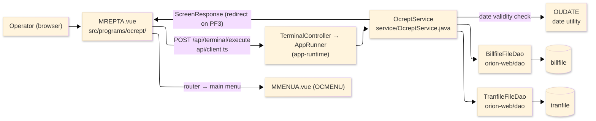
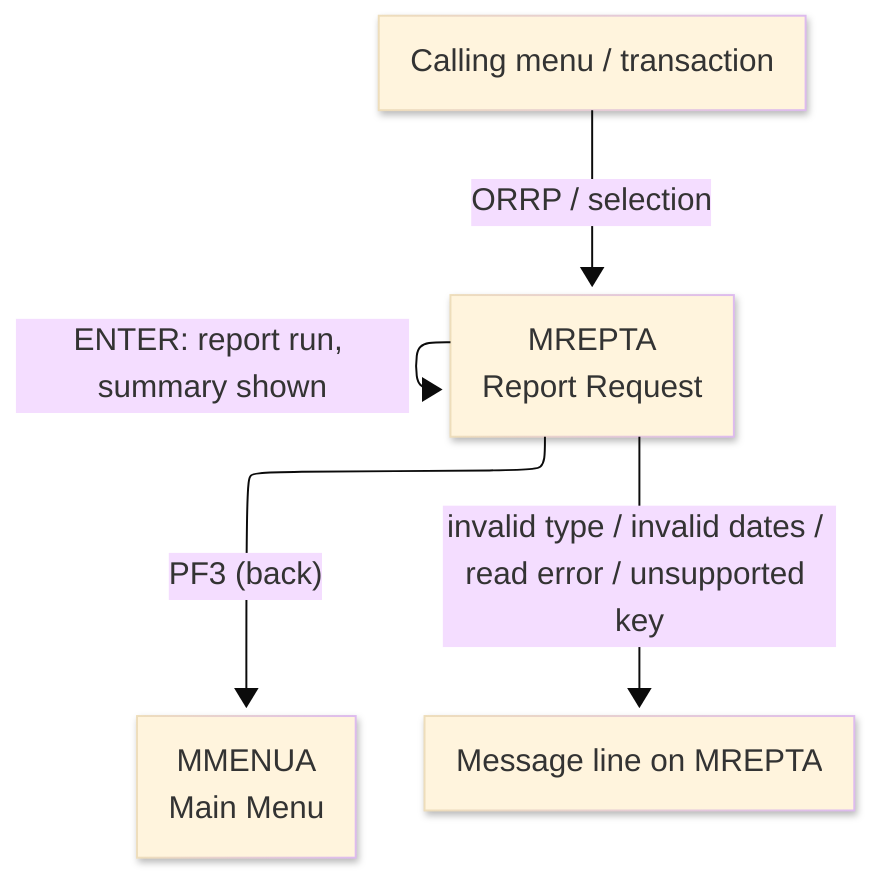
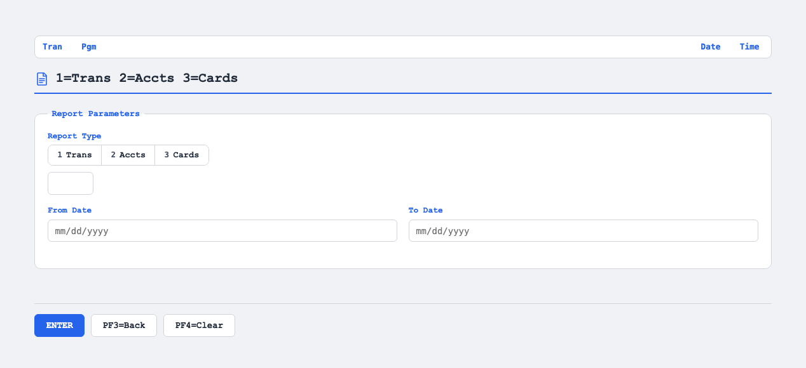

# TO-BE Screen Design — OCREPT_ReportRequest

> **Rule 1: TO-BE = AS-IS in business terms.** The interface moves to a web SPA, but the
> input/output data, the check conditions, the business flow and the database results are
> preserved. The section order follows the AS-IS document so the two compare 1-to-1.

## 0. Cover

| Item | Content |
|---|---|
| System | ORION-CCMS (ORION Credit Card Management System) |
| Subsystem | On-line (was CICS/BMS; now Vue SPA + REST) |
| Function name | Report Request |
| Function ID | OCREPT（COBOL program）／Trans-ID `ORRP`／Map `MREPTA` |
| Module | `ocrept` |
| Platform | Java 17 · Spring Boot 3.x · Vue 3 + TypeScript · DB Oracle (H2 in dev) |
| Version ／ Author ／ Date | 1 ／ modernizeX ／ 2026-09-28 |

## 1. Function overview

### 1.1 Overview diagram

System architecture — the screen, the request path to the server, the program service it runs, the
date utility it calls and the data stores it browses.

### 1.2 Function overview

| # | Function | Implementation |
|---|---|---|
| 1 | Accept the report selection and date range | The operator enters a report type and a from/to date range |
| 2 | Validate the selection | The type must be 01 or 02 and both dates must be valid, with the from date no later than the to date |
| 3 | Total the matching records | The chosen store is browsed and the count and amount total for the range are shown |

**Roles ／ authorisation**: authenticated operator (signed on through the Sign On screen). Sign-on
state travels in the conversation carried between requests; no framework role gate is wired yet.

**Keys → operations** (the SPA renders each former PF key as a button):

| Key | Label as rendered (verbatim) | What it does |
|---|---|---|
| `ENTER` | `ENTER=PROCESS` | check the selection and run the chosen report |
| `PF3` | `PF3=BACK` | return to the main menu |
| `PF4` | `PF4=CLEAR` | clear the entered values so the operator can start again |

> The middle column is the string the button really shows, copied from the program's button
> definitions. The physical PF keystrokes are not reproduced as keyboard shortcuts, so operators
> used to typing PF3 now click the `PF3=BACK` button — same action, one extra pointer move.

### 1.3 Databases used

| № | Business name | Table | C | R | U | D |
|---|---|---|---|---|---|---|
| 1 | Bill file — browsed to total bill payments in the range (report type 01) | `billfile` | - | 〇 | - | - |
| 2 | Transaction file — browsed to total transactions in the range (report type 02) | `tranfile` | - | 〇 | - | - |

## 2. Screen spec

Screen transition of the whole function — every screen a box, every edge labelled with what moves
the operator.

### 2.1 MREPTA — Report Request

**Layout**

**Archetype applied**: selection form with a summary result (`_archetypes/screenModel`). The header
carries the transaction/program/date/time meta strip; the body has the report type and the two date
entries under a legend caption; a message line and a button row close the screen.

| Area | Notes |
|---|---|
| Header (Tran/Prog/Date/Time) | meta strip above the title, filled by the server |
| Input area | three entry boxes — report type and the from/to dates |
| Legend caption | the static hint "1=Trans 2=Accts 3=Cards"; the program runs report type 01 (bills) or 02 (transactions) |
| Message line | inline alert below the form (was row 23 `ERRMSG`), also carrying the report summary |
| Button row | `ENTER=PROCESS`, `PF3=BACK`, `PF4=CLEAR` |

**Screen items**

_State legend: ○ shown · 必 must be entered · □ read-only · － not shown._

| № | Item name | Field | Type ／ length | Control | Required | Initial | Initial display | Selection entered | Notes |
|---|---|---|---|---|---|---|---|---|---|
| 1 | Report type | `RPTYPE` | text, 2 | entry box, 2 chars | 必 | ○ | ○ | ○ | 01 = bills, 02 = transactions; kept at 2 |
| 2 | From date | `RPFROM` | date text, 10 | entry box, 10 chars | 必 | ○ | ○ | ○ | YYYY-MM-DD; kept at 10 |
| 3 | To date | `RPTO` | date text, 10 | entry box, 10 chars | 必 | ○ | ○ | ○ | YYYY-MM-DD; kept at 10 |

> **Length and format unchanged**: the type accepts 2 characters and each date 10, exactly as the
> terminal screen did; the dates are read in the same YYYY-MM-DD form.

## 3. Check specifications

### 3.1 MREPTA — Report Request

All strings below are the literal messages the server returns to the on-screen message line.
Type: E=Error / I=Information.

| No. | What is checked | When it is checked | Message code | Message shown | If it fails |
|---|---|---|---|---|---|
| 1 | Opening prompt (informational) | when the screen first appears | — | Type 01=Bills 02=Trans, dates YYYY-MM-DD. | not a failure; guides the operator |
| 2 | The report type must be entered | on `ENTER`, before the report runs | — | Report type is required. | the entry stays; nothing runs |
| 3 | The report type must be 01 or 02 | on `ENTER`, before the report runs | — | Report type must be 01 or 02. | the entry stays; nothing runs |
| 4 | Both dates must be entered | on `ENTER`, before the report runs | — | From and to dates are required. | the entry stays; nothing runs |
| 5 | The from date must be a valid date | on `ENTER`, checked by the date utility | — | From date is not a valid date. | the entry stays; nothing runs |
| 6 | The to date must be a valid date | on `ENTER`, checked by the date utility | — | To date is not a valid date. | the entry stays; nothing runs |
| 7 | The from date must not be later than the to date | on `ENTER`, before the report runs | — | From date is later than to date. | the entry stays; nothing runs |
| 8 | The report type must be one the program can run | on `ENTER`, when selecting the report | — | Unsupported report type. | nothing runs; the entry stays |
| 9 | The bill browse must start | on `ENTER` for a bills report | — | Error starting bill browse. | the report stops; the entry stays |
| 10 | The bill store must be readable | on `ENTER` for a bills report | — | Error reading bill file. | the report stops; the entry stays |
| 11 | The transaction browse must start | on `ENTER` for a transactions report | — | Error starting tran browse. | the report stops; the entry stays |
| 12 | The transaction store must be readable | on `ENTER` for a transactions report | — | Error reading tran file. | the report stops; the entry stays |
| 13 | Report summary (informational) | on `ENTER` after the report runs | — | Type (type) Count: (n) Total: (amount) | not a failure; the count and total for the range are shown |
| 14 | Only a supported key may be used | on any other key press | — | Invalid key pressed. Please try again. | the screen is redisplayed unchanged |

## 4. Event specifications

### 4.1 MREPTA — Report Request

| No. | Event | What the system does | Result ／ next screen |
|---|---|---|---|
| 1 | The operator enters the report type and the date range and presses `ENTER` | the type and dates are checked (the dates through the date utility) and the matching records are totalled | stays on Report Request with the count and total, or a message when a check fails |
| 2 | The operator presses `PF3` | the request is abandoned and control returns to the main menu | the main menu appears |
| 3 | The operator presses `PF4` | the entered values are cleared and the opening prompt returns | stays on Report Request, ready for a fresh selection |
| 4 | The operator presses an unsupported key | the request is rejected and a message is shown | stays on Report Request, unchanged |

## 5. DB CRUD

**Update spec**

Not applicable — Report Request only reads records to total them; no row is created, updated or deleted.

**Column-level CRUD (per event ／ business type)**

| Table | Operation | Field | Value source | Transaction |
|---|---|---|---|---|
| `billfile` | SELECT (browse) | pay date and amount | records within the entered date range | read-only; no commit |
| `tranfile` | SELECT (browse) | original timestamp and amount | records within the entered date range | read-only; no commit |

## 6. API contract

| Request | Response | What it does | Errors |
|---|---|---|---|
| `POST /api/terminal/execute` — `{ programName: "OCREPT", aidKey, fields: { RPTYPE, RPFROM, RPTO } }` | `ScreenResponse` — `{ message, buttons }` | checks the type and dates, totals the matching records and returns the count and total on the message line | required → "Report type is required."; bad type → "Report type must be 01 or 02."; bad date → "From date is not a valid date." |

FE types: `src/programs/ocrept/schemas.d.ts` (`MREPTAFields`) · client: `src/api/client.ts` ·
endpoint: `TerminalController` (`/api/terminal/execute`), one round-trip per key press (CICS
pseudo-conversation preserved through the HTTP session).
