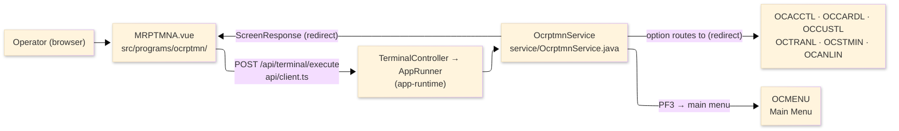
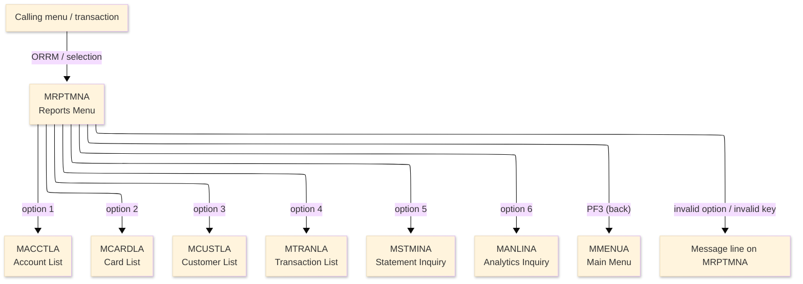
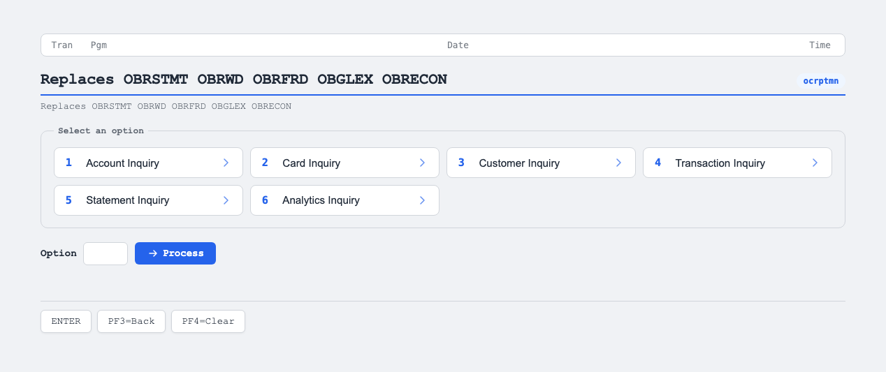

# TO-BE Screen Design — OCRPTMN_ReportsMenu

> **Rule 1: TO-BE = AS-IS in business terms.** The interface moves to a web SPA, but the
> input/output data, the check conditions, the business flow and the routing are preserved. The
> section order follows the AS-IS document so the two compare 1-to-1.

## 0. Cover

| Item | Content |
|---|---|
| System | ORION-CCMS (ORION Credit Card Management System) |
| Subsystem | On-line (was CICS/BMS; now Vue SPA + REST) |
| Function name | Reports Menu |
| Function ID | OCRPTMN（COBOL program）／Trans-ID `ORRM`／Map `MRPTMNA` |
| Module | `ocrptmn` |
| Platform | Java 17 · Spring Boot 3.x · Vue 3 + TypeScript · DB Oracle (H2 in dev) |
| Version ／ Author ／ Date | 1 ／ modernizeX ／ 2026-09-28 |

## 1. Function overview

### 1.1 Overview diagram

System architecture — the screen, the request path to the server, the program service it runs, and
the inquiry functions it routes the operator to.

### 1.2 Function overview

| # | Function | Implementation |
|---|---|---|
| 1 | Present the available inquiries as a numbered option list | Six inquiry choices are shown and the operator types the number of the one they want |
| 2 | Route the operator to the matching report or inquiry | The chosen number is checked and control passes to the corresponding program |
| 3 | Return the operator to the main menu on exit | The back action leaves the reports menu and returns to the main menu |

**Roles ／ authorisation**: authenticated operator (signed on through the Sign On screen). Sign-on
state travels in the conversation carried between requests; no framework role gate is wired yet.

**Keys → operations** (the SPA renders each former PF key as a button):

| Key | Label as rendered (verbatim) | What it does |
|---|---|---|
| `ENTER` | `ENTER=PROCESS` | check the chosen inquiry and route to the matching report function |
| `PF3` | `PF3=BACK` | return to the main menu |
| `PF4` | `PF4=CLEAR` | rendered button; the program acts only on ENTER and PF3, so any other key returns the unsupported-key message |

> The middle column is the string the button really shows, copied from the program's button
> definitions. The physical PF keystrokes are not reproduced as keyboard shortcuts, so operators
> used to typing PF3 now click the `PF3=BACK` button — same action, one extra pointer move.

### 1.3 Databases used

| № | Business name | Table | C | R | U | D |
|---|---|---|---|---|---|---|
| 1 | Navigation only — the target inquiry opens its own data | — | - | - | - | - |

## 2. Screen spec

Screen transition of the whole function — every screen a box, every edge labelled with what moves
the operator. Each menu number routes to one inquiry function.

### 2.1 MRPTMNA — Reports Menu

**Layout**

**Archetype applied**: routing menu with a single option entry (`_archetypes/screenModel`). The
header carries the transaction/program/date/time meta strip; the body lists the six numbered
choices with one option box; a message line and a button row close the screen.

| Area | Notes |
|---|---|
| Header (Tran/Prog/Date/Time) | meta strip above the title, filled by the server |
| Option list | six fixed captions: Account Inquiry, Card Inquiry, Customer Inquiry, Transaction Inquiry, Statement Inquiry, Analytics Inquiry |
| Input area | one entry box — the option number (1–6) |
| Message line | inline alert below the list (was row 23 `ERRMSG`) |
| Button row | `ENTER=PROCESS`, `PF3=BACK`, `PF4=CLEAR` |

**Screen items**

_State legend: ○ shown · 必 must be entered · □ read-only · － not shown._

| № | Item name | Field | Type ／ length | Control | Required | Initial | Key prompt | Record shown | Notes |
|---|---|---|---|---|---|---|---|---|---|
| 1 | Transaction id | `TRNNAME` | text, 4 | read-only | - | ○ | － | □ | header meta, server-filled |
| 2 | Screen title | `TITLE` | text, 40 | read-only | - | ○ | － | □ | header meta |
| 3 | Current date | `CURDATE` | date text, 10 | read-only | - | ○ | － | □ | header meta |
| 4 | Program name | `PGMNAME` | text, 8 | read-only | - | ○ | － | □ | header meta |
| 5 | Current time | `CURTIME` | time text, 8 | read-only | - | ○ | － | □ | header meta |
| 6 | Option | `OPTION` | numeric text, 2 | entry box, 2 chars | 必 | ○ | 必 | － | the menu number 1–6 |
| 7 | Message line | `ERRMSG` | text, 78 | read-only | - | － | － | □ | prompt and result messages |

> **Length and format unchanged**: the option box accepts the same 2 characters as the terminal
> field and the six captions keep their original wording.

## 3. Check specifications

### 3.1 MRPTMNA — Reports Menu

All strings below are the literal messages the server returns to the on-screen message line.
Type: E=Error / I=Information.

| No. | What is checked | When it is checked | Message code | Message shown | If it fails |
|---|---|---|---|---|---|
| 1 | Opening prompt (informational) | when the screen first appears | — | Select an inquiry (1-6) and press ENTER. | not a failure; guides the operator |
| 2 | The chosen option must be one of 1–6 | on `ENTER`, before routing | — | Invalid option - choose 1 through 6. | the menu is redisplayed; no routing happens |
| 3 | Only a supported key may be used | on any key press | — | Invalid key pressed. Please try again. | the screen is redisplayed unchanged |

## 4. Event specifications

### 4.1 MRPTMNA — Reports Menu

| No. | Event | What the system does | Result ／ next screen |
|---|---|---|---|
| 1 | The operator types an option and presses `ENTER` | the number is checked and, when it is 1–6, control passes to the matching function | routes to Account List (1), Card List (2), Customer List (3), Transaction List (4), Statement Inquiry (5) or Analytics Inquiry (6) |
| 2 | The operator types a number outside 1–6 and presses `ENTER` | the choice is rejected and a message is shown | stays on the Reports Menu with the invalid-option message |
| 3 | The operator presses `PF3` | the menu ends and control returns to the main menu | the main menu appears |
| 4 | The operator presses an unsupported key (including `PF4`) | the request is rejected and a message is shown | stays on the Reports Menu, unchanged |

## 5. DB CRUD

**Update spec**

Not applicable — the Reports Menu only routes to other functions; it does not create, read, update
or delete any record. File access is performed by the target inquiry the operator selects.

**Column-level CRUD (per event ／ business type)**

| Table | Operation | Field | Value source | Transaction |
|---|---|---|---|---|
| — (navigation only) | none | — | the option the operator selected | routing only; no commit |

## 6. API contract

| Request | Response | What it does | Errors |
|---|---|---|---|
| `POST /api/terminal/execute` — `{ programName: "OCRPTMN", aidKey, fields: { OPTION } }` | `ScreenResponse` — `{ redirect, message, buttons }` | checks the option and returns a redirect to the chosen inquiry program, or a message | out of range → "Invalid option - choose 1 through 6."; unsupported key → "Invalid key pressed. Please try again." |

FE types: `src/programs/ocrptmn/schemas.d.ts` (`MRPTMNAFields`) · client: `src/api/client.ts` ·
endpoint: `TerminalController` (`/api/terminal/execute`); a valid option returns a redirect that the
SPA router follows to the next program (CICS pseudo-conversation preserved through the HTTP session).
