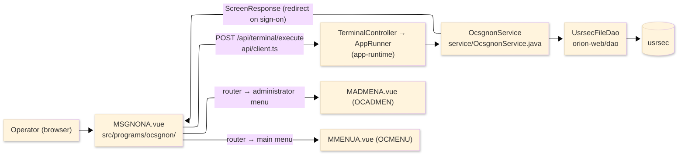
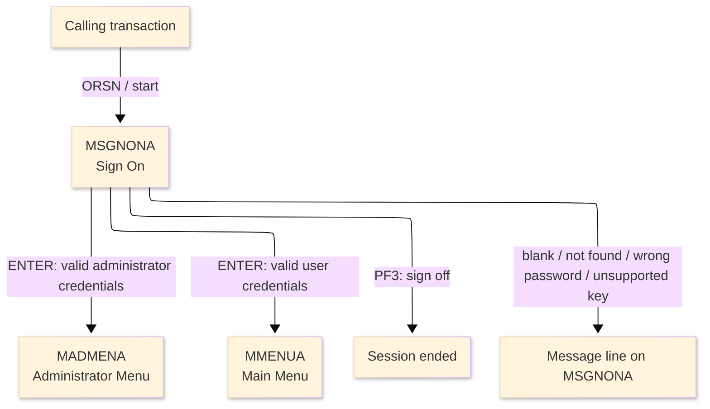
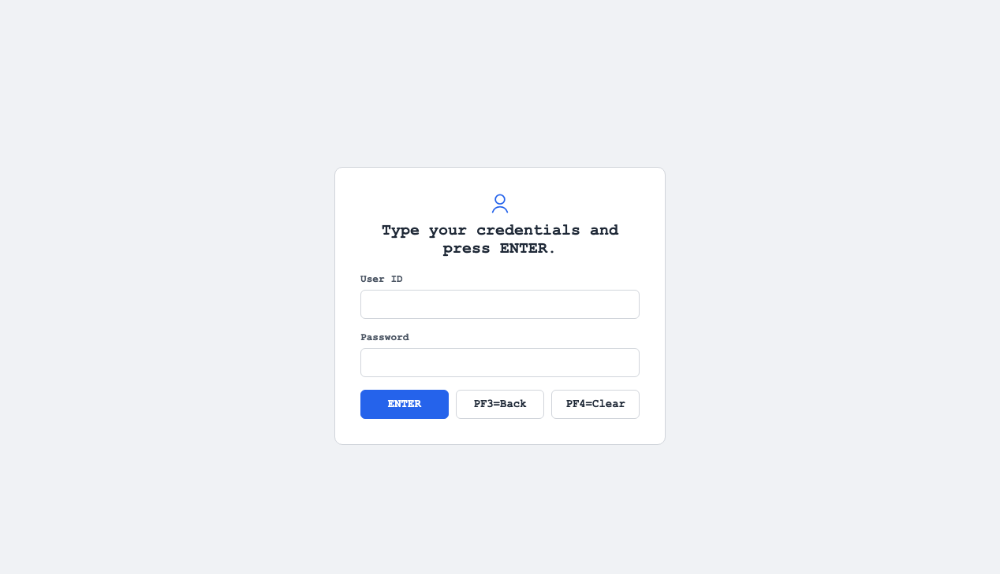

# TO-BE Screen Design — OCSGNON_SignOn

> **Rule 1: TO-BE = AS-IS in business terms.** The interface moves to a web SPA, but the
> input/output data, the check conditions, the business flow and the database results are
> preserved. The section order follows the AS-IS document so the two compare 1-to-1.

## 0. Cover

| Item | Content |
|---|---|
| System | ORION-CCMS (ORION Credit Card Management System) |
| Subsystem | On-line (was CICS/BMS; now Vue SPA + REST) |
| Function name | Sign On |
| Function ID | OCSGNON（COBOL program）／Trans-ID `ORSN`／Map `MSGNONA` |
| Module | `ocsgnon` |
| Platform | Java 17 · Spring Boot 3.x · Vue 3 + TypeScript · DB Oracle (H2 in dev) |
| Version ／ Author ／ Date | 1 ／ modernizeX ／ 2026-09-28 |

## 1. Function overview

### 1.1 Overview diagram

System architecture — the screen, the request path to the server, the program service it runs,
and the data store it reads to verify the credentials.

### 1.2 Function overview

| # | Function | Implementation |
|---|---|---|
| 1 | Prompt the operator for a user id and a password | The screen opens with an empty entry for the user id and one for the password |
| 2 | Verify the credentials and sign the operator on | The keyed user is read from `usrsec` and the stored password is compared with the one typed |
| 3 | Route the operator by user type | An administrator is taken to the administrator menu and a normal user to the main menu |

**Roles ／ authorisation**: this is the entry screen that establishes the operator identity. The
signed-on user id and user type are carried forward in the conversation between requests; no
framework role gate is wired yet.

**Keys → operations** (the SPA renders each former PF key as a button):

| Key | Label as rendered (verbatim) | What it does |
|---|---|---|
| `ENTER` | `ENTER=PROCESS` | verify the credentials and sign the operator on |
| `PF3` | `PF3=BACK` | sign off and end the session |
| `PF4` | `PF4=CLEAR` | labelled to clear the entry; the sign-on program wires no separate clear action, so the key returns the unsupported-key notice |

> The middle column is the string the button really shows, copied from the program's button
> definitions. The physical PF keystrokes are not reproduced as keyboard shortcuts, so operators
> used to typing PF3 now click the `PF3=BACK` button — same action, one extra pointer move.

### 1.3 Databases used

| № | Business name | Table | C | R | U | D |
|---|---|---|---|---|---|---|
| 1 | User security — read by user id to verify the sign-on | `usrsec` | - | 〇 | - | - |

## 2. Screen spec

Screen transition of the whole function — every screen a box, every edge labelled with what moves
the operator.

### 2.1 MSGNONA — Sign On

**Layout**

**Archetype applied**: sign-on form with two entry boxes (`_archetypes/screenModel`). The header
carries the transaction/program/date/time meta strip; the body has the user id and password
entries under a guidance caption; a message line and a button row close the screen.

| Area | Notes |
|---|---|
| Header (Tran/Prog/Date/Time) | meta strip above the title, filled by the server |
| Input area | two entry boxes — user id and password |
| Guidance caption | the static prompt "Type your credentials and press ENTER." |
| Message line | inline alert below the form (was row 23 `ERRMSG`) |
| Button row | `ENTER=PROCESS`, `PF3=BACK`, `PF4=CLEAR` |

**Screen items**

_State legend: ○ shown · 必 must be entered · □ read-only · － not shown._

| № | Item name | Field | Type ／ length | Control | Required | Initial | Initial display | Credentials entered | Notes |
|---|---|---|---|---|---|---|---|---|---|
| 1 | User ID | `USERID` | text, 8 | entry box, 8 chars | 必 | ○ | ○ | ○ | identifies the operator; kept at 8 as in the source |
| 2 | Password | `PASSWD` | text, 8 | entry box, 8 chars | 必 | ○ | ○ | ○ | compared with the stored password; kept at 8 |

> **Length and format unchanged**: each entry accepts 8 characters and the server compares the same
> 8-character values as the terminal screen did.

## 3. Check specifications

### 3.1 MSGNONA — Sign On

All strings below are the literal messages the server returns to the on-screen message line.
Type: E=Error / I=Information.

| No. | What is checked | When it is checked | Message code | Message shown | If it fails |
|---|---|---|---|---|---|
| 1 | Opening prompt (informational) | when the screen first appears | — | Please sign on. | not a failure; guides the operator |
| 2 | The user id must be entered | on `ENTER`, before the lookup | — | Please enter all required fields. | the entry stays; nothing is read |
| 3 | The keyed user must exist | on `ENTER`, after the lookup | — | User not found. | the entry stays; the operator is not signed on |
| 4 | The password must match the stored password | on `ENTER`, after the user is read | — | Invalid password. | the entry stays; the operator is not signed on |
| 5 | Only a supported key may be used | on any other key press | — | Invalid key pressed. Please try again. | the screen is redisplayed unchanged |

## 4. Event specifications

### 4.1 MSGNONA — Sign On

| No. | Event | What the system does | Result ／ next screen |
|---|---|---|---|
| 1 | The operator enters the credentials and presses `ENTER` | the user is read by id and the typed password is compared with the stored one | on a match the operator is signed on and routed by user type; stays with a message when blank, not found or the password is wrong |
| 2 | The sign-on succeeds for an administrator | the administrator identity is carried forward and control passes to the administrator menu | the administrator menu appears |
| 3 | The sign-on succeeds for a normal user | the user identity is carried forward and control passes to the main menu | the main menu appears |
| 4 | The operator presses `PF3` | the sign-on ends and the session is closed | the conversation ends |
| 5 | The operator presses `PF4` or any other unsupported key | the key is not wired to an action and is rejected | stays on Sign On with the unsupported-key message |

## 5. DB CRUD

**Update spec**

Not applicable — Sign On only reads the user security record; no row is created, updated or deleted.

**Column-level CRUD (per event ／ business type)**

| Table | Operation | Field | Value source | Transaction |
|---|---|---|---|---|
| `usrsec` | SELECT (read by key) | whole record | the user id the operator entered | read-only; no commit |

## 6. API contract

| Request | Response | What it does | Errors |
|---|---|---|---|
| `POST /api/terminal/execute` — `{ programName: "OCSGNON", aidKey, fields: { USERID, PASSWD } }` | `ScreenResponse` — `{ message, redirect, buttons }` | reads the user by id, compares the password and, on a match, redirects to the administrator or main menu | blank field → "Please enter all required fields."; unknown user → "User not found."; wrong password → "Invalid password." |

FE types: `src/programs/ocsgnon/schemas.d.ts` (`MSGNONAFields`) · client: `src/api/client.ts` ·
endpoint: `TerminalController` (`/api/terminal/execute`), one round-trip per key press (CICS
pseudo-conversation preserved through the HTTP session).
