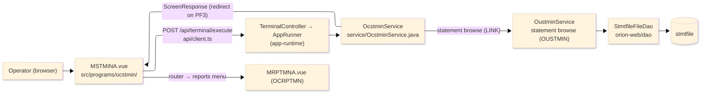
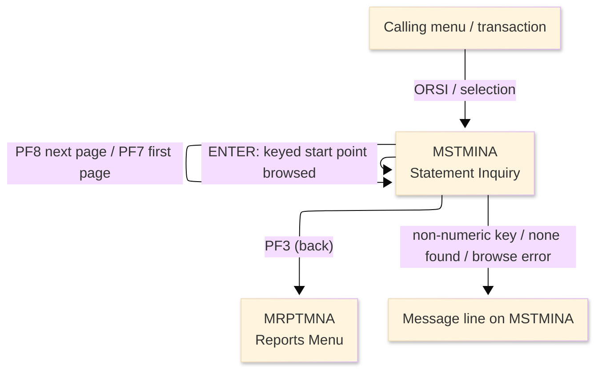
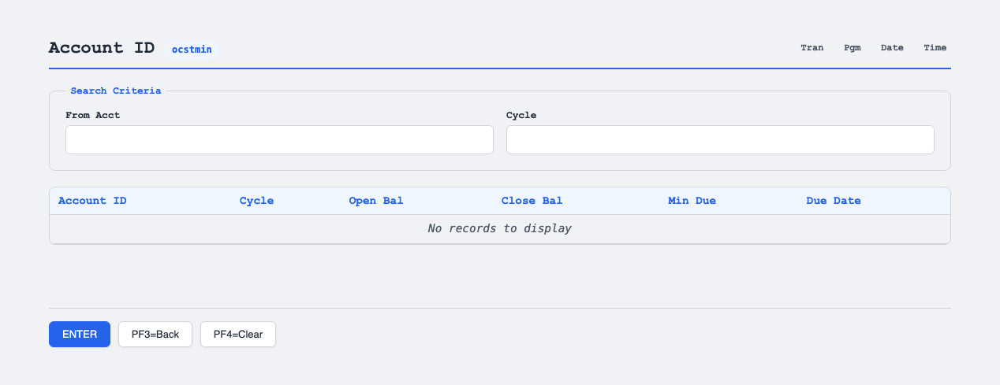

# TO-BE Screen Design — OCSTMIN_StatementInquiry

> **Rule 1: TO-BE = AS-IS in business terms.** The interface moves to a web SPA, but the
> input/output data, the check conditions, the business flow and the database results are
> preserved. The section order follows the AS-IS document so the two compare 1-to-1.

## 0. Cover

| Item | Content |
|---|---|
| System | ORION-CCMS (ORION Credit Card Management System) |
| Subsystem | On-line (was CICS/BMS; now Vue SPA + REST) |
| Function name | Statement Inquiry |
| Function ID | OCSTMIN（COBOL program）／Trans-ID `ORSI`／Map `MSTMINA` |
| Module | `ocstmin` |
| Platform | Java 17 · Spring Boot 3.x · Vue 3 + TypeScript · DB Oracle (H2 in dev) |
| Version ／ Author ／ Date | 1 ／ modernizeX ／ 2026-09-28 |

## 1. Function overview

### 1.1 Overview diagram

System architecture — the screen, the request path to the server, the program service it runs,
the statement browse service it hands to, and the data store that is read.

### 1.2 Function overview

| # | Function | Implementation |
|---|---|---|
| 1 | Accept an account id and cycle as the start point of the search | The operator keys the from-account and cycle; a blank value means start from the first statement |
| 2 | List the matching statements a page at a time | Up to six statement rows are read from that start point and shown with account, cycle, balances and due date |
| 3 | Let the operator page and refine the search | The next page, a fresh page from the start, or a new key can be requested without leaving the screen |
| 4 | Return to the calling menu when finished | The back action ends the inquiry and returns the operator to the reports menu |

**Roles ／ authorisation**: authenticated operator (signed on through the Sign On screen). Sign-on
state travels in the conversation carried between requests; no framework role gate is wired yet.

**Keys → operations** (the SPA renders each former PF key as a button):

| Key | Label as rendered (verbatim) | What it does |
|---|---|---|
| `ENTER` | `ENTER=PROCESS` | accept the keyed start point and list the matching statements |
| `PF3` | `PF3=BACK` | return to the reports menu |
| `PF4` | `PF4=CLEAR` | clear the entry so the operator can start again |
| `PF7` | `PF7` | rebuild the list from the first page of the current search |
| `PF8` | `PF8` | show the next page of statements |

> The middle column is the string the button really shows, copied from the program's button
> definitions. The physical PF keystrokes are not reproduced as keyboard shortcuts, so operators
> used to typing PF3 now click the `PF3=BACK` button — same action, one extra pointer move.

### 1.3 Databases used

| № | Business name | Table | C | R | U | D |
|---|---|---|---|---|---|---|
| 1 | Statement store — browsed from the keyed account and cycle | `stmtfile` | - | 〇 | - | - |

## 2. Screen spec

Screen transition of the whole function — every screen a box, every edge labelled with what moves
the operator.

### 2.1 MSTMINA — Statement Inquiry

**Layout**

**Archetype applied**: browse list with a two-part start key (`_archetypes/screenModel`). The header
carries the transaction/program/date/time meta strip; the body has two entry boxes and a six-row
result grid; a message line and a button row close the screen.

| Area | Notes |
|---|---|
| Header (Tran/Prog/Date/Time) | meta strip above the title, filled by the server |
| Input area | two entry boxes — the from-account and the cycle start point |
| Result grid | up to six read-only rows: account, cycle, open/close balance, min due, due date |
| Message line | inline alert below the grid (was row 23 `ERRMSG`) |
| Button row | `ENTER=PROCESS`, `PF3=BACK`, `PF4=CLEAR`, `PF7`, `PF8` |

**Screen items**

_State legend: ○ shown · 必 must be entered · □ read-only · － not shown._

| № | Item name | Field | Type ／ length | Control | Required | Initial | Key prompt | Record shown | Notes |
|---|---|---|---|---|---|---|---|---|---|
| 1 | From account (start) | `FRACCT` | numeric text, 11 | entry box, 11 chars | - | ○ | ○ | － | start of browse; blank = from first |
| 2 | Cycle (start) | `FRCYC` | numeric text, 6 | entry box, 6 chars | - | ○ | ○ | － | YYYYMM; blank = from first |
| 3 | Account ID (rows 1–6) | `SA1`–`SA6` | numeric text, 11 | read-only | - | － | □ | □ | one per result row |
| 4 | Cycle (rows 1–6) | `SC1`–`SC6` | numeric text, 6 | read-only | - | － | □ | □ | one per result row |
| 5 | Open balance (rows 1–6) | `SO1`–`SO6` | amount, 14 | read-only | - | － | □ | □ | edited amount |
| 6 | Close balance (rows 1–6) | `SL1`–`SL6` | amount, 14 | read-only | - | － | □ | □ | edited amount |
| 7 | Minimum due (rows 1–6) | `SM1`–`SM6` | amount, 14 | read-only | - | － | □ | □ | edited amount |
| 8 | Due date (rows 1–6) | `SD1`–`SD6` | date text, 10 | read-only | - | － | □ | □ | as stored |
| 9 | Message line | `ERRMSG` | text, 78 | read-only | - | － | □ | □ | prompt / error / count |

> **Length and format unchanged**: the entry boxes accept 11 and 6 characters and the server reads
> the same widths; each result column keeps the width it had on the terminal screen.

## 3. Check specifications

### 3.1 MSTMINA — Statement Inquiry

All strings below are the literal messages the server returns to the on-screen message line.
Type: E=Error / I=Information.

| No. | What is checked | When it is checked | Message code | Message shown | If it fails |
|---|---|---|---|---|---|
| 1 | Opening prompt (informational) | when the screen first appears | — | Enter account id (blank=first) and ENTER. | not a failure; guides the operator |
| 2 | A keyed from-account must be numeric | on `ENTER`, before the browse | — | Account id must be numeric. | the entry stays; nothing is browsed |
| 3 | A keyed cycle must be numeric | on `ENTER`, before the browse | — | Cycle must be numeric (YYYYMM). | the entry stays; nothing is browsed |
| 4 | Statements must exist from that point | on `ENTER` / paging, after the browse | — | No statements found from that point. | no rows are shown |
| 5 | The statement store must be readable | on `ENTER` / paging, during the browse | — | Error browsing the statement file. | no rows are shown |
| 6 | There must be a further page | on `PF8`, at the end of the list | — | End of file - no more statements. | the current page stays |
| 7 | Only a supported key may be used | on any key press | — | Invalid key pressed. Please try again. | the screen is redisplayed unchanged |

## 4. Event specifications

### 4.1 MSTMINA — Statement Inquiry

| No. | Event | What the system does | Result ／ next screen |
|---|---|---|---|
| 1 | The operator enters a start point and presses `ENTER` | the keyed values are checked and up to six matching statements are read and listed with a count of how many were shown | stays on Statement Inquiry with the rows shown, or a message when the key is invalid or nothing is found |
| 2 | The operator presses `PF8` | the next page of statements is read and listed | stays on Statement Inquiry, or an end-of-file message when there are no more |
| 3 | The operator presses `PF7` | the list is rebuilt from the first page of the current search | stays on Statement Inquiry |
| 4 | The operator presses `PF3` | the inquiry ends and control returns to the reports menu | the reports menu appears |
| 5 | The operator presses `PF4` | the entered values are cleared and the opening prompt returns | stays on Statement Inquiry, ready for a new key |
| 6 | The operator presses an unsupported key | the request is rejected and a message is shown | stays on Statement Inquiry, unchanged |

The statement rows are produced by the linked statement browse service (OUSTMIN); the inquiry screen
formats and paginates what that service returns, and the returned row count drives the summary line.

## 5. DB CRUD

**Update spec**

Not applicable — Statement Inquiry only reads; no row is created, updated or deleted.

**Column-level CRUD (per event ／ business type)**

| Table | Operation | Field | Value source | Transaction |
|---|---|---|---|---|
| `stmtfile` | browse read (by start key) | statement rows | the account id and cycle the operator keyed as the start point | read-only; no commit; performed by the linked browse service |

## 6. API contract

| Request | Response | What it does | Errors |
|---|---|---|---|
| `POST /api/terminal/execute` — `{ programName: "OCSTMIN", aidKey, fields: { FRACCT, FRCYC } }` | `ScreenResponse` — `{ fields: { SA1…SD6, ERRMSG }, message, buttons }` | validates the start key, browses up to six statements from that point and returns the rows and a count | non-numeric id → "Account id must be numeric."; non-numeric cycle → "Cycle must be numeric (YYYYMM)."; none → "No statements found from that point."; read error → "Error browsing the statement file." |

FE types: `src/programs/ocstmin/schemas.d.ts` (`MSTMINAFields`) · client: `src/api/client.ts` ·
endpoint: `TerminalController` (`/api/terminal/execute`), one round-trip per key press (CICS
pseudo-conversation preserved through the HTTP session).
