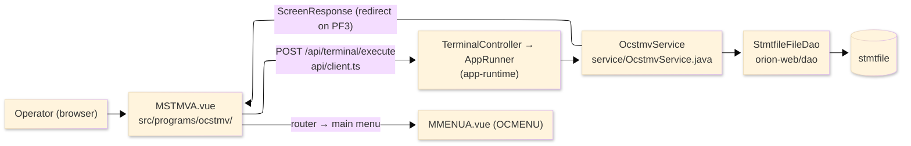
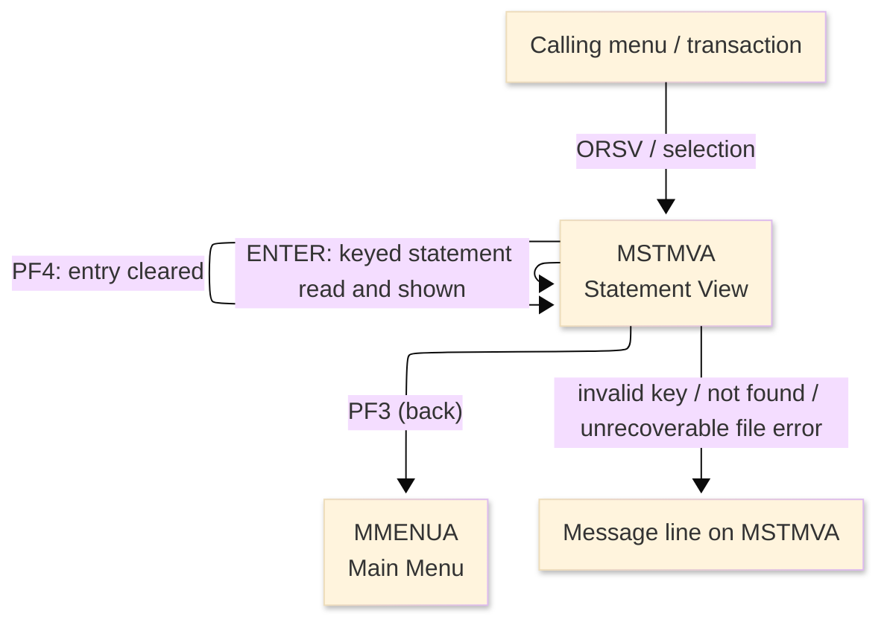
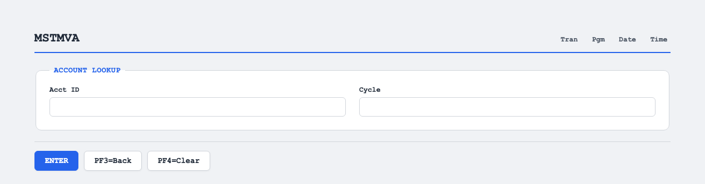

# TO-BE Screen Design — OCSTMV_StatementView

> **Rule 1: TO-BE = AS-IS in business terms.** The interface moves to a web SPA, but the
> input/output data, the check conditions, the business flow and the database results are
> preserved. The section order follows the AS-IS document so the two compare 1-to-1.

## 0. Cover

| Item | Content |
|---|---|
| System | ORION-CCMS (ORION Credit Card Management System) |
| Subsystem | On-line (was CICS/BMS; now Vue SPA + REST) |
| Function name | Statement View |
| Function ID | OCSTMV（COBOL program）／Trans-ID `ORSV`／Map `MSTMVA` |
| Module | `ocstmv` |
| Platform | Java 17 · Spring Boot 3.x · Vue 3 + TypeScript · DB Oracle (H2 in dev) |
| Version ／ Author ／ Date | 1 ／ modernizeX ／ 2026-09-28 |

## 1. Function overview

### 1.1 Overview diagram

System architecture — the screen, the request path to the server, the program service it runs,
and the data store it reads.

### 1.2 Function overview

| # | Function | Implementation |
|---|---|---|
| 1 | Look up a statement by account id and cycle | The operator enters both keys and the statement record is read by primary key from `stmtfile` |
| 2 | Show the current statement details in read-only form | Opening balance, closing balance, minimum due and due date are displayed; nothing on this screen is editable |
| 3 | Return to the calling menu when finished | The back action ends the view and returns the operator to the main menu |

**Roles ／ authorisation**: authenticated operator (signed on through the Sign On screen). Sign-on
state travels in the conversation carried between requests; no framework role gate is wired yet.

**Keys → operations** (the SPA renders each former PF key as a button):

| Key | Label as rendered (verbatim) | What it does |
|---|---|---|
| `ENTER` | `ENTER=PROCESS` | read the keyed statement and show its details |
| `PF3` | `PF3=BACK` | return to the main menu |
| `PF4` | `PF4=CLEAR` | clear the entry so the operator can start again |

> The middle column is the string the button really shows, copied from the program's button
> definitions. The physical PF keystrokes are not reproduced as keyboard shortcuts, so operators
> used to typing PF3 now click the `PF3=BACK` button — same action, one extra pointer move.

### 1.3 Databases used

| № | Business name | Table | C | R | U | D |
|---|---|---|---|---|---|---|
| 1 | Statement file — read by account id and cycle to show the detail | `stmtfile` | - | 〇 | - | - |

## 2. Screen spec

Screen transition of the whole function — every screen a box, every edge labelled with what moves
the operator.

### 2.1 MSTMVA — Statement View

**Layout**

**Archetype applied**: display form with a two-part lookup key (`_archetypes/screenModel`). The header
carries the transaction/program/date/time meta strip; the body has two entry boxes and a read-only
details block; a message line and a button row close the screen.

| Area | Notes |
|---|---|
| Header (Tran/Prog/Date/Time) | meta strip above the title, filled by the server |
| Input area | two entry boxes — the account id and the statement cycle |
| Details area | read-only outputs: opening balance, closing balance, minimum due, due date |
| Message line | inline alert below the form (was row 23 `ERRMSG`) |
| Button row | `ENTER=PROCESS`, `PF3=BACK`, `PF4=CLEAR` |

**Screen items**

_State legend: ○ shown · 必 must be entered · □ read-only · － not shown._

| № | Item name | Field | Type ／ length | Control | Required | Initial | Key prompt | Record shown | Notes |
|---|---|---|---|---|---|---|---|---|---|
| 1 | Account ID | `ACCTID` | numeric text, 11 | entry box, 11 chars | 必 | ○ | 必 | □ | first part of the lookup key; kept at 11 as in the source |
| 2 | Cycle | `STCYC` | numeric text, 6 | entry box, 6 chars | 必 | ○ | 必 | □ | second part of the key; six digits (YYYYMM) |
| 3 | Open balance | `STOPEN` | amount, 15 | read-only | - | － | □ | □ | edited amount |
| 4 | Close balance | `STCLOSE` | amount, 15 | read-only | - | － | □ | □ | edited amount |
| 5 | Minimum due | `STMIN` | amount, 15 | read-only | - | － | □ | □ | edited amount |
| 6 | Due date | `STDUE` | date text, 10 | read-only | - | － | □ | □ | as stored |

> **Length and format unchanged**: the entry boxes accept 11 and 6 characters and the server reads
> the same two-part key; the balances and date are shown with the same widths as the terminal screen.

## 3. Check specifications

### 3.1 MSTMVA — Statement View

All strings below are the literal messages the server returns to the on-screen message line.
Type: E=Error / I=Information.

| No. | What is checked | When it is checked | Message code | Message shown | If it fails |
|---|---|---|---|---|---|
| 1 | Opening prompt (informational) | when the screen first appears | — | Enter account id and cycle, press ENTER. | not a failure; guides the operator |
| 2 | The account id must be numeric | on `ENTER`, before the lookup | — | Account id must be numeric. | the entry stays; nothing is read |
| 3 | The cycle must be six digits | on `ENTER`, before the lookup | — | Cycle must be six digits (YYYYMM). | the entry stays; nothing is read |
| 4 | The cycle month must be valid | on `ENTER`, before the lookup | — | Cycle month must be 01 through 12. | the entry stays; nothing is read |
| 5 | The keyed statement must exist | on `ENTER`, after the lookup | — | No statement for that account and cycle. | no details are shown |
| 6 | The statement store must be readable | on `ENTER`, during the lookup | — | OCSTMV: unrecoverable file error. Contact support. | the transaction ends with an error notice |
| 7 | Only a supported key may be used | on any other key press | — | Invalid key pressed. Please try again. | the screen is redisplayed unchanged |

## 4. Event specifications

### 4.1 MSTMVA — Statement View

| No. | Event | What the system does | Result ／ next screen |
|---|---|---|---|
| 1 | The operator enters an account id and cycle and presses `ENTER` | the keyed statement is read and the opening balance, closing balance, minimum due and due date are filled in | stays on Statement View with the details shown, or a message when the key is invalid or not found |
| 2 | The operator presses `PF3` | the view ends and control returns to the calling menu | the main menu appears |
| 3 | The operator presses `PF4` | the entered values are cleared and the opening prompt returns | stays on Statement View, ready for a new key |
| 4 | The operator presses an unsupported key | the request is rejected and a message is shown | stays on Statement View, unchanged |

## 5. DB CRUD

**Update spec**

Not applicable — Statement View only reads; no row is created, updated or deleted.

**Column-level CRUD (per event ／ business type)**

| Table | Operation | Field | Value source | Transaction |
|---|---|---|---|---|
| `stmtfile` | SELECT (read by key) | whole record | the account id and cycle the operator entered | read-only; no commit |

## 6. API contract

| Request | Response | What it does | Errors |
|---|---|---|---|
| `POST /api/terminal/execute` — `{ programName: "OCSTMV", aidKey, fields: { ACCTID, STCYC } }` | `ScreenResponse` — `{ fields: { STOPEN, STCLOSE, STMIN, STDUE }, message, buttons }` | reads the statement by account id and cycle and returns its detail fields, or a message | non-numeric id → "Account id must be numeric."; bad cycle → "Cycle must be six digits (YYYYMM)."; bad month → "Cycle month must be 01 through 12."; missing → "No statement for that account and cycle." |

FE types: `src/programs/ocstmv/schemas.d.ts` (`MSTMVAFields`) · client: `src/api/client.ts` ·
endpoint: `TerminalController` (`/api/terminal/execute`), one round-trip per key press (CICS
pseudo-conversation preserved through the HTTP session).
